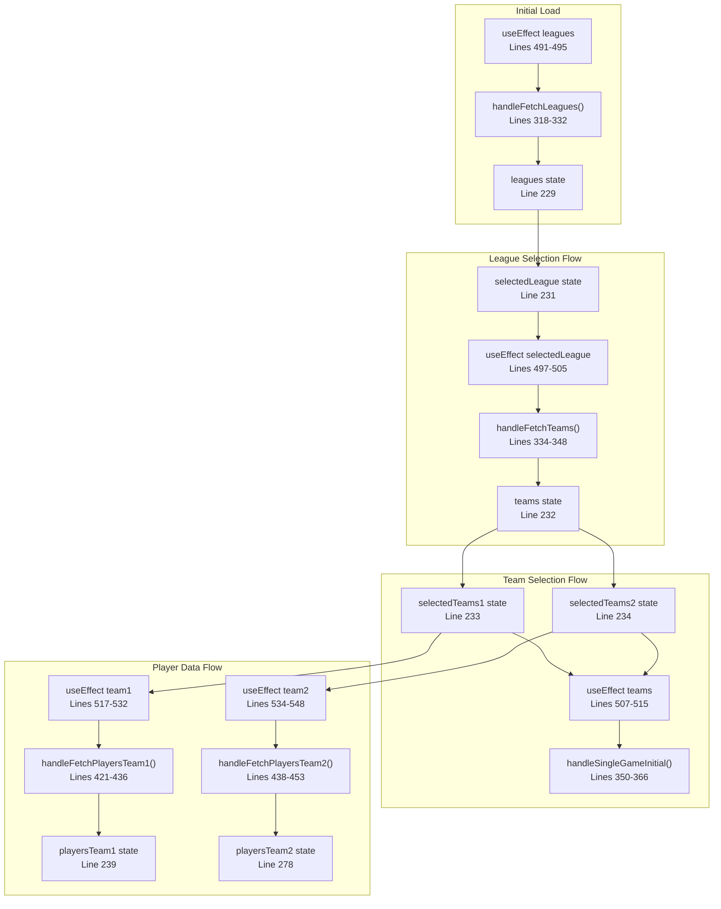

# Game Setup Interface

Relevant source files

The following files were used as context for generating this wiki page:

- [src/components/ui/sheet.tsx](/src/components/ui/sheet.tsx)
- [src/pages/GameSetup.tsx](/src/pages/GameSetup.tsx)

## Purpose and Scope

The Game Setup Interface serves as the central orchestration component for initializing and configuring basketball game simulations. It provides the main user interface for selecting leagues, teams, and game modes, while managing the complex state transitions required to prepare a game for simulation. This component acts as the primary entry point after authentication and coordinates data fetching from external basketball simulation APIs.

For information about the actual game simulation mechanics, see [Basketball Simulation](./14_Basketball_Simulation.md). For details about the authentication system that precedes this interface, see [Authentication System](./6_Authentication_System.md).

## Component Architecture Overview

The `GameSetup` component implements a tabbed interface architecture that separates different game simulation modes while sharing common setup functionality.

**Tab Structure:**
- **Full Season Version**: Complete league and team setup with live data
- **Single Game Version**: Simplified game mode with hardcoded data  
- **Instructions**: User guidance and documentation

Sources: [src/pages/GameSetup.tsx:556-591]()

## Data Flow and State Management

The component maintains extensive state for managing the game setup process, with cascading effects that trigger API calls as selections are made.

Sources: [src/pages/GameSetup.tsx:491-548]()

## API Integration Points

The component integrates with multiple external API endpoints through the `fetchWithAuth` method, handling authentication and error management consistently.

**Key API Endpoints:**
| Endpoint | Purpose | Trigger |
|----------|---------|---------|
| `get_leagues.php` | Fetch available leagues | Component mount |
| `get_teams.php` | Fetch teams for selected league | League selection |
| `playsinglegame_initial.php` | Initialize single game | Both teams selected |
| `get_actual_player_stats.php` | Fetch player statistics | Team selection |
| `play_predict.php` | Set prediction mode | Both teams selected |

Sources: [src/pages/GameSetup.tsx:318-485]()

## TypeScript Interface System

The component defines comprehensive TypeScript interfaces that structure the API response data and internal state management.

**Key Interface Details:**
- `PlayerChar` interface contains 45+ properties covering all basketball statistics
- `ScoreBoard` interface tracks real-time game state including player positions and statistics
- Response interfaces wrap data arrays from API calls
- All numeric values are typed as strings due to API response format

Sources: [src/pages/GameSetup.tsx:10-191]()

## Team Logo and Asset Management

The component includes a comprehensive mapping of NBA team names to their official logo URLs for visual enhancement of the interface.

The `teamLogos` object maps 30 NBA team names to their Wikipedia Commons SVG logo URLs, providing visual identification in the game interface.

Sources: [src/pages/GameSetup.tsx:193-224](), [src/pages/GameSetup.tsx:582]()

## Error Handling and Loading States

The component implements consistent error handling and loading state management across all API operations.

| State Variable | Purpose | Usage |
|----------------|---------|-------|
| `error` | Store error messages | Set in catch blocks, displayed in UI |
| `isLoading` | Track API request status | From `useApi()` hook, disables buttons |
| `isGameInitial` | Track game initialization | Local loading state for game setup |

**Error Handling Pattern:**
1. Clear existing errors with `setError(null)`
2. Wrap API calls in try-catch blocks
3. Parse error responses and set descriptive error messages
4. Display errors in UI components

Sources: [src/pages/GameSetup.tsx:230](), [src/pages/GameSetup.tsx:235](), [src/pages/GameSetup.tsx:319-331]()