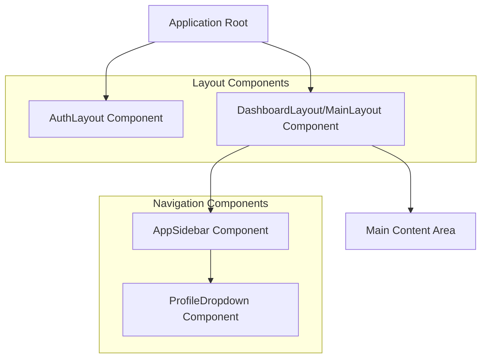
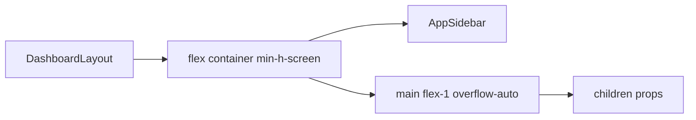
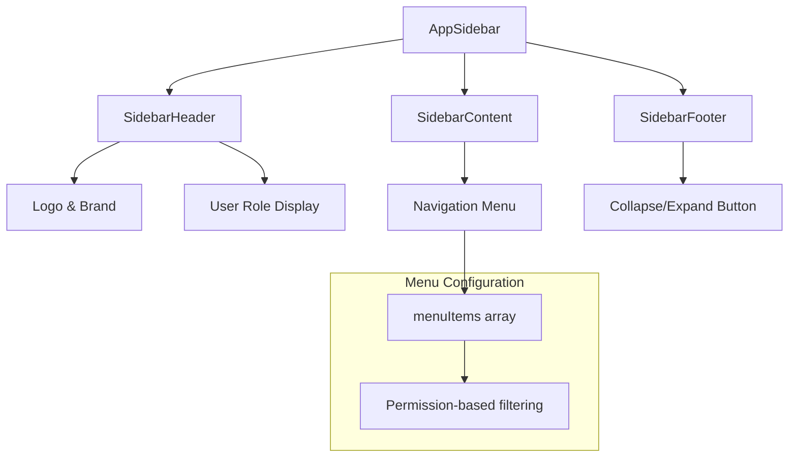
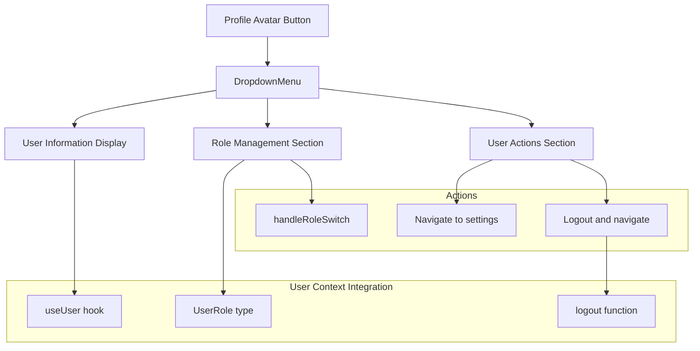
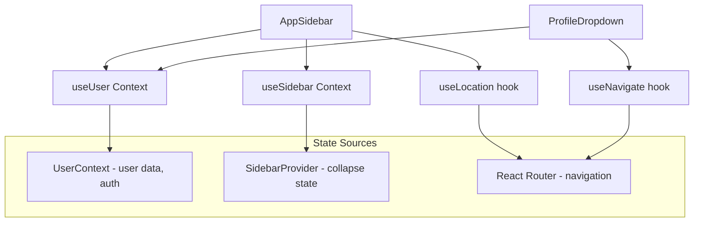

# Layout and Navigation

<details>
<summary>Relevant source files</summary>

The following files were used as context for generating this wiki page:

- [src/components/AppSidebar.tsx](/src/components/AppSidebar.tsx)
- [src/components/GoogleMap.tsx](/src/components/GoogleMap.tsx)
- [src/components/LoginLayout.tsx](/src/components/LoginLayout.tsx)
- [src/components/MainLayout.tsx](/src/components/MainLayout.tsx)
- [src/components/ProfileDropdown.tsx](/src/components/ProfileDropdown.tsx)

</details>


This document covers the application's layout system, sidebar navigation components, and user profile management interface. The layout system provides a consistent structure for the application with role-based navigation and user account management features.

For information about the core UI components used within these layouts, see [Core Components](./9_Core_Components.md). For details about the game-specific interfaces that render within these layouts, see [Game Setup Interface](./10_Game_Setup_Interface.md) and [Game Simulation Interfaces](./11_Game_Simulation_Interfaces.md).

## Layout Architecture

The application uses a modular layout system with distinct layouts for authenticated and unauthenticated states. The primary layout combines a collapsible sidebar with a flexible main content area.

**Layout Structure**


Sources: [src/components/MainLayout.tsx:1-14](), [src/components/LoginLayout.tsx:1-12](), [src/components/AppSidebar.tsx:1-117](), [src/components/ProfileDropdown.tsx:1-121]()

## Main Layout System

The `DashboardLayout` component in `MainLayout.tsx` provides the primary application structure using a two-pane layout design.

**Layout Implementation**


The layout uses flexbox with the sidebar maintaining fixed width and the main content area taking remaining space. The `overflow-auto` class on the main area enables scrolling for content that exceeds viewport height.

Sources: [src/components/MainLayout.tsx:4-10]()

## Authentication Layout

The `AuthLayout` component provides a full-screen container for authentication flows.

| Property | Value | Purpose |
|----------|-------|---------|
| Container | `w-screen h-screen` | Full viewport coverage |
| Content | Direct children rendering | Flexible auth UI placement |

Sources: [src/components/LoginLayout.tsx:4-9]()

## Sidebar Navigation

The `AppSidebar` component implements a collapsible navigation system with role-based menu items and user profile integration.

**Sidebar Component Structure**


### Navigation Menu Configuration

The sidebar menu is driven by a configuration array with permission-based access control:

```typescript
const menuItems = [
  { title: "Dashboard", url: "/adminpanel", icon: Home, permission: "view_all" },
  { title: "Casinos", url: "/adminpanel/casinos", icon: Building2, permission: "view_all" },
  { title: "Users", url: "/adminpanel/users", icon: Users, permission: "add_edit_delete_users" },
  { title: "Analytics", url: "/adminpanel/analytics", icon: BarChart3, permission: "view_all" },
  { title: "Settings", url: "/adminpanel/settings", icon: Settings, permission: "view_all" }
];
```

### Sidebar State Management

The sidebar uses the `useSidebar` hook for state management and provides collapsible functionality:

| State | Description | Visual Behavior |
|-------|-------------|-----------------|
| `expanded` | Full sidebar with text labels | Shows icons and text |
| `collapsed` | Icon-only mode | Shows only icons, hides text |

The collapse state is controlled by the `toggleSidebar` function and affects content visibility through CSS classes like `group-data-[collapsible=icon]:hidden`.

Sources: [src/components/AppSidebar.tsx:27-33](), [src/components/AppSidebar.tsx:35-116]()

## User Profile System

The `ProfileDropdown` component provides user account management with role-based features and authentication controls.

**Profile Dropdown Flow**


### User Information Display

The profile dropdown displays comprehensive user information with role-based styling:

| Component | Data Source | Display Format |
|-----------|-------------|----------------|
| Avatar | `user.username` | Initials from name |
| Username | `user.username` | Full display name |
| Email | `user.email` | User email address |
| Role Badge | `user.role` | Colored badge with role name |

### Role Management

The component includes role switching functionality for admin users:

```typescript
const getRoleBadgeColor = (role: UserRole) => {
  switch (role) {
    case 'admin': return 'bg-red-100 text-red-800';
    case 'developer': return 'bg-blue-100 text-blue-800';  
    case 'guest': return 'bg-gray-100 text-gray-800';
    default: return 'bg-gray-100 text-gray-800';
  }
};
```

### Authentication Actions

The profile dropdown provides access to critical user actions:

- **Password Reset**: Navigates to `/adminpanel/settings?tab=security`
- **Logout**: Calls `logout()` function and redirects to `/adminpanel/login`

Sources: [src/components/ProfileDropdown.tsx:17-43](), [src/components/ProfileDropdown.tsx:44-118]()

## Navigation State Integration

The layout and navigation components integrate with several React contexts for state management:

**Context Integration Flow**


The navigation system maintains active route highlighting through `location.pathname` comparison and provides seamless navigation through React Router integration.

Sources: [src/components/AppSidebar.tsx:24-38](), [src/components/ProfileDropdown.tsx:13-19]()