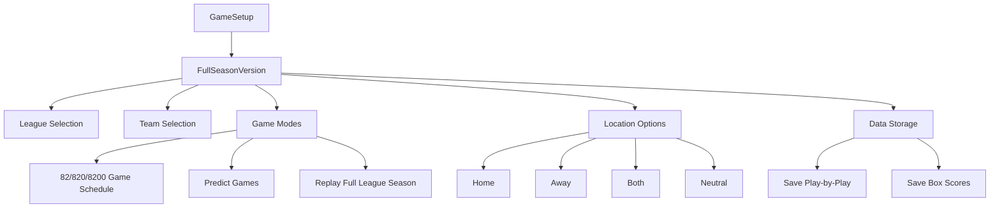
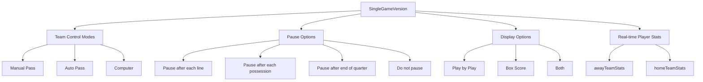
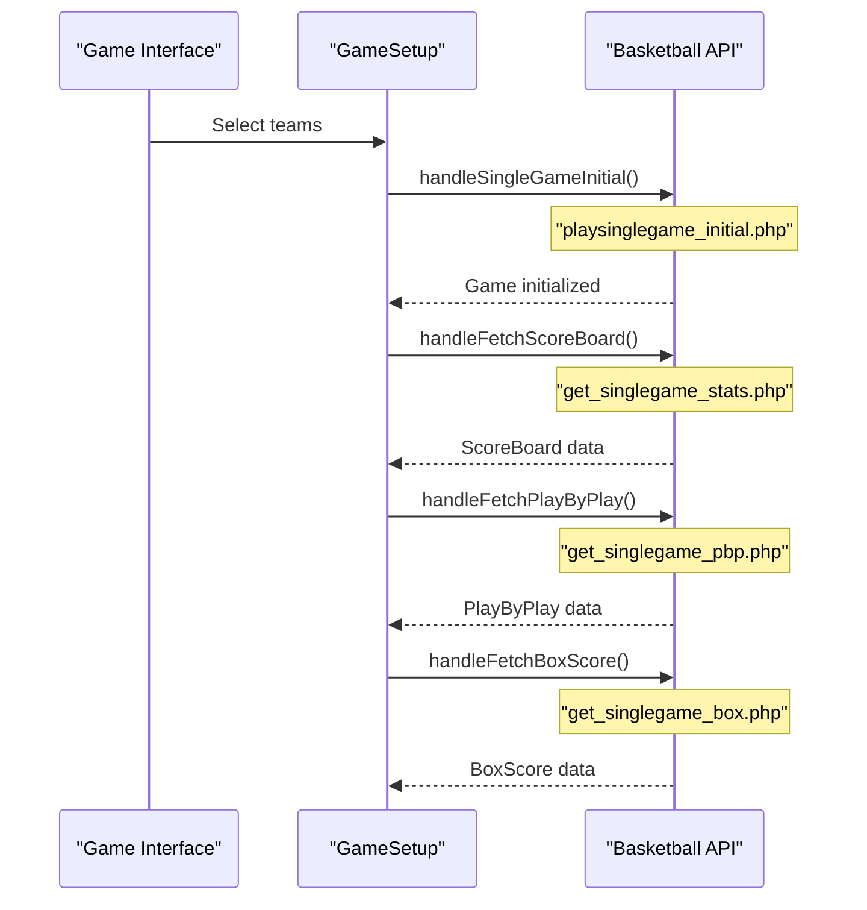
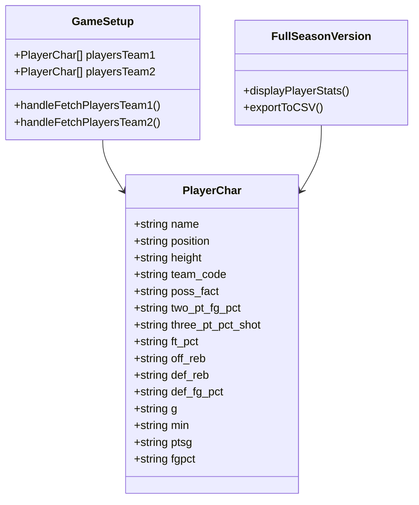
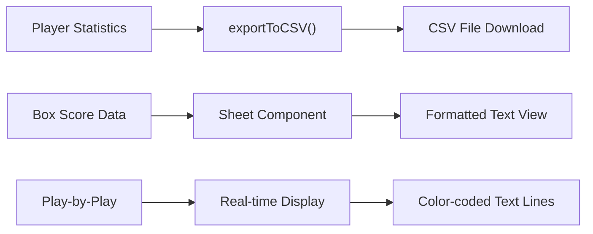

# Game Features

Relevant source files

The following files were used as context for generating this wiki page:

- [src/components/ui/CustomRadio.tsx](src/components/ui/CustomRadio.tsx)
- [src/components/ui/sheet.tsx](src/components/ui/sheet.tsx)
- [src/components/ui/table.tsx](src/components/ui/table.tsx)
- [src/gamesetup_result_image.png](src/gamesetup_result_image.png)
- [src/lib/utils.ts](src/lib/utils.ts)
- [src/pages/FullSeasonVersion.tsx](src/pages/FullSeasonVersion.tsx)
- [src/pages/GameSetup.tsx](src/pages/GameSetup.tsx)
- [src/pages/Instructions.tsx](src/pages/Instructions.tsx)
- [src/pages/SingleGameVersion.tsx](src/pages/SingleGameVersion.tsx)

## Purpose and Scope

This document covers the basketball simulation features and game mechanics available in the NBA simulation application. It details the two primary simulation modes, the underlying basketball engine, player management capabilities, and statistical tracking features.

For information about the user interface components that display these features, see [User Interface](#4). For details about the external API integration that powers the simulation, see [API Integration](#6).

## Game Simulation Modes

The application provides two distinct simulation modes accessible through the main game interface, each offering different levels of interaction and control.

### Full Season Mode

The Full Season Mode provides comprehensive league simulation capabilities with multiple game scheduling options and statistical tracking.

**Key Features:**
- **Schedule Modes**: Supports 82, 820, or 8200 game simulations via the `schedule` state variable
- **Prediction Mode**: Uses `handlePredictMode()` function to run predictive simulations
- **Location Control**: Home/away/both/neutral options via `location` state
- **Data Persistence**: Optional saving of play-by-play and box score data

Sources: [src/pages/FullSeasonVersion.tsx:126-131](), [src/pages/GameSetup.tsx:384-404]()

### Single Game Mode

The Single Game Mode provides detailed, interactive simulation of individual basketball games with real-time controls and comprehensive statistics display.

**Interactive Controls:**
- **Team Control**: Manual, auto, or computer-controlled gameplay via `awayTeamMode` and `homeTeamMode` states
- **Pause Control**: Granular pause options through `pauseOptions` state management
- **Display Modes**: Flexible viewing options via `displayOptions` state

Sources: [src/pages/SingleGameVersion.tsx:47-56](), [src/pages/SingleGameVersion.tsx:69-122]()

## Basketball Simulation Engine

The core basketball simulation is powered by external API calls that handle game mechanics, player interactions, and statistical calculations.

### Game Initialization and Control

**Core Simulation Functions:**
- **Game Initialization**: `handleSingleGameInitial()` sets up the game state with selected teams
- **Scoreboard Updates**: `handleFetchScoreBoard()` retrieves current game status
- **Play Generation**: `handleFetchPlayByPlay()` gets real-time game narration
- **Statistics Tracking**: `handleFetchBoxScore()` provides detailed game statistics

Sources: [src/pages/GameSetup.tsx:350-366](), [src/pages/GameSetup.tsx:368-382](), [src/pages/GameSetup.tsx:455-469](), [src/pages/GameSetup.tsx:471-485]()

### Game State Management

The simulation maintains comprehensive game state through structured data interfaces:

| Component | Interface | Key Properties |
|-----------|-----------|----------------|
| Game Status | `ScoreBoard` | `away_score`, `home_score`, `quarter`, `clock` |
| Player Tracking | `ScoreBoard` | `away_player1-5`, `home_player1-5`, position data |
| Game Flow | `PlayByPlay` | `pbp_line`, `color` for play descriptions |
| Statistics | `BoxScore` | `box_line`, `game_number`, `line_number` |

Sources: [src/pages/GameSetup.tsx:78-168](), [src/pages/GameSetup.tsx:174-181](), [src/pages/GameSetup.tsx:183-191]()

## Player and Team Management

### Player Characteristics System

The application manages detailed player statistics and characteristics through the `PlayerChar` interface, supporting both actual historical stats and editable simulation parameters.

**Player Data Management:**
- **Actual Statistics**: Retrieved via `get_actual_player_stats.php` API endpoint
- **Editable Characteristics**: Alternative endpoint `get_players_chars.php` for customizable stats
- **Dual Statistics Schema**: Same interface supports both actual and editable player data

Sources: [src/pages/GameSetup.tsx:30-68](), [src/pages/GameSetup.tsx:421-436](), [src/pages/GameSetup.tsx:438-453]()

### Team Selection and Management

The team management system provides hierarchical selection from leagues to specific teams with integrated logo support.

**Team Selection Flow:**
1. **League Selection**: Users choose from available leagues via `handleFetchLeagues()`
2. **Team Loading**: Selected league triggers `handleFetchTeams()` 
3. **Team Assignment**: Away and home team selection through `selectedTeams1` and `selectedTeams2`
4. **Logo Integration**: Team logos retrieved from `teamLogos` object mapping team names to image URLs

Sources: [src/pages/GameSetup.tsx:318-332](), [src/pages/GameSetup.tsx:334-348](), [src/pages/GameSetup.tsx:193-224]()

## Statistics and Reporting Features

### Player Statistics Display

The application provides comprehensive player statistics viewing with export capabilities through dedicated UI components.

**Statistics Tables:**
- **Scrollable Tables**: Fixed-height containers with overflow scrolling for large rosters
- **Comprehensive Metrics**: Position, height, games, minutes, points, shooting percentages, rebounds, defensive ratings
- **Export Functionality**: CSV export via `exportToCSV()` utility function
- **Dual Team Display**: Side-by-side comparison of both teams' player statistics

Sources: [src/pages/FullSeasonVersion.tsx:252-380](), [src/lib/utils.ts:8-42]()

### Game Data Export

**Export Features:**
- **CSV Export**: Player statistics exported via browser download with `exportToCSV()` function
- **Box Score Sheets**: Formatted text display in sliding sheet components
- **Play-by-Play Archive**: Real-time text feed with color coding for different events

Sources: [src/lib/utils.ts:8-42](), [src/pages/FullSeasonVersion.tsx:156-172]()

## Interactive Features

### Real-time Game Controls

The simulation provides multiple levels of user interaction during game execution:

**Simulation Control Options:**
- **Pause Management**: Configurable pause points (each line, possession, quarter, or continuous)
- **Team Control**: Switch between manual, automatic, and computer-controlled team management
- **Display Toggles**: Real-time switching between play-by-play, box scores, and combined views
- **Game Flow Control**: Continue/stop decisions at configurable intervals

Sources: [src/pages/SingleGameVersion.tsx:114-122](), [src/pages/SingleGameVersion.tsx:247-257]()

### Data Persistence Options

The application offers flexible data storage configuration for different simulation scenarios:

**Storage Configuration:**
- **Play-by-Play Storage**: Optional saving limited to 100 games via `savePbp` checkbox
- **Box Score Storage**: Optional saving with 15,000 game limit via `saveBox` checkbox  
- **Game Limitations**: Built-in constraints prevent excessive data storage

Sources: [src/pages/FullSeasonVersion.tsx:405-408]()