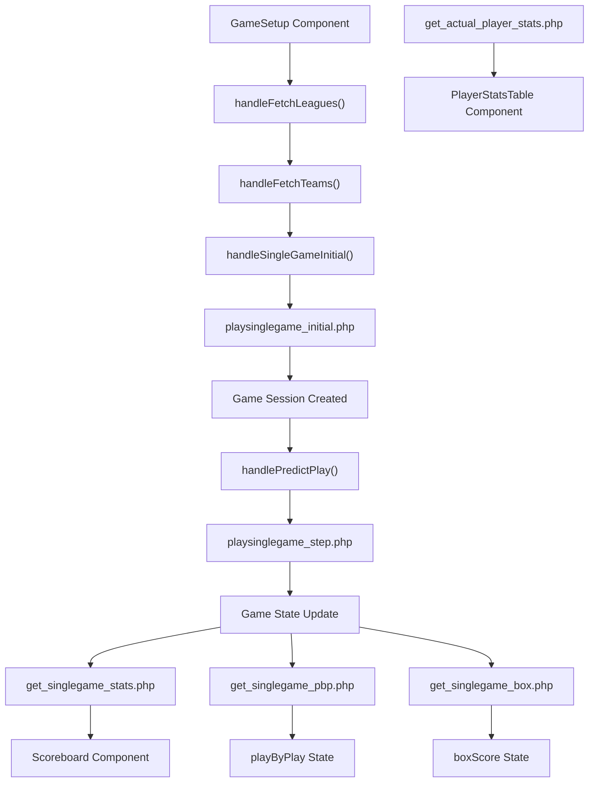
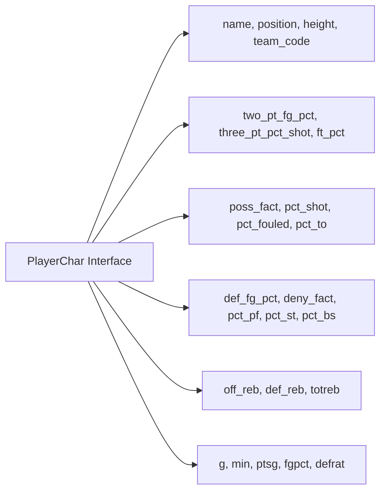
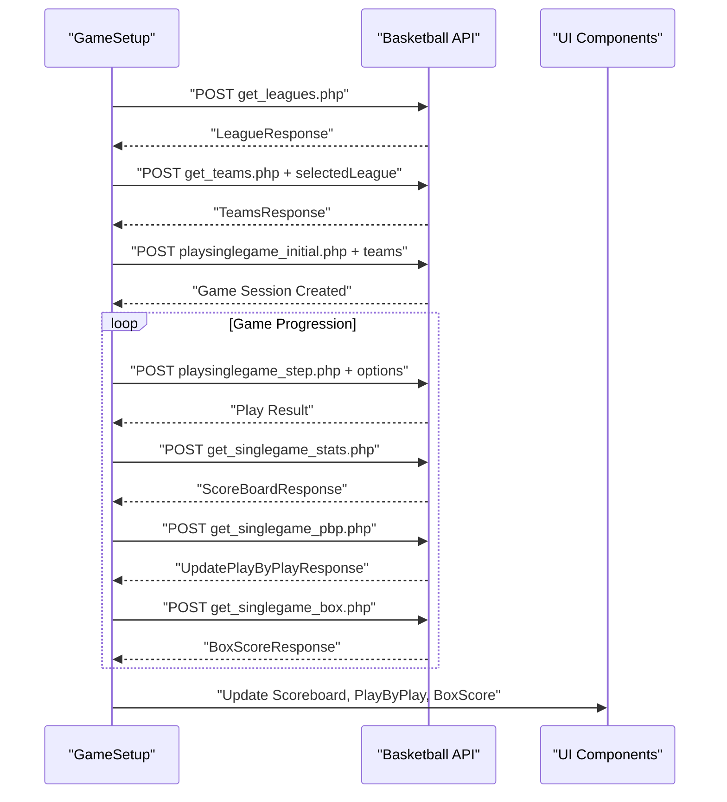
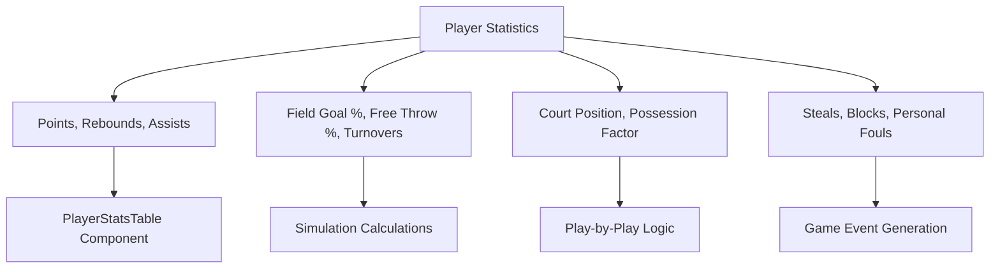

# Basketball Simulation

Relevant source files

The following files were used as context for generating this wiki page:

- [src/components/PlayerStatsTable.tsx](/src/components/PlayerStatsTable.tsx)
- [src/components/Scoreboard.tsx](/src/components/Scoreboard.tsx)
- [src/components/ui/sheet.tsx](/src/components/ui/sheet.tsx)
- [src/pages/GameSetup.tsx](/src/pages/GameSetup.tsx)

This document explains the basketball simulation engine that powers the core gameplay experience. It covers the data models, API integration patterns, and real-time game progression mechanics that enable users to simulate NBA games with detailed play-by-play action and statistical tracking.

For information about the user interface components that display simulation results, see [Game Simulation Interfaces](./11_Game_Simulation_Interfaces.md). For details about season-long simulation features, see [Season Management](./15_Season_Management.md).

## Simulation Architecture

The basketball simulation system integrates with an external basketball simulation API to provide realistic game experiences. The simulation operates through a stateful session model where games are initialized, progressed through individual plays, and tracked with comprehensive statistics.

Sources: [src/pages/GameSetup.tsx:318-485]()

## Core Data Models

The simulation system uses several key interfaces to represent game state and player information.

### Game State Representation

The `ScoreBoard` interface serves as the primary game state container, tracking all essential game information including scores, clock, player positions, and individual statistics.

| Component | Description | Key Fields |
|-----------|-------------|------------|
| Game Clock | Current game time and quarter | `quarter`, `clock` |
| Team Scores | Current score for both teams | `away_score`, `home_score` |
| Team Fouls | Foul counts for each team | `away_fouls`, `home_fouls` |
| Possession | Which team has the ball | `home_team_offense`, `player_with_ball` |
| Player Stats | Individual player performance | `*_player*_pts`, `*_player*_reb`, `*_player*_ast` |
| Court Positions | Player positioning data | `off_position*`, `def_position*`, `passable*` |

Sources: [src/pages/GameSetup.tsx:78-168](), [src/components/Scoreboard.tsx:3-14]()

### Player Characteristics

The `PlayerChar` interface defines comprehensive player attributes used for simulation calculations:

Sources: [src/pages/GameSetup.tsx:30-68]()

### Play-by-Play Events

Game narrative is captured through the `PlayByPlay` interface, which stores formatted text descriptions with visual styling information.

Sources: [src/pages/GameSetup.tsx:174-181]()

## API Integration Flow

The simulation communicates with the external basketball API through a series of HTTP endpoints, each serving specific functions in the game lifecycle.

Sources: [src/pages/GameSetup.tsx:318-485]()

### Key API Endpoints

| Endpoint | Purpose | Request Data | Response Type |
|----------|---------|--------------|---------------|
| `get_leagues.php` | Retrieve available leagues | None | `LeagueResponse` |
| `get_teams.php` | Get teams for selected league | `selectedLeague` | `TeamsResponse` |
| `playsinglegame_initial.php` | Initialize game session | Team selection data | Session confirmation |
| `playsinglegame_step.php` | Progress game by one play | `options: "4"` | Play result |
| `get_singlegame_stats.php` | Get current scoreboard | None | `ScoreBoardResponse` |
| `get_singlegame_pbp.php` | Get play-by-play updates | None | `UpdatePlayByPlayResponse` |
| `get_singlegame_box.php` | Get box score data | None | `BoxScoreResponse` |
| `get_actual_player_stats.php` | Get player statistics | `league + team_name` | `PlayerCharResponse` |

Sources: [src/pages/GameSetup.tsx:321-485]()

## Real-Time Game Progression

The simulation engine operates through a step-based progression model where each play is individually calculated and the game state is updated accordingly.

### Game Initialization Process

The `handleSingleGameInitial` function sets up a new game session:

1. Sends team configuration to `playsinglegame_initial.php`
2. Automatically fetches initial scoreboard state
3. Triggers prediction mode setup via `handlePredictMode`
4. Initializes play stepping through `handlePredictPlay`

Sources: [src/pages/GameSetup.tsx:350-366]()

### Play Stepping Mechanism

Individual plays are advanced using the `handlePredictPlay` function, which calls `playsinglegame_step.php` with specific options to progress the simulation engine.

Sources: [src/pages/GameSetup.tsx:406-419]()

### State Synchronization

The simulation maintains consistency through React's `useEffect` hooks that automatically trigger data fetching and state updates:

- Team selection triggers player data loading and prediction setup
- Game initialization automatically fetches scoreboard data
- Play progression updates all relevant game state components

Sources: [src/pages/GameSetup.tsx:491-548]()

## Statistical Tracking

The system tracks comprehensive statistics at both team and individual player levels through the `PlayerStatsTable` component and related data structures.

Sources: [src/components/PlayerStatsTable.tsx:11-17](), [src/pages/GameSetup.tsx:421-453]()

### Player Statistics Display

The `PlayerStatsTable` component renders real-time player performance in a structured table format showing points, rebounds, assists, and personal fouls for each active player.

Sources: [src/components/PlayerStatsTable.tsx:1-56]()

## Visual Game Representation

The simulation integrates with display components to provide real-time visual feedback during game progression.

### Scoreboard Integration

The `Scoreboard` component receives live game state through the `ScoreBoard` interface and displays:

- Current scores and game clock
- Team possession indicators
- Foul counts for both teams
- Team logos and branding

Sources: [src/components/Scoreboard.tsx:24-98]()

### Team Logo Resolution

The system includes a comprehensive mapping of NBA team names to their official logo URLs for enhanced visual presentation.

Sources: [src/pages/GameSetup.tsx:193-224]()