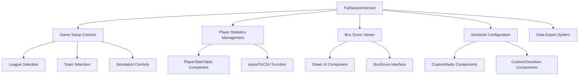
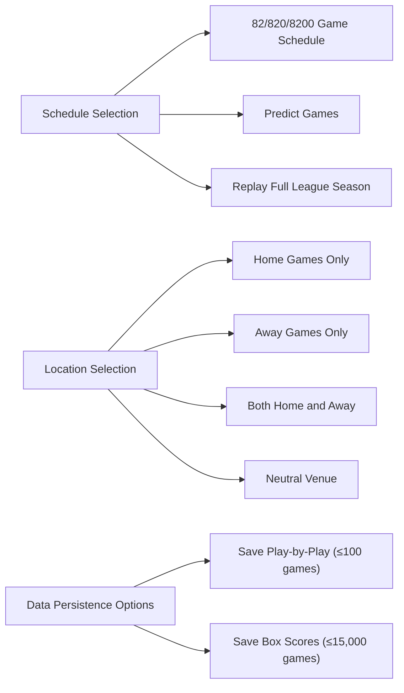
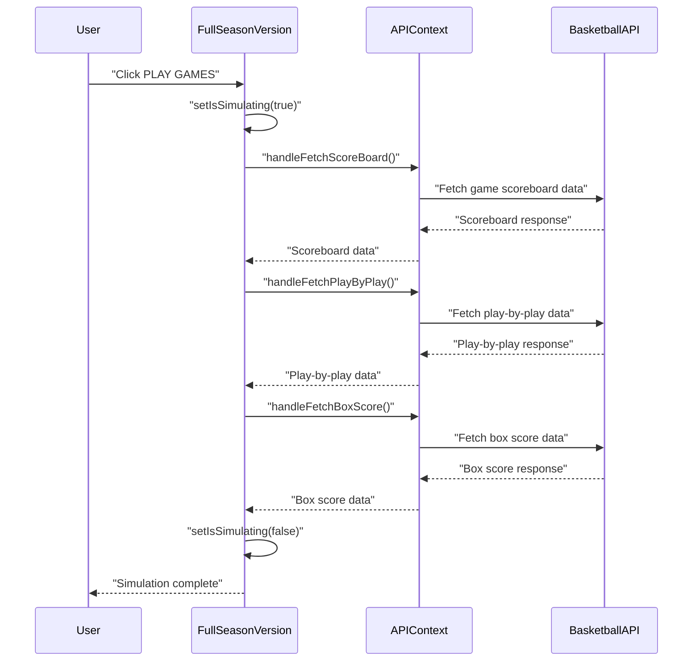

# Season Management

<details>
<summary>Relevant source files</summary>

The following files were used as context for generating this wiki page:

- [src/components/ui/CustomRadio.tsx](/src/components/ui/CustomRadio.tsx)
- [src/components/ui/table.tsx](/src/components/ui/table.tsx)
- [src/lib/utils.ts](/src/lib/utils.ts)
- [src/pages/FullSeasonVersion.tsx](/src/pages/FullSeasonVersion.tsx)

</details>


This document explains the full season simulation capabilities of the NBA simulation application, focusing on how basketball seasons are configured, executed, and tracked through the `FullSeasonVersion` component. Season Management provides comprehensive functionality for simulating complete basketball seasons with configurable parameters, statistical tracking, and data export capabilities.

For information about single game simulations, see [Game Simulation Interfaces](./11_Game_Simulation_Interfaces.md). For broader basketball simulation mechanics, see [Basketball Simulation](./14_Basketball_Simulation.md).

## Season Simulation Architecture

The season management system is built around the `FullSeasonVersion` component which orchestrates all aspects of multi-game simulation campaigns.

### Core Season Management Components



Sources: [src/pages/FullSeasonVersion.tsx:105-125](), [src/pages/FullSeasonVersion.tsx:30-82]()

### Season Configuration State Management

The season management system maintains several key state variables that control simulation behavior:

| State Variable | Type | Purpose | Default Value |
|---|---|---|---|
| `schedule` | string | Game count mode selection | 'schedule' |
| `location` | string | Home/away/neutral venue control | 'both' |
| `savePbp` | boolean | Play-by-play data persistence | false |
| `saveBox` | boolean | Box score data persistence | true |
| `isSimulating` | boolean | Simulation execution state | false |

Sources: [src/pages/FullSeasonVersion.tsx:126-131]()

## Schedule Configuration System

The schedule configuration allows users to select different simulation modes and data persistence options through radio button and checkbox interfaces.

### Schedule Mode Options



Sources: [src/pages/FullSeasonVersion.tsx:388-408]()

The schedule configuration is implemented using `CustomRadio` components for mutually exclusive options and `CustomCheckbox` components for data persistence settings:

```typescript
<CustomRadio 
  name="schedule" 
  value="schedule" 
  checked={schedule === 'schedule'} 
  onChange={setSchedule} 
  label="82/820/8200 Game Schedule" 
/>
```

Sources: [src/pages/FullSeasonVersion.tsx:391-392](), [src/components/ui/CustomRadio.tsx:12-32]()

## Player Statistics Management

The season management system provides comprehensive player statistics tracking with export capabilities for both teams in a simulation.

### Player Data Structure

The `PlayerChar` interface defines the complete statistical profile for players participating in season simulations:

```mermaid
graph TD
    PlayerChar["PlayerChar Interface"]
    
    PlayerChar --> BasicInfo["Basic Information"]
    PlayerChar --> GameStats["Game Statistics"]
    PlayerChar --> ShootingStats["Shooting Statistics"]
    PlayerChar --> ReboundStats["Rebounding Statistics"]
    PlayerChar --> DefensiveStats["Defensive Statistics"]
    
    BasicInfo --> Name["name"]
    BasicInfo --> Position["position"]
    BasicInfo --> Height["height"]
    BasicInfo --> TeamCode["team_code"]
    
    GameStats --> Games["g (games)"]
    GameStats --> Minutes["min (total minutes)"]
    GameStats --> MinutesPerGame["ming (minutes per game)"]
    GameStats --> PointsPerGame["ptsg (points per game)"]
    
    ShootingStats --> FGPct["fgpct (field goal %)"]
    ShootingStats --> TwoPtFGPct["twoptfgpct (2-point %)"]
    ShootingStats --> ThreePtFGPct["threeptfgpct (3-point %)"]
    ShootingStats --> FTPct["ftpct (free throw %)"]
    
    ReboundStats --> OffReb["offreb (offensive rebounds)"]
    ReboundStats --> DefReb["defreb (defensive rebounds)"]
    ReboundStats --> TotReb["totreb (total rebounds)"]
    
    DefensiveStats --> DefRat["defrat (defensive rating)"]
    DefensiveStats --> PctPF["pctpf (personal fouls %)"]
    DefensiveStats --> PctST["pctst (steals %)"]
    DefensiveStats --> PctBS["pctbs (blocks %)"]
```



Sources: [src/pages/FullSeasonVersion.tsx:44-82]()

### Statistics Display and Export

Player statistics are displayed in scrollable tables with export functionality implemented through the `exportToCSV` utility function:

```typescript
<Button 
  variant="outline" 
  size="sm" 
  onClick={() => exportToCSV(playersTeam1, `${selectedTeams1?.teams}_stats.csv`)}
>
  Export to CSV
</Button>
```

The export system automatically generates CSV files containing all player statistical data for external analysis.

Sources: [src/pages/FullSeasonVersion.tsx:257](), [src/lib/utils.ts:8-42]()

## Game Simulation Execution

The season simulation execution is coordinated through the `handlePlayGames` function which orchestrates multiple API calls to generate complete game data.

### Simulation Workflow



Sources: [src/pages/FullSeasonVersion.tsx:141-147]()

The simulation button provides visual feedback during execution with a loading spinner and disabled state:

```typescript
<Button 
  variant="outline" 
  disabled={isLoading || isSimulating} 
  className="mt-4" 
  onClick={handlePlayGames}
>
  {isSimulating && <Loader2 className="mr-2 h-4 w-4 animate-spin" />}
  PLAY GAMES
</Button>
```

Sources: [src/pages/FullSeasonVersion.tsx:409-412]()

## Data Visualization and Management

The season management system provides multiple interfaces for viewing and managing simulation data.

### Box Score Viewer

Box scores are displayed in a slide-out sheet component that provides scrollable access to detailed game data:

```typescript
<Sheet>
  <SheetTrigger asChild>
    <Button variant="outline" size="sm" disabled={isSimulating}>
      {boxScore.length === 0 ? "Show Box Score" : "Show Box Score (!)"}
    </Button>
  </SheetTrigger>
  <SheetContent className="overflow-y-auto">
    <pre className="text-sm">
      {boxScore.map((item: any) => item.box_line).join('\n')}
    </pre>
  </SheetContent>
</Sheet>
```

The box score data is stored in the `BoxScore` interface with structured game information including game numbers and line data.

Sources: [src/pages/FullSeasonVersion.tsx:156-172](), [src/pages/FullSeasonVersion.tsx:38-42]()

### Team Logos and Visual Elements

The season management interface includes team logo display functionality through the `TeamLogo` component:

```typescript
const TeamLogo: React.FC<{ logo?: string; name: string }> = ({ logo, name }) => (
  logo ? 
     : 
    <div className="h-14 w-14 bg-gray-700 rounded-full flex items-center justify-center text-white font-bold text-xl">
      {name.substring(0, 3).toUpperCase()}
    </div>
);
```

Sources: [src/pages/FullSeasonVersion.tsx:133-135]()

## Season Management Controls

The interface provides various management controls for season administration including quick access buttons and schedule manipulation options.

### Quick Action Buttons

| Button | Purpose | Implementation |
|---|---|---|
| Zero Schedule | Clear current schedule | Placeholder functionality |
| 82 Games | Set standard season length | Placeholder functionality |
| 820 Games | Set extended season length | Placeholder functionality |
| 8200 Games | Set maximum season length | Placeholder functionality |
| Clear | Reset all selections | Active implementation |

The Clear button implementation demonstrates the comprehensive state reset functionality:

```typescript
<Button variant="outline" onClick={() => {
  setSelectedLeague(null)
  setSelectedTeams1(null)
  setSelectedTeams2(null)
  setBoxScore([])
  setIsClear(!isClear)
}}>
  Clear
</Button>
```

Sources: [src/pages/FullSeasonVersion.tsx:185-191](), [src/pages/FullSeasonVersion.tsx:420-425]()

This season management system provides a comprehensive framework for conducting multi-game basketball simulations with full statistical tracking, data export capabilities, and flexible configuration options.