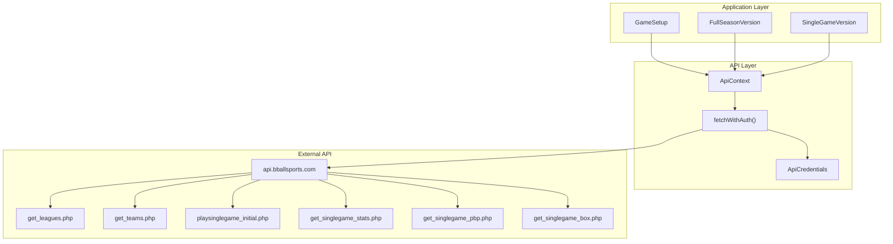
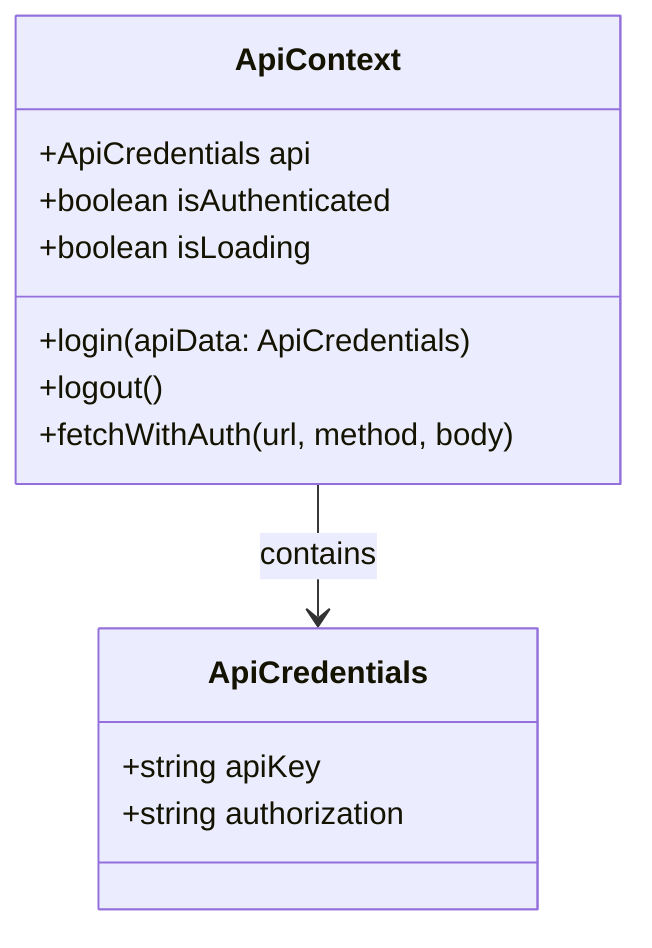
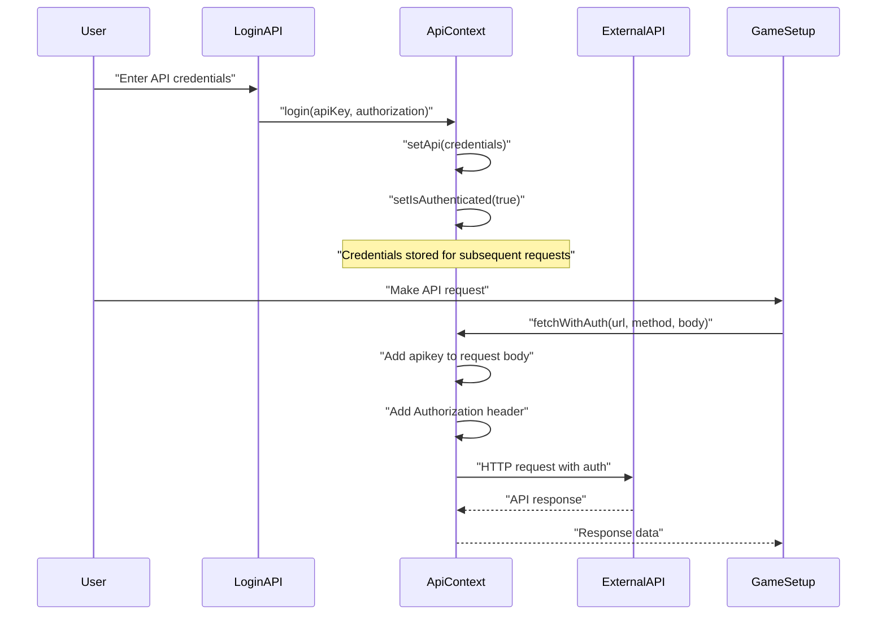
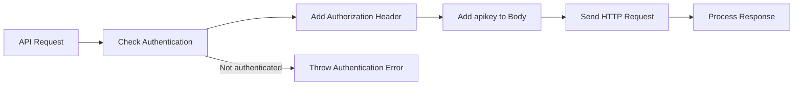
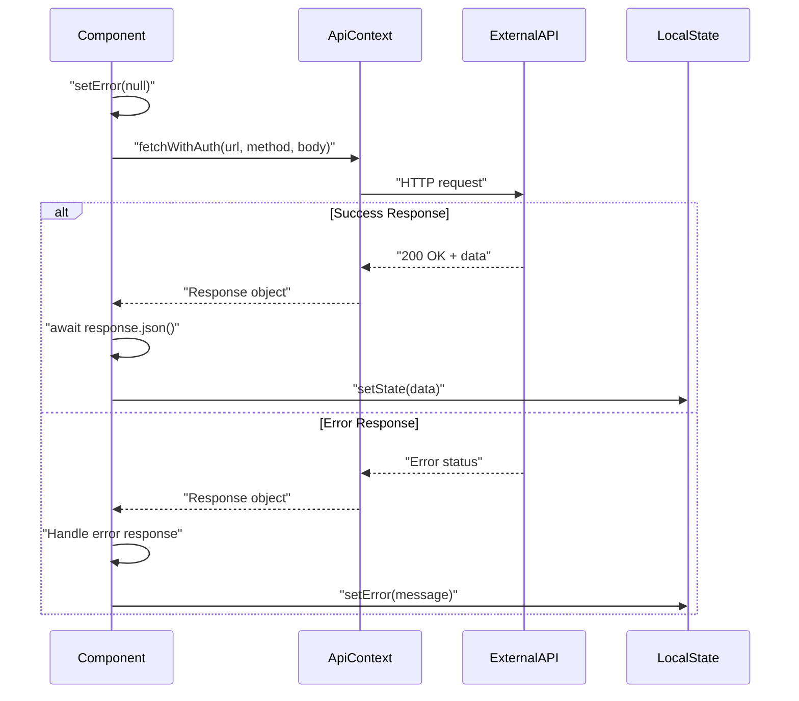
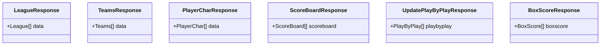
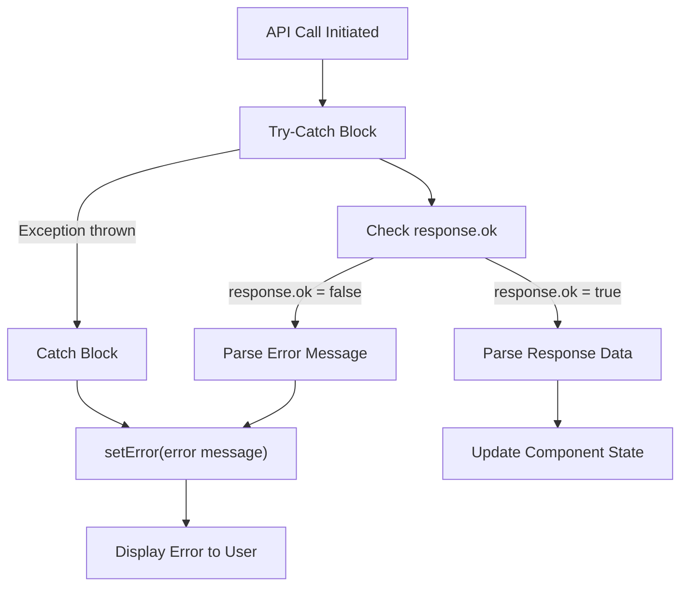
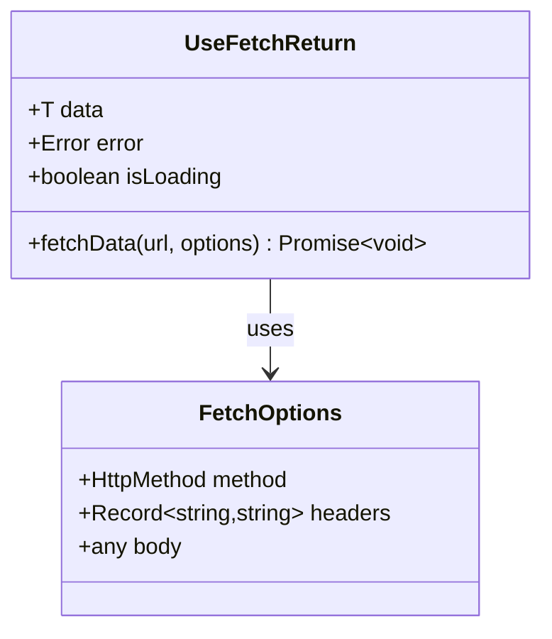
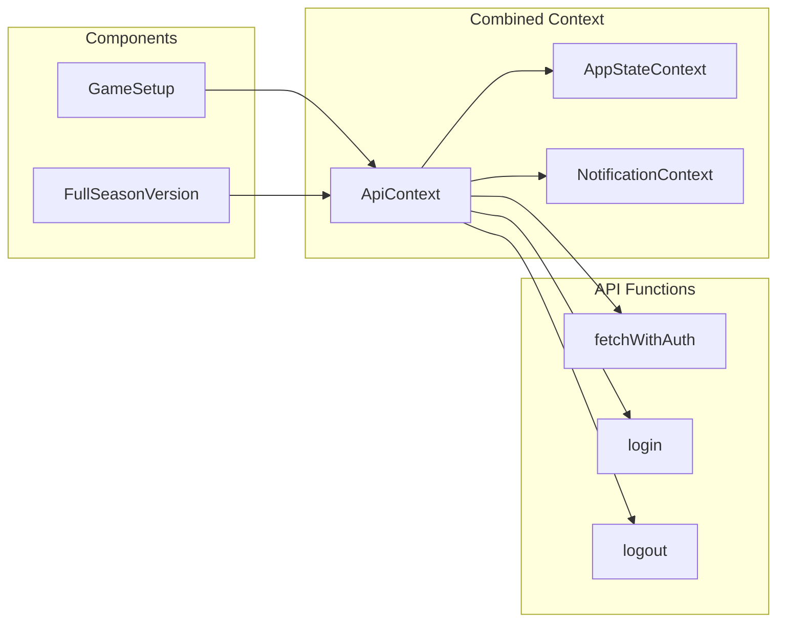

# API Integration

<details>
<summary>Relevant source files</summary>

The following files were used as context for generating this wiki page:

- [src/components/ui/sheet.tsx](/src/components/ui/sheet.tsx)
- [src/contexts/ApiContext.tsx](/src/contexts/ApiContext.tsx)
- [src/contexts/AppStateContext.tsx](/src/contexts/AppStateContext.tsx)
- [src/contexts/NotificationContext.tsx](/src/contexts/NotificationContext.tsx)
- [src/hooks/useFetch.tsx](/src/hooks/useFetch.tsx)
- [src/pages/GameSetup.tsx](/src/pages/GameSetup.tsx)

</details>


This document covers the API integration system used throughout the NBA simulation application. It explains how the application communicates with external basketball simulation APIs, manages authentication, handles data fetching, and processes API responses.

For information about the broader state management patterns, see [State Management](./5_State_Management.md). For details about specific game simulation features that consume this API data, see [Game Features](./13_Game_Features.md).

## API Architecture Overview

The application uses a centralized API integration pattern with a dedicated context provider that manages authentication and provides standardized data fetching capabilities. The system primarily integrates with an external basketball simulation API hosted at `api.bballsports.com`.

### API Integration Flow



**Sources:** [src/contexts/ApiContext.tsx:1-97](), [src/pages/GameSetup.tsx:226-597]()

## Authentication System

The API integration uses an API key-based authentication system managed through the `ApiContext`. Authentication credentials consist of two components: an API key and an authorization header.

### Authentication Data Structure

The authentication system uses the `ApiCredentials` interface to manage API access:



**Sources:** [src/contexts/ApiContext.tsx:5-8](), [src/contexts/ApiContext.tsx:12-21]()

### Authentication Flow



**Sources:** [src/contexts/ApiContext.tsx:33-43](), [src/contexts/ApiContext.tsx:45-70]()

## External API Endpoints

The application integrates with multiple endpoints of the basketball simulation API. Each endpoint serves a specific purpose in the game simulation workflow.

### Core API Endpoints

| Endpoint | Purpose | Method | Key Parameters |
|----------|---------|--------|----------------|
| `get_leagues.php` | Fetch available leagues | POST | `apikey` |
| `get_teams.php` | Get teams for selected league | POST | `apikey`, `league_name` |
| `playsinglegame_initial.php` | Initialize single game | POST | `homeaway`, `hometeam`, `awayteam`, `homeleague_name`, `awayleague_name` |
| `get_singlegame_stats.php` | Retrieve game scoreboard | POST | `apikey` |
| `get_actual_player_stats.php` | Get player statistics | POST | `apikey`, `league_name`, `team_name` |
| `get_singlegame_pbp.php` | Fetch play-by-play data | POST | `apikey` |
| `get_singlegame_box.php` | Get box score data | POST | `apikey` |
| `play_predict.php` | Initialize prediction mode | POST | `league_name`, `gamearray`, `gamemode` |
| `playsinglegame_step.php` | Step through game simulation | POST | `options` |

**Sources:** [src/pages/GameSetup.tsx:318-485]()

### API Request Authentication Pattern

The `fetchWithAuth` function automatically handles authentication by injecting credentials into requests:



**Sources:** [src/contexts/ApiContext.tsx:45-70]()

## Data Flow Patterns

The API integration follows consistent patterns for data fetching, error handling, and state updates across different game components.

### Typical API Call Pattern



**Sources:** [src/pages/GameSetup.tsx:318-332](), [src/pages/GameSetup.tsx:334-348]()

### Response Data Processing

API responses follow consistent TypeScript interfaces for type safety:



**Sources:** [src/pages/GameSetup.tsx:14-191]()

## Error Handling

The API integration implements comprehensive error handling at multiple levels to ensure robust operation and user feedback.

### Error Handling Hierarchy



**Sources:** [src/pages/GameSetup.tsx:318-332](), [src/pages/GameSetup.tsx:322-330]()

### Error Message Structure

The API returns error messages in a consistent format that components handle uniformly:

```typescript
interface Message {
  message: string;
}
```

Error handling follows this pattern across all API functions:
1. Set error state to `null` at request start
2. Check `response.ok` status
3. Parse error message from response if request failed
4. Set error state with descriptive message
5. Catch and handle any network or parsing exceptions

**Sources:** [src/pages/GameSetup.tsx:10-12](), [src/pages/GameSetup.tsx:322-331]()

## Custom Fetch Hook

The application provides a generic `useFetch` hook for components that need custom fetch logic outside the main API context.

### useFetch Implementation



The `useFetch` hook provides:
- Generic type support for response data
- Loading state management
- Error state handling
- Configurable HTTP methods and headers
- Automatic JSON parsing and error handling

**Sources:** [src/hooks/useFetch.tsx:1-62]()

## Integration with State Management

The API integration system works closely with the application's React Context-based state management to provide seamless data flow.

### Context Integration



The `ApiContext` aggregates multiple context providers into a unified interface, allowing components to access API functionality alongside application state and notifications through a single hook.

**Sources:** [src/contexts/ApiContext.tsx:12-21](), [src/contexts/ApiContext.tsx:72-88]()