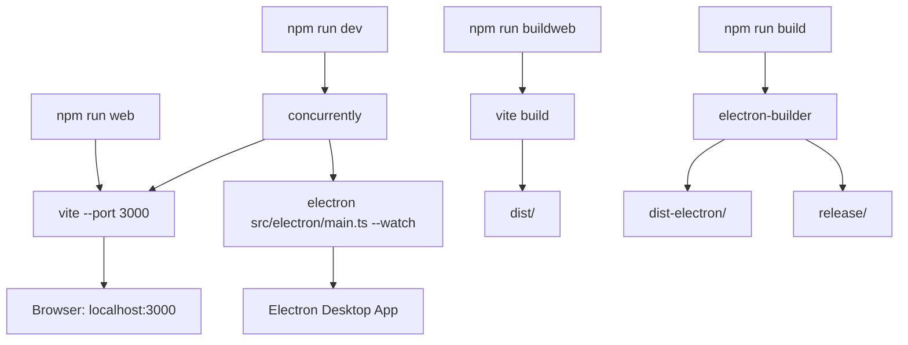
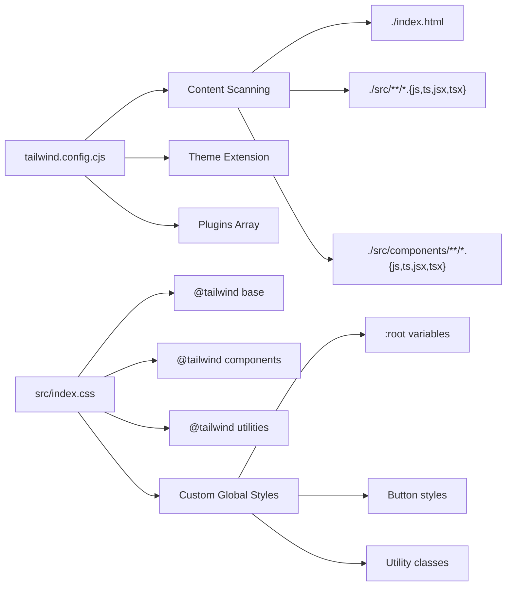
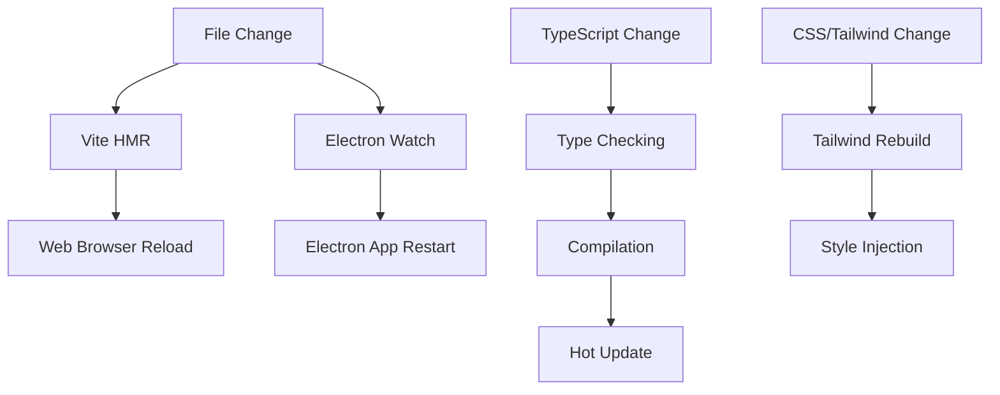

# Development Guide

Relevant source files

The following files were used as context for generating this wiki page:

- [src/App.css](/src/App.css)
- [src/index.css](/src/index.css)
- [tailwind.config.cjs](/tailwind.config.cjs)

This document provides technical guidance for developers working on the NBA simulation application codebase. It covers component development patterns, styling approaches, development workflow, and code organization principles. For information about the overall architecture, see [Architecture](./3_Architecture.md). For specific styling and theming details, see [Styling and Theming](./18_Styling_and_Theming.md). For Electron-specific development, see [Electron Development](./19_Electron_Development.md).

## Development Environment Setup

The application uses a modern React + TypeScript + Vite development stack with dual-target deployment capabilities. The development environment supports both web and Electron builds from a single codebase.

### Development Commands

**Development Workflow Commands**

| Command | Purpose | Output |
|---------|---------|--------|
| `npm run web` | Web development server | Browser at localhost:3000 |
| `npm run dev` | Electron development | Desktop app with hot reload |
| `npm run buildweb` | Web production build | `dist/` directory |
| `npm run build` | Electron production build | `dist-electron/` and `release/` |

Sources: Package.json scripts, vite.config.ts

## Component Development Patterns

The application follows a structured component hierarchy with reusable UI components and specialized game components.

### Component Architecture

```mermaid
graph TB
    subgraph "Component Types"
        LAYOUT["Layout Components"]
        FORMS["Form Components"] 
        GAME["Game Components"]
        SHARED["Shared UI Components"]
    end
    
    subgraph "Layout Components"
        APP_LAYOUT["AppLayout"]
        SIDEBAR["AppSidebar"] 
        USER_PROFILE["UserProfile"]
    end
    
    subgraph "Form Components"
        CUSTOM_RADIO["CustomRadio"]
        CUSTOM_CHECKBOX["CustomCheckbox"]
        LOGIN_API["LoginAPI"]
    end
    
    subgraph "Game Components"
        GAME_SETUP["GameSetup"]
        FULL_SEASON["FullSeasonVersion"]
        SINGLE_GAME["SingleGameVersion"]
        PLAYER_STATS["PlayerStatsTable"]
        SCOREBOARD["Scoreboard"]
    end
    
    subgraph "Shared UI Components"
        TABLE["Table Components"]
        INSTRUCTIONS["Instructions"]
    end
    
    LAYOUT --> APP_LAYOUT
    LAYOUT --> SIDEBAR
    LAYOUT --> USER_PROFILE
    
    FORMS --> CUSTOM_RADIO
    FORMS --> CUSTOM_CHECKBOX
    FORMS --> LOGIN_API
    
    GAME --> GAME_SETUP
    GAME --> FULL_SEASON
    GAME --> SINGLE_GAME
    GAME --> PLAYER_STATS
    GAME --> SCOREBOARD
    
    SHARED --> TABLE
    SHARED --> INSTRUCTIONS
```

### Component Development Guidelines

**State Management Integration**
Components should integrate with the React Context system for shared state:

- Use `ApiContext` for API calls and authentication state
- Use `UserContext` for user data and permissions
- Use `AppStateContext` for application-wide settings
- Use `NotificationContext` for user feedback

**TypeScript Patterns**
All components must be written in TypeScript with proper type definitions:
- Define prop interfaces for all components
- Use generic types for reusable components
- Leverage TypeScript strict mode for type safety

**Component Structure**
Follow consistent component organization:
- Component logic in main function
- Type definitions at top of file
- Helper functions below main component
- Default export at bottom

Sources: src/components/ directory structure, React Context implementations

## Styling System

The application uses Tailwind CSS as the primary styling framework with custom CSS for specific overrides and global styles.

### Tailwind Configuration

### Global Style Structure

The styling system is organized in [src/index.css:1-71]():

**Tailwind Integration** [src/index.css:1-3]()
- Base layer for CSS resets
- Components layer for custom component classes  
- Utilities layer for utility classes

**Global Variables** [src/index.css:6-19]()
- Font family definitions using Inter
- Color scheme configuration
- Typography optimization settings

**Custom Utility Classes** [src/index.css:65-71]()
- `.bg-popover` for popover backgrounds
- `.bg-destructive` for destructive action styling

### Styling Patterns

**Component-Specific Styles**
Additional component styles are defined in [src/App.css:1-50]():
- Logo animations and hover effects
- Responsive layout utilities
- Sidebar collapsed/expanded states

**Tailwind Configuration** [tailwind.config.cjs:1-8]()
- Content scanning includes all TypeScript/JavaScript files
- Theme extensions for custom design tokens
- Plugin integration for additional functionality

Sources: [src/index.css:1-71](), [tailwind.config.cjs:1-8](), [src/App.css:1-50]()

## Development Workflow

### Hot Reload and Development Server

The development workflow supports real-time code changes for both web and desktop versions:

### Environment Variables

Development configuration is controlled through environment variables:

| Variable | Purpose | Values |
|----------|---------|--------|
| `VITE_APP_TARGET` | Build target selection | `web` or `electron` |
| `VITE_API_BASE_URL` | API endpoint configuration | API base URL |
| `VITE_AWS_REGION` | AWS services region | AWS region code |

### TypeScript Configuration

The application uses strict TypeScript configuration for development:
- Strict mode enabled for type safety
- Path mapping for clean imports
- JSX transformation for React components
- Module resolution for Node.js compatibility

Sources: vite.config.ts, tsconfig.json, package.json scripts

## Code Organization Principles

### File Structure Standards

**Component Organization**
- One component per file with matching filename
- Co-locate related components in feature directories
- Separate shared/reusable components from feature-specific ones

**Import Conventions**
- External library imports first
- Internal component imports second
- Relative imports last
- Type-only imports with `type` keyword

**Naming Conventions**
- PascalCase for components and types
- camelCase for functions and variables
- kebab-case for file names (when appropriate)
- UPPER_CASE for constants

### Development Best Practices

**Type Safety**
- Define explicit prop interfaces
- Use union types for controlled values
- Leverage TypeScript inference where appropriate
- Avoid `any` type usage

**Performance Considerations**
- Use React.memo for expensive components
- Implement proper dependency arrays for hooks
- Avoid unnecessary re-renders through context splitting
- Optimize large lists with virtualization when needed

**Error Handling**
- Implement error boundaries for component trees
- Use try-catch blocks for async operations
- Provide user-friendly error messages
- Log errors for debugging purposes

Sources: Component files in src/ directory, TypeScript configuration, React Context implementations