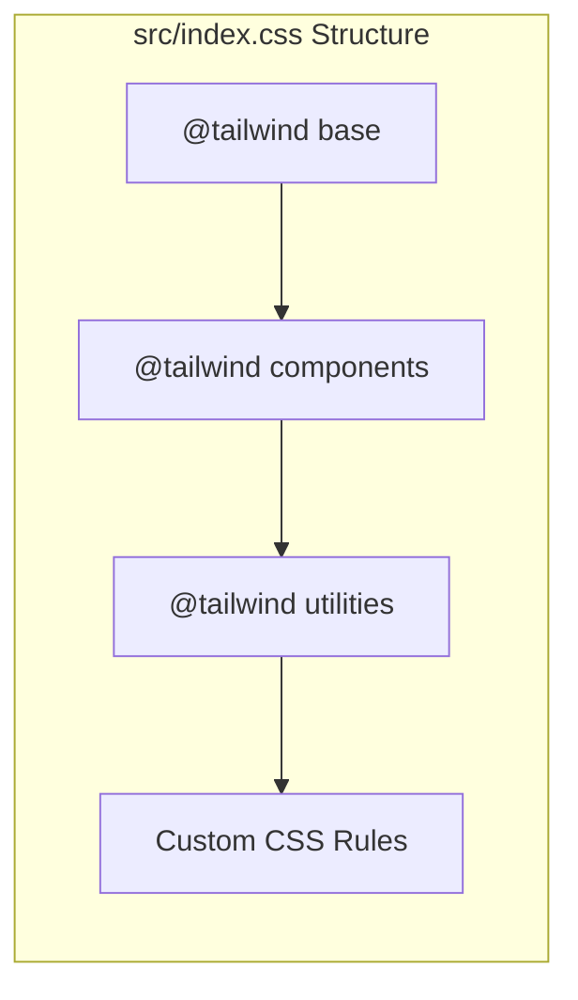
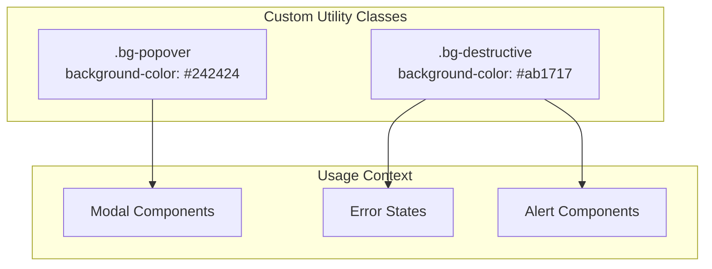
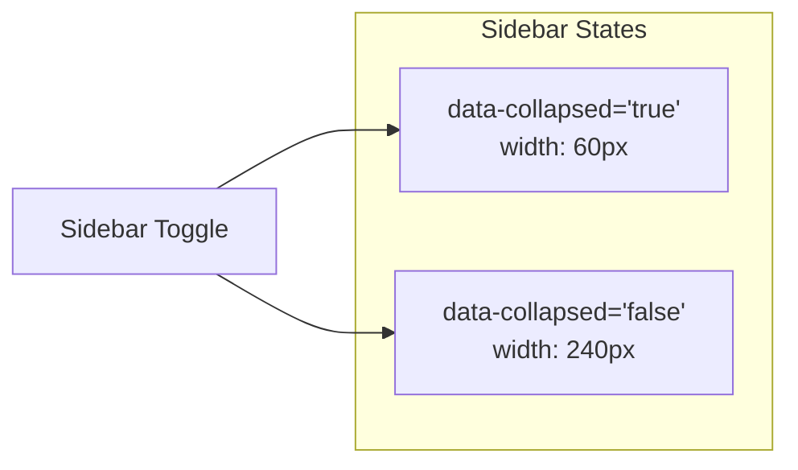
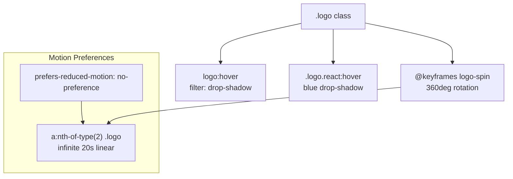

# Styling and Theming

<details>
<summary>Relevant source files</summary>

The following files were used as context for generating this wiki page:

- [src/App.css](/src/App.css)
- [src/index.css](/src/index.css)
- [tailwind.config.cjs](/tailwind.config.cjs)

</details>


This document covers the styling and theming system used in the NBA simulation application. It explains how Tailwind CSS is integrated as the primary styling framework, how global styles are managed, and the patterns used for component-specific styling throughout the codebase.

For information about UI component structure and design patterns, see [Core Components](./9_Core_Components.md). For build system configuration that affects styling, see [Build System](./7_Build_System.md).

## Styling System Architecture

The application uses a layered styling approach that combines Tailwind CSS utilities with custom CSS for specific design requirements and global theming.

### Styling Architecture Overview

```mermaid
graph TB
    subgraph "Styling Layers"
        TAILWIND[tailwind.config.cjs<br/>"Tailwind Configuration"]
        INDEX_CSS[src/index.css<br/>"Global Styles & Base"]
        APP_CSS[src/App.css<br/>"Component Styles"]
        INLINE[Inline Tailwind Classes<br/>"Component Styling"]
    end
    
    subgraph "CSS Processing"
        POSTCSS[PostCSS Processing]
        VITE[Vite Build System]
    end
    
    subgraph "Output"
        BUNDLE[Bundled CSS]
        COMPONENTS[Styled Components]
    end
    
    TAILWIND --> POSTCSS
    INDEX_CSS --> POSTCSS
    APP_CSS --> POSTCSS
    INLINE --> POSTCSS
    
    POSTCSS --> VITE
    VITE --> BUNDLE
    BUNDLE --> COMPONENTS
```

Sources: [tailwind.config.cjs:1-8](), [src/index.css:1-3](), [src/App.css:1-50]()

## Tailwind CSS Integration

The application uses Tailwind CSS as its primary styling framework with a standard configuration setup.

### Tailwind Configuration

The Tailwind configuration is minimal and uses default settings with content scanning configured for the React application structure:

| Configuration | Value | Purpose |
|---------------|--------|---------|
| Content paths | `["./index.html", "./src/**/*.{js,ts,jsx,tsx}", "./src/components/**/*.{js,ts,jsx,tsx}"]` | Scans for Tailwind classes |
| Theme extensions | None | Uses default Tailwind theme |
| Plugins | None | No additional Tailwind plugins |

The configuration at [tailwind.config.cjs:3]() ensures all TypeScript and JSX files are scanned for Tailwind utility classes during the build process.

Sources: [tailwind.config.cjs:1-8]()

### Tailwind Import Structure



The Tailwind directives are imported in the standard order at [src/index.css:1-3](), followed by custom CSS rules that extend or override default behavior.

Sources: [src/index.css:1-3]()

## Global Styles and Theme System

The application implements a dark-themed design system with global CSS custom properties and base styles.

### Color Scheme and Typography

The global theme is defined using CSS custom properties in the `:root` selector:

| Property | Value | Usage |
|----------|--------|-------|
| `font-family` | `Inter, system-ui, Avenir, Helvetica, Arial, sans-serif` | Primary font stack |
| `color-scheme` | `light dark` | Browser color scheme support |
| `color` | `rgba(255, 255, 255, 0.87)` | Default text color |
| `background-color` | `#4d4d4d` | Base background color |

The typography system at [src/index.css:7-18]() includes optimized font rendering with `text-rendering: optimizeLegibility` and `-webkit-font-smoothing: antialiased`.

Sources: [src/index.css:6-19]()

### Custom Utility Classes

The application defines custom utility classes for specific component styling needs:



These custom classes at [src/index.css:65-71]() provide consistent theming for popup elements and destructive actions that override default component styling.

Sources: [src/index.css:65-71]()

## Component-Specific Styling Patterns

### Layout and Responsive Design

The application uses specific styling patterns for layout management and responsive behavior.

#### Root Container Styling

The main application container uses centered layout with responsive sizing:

| Property | Value | Purpose |
|----------|--------|---------|
| `max-width` | `1280px` | Maximum content width |
| `margin` | `0 auto` | Horizontal centering |
| `padding` | `2rem` | Base container padding |
| `text-align` | `center` | Default text alignment |

Defined at [src/App.css:1-6](), this provides the base layout structure for the application.

Sources: [src/App.css:1-6]()

#### Sidebar Collapse System

The application implements a collapsible sidebar using data attributes:



The collapse system at [src/App.css:44-50]() uses data attributes to control sidebar width, enabling smooth transitions between collapsed and expanded states.

Sources: [src/App.css:44-50]()

### Interactive Element Styling

#### Button System

Global button styling provides consistent interactive elements:

| State | Properties | Visual Effect |
|-------|------------|---------------|
| Default | `border-radius: 8px`, `padding: 0.6em 1.2em`, `background-color: #1a1a1a` | Dark themed button |
| Hover | `border-color: #646cff` | Blue border highlight |
| Focus | `outline: 4px auto -webkit-focus-ring-color` | Accessibility outline |

The button system at [src/index.css:44-63]() includes transition effects and proper focus management for accessibility.

Sources: [src/index.css:44-63]()

#### Link Styling

Link elements use consistent color theming:

- Default color: `#646cff` (blue)
- Hover color: `#535bf2` (darker blue)
- Font weight: `500` (medium)

Defined at [src/index.css:21-29](), links maintain visual consistency with the overall color scheme.

Sources: [src/index.css:21-29]()

## Animation and Visual Effects

### Logo Animation System

The application includes sophisticated logo animations with motion preferences:



The animation system at [src/App.css:8-34]() respects user motion preferences and provides visual feedback through drop-shadow effects and rotation animations.

Sources: [src/App.css:8-34]()

### Transition Effects

Interactive elements use consistent transition timing:

- Button border transitions: `0.25s` duration
- Logo filter transitions: `300ms` duration

These transitions provide smooth user interactions while maintaining performance.

Sources: [src/index.css:53](), [src/App.css:12]()

## Development Patterns

### CSS Organization Strategy

The styling system follows a clear separation of concerns:

1. **Global base styles** in `src/index.css` for typography, colors, and base element styling
2. **Component-specific styles** in `src/App.css` for layout and component behavior
3. **Utility-first approach** using Tailwind classes directly in components
4. **Custom utilities** for application-specific theming needs

### Responsive Design Approach

The application uses Tailwind's responsive utilities combined with CSS custom properties for adaptive design. The minimum viewport width is set to `320px` at [src/index.css:35]() to ensure mobile compatibility.

Sources: [src/index.css:35](), [src/App.css:30-34]()