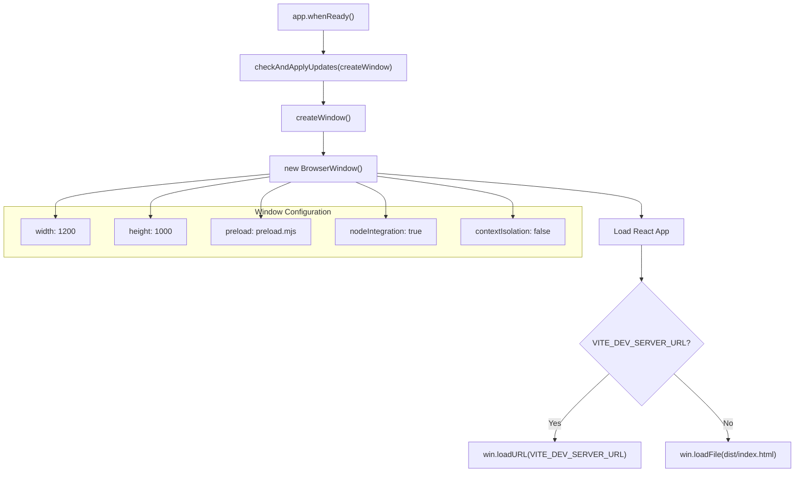
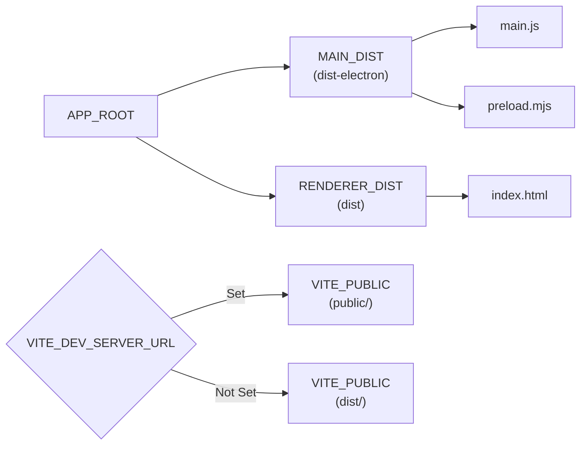
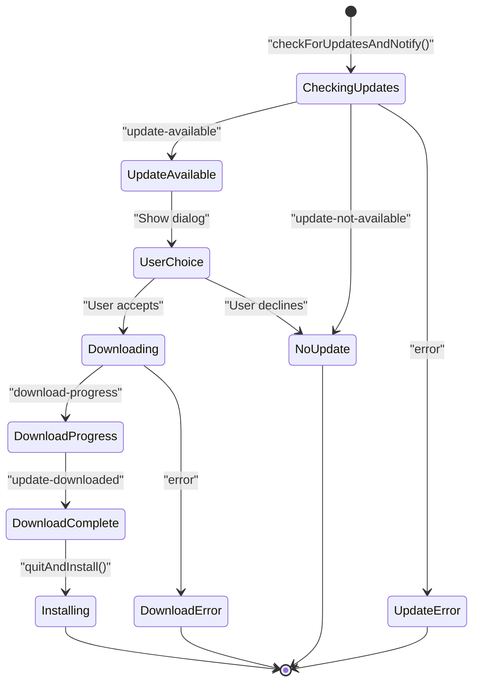
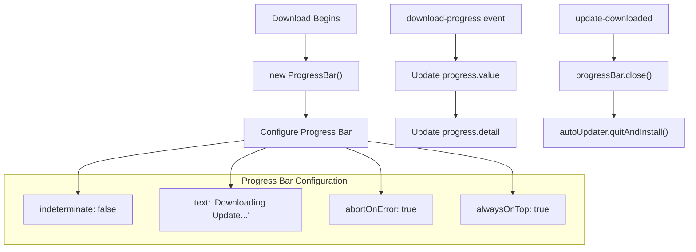
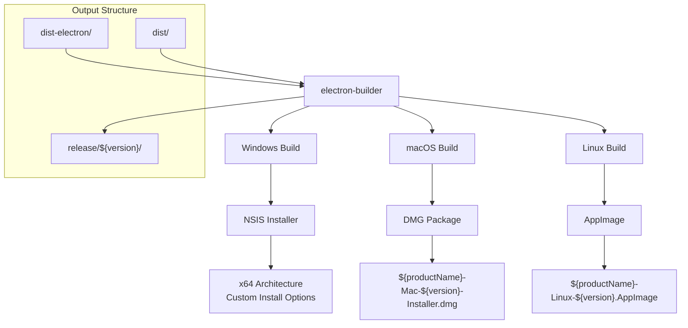

# Electron Development

<details>
<summary>Relevant source files</summary>

The following files were used as context for generating this wiki page:

- [.gitignore](/.gitignore)
- [README.md](/README.md)
- [electron-builder.json5.example](/electron-builder.json5.example)
- [electron/main.ts](/electron/main.ts)
- [electron/updater.ts](/electron/updater.ts)
- [license.txt](/license.txt)

</details>


This document covers the Electron desktop application development aspects of the NBA simulation application, including the main process setup, auto-updater system, and packaging configuration. For information about the overall build system that supports both web and Electron targets, see [Build System](./7_Build_System.md).

## Purpose and Scope

The Electron development system enables the React-based NBA simulation application to run as a native desktop application across Windows, macOS, and Linux platforms. This includes the main Electron process, automatic update functionality, and cross-platform packaging configuration.

## Main Process Architecture

The Electron main process is implemented in `electron/main.ts` and serves as the entry point for the desktop application. The main process creates and manages the browser window that renders the React application.

### Window Creation and Lifecycle

The `createWindow` function initializes the main application window with specific configurations:



**Main Process Lifecycle Events**

| Event | Handler | Purpose |
|-------|---------|---------|
| `window-all-closed` | Quit app (except macOS) | Standard desktop app behavior |
| `activate` | Create window if none exist | macOS dock interaction |
| `did-finish-load` | Send timestamp message | IPC communication test |

Sources: [electron/main.ts:31-55](), [electron/main.ts:60-73]()

### Environment and Path Configuration

The main process establishes the application directory structure and environment variables:



Sources: [electron/main.ts:20-27]()

## Auto-updater System

The auto-updater system is implemented in `electron/updater.ts` using the `electron-updater` package. It provides automatic update checking, downloading, and installation with user interaction.

### Update Flow State Machine



### Auto-updater Configuration

The updater is configured with the following key settings:

| Setting | Value | Purpose |
|---------|-------|---------|
| `autoDownload` | `false` | Requires user consent before downloading |
| `logger` | `electron-log` | Centralized logging for update events |
| Dialog Type | `MessageBox` | Native system dialogs for user interaction |

Sources: [electron/updater.ts:7-14]()

### Progress Bar Integration

The system uses `electron-progressbar` to provide visual feedback during update downloads:



Sources: [electron/updater.ts:47-56](), [electron/updater.ts:78-111]()

### Update Event Handlers

The auto-updater implements comprehensive event handling:

| Event | Handler Function | User Interaction |
|-------|------------------|------------------|
| `update-available` | Show download dialog | User chooses to download or skip |
| `download-progress` | Update progress bar | Visual progress feedback |
| `update-downloaded` | Automatic installation | Immediate quit and install |
| `error` | Show error dialog | Error notification |
| `update-not-available` | Silent logging | No user notification |

Sources: [electron/updater.ts:37-75](), [electron/updater.ts:114-135](), [electron/updater.ts:138-148]()

## Build and Packaging Configuration

The Electron application packaging is configured through `electron-builder.json5.example`, which defines cross-platform build targets and distribution settings.

### Cross-Platform Build Targets



### Build Configuration Details

| Platform | Target Format | Architecture | Installer Options |
|----------|---------------|--------------|-------------------|
| Windows | NSIS | x64 | Custom install directory, per-user install |
| macOS | DMG | Universal | Standard DMG with application bundle |
| Linux | AppImage | Universal | Portable application format |

**NSIS Windows Installer Configuration:**
- `oneClick: false` - Allows custom installation options
- `perMachine: false` - Per-user installation
- `allowToChangeInstallationDirectory: true` - User-selectable install path
- `deleteAppDataOnUninstall: false` - Preserves user data

Sources: [electron-builder.json5.example:20-40]()

### GitHub Publishing Integration

The configuration includes GitHub publishing setup for automated release distribution:

```json
{
  "publish": {
    "provider": "github",
    "token": "Github-token"
  }
}
```

This enables automatic publishing of release artifacts to GitHub releases when building with the `--publish` flag.

Sources: [electron-builder.json5.example:47-50]()

## Development Workflow

### Environment Configuration

The development workflow relies on the `VITE_APP_TARGET` environment variable to control build behavior:

| Command | Environment | Purpose |
|---------|-------------|---------|
| `npm run dev` | `VITE_APP_TARGET=electron` | Electron development with hot reload |
| `npm run build` | `VITE_APP_TARGET=electron` | Production Electron build |
| `npm run web` | No `VITE_APP_TARGET` | Web development server |
| `npm run buildweb` | No `VITE_APP_TARGET` | Web production build |

### File Structure and Gitignore

The Electron development generates several build artifacts that are excluded from version control:

```
├── dist/                 # Web build output
├── dist-electron/        # Electron build output  
├── release/              # Packaged installers
└── electron/
    ├── main.ts          # Main process
    ├── updater.ts       # Auto-updater
    └── preload.mjs      # Preload script
```

Sources: [README.md:66-70](), [.gitignore:11-14]()

### Integration with React Application

The Electron main process integrates with the React application through several mechanisms:

1. **Window Loading**: Loads either the Vite development server or built React application
2. **IPC Communication**: Uses preload scripts with `nodeIntegration: true` and `contextIsolation: false`
3. **Update Integration**: Calls `checkAndApplyUpdates` before creating the main window

Sources: [electron/main.ts:6](), [electron/main.ts:78-79](), [electron/main.ts:36-40]()