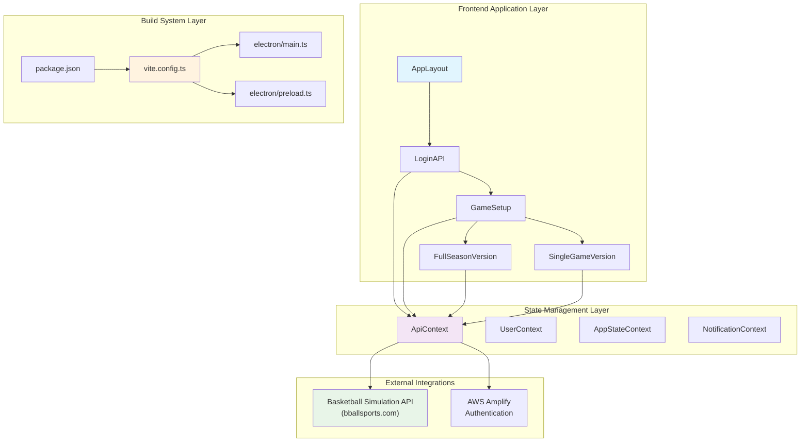
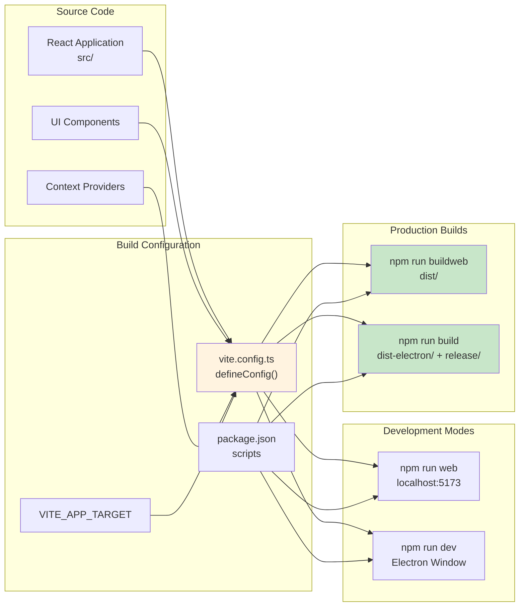
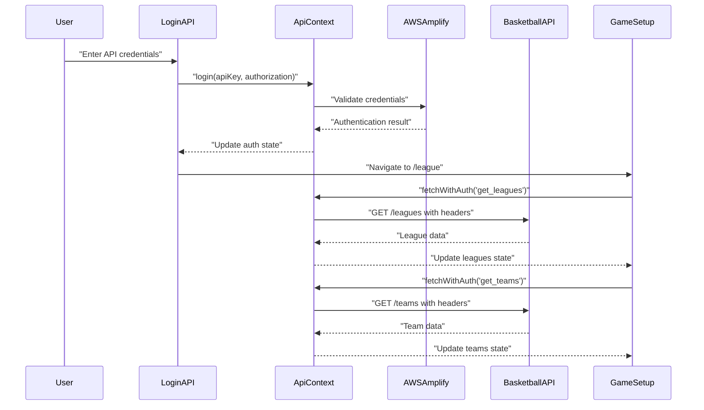

# Overview

Relevant source files

The following files were used as context for generating this wiki page:

- [.env.example](/.env.example)
- [README.md](/README.md)
- [license.txt](/license.txt)
- [package.json](/package.json)
- [src/gamesetupimage.png](/src/gamesetupimage.png)
- [src/main.tsx](/src/main.tsx)
- [vite.config.ts](/vite.config.ts)

## Purpose and Scope

This document provides a comprehensive overview of the NBA simulation application, a React-based basketball game simulator that enables users to simulate basketball games and seasons through integration with external basketball simulation APIs. The application supports both web browser and desktop deployment through a unified codebase.

For detailed information about specific subsystems, see [Architecture](./3_Architecture.md) for system design patterns, [User Interface](./8_User_Interface.md) for component documentation, [Game Features](./13_Game_Features.md) for simulation mechanics, and [Development Guide](./17_Development_Guide.md) for contributor guidelines.

## Application Architecture

The NBA simulation application follows a modern React architecture with dual deployment capabilities. The system is built around a centralized state management approach using React Context and supports both web and Electron desktop environments from a single codebase.

Sources: [src/main.tsx:10](/src/main.tsx), [package.json:2](/package.json), [vite.config.ts:8-36](/vite.config.ts)

## Deployment Architecture

The application supports dual deployment targets through environment-driven build configuration. The `VITE_APP_TARGET` environment variable controls whether the application builds for web or desktop deployment.

Sources: [vite.config.ts:8-11](/vite.config.ts), [package.json:6-12](/package.json), [README.md:15-71](/README.md)

## Core Technology Stack

The application leverages a modern React ecosystem with carefully selected libraries for UI, state management, and development workflow.

| Category | Technology | Purpose |
|----------|------------|---------|
| **Frontend Framework** | React 18.3.1 | Component-based UI development |
| **Type System** | TypeScript 5.8.3 | Static type checking and IDE support |
| **Build System** | Vite 5.1.6 | Fast development server and build tooling |
| **Desktop Runtime** | Electron 30.0.1 | Cross-platform desktop application support |
| **UI Components** | Radix UI + PrimeReact | Accessible component primitives and widgets |
| **Styling** | Tailwind CSS 3.4.17 | Utility-first CSS framework |
| **State Management** | React Context | Built-in React state management pattern |
| **Authentication** | AWS Amplify 6.15.3 | User authentication and management |
| **Data Fetching** | TanStack React Query 5.56.2 | Server state management and caching |

Sources: [package.json:14-71]()

## Authentication and API Integration

The application implements API key-based authentication through AWS Amplify integration. The `ApiContext` centralizes all external API communication and authentication state management.

The authentication system supports integration with basketball simulation services at `bballsports.com` and manages user sessions through AWS Amplify's authentication infrastructure.

Sources: [package.json:15](/package.json), [package.json:47](/package.json), [package.json:113](/package.json)

## Development Environment Setup

The application provides streamlined development workflows for both web and desktop environments through npm scripts and environment variable configuration.

### Environment Configuration

The `.env` file controls build target selection:
- Set `VITE_APP_TARGET=electron` for desktop development and builds
- Remove or set to any other value for web development and builds

### Development Commands

| Command | Environment | Description |
|---------|-------------|-------------|
| `npm run web` | Web | Start development server at http://localhost:5173 |
| `npm run dev` | Electron | Launch Electron development window |
| `npm run buildweb` | Web | Build production web application to `dist/` |
| `npm run build` | Electron | Build desktop application to `dist-electron/` and `release/` |

The Vite configuration automatically detects the environment target and conditionally loads the Electron plugin, enabling seamless switching between development modes without configuration changes.

Sources: [README.md:15-71](), [vite.config.ts:8-36](), [.env.example:1]()

## Project Structure and Entry Points

The application follows a standard React application structure with TypeScript support and modular component organization.

### Main Entry Point

The application bootstraps through [src/main.tsx:8-12]() where `ReactDOM` renders the `AppLayout` component wrapped in `React.StrictMode`. The main entry also includes Electron IPC communication setup for desktop deployment.

### Core Application Layout

The `AppLayout` component serves as the root container, managing routing, authentication state, and global context providers. This component orchestrates the entire application flow from login through game simulation interfaces.

### Build Artifacts

- **Web deployment**: Static files generated in `dist/` directory
- **Desktop deployment**: Electron application files in `dist-electron/` with installers in `release/`
- **Main process**: Electron entry point defined as `dist-electron/main.js` in [package.json:149]()

Sources: [src/main.tsx:8-19](), [package.json:149]()