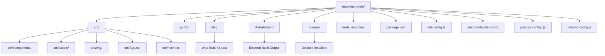
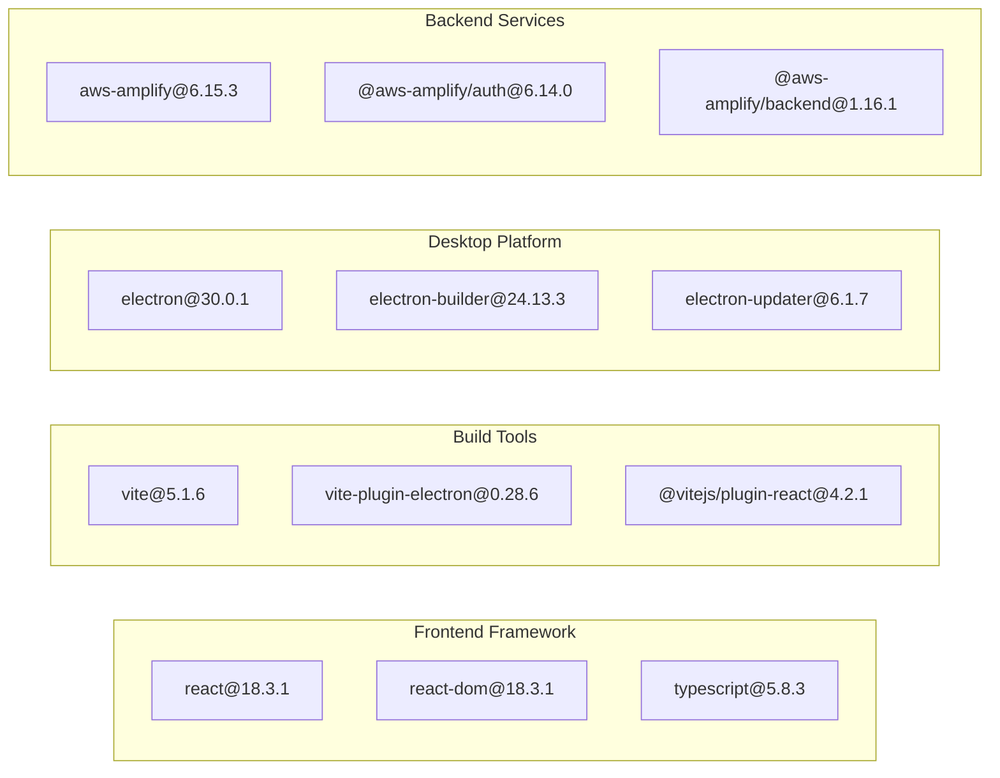
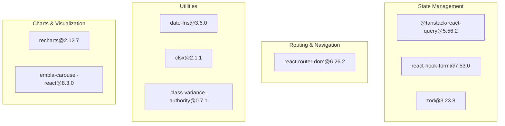
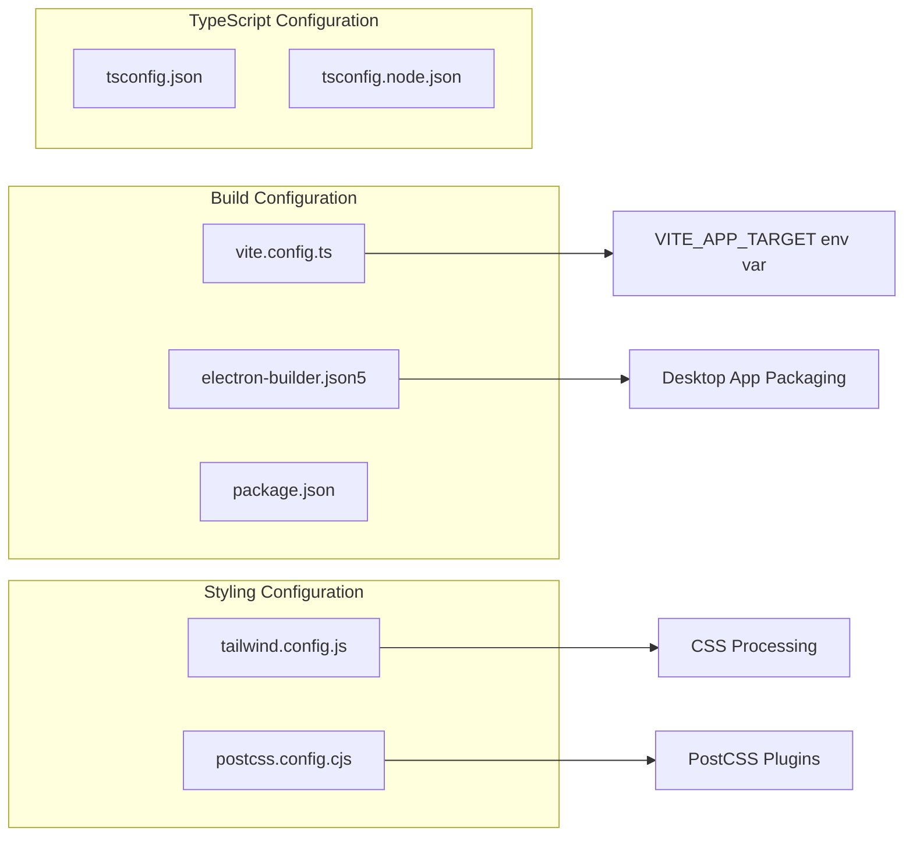
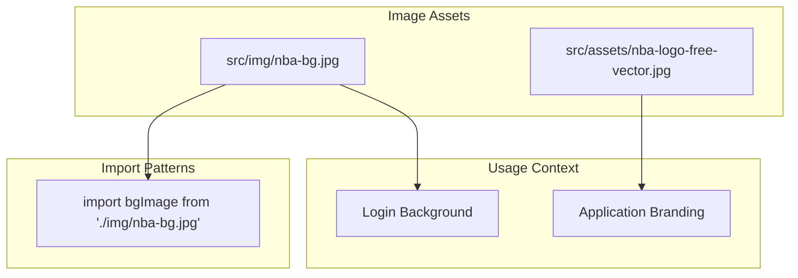
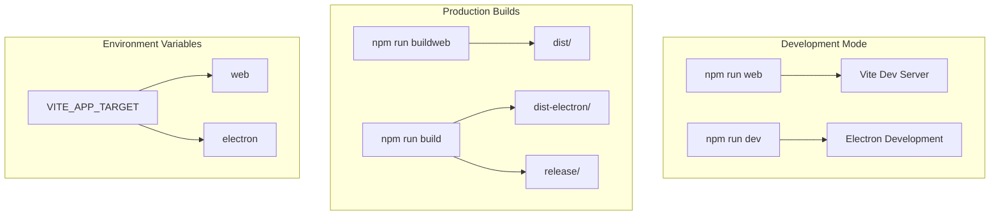
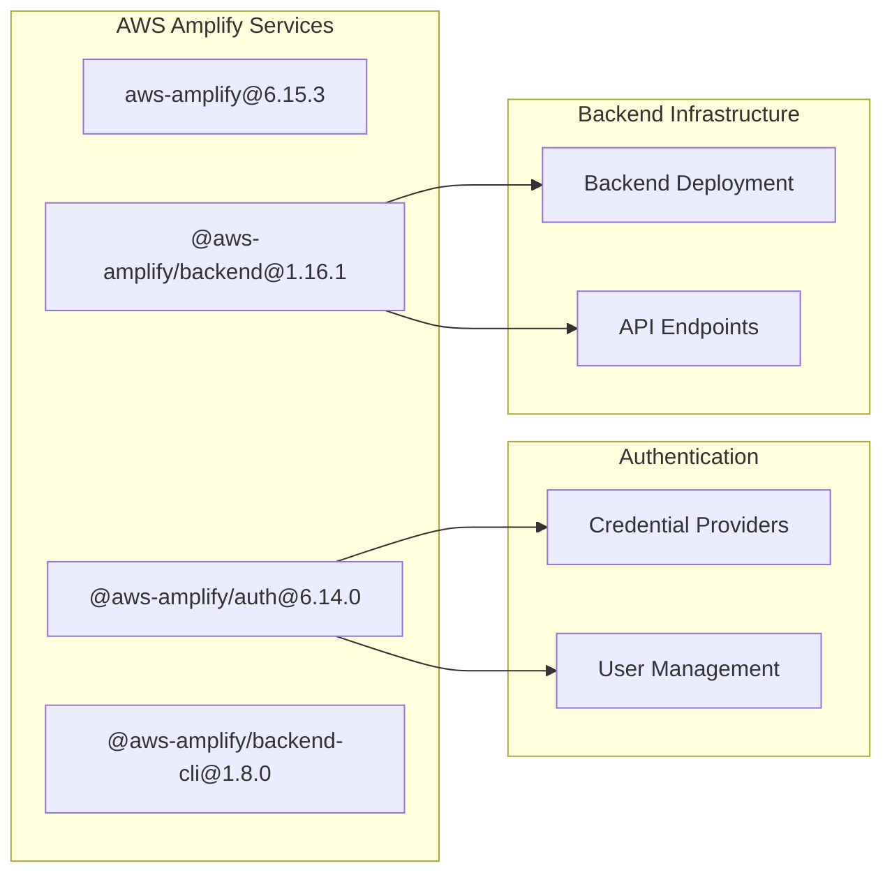

# Reference

<details>
<summary>Relevant source files</summary>

The following files were used as context for generating this wiki page:

- [package-lock.json](package-lock.json)
- [postcss.config.cjs](postcss.config.cjs)
- [src/App.tsx](src/App.tsx)
- [src/assets/nba-logo-free-vector.jpg](src/assets/nba-logo-free-vector.jpg)
- [src/img/nba-bg.jpg](src/img/nba-bg.jpg)

</details>


This page provides comprehensive reference documentation for the NBA simulation application codebase structure, configuration files, dependencies, and assets. It serves as a quick lookup guide for developers working with the project's technical infrastructure and build system.

For information about the application's UI components and styling system, see [Styling and Theming](#7.1). For details about the build and deployment processes, see [Build System](#3.4).

## Project Structure Overview

The application follows a standard React TypeScript project structure with dual-target builds for web and Electron desktop deployment.

### Core Directory Structure



Sources: [package-lock.json:1-10]()

### File Structure Mapping

| Directory | Purpose | Key Files |
|-----------|---------|-----------|
| `src/` | Source code | `App.tsx`, `main.tsx` |
| `src/components/` | React components | UI component library |
| `src/assets/` | Static assets | Images, icons, media files |
| `src/img/` | Image resources | `nba-bg.jpg`, logos |
| `dist/` | Web build output | Production web assets |
| `dist-electron/` | Electron build output | Desktop application files |
| `release/` | Packaged installers | Platform-specific installers |

Sources: [src/App.tsx:1-5](), [src/assets/nba-logo-free-vector.jpg:1](), [src/img/nba-bg.jpg:1]()

## Dependencies and External Libraries

### Core Framework Dependencies

The application uses the following major framework dependencies defined in `package.json`:



Sources: [package-lock.json:54-66](), [package-lock.json:115-143]()

### UI Component Libraries

| Library | Version | Purpose |
|---------|---------|---------|
| `@radix-ui/*` | Various | Accessible UI primitives |
| `lucide-react` | 0.462.0 | Icon library |
| `primereact` | 10.9.6 | React UI components |
| `primeicons` | 7.0.0 | Icon set for PrimeReact |
| `tailwindcss` | 3.4.17 | Utility-first CSS framework |
| `tailwind-merge` | 2.5.2 | Tailwind class merging utility |

Sources: [package-lock.json:14-40](), [package-lock.json:50-64]()

### Data Management and Utilities



Sources: [package-lock.json:41-66]()

## Configuration Files

### Build Configuration

The project uses multiple configuration files for different aspects of the build process:



Sources: [postcss.config.cjs:1-7]()

### PostCSS Configuration

The PostCSS configuration is minimal and focused on Tailwind CSS integration:

```javascript
// postcss.config.cjs
module.exports = {
  plugins: {
    tailwindcss: {},
    autoprefixer: {},
  },
}
```

Sources: [postcss.config.cjs:1-7]()

### Package Scripts

| Script | Command | Purpose |
|--------|---------|---------|
| `web` | Development server for web | `npm run web` |
| `dev` | Development server for Electron | `npm run dev` |
| `buildweb` | Production web build | `npm run buildweb` |
| `build` | Production Electron build | `npm run build` |

Sources: [package-lock.json:1-10]()

## Assets and Resources

### Image Assets

The application includes several image assets for branding and background:



Sources: [src/App.tsx:4](), [src/img/nba-bg.jpg:1](), [src/assets/nba-logo-free-vector.jpg:1]()

### Asset Import Example

The main application component demonstrates proper asset importing:

```typescript
// src/App.tsx
import bgImage from './img/nba-bg.jpg'

// Usage in component
<div
  className="min-h-screen bg-cover bg-center flex items-center justify-center"
  style={{ backgroundImage: `url(${bgImage})` }}
>
```

Sources: [src/App.tsx:4](), [src/App.tsx:55-58]()

## Build Artifacts and Output

### Development vs Production Builds



Sources: [package-lock.json:1-10]()

## Environment Variables and Configuration

### Build Target Configuration

The application uses environment variables to control build behavior:

| Variable | Values | Purpose |
|----------|--------|---------|
| `VITE_APP_TARGET` | `web` \| `electron` | Controls build target |
| `NODE_ENV` | `development` \| `production` | Environment mode |

### Vite Configuration Integration

The build system uses the `VITE_APP_TARGET` environment variable to customize builds for different deployment targets, enabling the same codebase to produce both web and desktop applications.

Sources: [package-lock.json:1-10]()

## External Service Dependencies

### AWS Amplify Integration

The application integrates with AWS Amplify for backend services:



Sources: [package-lock.json:473-485](), [package-lock.json:502-525]()

### Basketball Simulation API

The application integrates with external basketball simulation services for game data and statistics, as referenced in the system architecture diagrams.

Sources: [package-lock.json:1-10]()