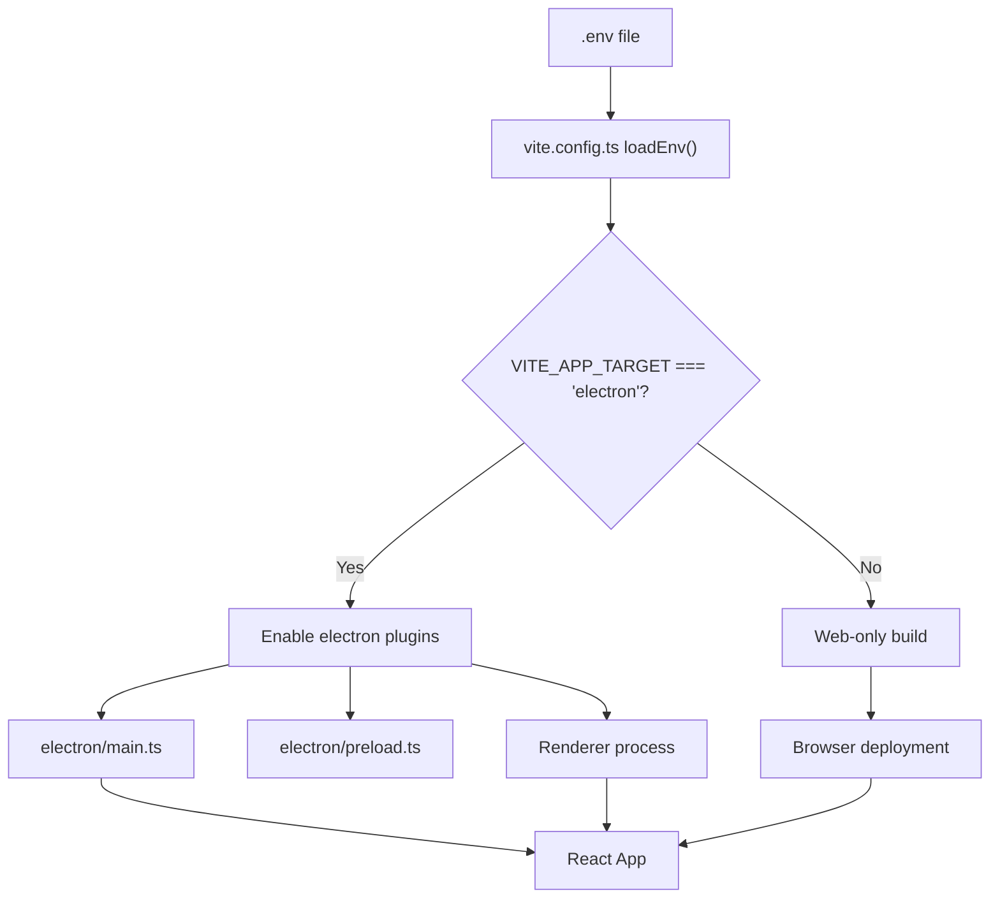
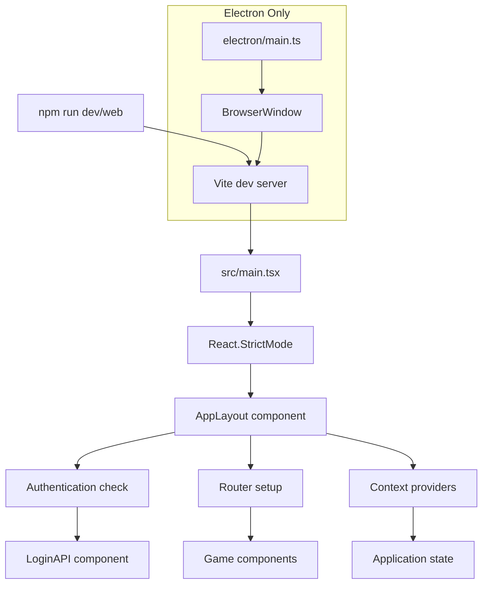
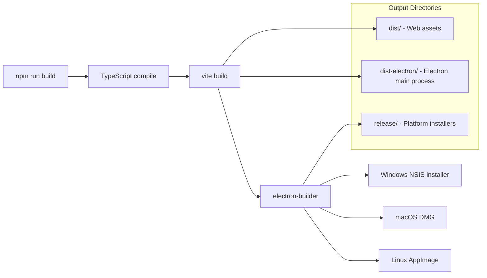

# Getting Started

<details>
<summary>Relevant source files</summary>

The following files were used as context for generating this wiki page:

- [.env.example](/.env.example)
- [.gitignore](/.gitignore)
- [electron-builder.json5.example](/electron-builder.json5.example)
- [package.json](/package.json)
- [src/gamesetupimage.png](/src/gamesetupimage.png)
- [src/main.tsx](/src/main.tsx)
- [vite.config.ts](/vite.config.ts)

</details>


This document provides setup instructions and development workflows for the NBA simulation application. It covers installation, environment configuration, and running the application in both web browser and desktop modes.

For information about the application architecture and component structure, see [Architecture](./3_Architecture.md). For details about the UI components and game interfaces, see [User Interface](./8_User_Interface.md).

## Prerequisites

Before setting up the application, ensure you have the following installed on your development machine:

| Requirement | Version | Purpose |
|-------------|---------|---------|
| Node.js | 18+ | Runtime environment and package manager |
| npm | 8+ | Package dependency management |
| Git | Latest | Source code version control |

The application requires access to external basketball simulation APIs and AWS Amplify services for full functionality.

## Installation

Clone the repository and install dependencies:

```bash
git clone https://github.com/metantonio/react-test-ts-nb
cd react-test-ts-nb
npm install
```

The installation process will download all dependencies listed in [package.json:14-147](), including React, TypeScript, Electron, and UI component libraries.

**Sources:** [package.json:1-150]()

## Environment Configuration

The application uses environment variables to control build targets and configuration. Create a `.env` file in the project root:

```bash
cp .env.example .env
```

### Key Environment Variables

| Variable | Values | Description |
|----------|--------|-------------|
| `VITE_APP_TARGET` | `electron` \| `web` | Determines build target platform |

The `VITE_APP_TARGET` variable controls whether the application builds for Electron desktop or web browser deployment. This affects the Vite configuration and available features.

### Build Target Configuration Flow



**Sources:** [vite.config.ts:8-11](), [.env.example:1]()

## Development Workflows

The application supports two primary development modes through different npm scripts defined in `package.json`.

### Web Development

For web browser development:

```bash
npm run web
```

This command starts a Vite development server accessible at `http://localhost:5173`. The application runs in web mode without Electron-specific features.

### Desktop Development  

For Electron desktop development:

```bash
npm run dev
```

This command starts both the Vite development server and launches the Electron application window. Hot reload is enabled for both the main process and renderer process.

### Application Startup Flow



**Sources:** [src/main.tsx:8-12](), [package.json:7-8]()

## Build Commands

The application provides several build commands for different deployment targets:

### Web Production Build

```bash
npm run buildweb
```

Compiles TypeScript and creates an optimized web build in the `dist/` directory. The build process:
1. Runs TypeScript compiler (`tsc`)  
2. Executes Vite build process
3. Outputs static files for web deployment

### Desktop Production Build

```bash
npm run build
```

Creates both the web build and Electron desktop application packages. The build process:
1. Compiles TypeScript (`tsc`)
2. Creates Vite build (`vite build`)  
3. Runs Electron Builder (`electron-builder`)
4. Generates platform-specific installers in `release/` directory

### Electron Builder Configuration

The desktop build uses `electron-builder.json5` for packaging configuration:



**Sources:** [package.json:9-12](), [electron-builder.json5.example:1-51](), [.gitignore:11-14]()

## Development Tools

### Linting

Run ESLint to check code quality:

```bash
npm run lint
```

The linting configuration checks TypeScript and TSX files with React-specific rules enabled.

### Preview Production Build

Test the production web build locally:

```bash
npm run preview
```

This serves the built application from the `dist/` directory using Vite's preview server.

**Sources:** [package.json:11-12]()

## Directory Structure

After setup and initial builds, the project structure includes:

| Directory | Purpose | Generated By |
|-----------|---------|--------------|
| `src/` | React application source code | Manual |
| `electron/` | Electron main and preload processes | Manual | 
| `dist/` | Web production build output | `npm run buildweb` |
| `dist-electron/` | Electron main process build | `npm run build` |
| `release/` | Platform-specific installers | `npm run build` |
| `node_modules/` | Package dependencies | `npm install` |

**Sources:** [.gitignore:10-14](), [vite.config.ts:17-25]()

## Next Steps

After completing the installation and setup:

1. Start development using `npm run web` or `npm run dev`
2. Configure API credentials for basketball simulation services
3. Review the authentication system documentation in [Authentication System](./6_Authentication_System.md)
4. Explore the game setup interface documentation in [Game Setup Interface](./10_Game_Setup_Interface.md)

The application will require valid API credentials for the basketball simulation service to access game data and functionality.