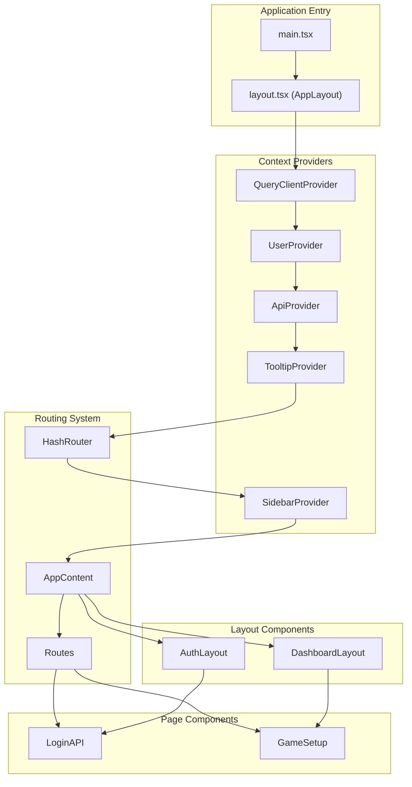
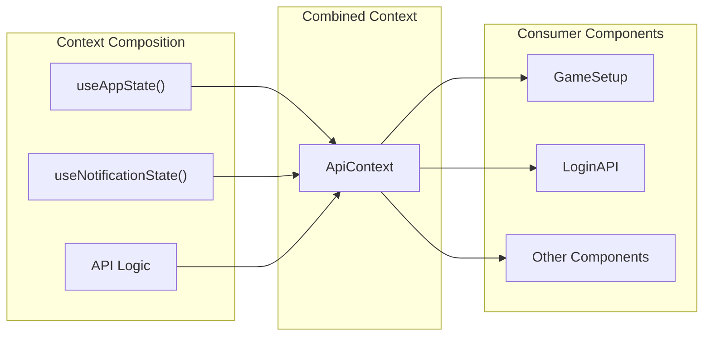
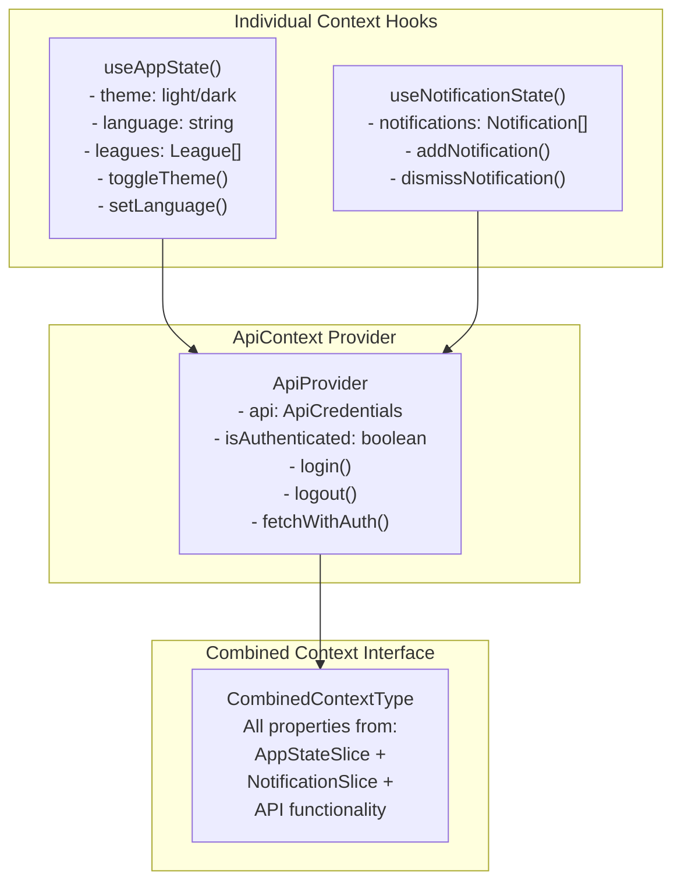
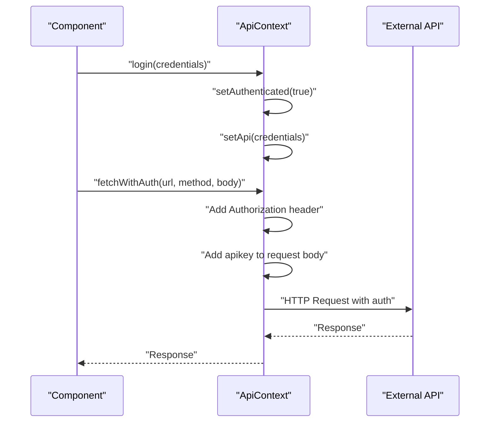
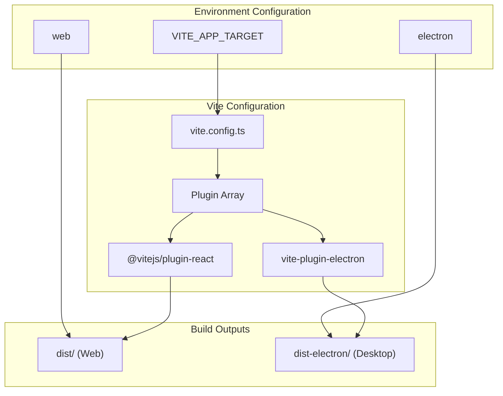
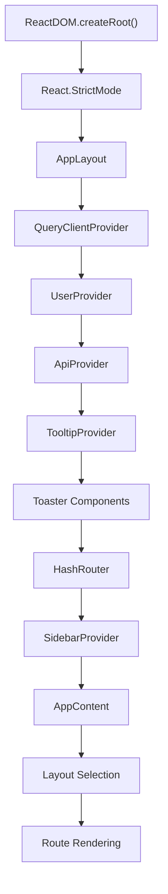

# Architecture

<details>
<summary>Relevant source files</summary>

The following files were used as context for generating this wiki page:

- [.env.example](.env.example)
- [src/contexts/ApiContext.tsx](src/contexts/ApiContext.tsx)
- [src/contexts/AppStateContext.tsx](src/contexts/AppStateContext.tsx)
- [src/contexts/NotificationContext.tsx](src/contexts/NotificationContext.tsx)
- [src/layout.tsx](src/layout.tsx)
- [src/main.tsx](src/main.tsx)
- [vite.config.ts](vite.config.ts)

</details>


This document explains the overall system architecture and core design patterns of the NBA simulation application. It covers the React application structure, state management system, authentication patterns, and dual-target build configuration that enables both web and desktop deployment.

For specific details about individual UI components, see [Core Components](#4.1). For build system implementation details, see [Build System](#3.4).

## System Overview

The application follows a React-based architecture with a centralized state management system using React Context. The codebase is structured to support dual deployment targets (web and Electron desktop) from a single source tree.

### High-Level Component Architecture



Sources: [src/main.tsx:1-20](), [src/layout.tsx:44-62](), [src/layout.tsx:22-42]()

## Core Architectural Patterns

### Provider Pattern with Context Aggregation

The application uses a sophisticated context system where `ApiProvider` acts as an aggregator that combines multiple context slices into a unified interface. This pattern reduces the complexity of consuming multiple contexts throughout the component tree.



Sources: [src/contexts/ApiContext.tsx:12-21](), [src/contexts/ApiContext.tsx:72-82]()

### Conditional Layout System

The application implements a conditional layout system that switches between `AuthLayout` and `DashboardLayout` based on the current route. This provides different UI experiences for authenticated and unauthenticated states.

| Route Pattern | Layout Component | Purpose |
|---------------|------------------|---------|
| `/` | `AuthLayout` | Login interface |
| `/login` | `AuthLayout` | Redirects to `/` |
| `/league` | `DashboardLayout` | Main application interface |
| `*` (fallback) | `AuthLayout` | Unknown routes redirect to login |

Sources: [src/layout.tsx:25-27](), [src/layout.tsx:34-40]()

## Context System Architecture

The state management system is built around three main context slices that are composed together:

### Context Composition Pattern



Sources: [src/contexts/ApiContext.tsx:13-20](), [src/contexts/AppStateContext.tsx:4-24](), [src/contexts/NotificationContext.tsx:22-22]()

### Authentication Flow Architecture

The authentication system is integrated into the context layer and provides authenticated API requests through the `fetchWithAuth` method:



Sources: [src/contexts/ApiContext.tsx:33-38](), [src/contexts/ApiContext.tsx:45-70]()

## Routing and Layout System

### Route-Based Layout Selection

The application uses `HashRouter` with a dynamic layout selection system based on route patterns. The `AppContent` component determines which layout to use:

```typescript
const isAuthRoute = location.pathname.startsWith("/login") || location.pathname === "/";
const Layout = isAuthRoute ? AuthLayout : DashboardLayout;
```

This pattern enables different UI structures for different application states while maintaining a single routing system.

### Route Configuration

| Route | Component | Layout | Purpose |
|-------|-----------|--------|---------|
| `/` | `LoginAPI` | `AuthLayout` | API credential input |
| `/login` | Redirect to `/` | `AuthLayout` | Legacy route handling |
| `/league` | `GameSetup` | `DashboardLayout` | Main application |
| `*` | `LoginAPI` | `AuthLayout` | Catch-all fallback |

Sources: [src/layout.tsx:24-27](), [src/layout.tsx:34-40]()

## Build System Architecture

### Dual-Target Build Configuration

The application supports both web and Electron deployment through a conditional build system controlled by environment variables:



The build system uses `loadEnv` to read the `VITE_APP_TARGET` environment variable and conditionally includes the Electron plugin:

```typescript
const isElectron = env.VITE_APP_TARGET === 'electron';
```

This enables the same codebase to generate both web applications and desktop applications without code duplication.

Sources: [vite.config.ts:8-11](), [vite.config.ts:16-34](), [.env.example:1-1]()

## Application Initialization Flow

The application follows a specific initialization sequence that sets up all architectural layers:



This initialization sequence ensures that all context providers are available to child components and that the routing system has access to the complete application state.

Sources: [src/main.tsx:8-12](), [src/layout.tsx:44-60]()