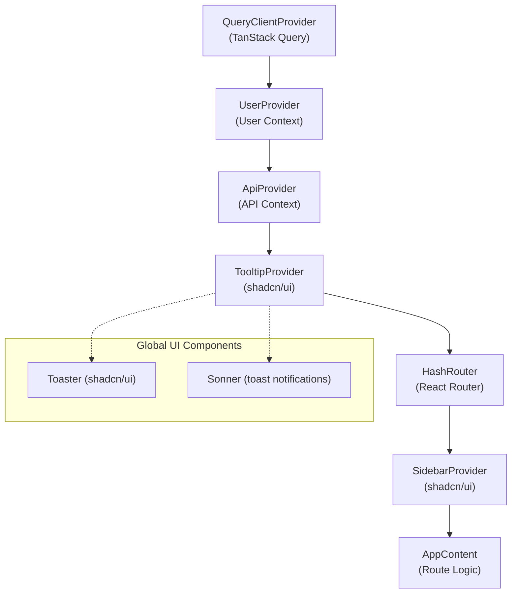
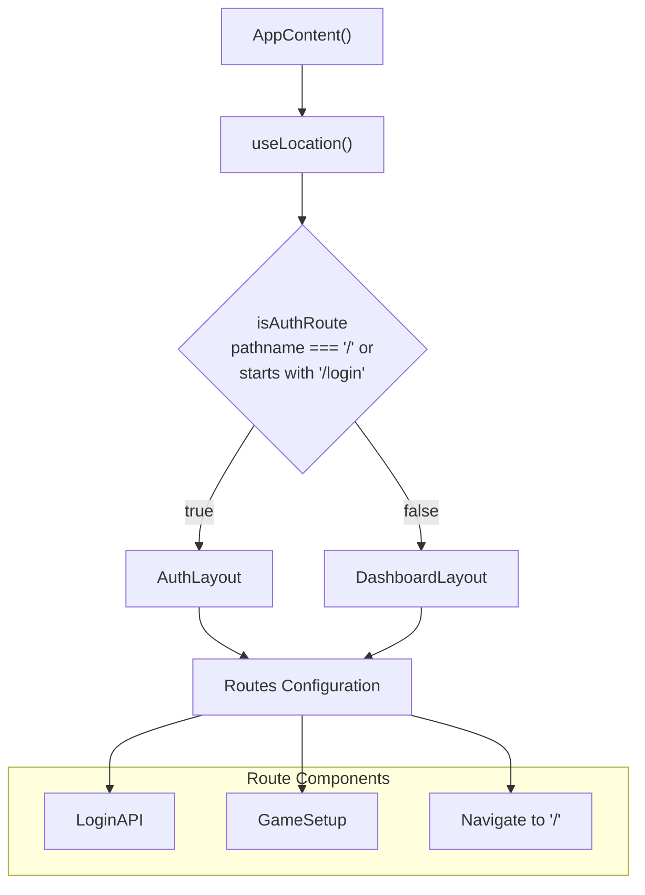
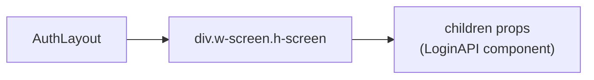
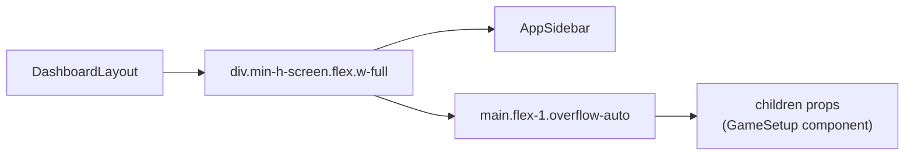
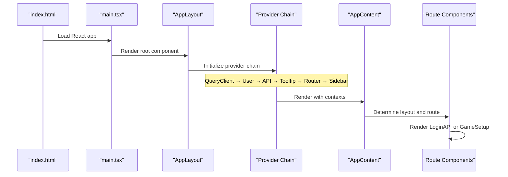

# Application Structure

Relevant source files

The following files were used as context for generating this wiki page:

- [index.html](/index.html)
- [src/components/GoogleMap.tsx](/src/components/GoogleMap.tsx)
- [src/components/LoginLayout.tsx](/src/components/LoginLayout.tsx)
- [src/components/MainLayout.tsx](/src/components/MainLayout.tsx)
- [src/layout.tsx](/src/layout.tsx)

This page documents the React application structure, routing system, and layout components that form the foundation of the NBA simulation application. It covers the component hierarchy, routing configuration, provider setup, and layout organization.

For information about the build system that supports both web and Electron deployment, see [Build System](./7_Build_System.md). For details about the React Context-based state management, see [State Management](./5_State_Management.md).

## Application Entry Point and Provider Hierarchy

The application follows a standard React structure with a hierarchical provider system that manages global state, routing, and UI components. The main entry point establishes the provider chain that wraps the entire application.

### Provider Stack Architecture

Sources: [src/layout.tsx:44-60](/src/layout.tsx)

## Routing System

The application uses `HashRouter` for client-side routing, which is compatible with both web and Electron deployment targets. The routing logic is centralized in the `AppContent` component with conditional layout rendering.

### Route Configuration

| Route Path | Component | Layout | Purpose |
|------------|-----------|--------|---------|
| `/` | `LoginAPI` | `AuthLayout` | Main login/authentication page |
| `/login` | Redirect to `/` | `AuthLayout` | Login redirect (legacy) |
| `/league` | `GameSetup` | `DashboardLayout` | Game setup and configuration |
| `*` (catch-all) | `LoginAPI` | `AuthLayout` | Fallback for unknown routes |

### Routing Logic Implementation

Sources: [src/layout.tsx:22-42]()

## Layout System

The application uses a dual-layout system where the layout component is dynamically selected based on the current route. This allows for different UI structures between authentication and main application screens.

### AuthLayout Structure

The `AuthLayout` provides a minimal container for authentication-related components, occupying the full screen without additional navigation or sidebar elements.

Sources: [src/components/LoginLayout.tsx:4-9]()

### DashboardLayout Structure

The `DashboardLayout` implements a sidebar-based layout for the main application interface, providing navigation and content areas.

Sources: [src/components/MainLayout.tsx:4-11]()

## Component Import Structure

The application organizes components into logical groups with clear import paths and responsibilities.

### Main Application Components

| Import Path | Component | Purpose |
|-------------|-----------|---------|
| `./App` | `App` | Main application component |
| `./LoginAPI` | `LoginAPI` | Authentication interface |
| `./pages/GameSetup` | `GameSetup` | Game configuration interface |
| `./components/LoginLayout` | `AuthLayout` | Authentication layout wrapper |
| `./components/MainLayout` | `DashboardLayout` | Dashboard layout wrapper |

### Context Providers

| Import Path | Provider | Functionality |
|-------------|----------|---------------|
| `@/contexts/UserContext` | `UserProvider` | User authentication state |
| `@/contexts/ApiContext` | `ApiProvider` | API configuration and requests |

### UI Library Integrations

| Import Path | Component | Library |
|-------------|-----------|---------|
| `@/components/ui/sidebar` | `SidebarProvider` | shadcn/ui |
| `@/components/ui/tooltip` | `TooltipProvider` | shadcn/ui |
| `@/components/ui/toaster` | `Toaster` | shadcn/ui |
| `@/components/ui/sonner` | `Sonner` | Sonner toast library |

Sources: [src/layout.tsx:1-18]()

## Application Initialization Flow

The application follows a specific initialization sequence that establishes the provider hierarchy and routing system before rendering any user interface components.

### Initialization Sequence

Sources: [index.html:10-12](/index.html), [src/layout.tsx:44-60](/src/layout.tsx)

The `AppLayout` component serves as the root component that orchestrates the entire application structure, establishing the context providers, routing system, and layout rendering logic in a predictable hierarchy.