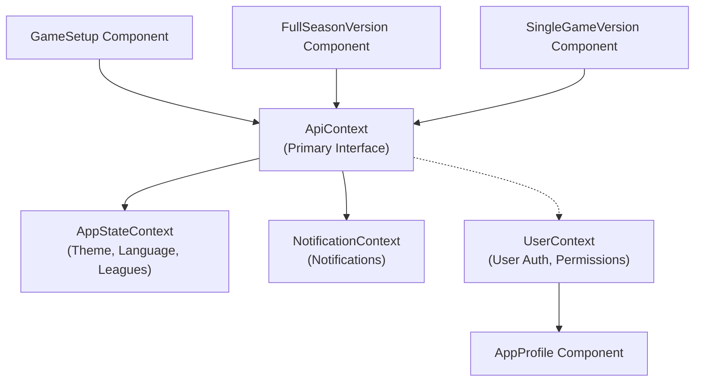
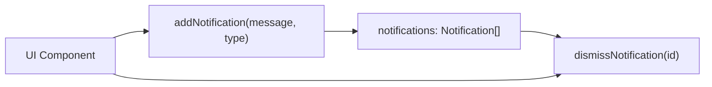
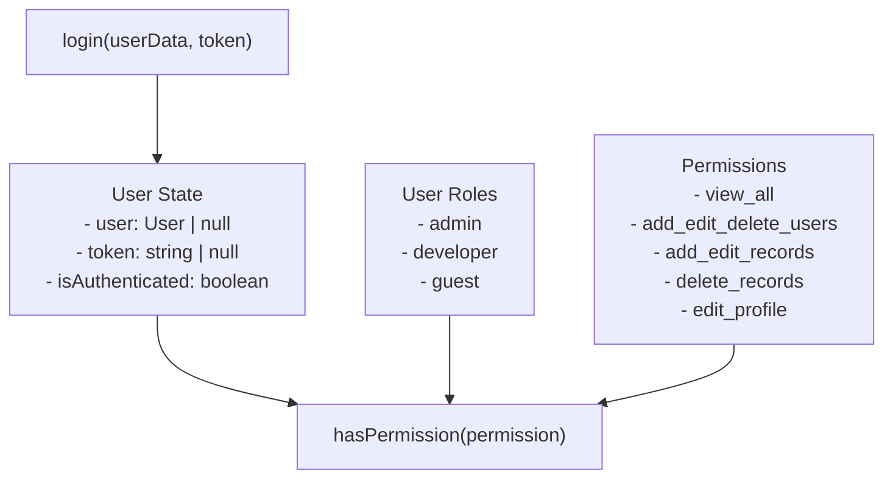
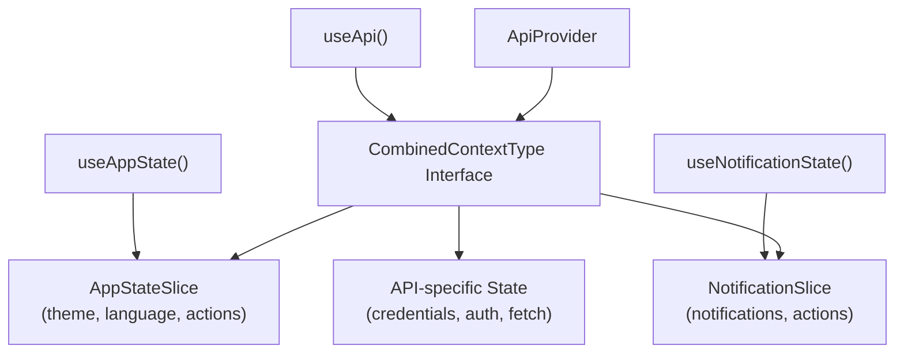
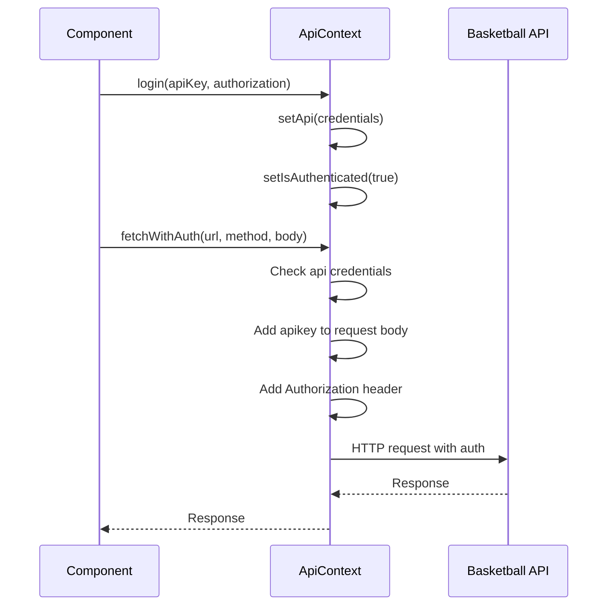
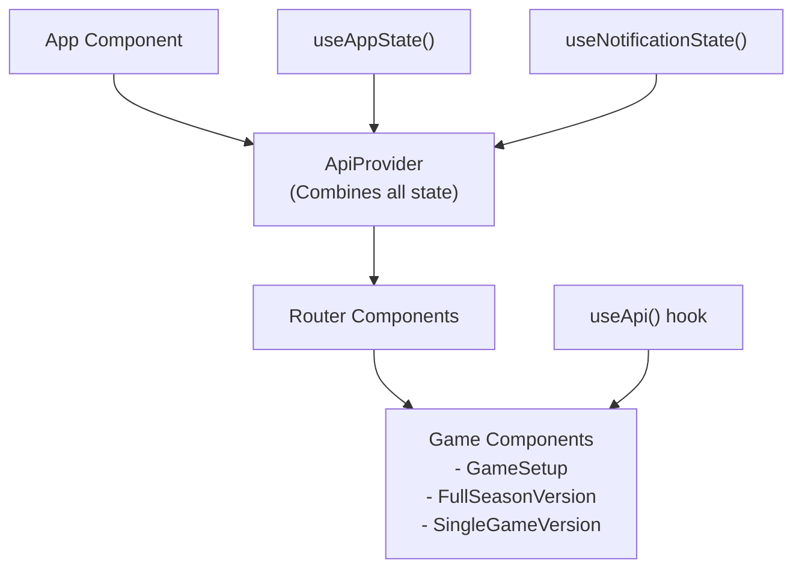

# State Management

<details>
<summary>Relevant source files</summary>

The following files were used as context for generating this wiki page:

- [src/contexts/ApiContext.tsx](src/contexts/ApiContext.tsx)
- [src/contexts/AppStateContext.tsx](src/contexts/AppStateContext.tsx)
- [src/contexts/AuthService.ts](src/contexts/AuthService.ts)
- [src/contexts/NotificationContext.tsx](src/contexts/NotificationContext.tsx)
- [src/contexts/UserContext.tsx](src/contexts/UserContext.tsx)

</details>


This document covers the React Context-based state management system used throughout the NBA simulation application. The system implements a centralized pattern where multiple specialized contexts are combined into a unified API context that provides state and actions to components.

For information about the authentication integration with AWS Amplify, see [Authentication System](#3.3). For details about API integration patterns, see [API Integration](#6).

## Overview

The application uses a multi-layered React Context architecture that combines several specialized contexts into a single unified interface. This approach provides centralized state management while maintaining separation of concerns across different application domains.

### Context Architecture



Sources: [src/contexts/ApiContext.tsx:13-21](), [src/contexts/AppStateContext.tsx:24](), [src/contexts/NotificationContext.tsx:22](), [src/contexts/UserContext.tsx:12-20]()

## Individual Context Components

### AppStateContext

The `AppStateContext` manages application-wide settings and cached data. It uses a custom hook pattern that returns a memoized state slice combining state and actions.

| State Property | Type | Purpose |
|----------------|------|---------|
| `theme` | `'light' \| 'dark'` | Current UI theme |
| `language` | `string` | Current language setting |
| `leagues` | `League[]` | Cached league data |

| Action | Purpose |
|--------|---------|
| `toggleTheme()` | Switches between light and dark themes |
| `setLanguage(language: string)` | Updates the application language |
| `setLeague(value: [])` | Updates cached league data |

The context uses `useMemo` for performance optimization: [src/contexts/AppStateContext.tsx:43-50]()

Sources: [src/contexts/AppStateContext.tsx:4-7](), [src/contexts/AppStateContext.tsx:17-21](), [src/contexts/AppStateContext.tsx:27-52]()

### NotificationContext

The `NotificationContext` manages application-wide notifications using a queue-based system. Each notification has a unique timestamp-based ID for management.



The notification interface includes:
- `id`: Unique timestamp-based identifier
- `message`: Display text
- `type`: `'info' | 'success' | 'error'`

Sources: [src/contexts/NotificationContext.tsx:4-8](), [src/contexts/NotificationContext.tsx:28-49]()

### UserContext

The `UserContext` handles user authentication, role-based permissions, and user profile management. This appears to be designed for AWS Amplify integration, separate from the API key authentication system.



The permission system maps roles to capabilities: [src/contexts/UserContext.tsx:48-52]()

Sources: [src/contexts/UserContext.tsx:3-10](), [src/contexts/UserContext.tsx:24-41](), [src/contexts/UserContext.tsx:43-55]()

## Combined Context Pattern

### ApiContext Integration

The `ApiContext` serves as the primary interface by combining multiple context slices into a unified context. This pattern reduces the complexity of context consumption in components.



The interface definition: [src/contexts/ApiContext.tsx:13-20]()

The context value assembly: [src/contexts/ApiContext.tsx:72-82]()

Sources: [src/contexts/ApiContext.tsx:13-21](), [src/contexts/ApiContext.tsx:72-88]()

### Authentication Flow

The `ApiContext` manages API key-based authentication for the basketball simulation service, distinct from the user authentication system.



The `fetchWithAuth` method handles authenticated requests: [src/contexts/ApiContext.tsx:45-70]()

Sources: [src/contexts/ApiContext.tsx:33-43](), [src/contexts/ApiContext.tsx:45-70]()

## Performance Optimizations

### Memoization Strategy

All context hooks use React's optimization hooks to prevent unnecessary re-renders:

- **useCallback**: Ensures action functions maintain referential equality [src/contexts/NotificationContext.tsx:31-41]()
- **useMemo**: Memoizes context values to prevent provider re-renders [src/contexts/AppStateContext.tsx:43-50]()

### Context Provider Hierarchy

The application structure minimizes context re-renders by organizing providers strategically. The `ApiProvider` wraps the main application and provides access to all state slices through a single context.



Sources: [src/contexts/ApiContext.tsx:24-88](), [src/contexts/AppStateContext.tsx:27](), [src/contexts/NotificationContext.tsx:28]()

## Usage Patterns

### Component Integration

Components consume the unified context through the `useApi` hook:

```typescript
const { 
  isAuthenticated, 
  fetchWithAuth, 
  addNotification, 
  theme 
} = useApi();
```

The hook provides type safety and throws an error if used outside the provider context: [src/contexts/ApiContext.tsx:91-97]()

### Error Handling

Context hooks include runtime validation to ensure proper provider hierarchy: [src/contexts/ApiContext.tsx:93-96]()

This pattern is consistent across all context implementations for development-time error detection.

Sources: [src/contexts/ApiContext.tsx:91-97](), [src/contexts/UserContext.tsx:72-78]()