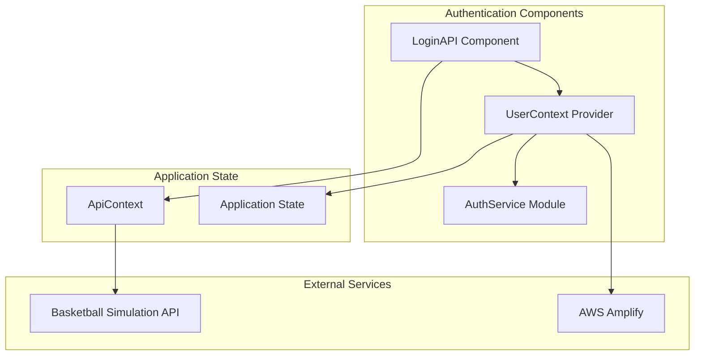
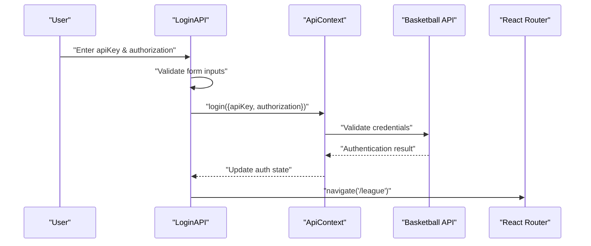
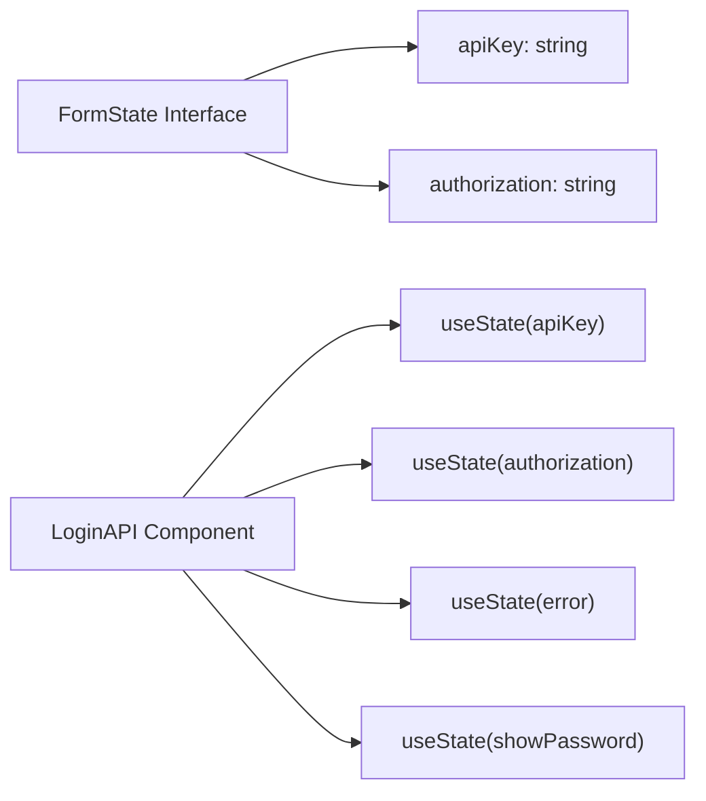
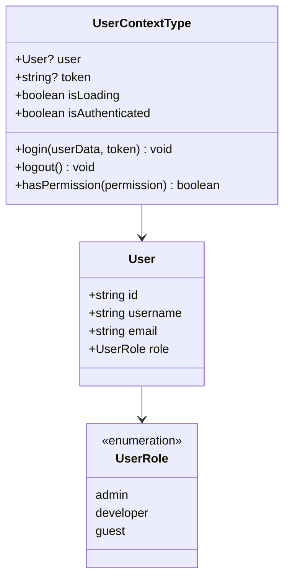
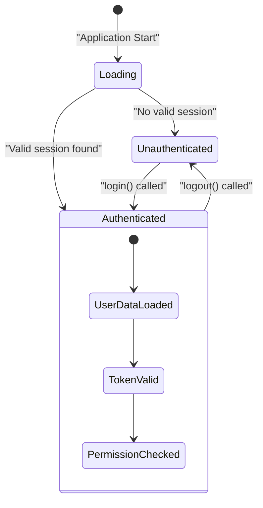
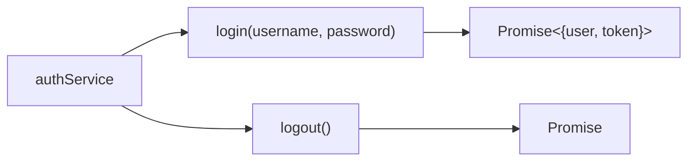

# Authentication System

Relevant source files

The following files were used as context for generating this wiki page:

- [src/LoginAPI.tsx](src/LoginAPI.tsx)
- [src/contexts/AuthService.ts](src/contexts/AuthService.ts)
- [src/contexts/UserContext.tsx](src/contexts/UserContext.tsx)

This document covers the authentication system used in the NBA simulation application, which implements API key-based authentication for accessing external basketball simulation services. The system manages user credentials, maintains authentication state, and provides role-based access control throughout the application.

For information about the broader state management architecture, see [State Management](#3.2). For details about API integration patterns, see [API Integration](#6).

## Overview

The authentication system uses a dual-layer approach combining API key authentication for external services with internal user state management. Rather than traditional username/password authentication, the system requires users to provide API credentials to access basketball simulation data from external providers.

Sources: [src/LoginAPI.tsx:1-172](), [src/contexts/UserContext.tsx:1-78](), [src/contexts/AuthService.ts:1-12]()

## API Key Authentication Flow

The primary authentication mechanism uses API keys and authorization tokens to access external basketball simulation services. The `LoginAPI` component handles credential collection and validation.

### Login Process

The authentication flow follows these key steps:

The `LoginAPI` component manages two primary credential fields:

| Field | Type | Purpose |
|-------|------|---------|
| `apiKey` | string | Primary API identifier for external service |
| `authorization` | string | Authorization token for API access |

Sources: [src/LoginAPI.tsx:22-25](), [src/LoginAPI.tsx:42-52]()

### Form State Management

The login form uses React state to manage user input and validation:

The form validation occurs in the `handleSubmit` function, which checks for the presence of both required fields before proceeding with authentication.

Sources: [src/LoginAPI.tsx:27-35](), [src/LoginAPI.tsx:37-40]()

## User Context and Role Management

The `UserContext` provides centralized user state management with role-based access control. It defines three user roles with different permission levels.

### User Interface Definition

### Permission System

The permission system maps user roles to specific capabilities:

| Role | Permissions |
|------|-------------|
| `admin` | `view_all`, `add_edit_delete_users`, `add_edit_records`, `delete_records`, `edit_profile` |
| `developer` | `view_all`, `add_edit_records`, `delete_records`, `edit_profile` |
| `guest` | `view_all`, `add_edit_records`, `edit_profile` |

The `hasPermission` method provides runtime permission checking throughout the application.

Sources: [src/contexts/UserContext.tsx:3-10](), [src/contexts/UserContext.tsx:43-55]()

## Authentication State Management

The authentication system maintains several state variables to track user session status:

The `UserProvider` component manages these state transitions through the `login` and `logout` functions, which update the authentication status and user data simultaneously.

Sources: [src/contexts/UserContext.tsx:24-41]()

## Integration with External Services

The authentication system integrates with external services through the `ApiContext`, which handles the actual API communication and credential management.

### AuthService Module

The `AuthService` module provides a basic interface for authentication operations:

Note that this service currently contains placeholder implementations and would need to be extended for production use with actual authentication providers.

Sources: [src/contexts/AuthService.ts:1-12]()

### AWS Amplify Integration

Based on the system architecture, the authentication system integrates with AWS Amplify for user management and session persistence, though the specific implementation details are handled through the broader `ApiContext` system.

## Error Handling and User Experience

The login interface includes comprehensive error handling and user experience features:

- Form validation with real-time error clearing
- Loading states during authentication
- Password visibility toggle for the authorization field
- Alert dialogs for authentication failures
- Remember me functionality (UI placeholder)

The error handling follows a pattern where errors are cleared when users modify form inputs, providing immediate feedback for correction.

Sources: [src/LoginAPI.tsx:75-93](), [src/LoginAPI.tsx:118-138]()