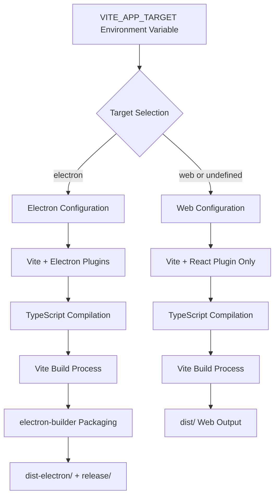
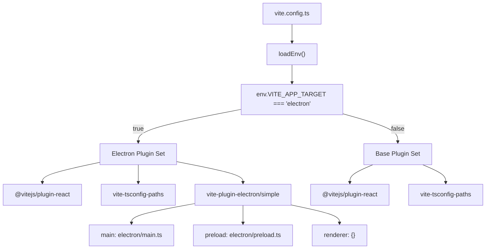
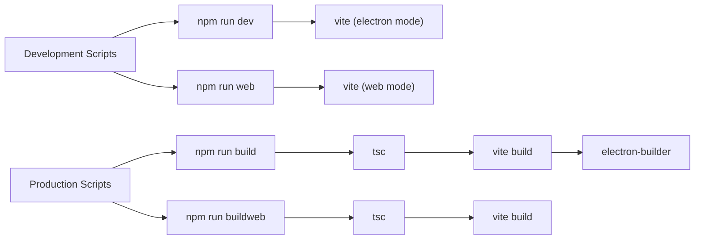
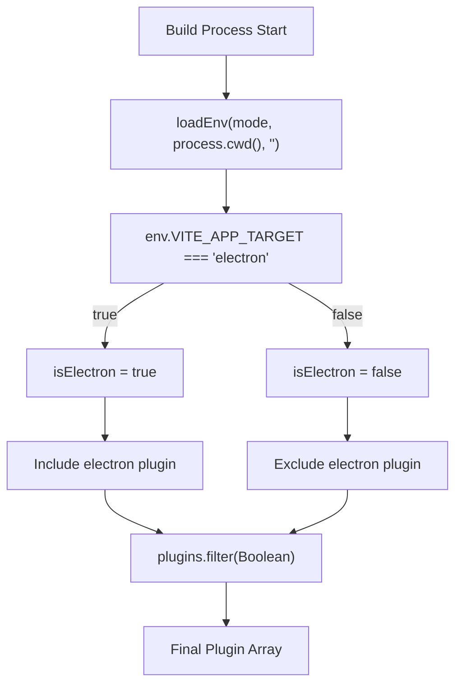
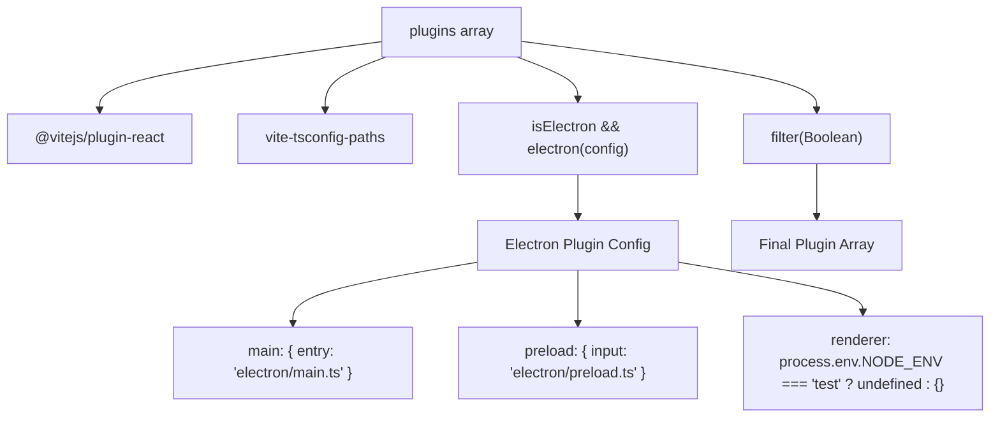
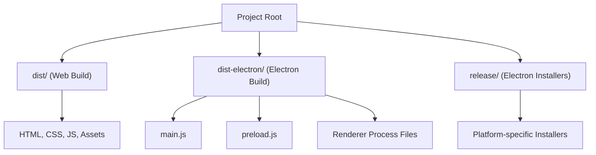

# Build System

Relevant source files

The following files were used as context for generating this wiki page:

- [.env.example](/.env.example)
- [README.md](/README.md)
- [license.txt](/license.txt)
- [package.json](/package.json)
- [src/gamesetupimage.png](/src/gamesetupimage.png)
- [src/main.tsx](/src/main.tsx)
- [vite.config.ts](/vite.config.ts)

This document covers the dual-target build system that enables the NBA simulation application to be deployed as both a web application and an Electron desktop application from a single codebase. The build system uses Vite as the primary build tool with conditional configuration based on environment variables.

For information about the application architecture and component structure, see [Application Structure](./4_Application_Structure.md). For deployment and packaging details, see [Electron Development](./19_Electron_Development.md).

## Overview

The build system is designed around a unified codebase that can produce two distinct deployment targets:
- **Web Application**: Standard React web app for browser deployment
- **Electron Desktop**: Native desktop application with the same functionality

The target selection is controlled by the `VITE_APP_TARGET` environment variable, which determines which plugins and configurations are applied during the build process.

**Build Process Flow**

Sources: [vite.config.ts:8-36](), [package.json:6-12]()

## Build Configuration

The core build configuration is defined in `vite.config.ts` using a conditional approach that loads different plugin sets based on the target environment.

**Configuration Architecture**

The configuration uses environment variable detection to conditionally include the electron plugin: [vite.config.ts:10-11](), [vite.config.ts:16-33]().

Sources: [vite.config.ts:1-36]()

## Build Scripts

The build system provides four main npm scripts that handle different development and production scenarios:

| Script | Command | Purpose | Environment |
|--------|---------|---------|-------------|
| `dev` | `vite` | Electron development server | Electron |
| `web` | `vite` | Web development server | Web |
| `build` | `tsc && vite build && electron-builder` | Production Electron build | Electron |
| `buildweb` | `tsc && vite build` | Production web build | Web |

**Build Script Execution Flow**

Sources: [package.json:6-12]()

## Environment Variable Control

The `VITE_APP_TARGET` environment variable serves as the primary mechanism for target selection:

- **For Electron development and builds**: Set `VITE_APP_TARGET=electron`
- **For Web development and builds**: Remove the variable or set to any other value

The environment variable configuration is managed through `.env` files: [.env.example:1]().

**Target Detection Logic**

Sources: [vite.config.ts:9-10](), [README.md:67-70]()

## Plugin Architecture

The build system uses a modular plugin architecture where plugins are conditionally loaded based on the target:

### Base Plugins (Always Loaded)
- `@vitejs/plugin-react`: React support and JSX transformation
- `vite-tsconfig-paths`: TypeScript path mapping support

### Conditional Plugins (Electron Only)
- `vite-plugin-electron/simple`: Electron main and renderer process support

**Plugin Configuration Structure**

The electron plugin configuration includes specific entry points for the main and preload processes: [vite.config.ts:17-32]().

Sources: [vite.config.ts:13-35]()

## Output Artifacts

The build system produces different output structures depending on the target:

### Web Build Output
- **Location**: `dist/`
- **Contents**: Standard web application assets (HTML, CSS, JS, images)
- **Usage**: Can be deployed to any web server or CDN

### Electron Build Output
- **Location**: `dist-electron/` and `release/`
- **Contents**: 
  - `dist-electron/`: Compiled Electron application files
  - `release/`: Platform-specific installers and executables
- **Usage**: Desktop application distribution

**Output Directory Structure**

The `main` field in package.json points to the compiled electron main process: [package.json:149]().

Sources: [package.json:149](), [README.md:43-63]()

## TypeScript Integration

Both build targets include TypeScript compilation as the first step in the production build process. The `tsc` command runs before the Vite build to ensure type checking and compilation:

1. **Type Checking**: Validates TypeScript code for errors
2. **Declaration Generation**: Produces `.d.ts` files if configured
3. **Build Preparation**: Ensures clean TypeScript state before bundling

The TypeScript configuration supports path mapping through the `vite-tsconfig-paths` plugin, enabling clean import paths throughout the application: [vite.config.ts:5](), [vite.config.ts:15]().

Sources: [package.json:9-10](), [vite.config.ts:5](), [vite.config.ts:15]()

## Development vs Production

The build system distinguishes between development and production modes:

### Development Mode
- **Hot Module Replacement (HMR)**: Automatic reload on file changes
- **Source Maps**: Full debugging support
- **Fast Compilation**: Optimized for development speed
- **Live Reload**: Electron process restart on main process changes

### Production Mode
- **Code Minification**: Optimized bundle sizes
- **Tree Shaking**: Unused code elimination
- **Asset Optimization**: Compressed images and assets
- **Electron Packaging**: Complete application bundling with electron-builder

The development servers are accessible at `http://localhost:5173` for web mode: [README.md:27]().

Sources: [README.md:19-37](), [README.md:42-63]()