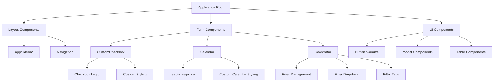
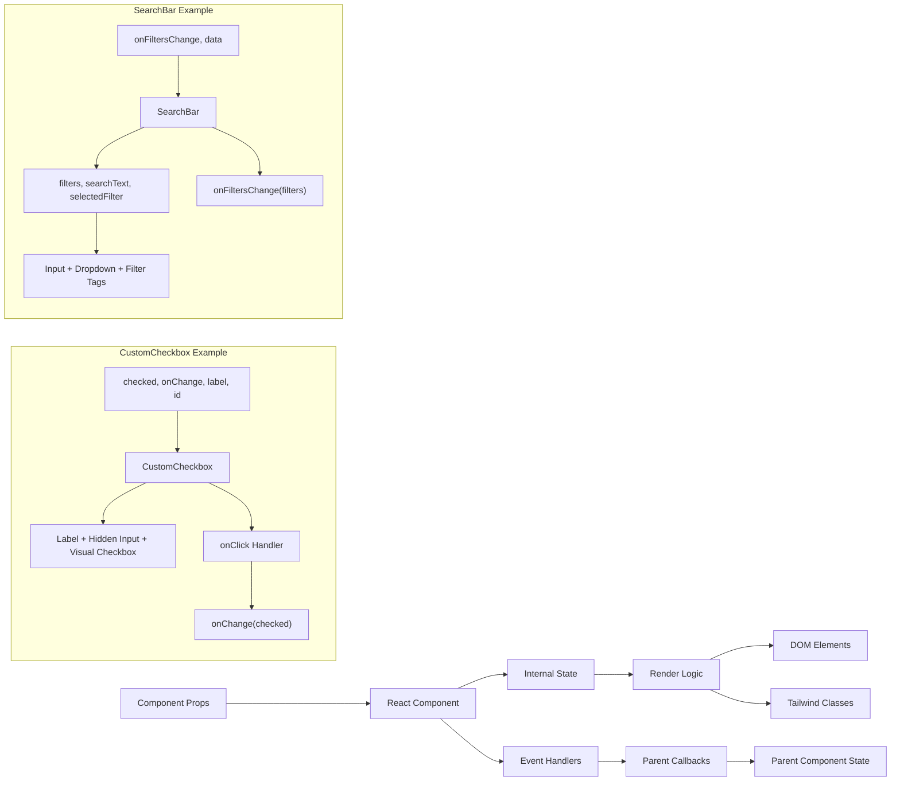

# User Interface

<details>
<summary>Relevant source files</summary>

The following files were used as context for generating this wiki page:

- [src/components/searchbox.tsx](src/components/searchbox.tsx)
- [src/components/ui/CustomCheckbox.tsx](src/components/ui/CustomCheckbox.tsx)
- [src/components/ui/calendar.tsx](src/components/ui/calendar.tsx)
- [src/index.css](src/index.css)
- [src/singlegame_image.png](src/singlegame_image.png)

</details>


This document covers the user interface components and design patterns used throughout the NBA simulation application. It focuses on the reusable UI components, styling system, and architectural patterns that form the foundation for all user-facing interfaces.

For information about specific game interfaces and their interactions, see [Game Simulation Interfaces](#4.3). For details about the overall application layout and navigation structure, see [Layout and Navigation](#4.4).

## Styling System

The application uses a Tailwind CSS-based styling system with custom global styles and CSS custom properties for consistent theming.

### Global Styles and Theming

The base styling system is defined in [src/index.css:1-71]() and establishes the application's visual foundation:

```css
:root {
  font-family: Inter, system-ui, Avenir, Helvetica, Arial, sans-serif;
  color-scheme: light dark;
  color: rgba(255, 255, 255, 0.87);
  background-color: #4d4d4d;
}
```

The system includes custom utility classes for specific UI elements:
- `.bg-popover` for modal and dropdown backgrounds
- `.bg-destructive` for error and warning states
- Global button styling with hover and focus states

**Sources:** [src/index.css:1-71]()

### Tailwind CSS Integration

The application leverages Tailwind CSS as its primary styling framework through the standard directives:

```css
@tailwind base;
@tailwind components;  
@tailwind utilities;
```

This provides utility-first styling throughout all components while maintaining design consistency.

**Sources:** [src/index.css:1-3]()

## Core UI Components

The application includes several reusable UI components that serve as building blocks for more complex interfaces.

### Form Controls

#### CustomCheckbox Component

The `CustomCheckbox` component provides a custom-styled checkbox input with consistent visual design:

```typescript
interface CustomCheckboxProps {
  checked: boolean;
  onChange: (checked: boolean) => void;
  label: string;
  id: string;
}
```

Key features:
- Hidden native checkbox input for accessibility
- Custom visual styling with border and checkmark icon
- Hover and focus states for better user experience
- SVG checkmark icon for visual feedback

**Sources:** [src/components/ui/CustomCheckbox.tsx:1-31]()

#### Calendar Component

The calendar component wraps the `react-day-picker` library with custom styling and behavior:

```typescript
export type CalendarProps = React.ComponentProps<typeof DayPicker>;
```

Features include:
- Navigation buttons with chevron icons
- Customizable class names for styling
- Support for date ranges and selection states
- Responsive layout for different screen sizes

**Sources:** [src/components/ui/calendar.tsx:1-65]()

### Search and Filter Components

#### Advanced Search Bar

The `SearchBar` component provides sophisticated filtering capabilities with tag-based filters:

```typescript
interface SearchBarProps {
  onFiltersChange: (filters: FilterTag[]) => void;
  data: Casino[];
}
```

Core functionality:
- Dynamic filter selection from available options
- Real-time search with visual filter tags
- Keyboard shortcuts (semicolon to create filter tags)
- Filter management with add/remove capabilities

**Sources:** [src/components/searchbox.tsx:1-218]()

## Component Architecture

The UI system follows a hierarchical component architecture with clear separation of concerns between presentation and logic.

### Component Hierarchy



**Sources:** [src/components/ui/CustomCheckbox.tsx:1-31](), [src/components/ui/calendar.tsx:1-65](), [src/components/searchbox.tsx:1-218]()

### Component Data Flow



**Sources:** [src/components/ui/CustomCheckbox.tsx:3-8](), [src/components/searchbox.tsx:22-25]()

## Design Patterns

### Controlled Components Pattern

All form components follow the controlled component pattern where parent components manage state:

```typescript
// CustomCheckbox - parent controls checked state
const CustomCheckbox: React.FC<CustomCheckboxProps> = ({ 
  checked, onChange, label, id 
}) => {
  // Component renders based on props, calls onChange for updates
}

// SearchBar - parent receives filter updates
const SearchBar: React.FC<SearchBarProps> = ({ 
  onFiltersChange, data 
}) => {
  // Internal state for UI, but notifies parent of changes
}
```

This pattern ensures predictable state management and easier testing.

**Sources:** [src/components/ui/CustomCheckbox.tsx:10-28](), [src/components/searchbox.tsx:27-75]()

### Composition and Flexibility

Components are designed for composition with configurable props and flexible styling:

#### Flexible Styling

```typescript
// Calendar component accepts custom class names
function Calendar({
  className,
  classNames,
  showOutsideDays = true,
  ...props
}: CalendarProps)

// Uses cn utility for class name composition
className={cn("p-3", className)}
```

#### Event Handling Patterns

Components use TypeScript interfaces to ensure type safety:

```typescript
interface CustomCheckboxProps {
  checked: boolean;
  onChange: (checked: boolean) => void;  // Type-safe callback
  label: string;
  id: string;
}
```

**Sources:** [src/components/ui/calendar.tsx:10-19](), [src/components/ui/CustomCheckbox.tsx:3-8]()

### Filter and Search Patterns

The SearchBar component demonstrates advanced patterns for dynamic filtering:

#### Dynamic Filter Management

```typescript
type FilterTag = {
  id: string;
  type: string; 
  label: string;
  value: string;
};

// Dynamic filter options based on data
const filterOptions = [
  { key: 'casinoName', label: 'Casino Name', values: [...new Set(data.map(item => item.casinoName))] },
  // ... more filter options
];
```

#### Real-time Search Integration

The component combines permanent filter tags with real-time search:

```typescript
useEffect(() => {
  const allFilters = [...filters];
  
  if (selectedFilter && searchText.trim()) {
    // Add dynamic search filter for real-time filtering
    const dynamicFilter: FilterTag = {
      id: `dynamic-${selectedFilter}-${Date.now()}`,
      type: selectedFilter as FilterTag['type'],
      label: filterOptions.find(opt => opt.key === selectedFilter)?.label || selectedFilter,
      value: searchText.trim()
    };
    allFilters.push(dynamicFilter);
  }
  
  onFiltersChange(allFilters);
}, [filters, selectedFilter, searchText, onFiltersChange]);
```

**Sources:** [src/components/searchbox.tsx:14-20](), [src/components/searchbox.tsx:34-41](), [src/components/searchbox.tsx:59-75]()

### Accessibility Patterns

Components follow accessibility best practices:

#### Hidden Input Pattern
```typescript
// CustomCheckbox hides native input but maintains functionality
<input
  type="checkbox"
  id={id}
  checked={checked}
  onChange={(e) => onChange(e.target.checked)}
  className="hidden"
/>
<label htmlFor={id} className="flex items-center cursor-pointer">
  {/* Custom visual checkbox */}
</label>
```

#### Keyboard Navigation
```typescript
// SearchBar supports keyboard shortcuts
const handleKeyDown = (e: React.KeyboardEvent) => {
  if (e.key === ';' && selectedFilter && searchText.trim()) {
    e.preventDefault();
    // Create filter tag
  }
};
```

**Sources:** [src/components/ui/CustomCheckbox.tsx:13-25](), [src/components/searchbox.tsx:83-99]()