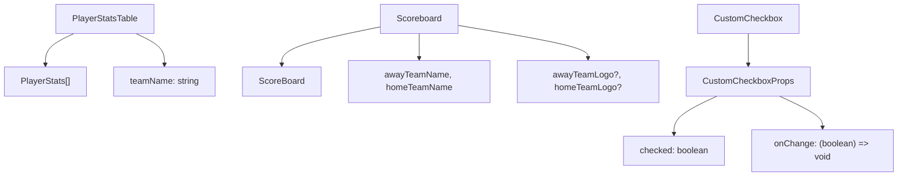
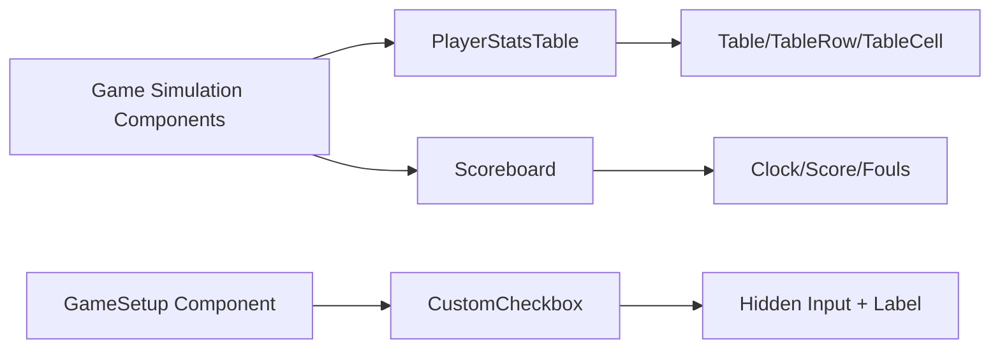

# Core Components

<details>
<summary>Relevant source files</summary>

The following files were used as context for generating this wiki page:

- [src/components/PlayerStatsTable.tsx](/src/components/PlayerStatsTable.tsx)
- [src/components/Scoreboard.tsx](/src/components/Scoreboard.tsx)
- [src/components/searchbox.tsx](/src/components/searchbox.tsx)
- [src/components/ui/CustomCheckbox.tsx](/src/components/ui/CustomCheckbox.tsx)
- [src/components/ui/calendar.tsx](/src/components/ui/calendar.tsx)
- [src/singlegame_image.png](/src/singlegame_image.png)

</details>


## Purpose and Scope

This document covers the reusable UI components that form the foundation of the basketball simulation application's user interface. These components provide essential building blocks for displaying game data, collecting user input, and presenting statistical information throughout the application.

For information about the higher-level game interfaces that use these components, see [Game Simulation Interfaces](./11_Game_Simulation_Interfaces.md). For layout and navigation components, see [Layout and Navigation](./12_Layout_and_Navigation.md).

## Table Components

### PlayerStatsTable Component

The `PlayerStatsTable` component provides a standardized way to display basketball player statistics across the application. It renders player data in a scrollable table format with consistent styling.

**Key Features:**
- Fixed-height scrollable container (250px) for handling large rosters
- Responsive table layout using shadcn/ui Table components
- Dark mode support with hover effects
- Standardized player stat columns: Name, Points (PTS), Rebounds (REB), Assists (AST), Personal Fouls (PF)

**Interface Definition:**
```typescript
interface PlayerStats {
  name: string;
  pts: string;
  reb: string;
  ast: string;
  pf: string;
}

interface PlayerStatsTableProps {
  teamName: string;
  players: PlayerStats[];
}
```

The component uses the shadcn/ui table primitives (`Table`, `TableHeader`, `TableBody`, `TableHead`, `TableRow`, `TableCell`) for consistent styling across the application [src/components/PlayerStatsTable.tsx:3-9]().

**Sources:** [src/components/PlayerStatsTable.tsx:1-57]()

## Game Display Components

### Scoreboard Component

The `Scoreboard` component renders a realistic basketball scoreboard interface displaying live game state information. It serves as the central visual element during game simulations.

**Core Display Elements:**
- Team scores with large, monospace font styling
- Game clock and quarter information
- Team fouls tracking
- Possession indicator with animated pulse effect
- Optional team logo support

**Interface Definition:**
```typescript
interface ScoreBoard {
  away_score: string;
  home_score: string;
  quarter: string;
  clock: string;
  away_possessions: string;
  home_possessions: string;
  away_fouls: string;
  home_fouls: string;
  home_team_offense: string;
  player_with_ball: string;
}
```

The component implements sophisticated visual design with backdrop blur effects, gradient backgrounds, and responsive layout using Tailwind CSS classes [src/components/Scoreboard.tsx:53-97](). The possession indicator uses conditional opacity and pulse animations based on the `home_team_offense` flag [src/components/Scoreboard.tsx:82-94]().

**Sources:** [src/components/Scoreboard.tsx:1-101]()

## Form Controls

### CustomCheckbox Component

The `CustomCheckbox` component provides a branded alternative to native HTML checkboxes with consistent styling throughout the application.

**Implementation Details:**
- Hidden native input element for accessibility
- Custom visual representation using CSS classes
- SVG checkmark icon for checked state
- Controlled component pattern with onChange callback

The component uses a hidden input strategy where the actual `<input type="checkbox">` element is hidden using `className="hidden"` [src/components/ui/CustomCheckbox.tsx:18](), while a custom label provides the visual interface [src/components/ui/CustomCheckbox.tsx:20-27]().

**Interface:**
```typescript
interface CustomCheckboxProps {
  checked: boolean;
  onChange: (checked: boolean) => void;
  label: string;
  id: string;
}
```

**Sources:** [src/components/ui/CustomCheckbox.tsx:1-31]()

## Utility Components

### Calendar Component

The application includes a `Calendar` component built on `react-day-picker` with extensive customization for date selection interfaces. It uses the shadcn/ui design system with comprehensive styling options for various calendar states and interactions [src/components/ui/calendar.tsx:10-61]().

### SearchBar Component

A sophisticated search and filtering component is available, though it appears to be adapted from another domain (casino data). It implements tag-based filtering with real-time search capabilities [src/components/searchbox.tsx:27-215]().

**Sources:** [src/components/ui/calendar.tsx:1-65](), [src/components/searchbox.tsx:1-218]()

## Component Architecture Patterns

### Shadcn/UI Integration

The core components leverage the shadcn/ui component library for consistent styling and theming. This provides:

- Standardized component primitives (Table, Button variants)
- Dark mode support through CSS variables
- Utility-first styling with Tailwind CSS
- Accessible component defaults

### TypeScript Interface Design

All components use strict TypeScript interfaces to ensure type safety:



**Sources:** [src/components/PlayerStatsTable.tsx:11-22](), [src/components/Scoreboard.tsx:3-22](), [src/components/ui/CustomCheckbox.tsx:3-8]()

## Component Usage Patterns

### Data Flow Architecture

The core components follow a unidirectional data flow pattern where parent components pass data down through props:



### Styling System Integration

Components integrate with the application's styling system through:

- Tailwind CSS utility classes for responsive design
- CSS custom properties for theme variables
- Conditional styling for dark mode support
- Hover and focus states for interactive elements

The `PlayerStatsTable` uses `dark:bg-gray-800` and `dark:hover:bg-gray-700` classes for dark mode support [src/components/PlayerStatsTable.tsx:30-41](), while the `Scoreboard` implements complex backdrop effects with `bg-gray-900/80 backdrop-blur-sm` [src/components/Scoreboard.tsx:53]().

**Sources:** [src/components/PlayerStatsTable.tsx:24-54](), [src/components/Scoreboard.tsx:52-98](), [src/components/ui/CustomCheckbox.tsx:12-27]()