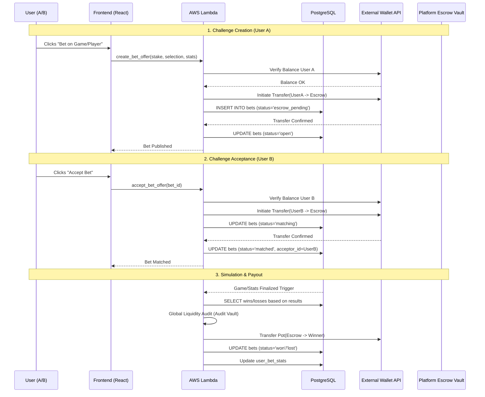

# P2P Betting System: Technical Specification (Enhanced)

This document details the business logic, database interactions, and AWS Lambda functions for the Peer-to-Peer betting system with external wallet and escrow integration.

## 0. Process Overview Diagram

---

## 1. User Initialization (`cognito_post_confirmation`)

**Objective**: Link the user to the application's betting context.
- **Table**: `wallets`
- **Fields**: `user_id` (Cognito `sub`), `external_wallet_address` (linked later).

---

## 2. Initiating a Challenge (`create_bet_offer`)

**Objective**: Lock User A's funds in escrow based on a game or specific player stats.

### Specific Steps:
1.  **Frontend**: User selects a game (or player stat), picks a side (Selection), and sets the `stake`.
2.  **Auth**: Lambda extracts `cognito_user_id` from the JWT.
3.  **Ext Check**: Lambda calls `External_Wallet_API.check_balance(UserA)`.
4.  **Tx Initiation**: Lambda calls `External_Wallet_API.transfer(from: UserA, to: PlatformEscrow, amount: stake)`.
5.  **DB Entry**: Create record in `bets`:
    - `user_id`: Challenger ID.
    - `selection`: e.g., 'Team A Wins' or 'Player X > 15 Points'.
    - `status`: `'escrow_pending'`.
6.  **Confirmation**: Upon callback/webhook from External Wallet, set `status` to `'open'`.

---

## 3. Accepting a Challenge (`accept_bet_offer`)

**Objective**: Match the challenge by taking User B's stake into escrow.

### Specific Steps:
1.  **Selection**: User B browses open bets and clicks "Accept" on a challenge.
2.  **Ext Transfer**: Lambda initiates `External_Wallet_API.transfer(from: UserB, to: PlatformEscrow, amount: stake)`.
3.  **Matching**: Set `bets.status = 'matched'` and `bets.acceptor_id = UserB` ONLY after the transfer is confirmed.

---

## 4. Game Result & Settlement (`process_settlement_escrow`)

**Objective**: Resolve the bet using simulation data or player metrics.

### Settlement Logic Details:
- **Simulation Source**: `games.home_score` vs `games.away_score`.
- **Stat Source**: `game_player_stats` (points, rebounds, etc.).
- **Payout Calculation**:
    - **Total Pot** = `stake * 2` (minus platform fee, if any).
    - **Final Check**: Run `Global_Liquidity_Audit`. Verify Platform Escrow balance matches the sum of all matched stakes.
    - **Transfer**: `External_Wallet_API.transfer(from: PlatformEscrow, to: Winner, amount: Pot)`.

### Error Handling:
- If a game is cancelled, the Lambda must trigger `Refunds`: Transfer stakes from Escrow back to both users.
