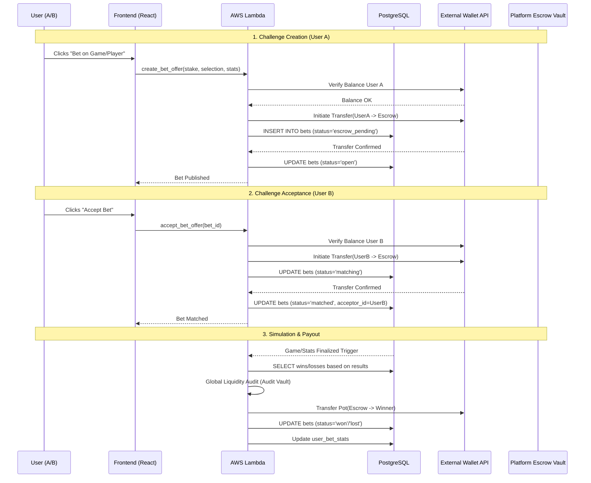

# P2P Betting System: Technical Specification (Enhanced)

This document details the business logic, database interactions, and AWS Lambda functions for the Peer-to-Peer betting system with external wallet and escrow integration.

## 0. Process Overview Diagram



---

## 1. User Initialization (`cognito_post_confirmation`)

**Objective**: Link the user to the application's betting context immediately upon sign-up.

### Tables & Values
- **Table**: `wallets`
- **Actions**: Create a record with the `user_id` (Cognito `sub`) and a placeholder for the `external_wallet_address`.

### Lambda Snippet (Python)
```python
import json
import psycopg2

def lambda_handler(event, context):
    user_id = event['request']['userAttributes']['sub']
    
    conn = psycopg2.connect("dbname=... user=... password=... host=...")
    cur = conn.cursor()
    
    try:
        cur.execute(
            "INSERT INTO wallets (user_id, balance) VALUES (%s, 0.00) ON CONFLICT DO NOTHING",
            (user_id,)
        )
        conn.commit()
    except Exception as e:
        print(f"Error creating wallet: {e}")
        conn.rollback()
    finally:
        cur.close()
        conn.close()
        
    return event
```

---

## 2. Initiating a Challenge (`create_bet_offer`)

**Objective**: Lock User A's funds in escrow based on a game or specific player stats.

### Specific Steps & Logic:
1.  **Selection**: User A picks a game or player stat and sets the `stake`.
2.  **Fee Calculation**: Lambda estimates the `Total_Fee` required to cover transaction gas for (Stake Transfer In + Acceptance Transfer In + Winner Payout).
3.  **External Check**: Lambda calls the external wallet service to verify User A has `balance >= (stake + Total_Fee)`.
4.  **Tx Initiation**: Lambda initiates a transfer from User A to the **Platform Escrow Vault** for `(stake + Total_Fee)`.
5.  **Local Record**: Create a record in `bets` with `status='escrow_pending'`.
6.  **Audit**: Create a `wallet_transactions` entry (Type: `escrow_in`).
7.  **Confirmation**: Once the external service confirms the transfer, update `bets.status = 'open'`.

### Lambda Snippet (Python Example)
```python
def create_bet_offer(user_id, game_id, selection, stake):
    # 1. Dynamic Fee Calculation (Escrow In + Acceptance In + Payout Out)
    platform_fee = calculate_dynamic_gas_fee()
    total_required = stake + platform_fee

    # 2. External Balance Verification
    if not external_wallet.has_funds(user_id, total_required):
        return {"error": "Insufficient funds to cover stake and transaction gas"}

    # 3. Transfer Total (Stake + Gas Fee) to Escrow
    tx_id = external_wallet.transfer(source=user_id, destination=PLATFORM_ESCROW, amount=total_required)

    # 4. DB Persistence
    db.execute(
        "INSERT INTO bets (user_id, game_id, selection, stake, fee_paid, escrow_tx_id, status) VALUES (%s, %s, %s, %s, %s, %s, 'escrow_pending')",
        (user_id, game_id, selection, stake, platform_fee, tx_id)
    )
    return {"status": "pending_confirmation", "tx_id": tx_id}
```

---

## 3. Accepting a Challenge (`accept_bet_offer`)

**Objective**: Match the challenge by taking User B's stake into escrow.

### Specific Steps:
1.  **Verification**: Lambda verifies User B has sufficient funds and the bet is still `status='open'`.
2.  **Fee Calculation**: Lambda verifies User B's balance covers `Stake + Gas_Fee` (In-transfer + portion of Payout gas).
3.  **Ext Transfer**: Lambda initiates a transfer from User B to the **Platform Escrow Vault** (Stake + AcceptanceFee).
4.  **Matching**: Set `bets.status = 'matched'` and `bets.acceptor_id = UserB` ONLY AFTER the transfer is confirmed by the external service.

---

## 4. Game Result & Settlement (`process_settlement_escrow`)

**Objective**: Resolve the bet using simulation data or player metrics and release the pot.

### Settlement Logic Details:
- **Simulation Source**: `games.home_score` vs `games.away_score`.
- **Stat Source**: `game_player_stats` (points, rebounds, etc.).
- **Payout Calculation**:
    - **Total Pot** = `stake * 2`. (Transaction fees/gas were pre-collected from both parties).
    - **Final Check**: Run `Global_Liquidity_Audit` to verify the Vault balance matches all `matched` bets.
    - **Transfer**: Call `External_Wallet_API.transfer(from: PlatformEscrow, to: Winner, amount: Pot)`.

### Lambda Snippet (Python Example)
```python
def settle_bet(bet):
    game = db.get_game(bet.game_id)
    winner_id = determine_winner(bet, game) # Selection vs Actual Results
    
    if winner_id:
        total_pot = bet.stake * 2
        
        # 1. Economic Viability Check
        current_gas_fee = external_wallet.estimate_fee(destination=winner_id)
        if current_gas_fee >= total_pot:
            # Fee is higher than the prize (Dust situation or High Gas Spike)
            db.execute("UPDATE bets SET status='high_gas_wait' WHERE id=%s", (bet.id,))
            alert_admin(f"Payout deferred for bet {bet.id}: Fee ({current_gas_fee}) > Pot ({total_pot})")
            return

        # 2. Secure Transfer from Escrow to Winner
        try:
            tx_id = external_wallet.transfer(source=PLATFORM_ESCROW, destination=winner_id, amount=total_pot)
            
            # Update Records
            db.execute("UPDATE bets SET status='won', settled_at=NOW(), payout_tx_id=%s WHERE id=%s", (tx_id, bet.id))
            update_user_stats(winner_id, win=True, profit=bet.stake)
        except Exception as e:
            alert_admin(f"Payout failed for bet {bet.id}: {e}")
            db.execute("UPDATE bets SET status='payout_failed' WHERE id=%s", (bet.id,))
```

### Financial Risk & Liquidity Safety

In a **Peer-to-Peer (P2P)** model, the platform acts as a facilitator, not a bookmaker. However, there are still risks that could lead to financial loss:

#### 1. Transaction Cost Risk (Gas/Tolls)
- **Risk**: If the `Platform Fee` is lower than the total gas spent to move funds (User -> Escrow -> Winner), the platform loses money on every bet.
- **Mitigation**: The system calculates a dynamic fee or a fixed percentage that covers the maximum estimated gas for at least 3 transfers (2 into escrow, 1 out).

#### 2. The "Double-Payout" Risk
- **Risk**: A race condition or bug in the Lambda could trigger two payout transfers for the same `bet_id`.
- **Mitigation**: 
    - Use **Database Transactions**: Mark the bet as `status='settling'` before initiating the transfer.
    - **Idempotency**: Use a unique `Idempotency Key` (e.g., `bet_id + "payout"`) when calling the External Wallet API to ensure the transfer only happens once.

#### 3. Platform Insolvency (Liquidity)
- **Risk**: Errors in accounting or external hacks.
- **Safety Lock**: The `Global_Liquidity_Audit` must run before **every** payout batch.
    - **Formula**: `Escrow_Account_Balance >= SUM(Matched_Stakes * 2)`.
    - If this fails, the system automatically shuts down payouts and alerts admins.

> [!TIP]
> **Profitability Rule**: `Net Margin = (Total_Fees_Collected) - (Gas_In_A + Gas_In_B + Gas_Payout_Winner)`. 
> The platform should only process bets where the Margin is positive.

---

## 5. High Gas & Dust Management

**Objective**: Prevent the platform from processing irrational transactions where the network cost exceeds the value of the prize.

### 1. Economic Viability Rule
A payout is considered **economically viable** if:
`Pot_Amount > (Current_Network_Gas * Multiplier)`.
- If `current_gas >= pot`, the status is set to `high_gas_wait`.
- If the prize is extremely small (Dust), the platform may consolidate payouts or offer a "Claim" mechanism where the user pays the gas.

### 2. The `high_gas_wait` Status
- Bets in this status are checked every hour by a scheduled Lambda trigger.
- When network congestion clears and `gas < pot * 0.5` (or a defined safety threshold), the transfer is executed automatically.
- Users see a "Congested Network - Pending Payout" message in the UI.

### 3. Dust Consolidation
For very small bets (e.g., $1 stakes on experimental leagues), the platform should discourage their creation if the estimated gas at creation time is > 20% of the stake.
