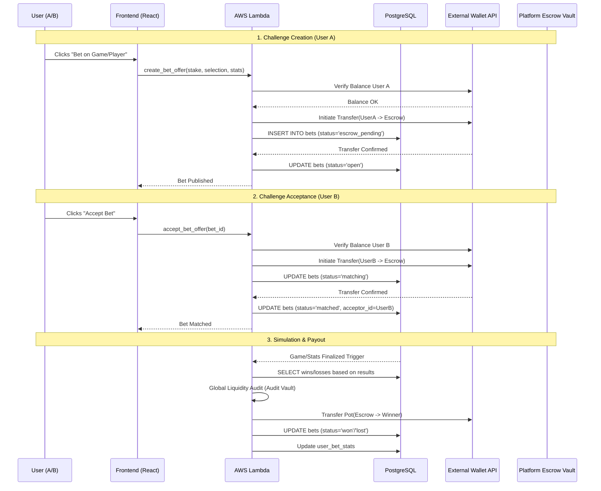

# P2P Betting System: Technical Specification (Enhanced)

This document details the business logic, database interactions, and AWS Lambda functions for the Peer-to-Peer betting system with external wallet and escrow integration.

## 0. Process Overview Diagram



---

## 1. User Initialization (`cognito_post_confirmation`)

**Objective**: Link the user to the application's betting context immediately upon sign-up.

### Tables & Values
- **Table**: `wallets`
- **Actions**: Create a record with the `user_id` (Cognito `sub`) and a placeholder for the `external_wallet_address`.

### Lambda Snippet (Python)
```python
import json
import psycopg2

def lambda_handler(event, context):
    user_id = event['request']['userAttributes']['sub']
    
    conn = psycopg2.connect("dbname=... user=... password=... host=...")
    cur = conn.cursor()
    
    try:
        cur.execute(
            "INSERT INTO wallets (user_id, balance) VALUES (%s, 0.00) ON CONFLICT DO NOTHING",
            (user_id,)
        )
        conn.commit()
    except Exception as e:
        print(f"Error creating wallet: {e}")
        conn.rollback()
    finally:
        cur.close()
        conn.close()
        
    return event
```

---

## 2. Initiating a Challenge (`create_bet_offer`)

**Objective**: Lock User A's funds in escrow based on a game or specific player stats.

### Specific Steps & Logic:
1.  **Selection**: User A picks a game or player stat and sets the `stake`.
2.  **External Check**: Lambda calls the external wallet service to verify User A has `balance >= stake`.
3.  **Tx Initiation**: Lambda initiates a transfer from User A to the **Platform Escrow Vault**.
4.  **Local Record**: Create a record in `bets` with `status='escrow_pending'`.
5.  **Audit**: Create a `wallet_transactions` entry (Type: `escrow_in`).
6.  **Confirmation**: Once the external service confirms the transfer, update `bets.status = 'open'`.

### Lambda Snippet (Python Example)
```python
def create_bet_offer(user_id, game_id, selection, stake):
    # 1. External Balance Verification
    if not external_wallet.has_funds(user_id, stake):
        return {"error": "Insufficient funds"}

    # 2. Transfer to Escrow
    tx_id = external_wallet.transfer(source=user_id, destination=PLATFORM_ESCROW, amount=stake)

    # 3. DB Persistence
    db.execute(
        "INSERT INTO bets (user_id, game_id, selection, stake, escrow_tx_id, status) VALUES (%s, %s, %s, %s, %s, 'escrow_pending')",
        (user_id, game_id, selection, stake, tx_id)
    )
    return {"status": "pending_confirmation", "tx_id": tx_id}
```

---

## 3. Accepting a Challenge (`accept_bet_offer`)

**Objective**: Match the challenge by taking User B's stake into escrow.

### Specific Steps:
1.  **Verification**: Lambda verifies User B has sufficient funds and the bet is still `status='open'`.
2.  **Ext Transfer**: Lambda initiates a transfer from User B to the **Platform Escrow Vault**.
3.  **Matching**: Set `bets.status = 'matched'` and `bets.acceptor_id = UserB` ONLY AFTER the transfer is confirmed by the external service.

---

## 4. Game Result & Settlement (`process_settlement_escrow`)

**Objective**: Resolve the bet using simulation data or player metrics and release the pot.

### Settlement Logic Details:
- **Simulation Source**: `games.home_score` vs `games.away_score`.
- **Stat Source**: `game_player_stats` (points, rebounds, etc.).
- **Payout Calculation**:
    - **Total Pot** = `stake * 2` (minus platform fee).
    - **Final Check**: Run `Global_Liquidity_Audit` to verify the Vault balance matches all `matched` bets.
    - **Transfer**: Call `External_Wallet_API.transfer(from: PlatformEscrow, to: Winner, amount: Pot)`.

### Lambda Snippet (Python Example)
```python
def settle_bet(bet):
    game = db.get_game(bet.game_id)
    winner_id = determine_winner(bet, game) # Selection vs Actual Results
    
    if winner_id:
        total_pot = bet.stake * 2
        # Secure Transfer from Escrow to Winner
        external_wallet.transfer(source=PLATFORM_ESCROW, destination=winner_id, amount=total_pot)
        
        # Update Records
        db.execute("UPDATE bets SET status='won', settled_at=NOW() WHERE id=%s", (bet.id,))
        update_user_stats(winner_id, win=True, profit=bet.stake)
        update_user_stats(loser_id, win=False, profit=-bet.stake)
```

### Risk & Error Handling:
- **Refunds**: If a game is cancelled or a refund is triggered, funds are returned from Escrow to the users. 
    - > [!IMPORTANT]
    - > Refunds are **not 100%**. The system calculates the "Gas Used" (transaction fees/tolls) encountered during the original transfer to escrow and the return transfer. This amount is deducted from the refund total.
- **Liquidity Audit**: The system must verify the Escrow account balance matches the sum of all `matched` stakes before any payout is triggered.
