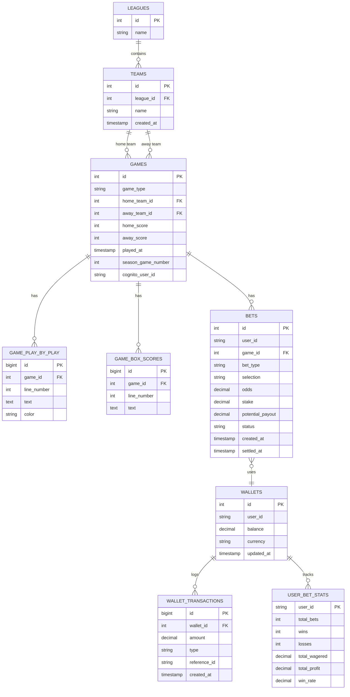

# Database Schema Documentation

This document describes the PostgreSQL database schema designed to store data from the "Single Game Version" and "Full Season Version" of the application.

## Overview

The schema is designed to store:
1.  **Leagues**: The various leagues available in the simulation.
2.  **Teams**: Teams belonging to those leagues.
3.  **Games**: The results of simulated games (both single games and season games).
4.  **Play-by-Play**: Detailed logs of events within a game.
5.  **Box Scores**: Summary statistics/text for the game.

## Entity-Relationship Diagram (ERD)



## Tables

### 1. `leagues`
Stores the names of the leagues (e.g., "Prod2024-2025").

| Column | Type | Constraints | Description |
| :--- | :--- | :--- | :--- |
| `id` | `SERIAL` | `PRIMARY KEY` | Unique identifier for the league. |
| `name` | `VARCHAR(255)` | `UNIQUE`, `NOT NULL` | Name of the league. |

### 2. `teams`
Stores team information.

| Column | Type | Constraints | Description |
| :--- | :--- | :--- | :--- |
| `id` | `SERIAL` | `PRIMARY KEY` | Unique identifier for the team. |
| `league_id` | `INTEGER` | `FOREIGN KEY` | Reference to the `leagues` table. |
| `name` | `VARCHAR(255)` | `NOT NULL` | Name of the team. |
| `created_at` | `TIMESTAMP` | `DEFAULT NOW()` | Timestamp when the team was added. |

### 3. `games`
Stores the header information and final score of a game.

| Column | Type | Constraints | Description |
| :--- | :--- | :--- | :--- |
| `id` | `SERIAL` | `PRIMARY KEY` | Unique identifier for the game. |
| `game_type` | `VARCHAR(50)` | `NOT NULL` | Type of game: `'single'` or `'season'`. |
| `home_team_id` | `INTEGER` | `FOREIGN KEY` | Reference to the home `teams`. |
| `away_team_id` | `INTEGER` | `FOREIGN KEY` | Reference to the away `teams`. |
| `home_score` | `INTEGER` | `NOT NULL` | Final score for the home team. |
| `away_score` | `INTEGER` | `NOT NULL` | Final score for the away team. |
| `played_at` | `TIMESTAMP` | `DEFAULT NOW()` | When the simulation was run. |
| `season_game_number` | `INTEGER` | | Optional. The game number in the season schedule (e.g., 1-82). |
| `cognito_user_id` | `VARCHAR(255)` | | Optional. References the AWS Cognito User ID associated with this game. |

### 4. `game_play_by_play` (Not really necessary)
Stores the raw text lines of the play-by-play commentary.

| Column | Type | Constraints | Description |
| :--- | :--- | :--- | :--- |
| `id` | `BIGSERIAL` | `PRIMARY KEY` | Unique identifier. |
| `game_id` | `INTEGER` | `FOREIGN KEY` | Reference to the `games` table. |
| `line_number` | `INTEGER` | `NOT NULL` | Ordering of the lines. |
| `text` | `TEXT` | `NOT NULL` | The content of the play-by-play line. |
| `color` | `VARCHAR(50)` | | Color code/name used in the UI (e.g., for scoring plays). |

### 5. `game_box_scores` (OPTIONAL)
Stores the raw text lines of the box score. 

| Column | Type | Constraints | Description |
| :--- | :--- | :--- | :--- |
| `id` | `BIGSERIAL` | `PRIMARY KEY` | Unique identifier. |
| `game_id` | `INTEGER` | `FOREIGN KEY` | Reference to the `games` table. |
| `line_number` | `INTEGER` | `NOT NULL` | Ordering of the lines. |
| `text` | `TEXT` | `NOT NULL` | The content of the box score line. |

## Usage Notes

- **Data Ingestion**: When a game finishes in the React app, the frontend should send the `gameData` object to a backend endpoint. The backend will then insert records into these tables.
- **Box Score**: Currently, the box score is stored as raw text lines to match the current application output. If structured analysis (e.g., "Find all players who scored > 20 points") is needed in the future, a new table `game_player_stats` should be created to parse and store individual player metrics.

## Alternative: Optimized Schema (JSONB)

For improved performance and efficiency, especially when dealing with large volumes of text data like play-by-play logs, we can leverage PostgreSQL's `JSONB` data type.

### Changes to `games` Table

Instead of using separate tables for `game_play_by_play` and `game_box_scores`, we add two columns directly to the `games` table:

| Column | Type | Description |
| :--- | :--- | :--- |
| `play_by_play` | `JSONB` | Stores the entire list of play-by-play objects. |
| `box_score` | `JSONB` | Stores the entire list of box score line objects. |

### Benefits

1.  **Reduced Row Count**: Eliminates hundreds or thousands of rows per game in child tables.
2.  **Faster Reads**: Fetching a game and its logs becomes a single `SELECT` statement without expensive `JOIN`s.
3.  **Simplified Writes**: The entire game object (header + logs) can be inserted or updated in fewer operations.

### JSON Structure

**`play_by_play` Column:**
```json
[
  { "line_number": 1, "text": "Tip-off...", "color": "0" },
  { "line_number": 2, "text": "Player X scores!", "color": "1" }
]
```

**`box_score` Column:**
```json
[
  { "line_number": 1, "text": "Header Info..." },
  { "line_number": 2, "text": "Player Stats..." }
]
```

### 6. `game_player_stats` (May be to apply in the future, for Analysis with AI)

While the `box_score` JSONB column stores the display-ready text, this table is designed for structured queries (e.g., "Who had the most rebounds?").

| Column | Type | Constraints | Description |
| :--- | :--- | :--- | :--- |
| `id` | `BIGSERIAL` | `PRIMARY KEY` | Unique identifier. |
| `game_id` | `INTEGER` | `FOREIGN KEY` | Reference to the `games` table. |
| `player_name` | `VARCHAR(255)` | `NOT NULL` | Name of the player. |
| `team_id` | `INTEGER` | `FOREIGN KEY` | Reference to the `teams` table. |
| `points` | `INTEGER` | | Total points scored. |
| `rebounds` | `INTEGER` | | Total rebounds. |
| `assists` | `INTEGER` | | Total assists. |
| `steals` | `INTEGER` | | Total steals. |
| `blocks` | `INTEGER` | | Total blocks. |
| `turnovers` | `INTEGER` | | Total turnovers. |

### 7. `wallets`
Stores the current balance for each user.

| Column | Type | Constraints | Description |
| :--- | :--- | :--- | :--- |
| `id` | `SERIAL` | `PRIMARY KEY` | Unique identifier. |
| `user_id` | `VARCHAR(255)` | `UNIQUE`, `NOT NULL` | The Cognito User ID. |
| `balance` | `DECIMAL(12,2)` | `DEFAULT 0.00` | Current funds. |
| `currency` | `VARCHAR(10)` | `DEFAULT 'USD'` | Currency type. |
| `updated_at` | `TIMESTAMP` | `DEFAULT NOW()` | Last balance change. |

### 8. `wallet_transactions`
Auditable log of all balance changes.

| Column | Type | Constraints | Description |
| :--- | :--- | :--- | :--- |
| `id` | `BIGSERIAL` | `PRIMARY KEY` | Unique identifier. |
| `wallet_id` | `INTEGER` | `FOREIGN KEY` | Reference to `wallets`. |
| `amount` | `DECIMAL(12,2)` | `NOT NULL` | Change amount (positive or negative). |
| `type` | `VARCHAR(50)` | `NOT NULL` | e.g., 'deposit', 'withdrawal', 'bet_placed', 'bet_won'. |
| `reference_id` | `VARCHAR(255)` | | Optional ID linking to a specific bet or external transaction. |
| `created_at` | `TIMESTAMP` | `DEFAULT NOW()` | Transaction time. |

### 9. `bets`
Records individual wagers placed by users.

| Column | Type | Constraints | Description |
| :--- | :--- | :--- | :--- |
| `id` | `SERIAL` | `PRIMARY KEY` | Unique identifier. |
| `user_id` | `VARCHAR(255)` | `NOT NULL` | The Cognito User ID. |
| `game_id` | `INTEGER` | `FOREIGN KEY` | Reference to the `games` table. |
| `bet_type` | `VARCHAR(50)` | `NOT NULL` | e.g., 'winner', 'over_under', 'points_spread'. |
| `selection` | `VARCHAR(255)` | `NOT NULL` | The user's choice (e.g., 'home_team', 'away_team', 'over_210.5'). |
| `odds` | `DECIMAL(6,2)` | `NOT NULL` | Odds multiplier. |
| `stake` | `DECIMAL(12,2)` | `NOT NULL` | Amount wagered. |
| `potential_payout` | `DECIMAL(12,2)` | `NOT NULL` | Stake * Odds. |
| `status` | `VARCHAR(20)` | `DEFAULT 'pending'` | 'pending', 'won', 'lost', 'cancelled'. |
| `created_at` | `TIMESTAMP` | `DEFAULT NOW()` | When the bet was placed. |
| `settled_at` | `TIMESTAMP` | | When the game result was processed. |

### 10. `user_bet_stats`
Summary statistics for user profiles.

| Column | Type | Constraints | Description |
| :--- | :--- | :--- | :--- |
| `user_id` | `VARCHAR(255)` | `PRIMARY KEY` | Link to Cognito User ID. |
| `total_bets` | `INTEGER` | `DEFAULT 0` | Count of bets placed. |
| `wins` | `INTEGER` | `DEFAULT 0` | Count of won bets. |
| `losses` | `INTEGER` | `DEFAULT 0` | Count of lost bets. |
| `total_wagered` | `DECIMAL(15,2)` | `DEFAULT 0.00` | Sum of all stakes. |
| `total_profit` | `DECIMAL(15,2)` | `DEFAULT 0.00` | Net profit (Payouts - Stakes). |
| `win_rate` | `DECIMAL(5,2)` | | Percentage of wins. |


