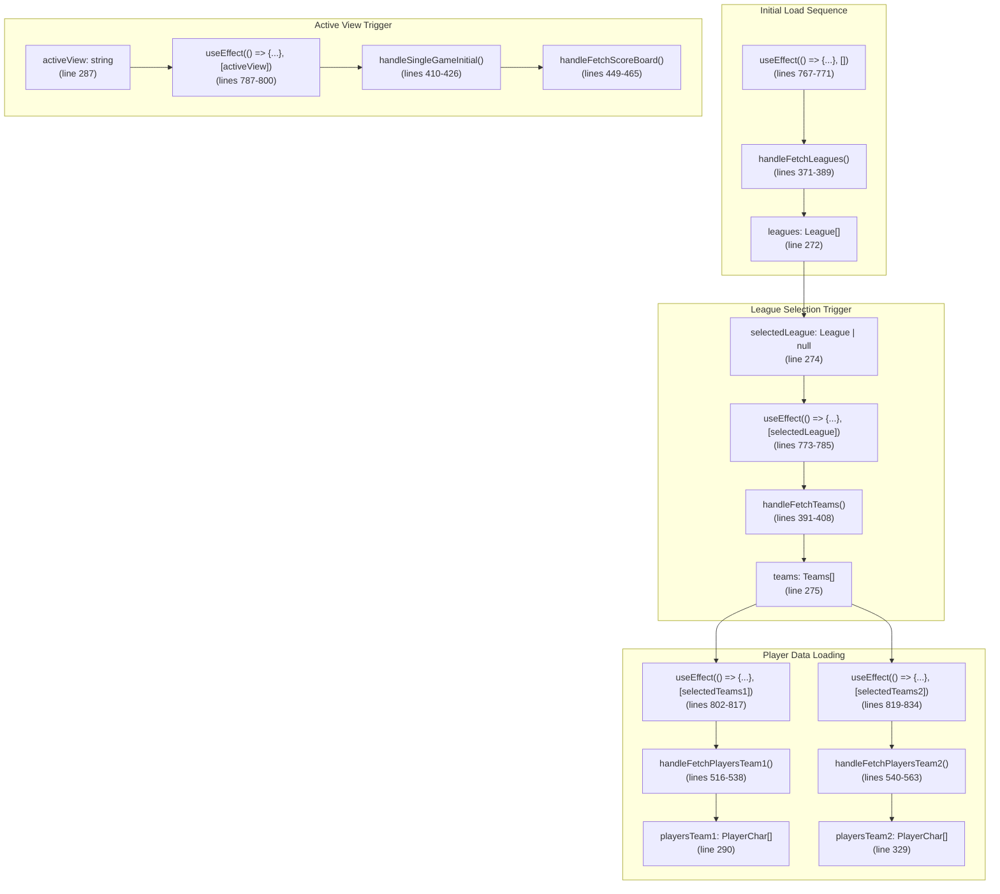
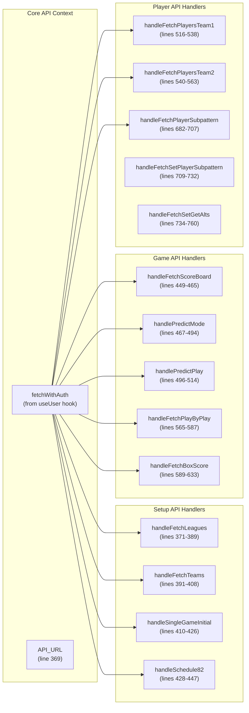
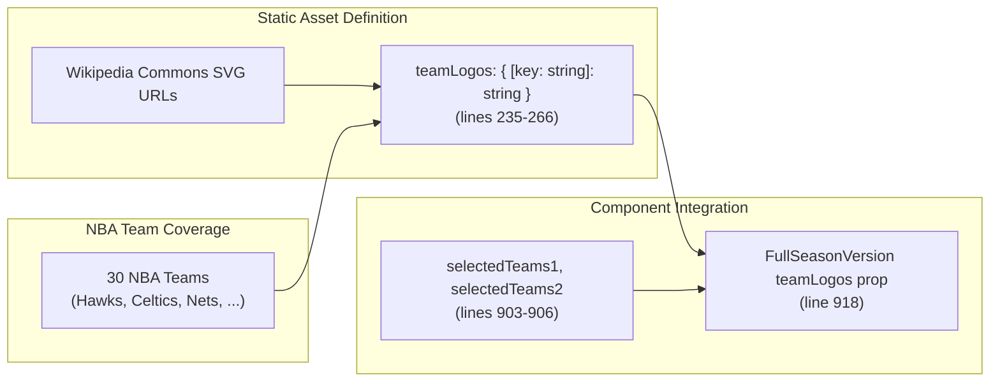

# Game Setup Interface

Relevant source files

The following files were used as context for generating this wiki page:

- [src/pages/GameSetup.tsx](/src/pages/GameSetup.tsx)

## Purpose and Scope

The `GameSetup` component serves as the central orchestration point for basketball game simulations in the NBA simulation application. Located at [src/pages/GameSetup.tsx](/src/pages/GameSetup.tsx), this component manages league selection, team configuration, and game initialization through a comprehensive state management system that coordinates with external basketball simulation APIs.

The component implements a Sheet-based navigation interface supporting full season simulation, single game modes, and user instructions. It acts as the primary data orchestrator that bridges user selections with the underlying simulation engine through the `useUser` context system, providing authenticated API access and user state management.

For simulation execution details, see [Basketball Simulation](./15_Basketball_Simulation.md). For authentication prerequisites, see [Authentication System](./6_Authentication_System.md).

## Component Architecture Overview

The `GameSetup` component implements a Sheet-based navigation interface that orchestrates different simulation modes while maintaining shared state and API integration.

**GameSetup Component Structure**

```mermaid
graph TD
    GameSetupComponent["GameSetup<br/>(lines 268-946)"]
    
    subgraph "Hook Dependencies"
        useUserHook["useUser<br/>(line 270)"]
        useNavigateHook["useNavigate<br/>(line 271)"]
        fetchWithAuth["fetchWithAuth, isLoading, user<br/>(line 270)"]
    end
    
    subgraph "State Management"
        LeagueState["leagues, selectedLeague<br/>(lines 272-274)"]
        TeamState["teams, selectedTeams1/2<br/>(lines 275-278)"]
        GameState["scoreBoard, playByPlay, boxScore<br/>(lines 280-287)"]
        PlayerState["playersTeam1, playersTeam2<br/>(lines 290-367)"]
    end
    
    subgraph "Navigation Components"
        Sheet["Sheet<br/>(lines 854-890)"]
        SheetTrigger["SheetTrigger<br/>(lines 855-859)"]
        SheetContent["SheetContent<br/>(lines 860-889)"]
        MenuButton["Menu Button<br/>(lines 856-858)"]
    end
    
    subgraph "Mode Components"
        FullSeasonVersion["FullSeasonVersion<br/>(lines 895-932)"]
        SingleGameVersion["SingleGameVersion<br/>(line 935)"]
        Instructions["Instructions<br/>(line 938)"]
    end
    
    GameSetupComponent --> useUserHook
    GameSetupComponent --> useNavigateHook
    GameSetupComponent --> LeagueState
    GameSetupComponent --> TeamState
    GameSetupComponent --> GameState
    GameSetupComponent --> PlayerState
    GameSetupComponent --> Sheet
    GameSetupComponent --> FullSeasonVersion
    GameSetupComponent --> SingleGameVersion
    GameSetupComponent --> Instructions
```

**Component Responsibilities:**
- **FullSeasonVersion**: Complete league/team setup with 82-game schedules and live API data
- **SingleGameVersion**: Hardcoded game simulation for testing  
- **Instructions**: User documentation and guidance
- **Sheet Navigation**: Side panel menu for mode switching and user controls

Sources: [src/pages/GameSetup.tsx:268-946](/src/pages/GameSetup.tsx), [src/pages/GameSetup.tsx:854-890](/src/pages/GameSetup.tsx), [src/pages/GameSetup.tsx:895-938](/src/pages/GameSetup.tsx)

## Data Flow and State Management

The component implements a cascading state management system where user selections trigger sequential API calls and state updates through `useEffect` hooks.

**State Cascade and API Integration**

**State Initialization Pattern:**
Each state variable follows a defensive initialization pattern with default empty or null values to prevent runtime errors during the loading sequence. The component includes detailed default player objects with all required statistical fields.

Sources: [src/pages/GameSetup.tsx:767-834](/src/pages/GameSetup.tsx), [src/pages/GameSetup.tsx:272-367](/src/pages/GameSetup.tsx)

## API Integration Points

The component uses the `fetchWithAuth` method from `useApi` context to communicate with basketball simulation endpoints, implementing consistent error handling and authentication across all API operations.

**API Handler Functions and Endpoint Mapping**

**API Endpoint Configuration**
| Handler Function | Endpoint | Request Method | Payload | State Update |
|------------------|----------|----------------|---------|--------------|
| `handleFetchLeagues` | `get_leagues.php` | POST | None | `setLeagues` |
| `handleFetchTeams` | `get_teams.php` | POST | `selectedLeague` | `setTeams` |
| `handleSingleGameInitial` | `playsinglegame_initial.php` | POST | Team configuration | `handleFetchScoreBoard` |
| `handleFetchScoreBoard` | `get_singlegame_stats.php` | POST | None | `setScoreBoard` |
| `handleFetchPlayersTeam1` | `get_actual_player_stats.php` | POST | League + team1 | `setPlayersTeam1` |
| `handleFetchPlayersTeam2` | `get_actual_player_stats.php` | POST | League + team2 | `setPlayersTeam2` |
| `handlePredictMode` | `play_predict.php/play_82/play_fsv` | POST | Game array config | Conditional box score fetch |
| `handleSchedule82` | `get_82_game_schedule.php` | POST | League + team | `setTeamsSchedule` |
| `handleFetchBoxScoreFullSeason` | `get_raw_box_scores.php` | POST | Game number filter | `setBoxScoreFullSeason` |

Sources: [src/pages/GameSetup.tsx:369-760](/src/pages/GameSetup.tsx)

## TypeScript Interface System

The component defines comprehensive TypeScript interfaces that structure API responses and game state data, ensuring type safety across the simulation system.

**Interface Hierarchy and Relationships**

```mermaid
graph TD
    subgraph "Entity Interfaces"
        MessageInterface["Message<br/>(lines 13-15)"]
        LeagueInterface["League<br/>(lines 21-23)"]
        TeamsInterface["Teams<br/>(lines 29-31)"]
        TeamsScheduleInterface["TeamsSchedule<br/>(lines 37-40)"]
        PlayerCharInterface["PlayerChar<br/>(lines 46-84)"]
    end
    
    subgraph "Game State Interfaces"
        ScoreBoardInterface["ScoreBoard<br/>(lines 94-184)"]
        PlayByPlayInterface["PlayByPlay<br/>(lines 190-193)"]
        BoxScoreInterface["BoxScore<br/>(lines 199-203)"]
        BoxScoreFullSeasonInterface["BoxScoreFullSeason<br/>(lines 205-209)"]
        PlayerSubPatternInterface["PlayerSubPattern<br/>(lines 215-221)"]
        GetAltsInterface["GetAlts<br/>(lines 227-229)"]
    end
    
    subgraph "Response Wrapper Interfaces"
        LeagueResponseInterface["LeagueResponse<br/>(lines 25-27)"]
        TeamsResponseInterface["TeamsResponse<br/>(lines 33-35)"]
        TeamsScheduleResponseInterface["TeamsScheduleResponse<br/>(lines 42-44)"]
        PlayerCharResponseInterface["PlayerCharResponse<br/>(lines 86-88)"]
        ScoreBoardResponseInterface["ScoreBoardResponse<br/>(lines 186-188)"]
        UpdatePlayByPlayResponseInterface["UpdatePlayByPlayResponse<br/>(lines 195-197)"]
        BoxScoreResponseInterface["BoxScoreResponse<br/>(lines 211-213)"]
        PlayerSubPatternResponseInterface["PlayerSubPatternResponse<br/>(lines 223-225)"]
        GetAltsResponseInterface["GetAltsResponse<br/>(lines 231-233)"]
    end
    
    LeagueInterface --> LeagueResponseInterface
    TeamsInterface --> TeamsResponseInterface
    TeamsScheduleInterface --> TeamsScheduleResponseInterface
    PlayerCharInterface --> PlayerCharResponseInterface
    ScoreBoardInterface --> ScoreBoardResponseInterface
    PlayByPlayInterface --> UpdatePlayByPlayResponseInterface
    BoxScoreInterface --> BoxScoreResponseInterface
    PlayerSubPatternInterface --> PlayerSubPatternResponseInterface
    GetAltsInterface --> GetAltsResponseInterface
```

**Critical Interface Details:**

| Interface | Properties | Purpose |
|-----------|------------|---------|
| `PlayerChar` | 45+ basketball statistics | Complete player statistical profile including both editable and actual stats |
| `ScoreBoard` | 90+ game state fields | Real-time game tracking including scores, player positions, possession data |
| `TeamsSchedule` | `teams`, `games` | 82-game schedule management for full season simulation |
| `PlayerSubPattern` | 5 position fields | Player substitution patterns for lineup management |
| `BoxScoreFullSeason` | `text`, `game_number`, `line_number` | Full season box score data format |
| `GetAlts` | `alt_sub` | Alternative player substitution configurations |

**API Response Pattern:**
All API responses follow a consistent wrapper pattern where data arrays are contained within a `data` property, except `ScoreBoardResponse` which uses `scoreboard` and `UpdatePlayByPlayResponse` which uses `playbyplay`.

Sources: [src/pages/GameSetup.tsx:13-233](/src/pages/GameSetup.tsx)

## Team Logo Management System

The component includes a static asset mapping system that provides visual team identification throughout the simulation interface.

**Asset Configuration and Integration**

**Logo Mapping Implementation:**
The `teamLogos` constant provides a complete mapping of NBA team names to their official SVG logo URLs hosted on Wikipedia Commons. This ensures consistent visual branding across the simulation interface.

**Team Coverage:**
- 30 complete NBA team mappings
- SVG format for scalable rendering
- External CDN hosting via Wikipedia Commons
- Direct team name key matching with API response data

Sources: [src/pages/GameSetup.tsx:235-266](/src/pages/GameSetup.tsx), [src/pages/GameSetup.tsx:918](/src/pages/GameSetup.tsx)

## Error Handling and Loading States

The component implements consistent error handling and loading state management across all API operations.

| State Variable | Purpose | Usage |
|----------------|---------|-------|
| `error` | Store error messages | Set in catch blocks, displayed in UI |
| `isLoading` | Track API request status | From `useApi()` hook, disables buttons |
| `isGameInitial` | Track game initialization | Local loading state for game setup |

**Error Handling Pattern:**
1. Clear existing errors with `setError(null)`
2. Wrap API calls in try-catch blocks
3. Parse error responses and set descriptive error messages
4. Display errors in UI components

Sources: [src/pages/GameSetup.tsx:230](/src/pages/GameSetup.tsx), [src/pages/GameSetup.tsx:235](/src/pages/GameSetup.tsx), [src/pages/GameSetup.tsx:319-331](/src/pages/GameSetup.tsx)