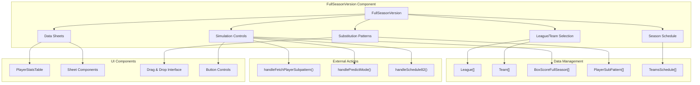
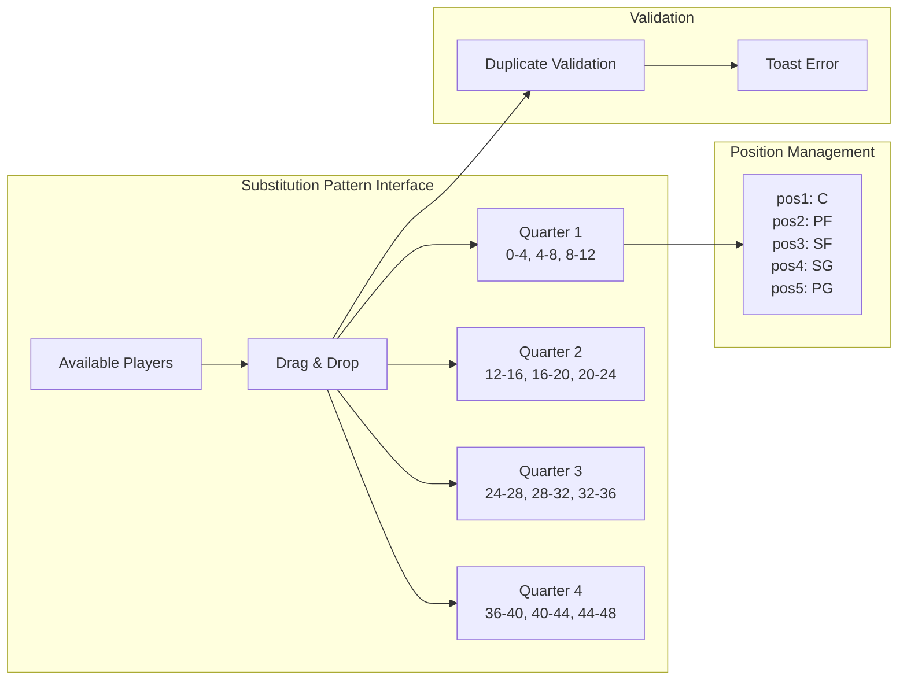
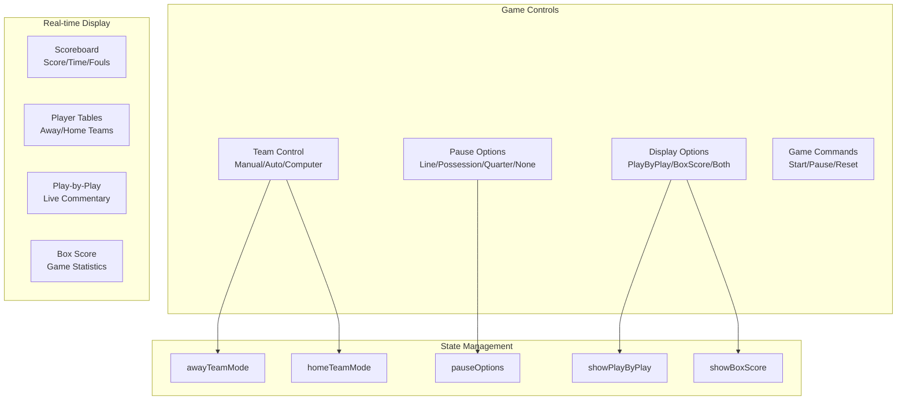
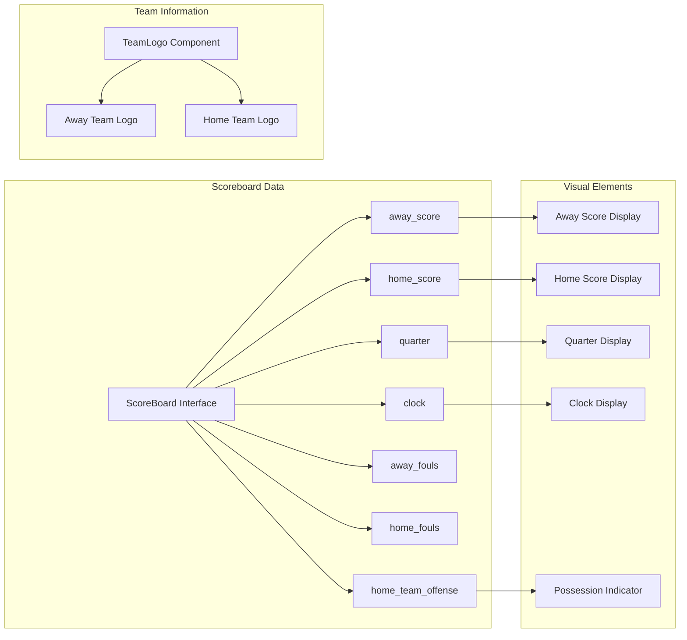
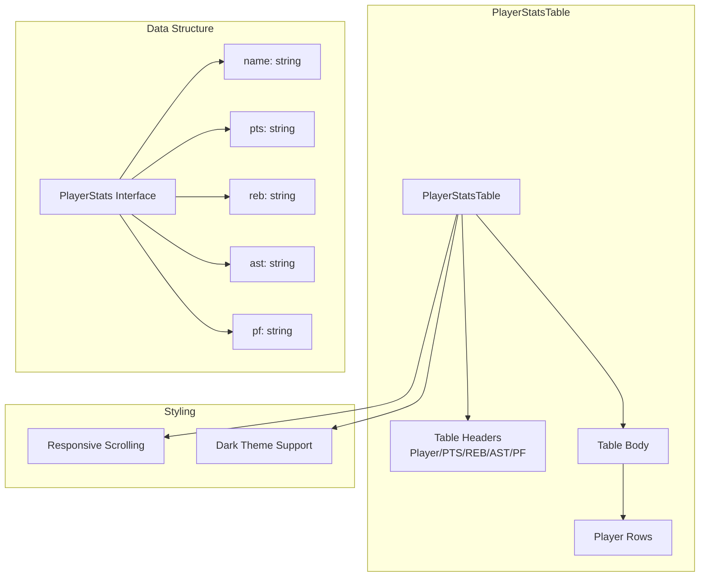
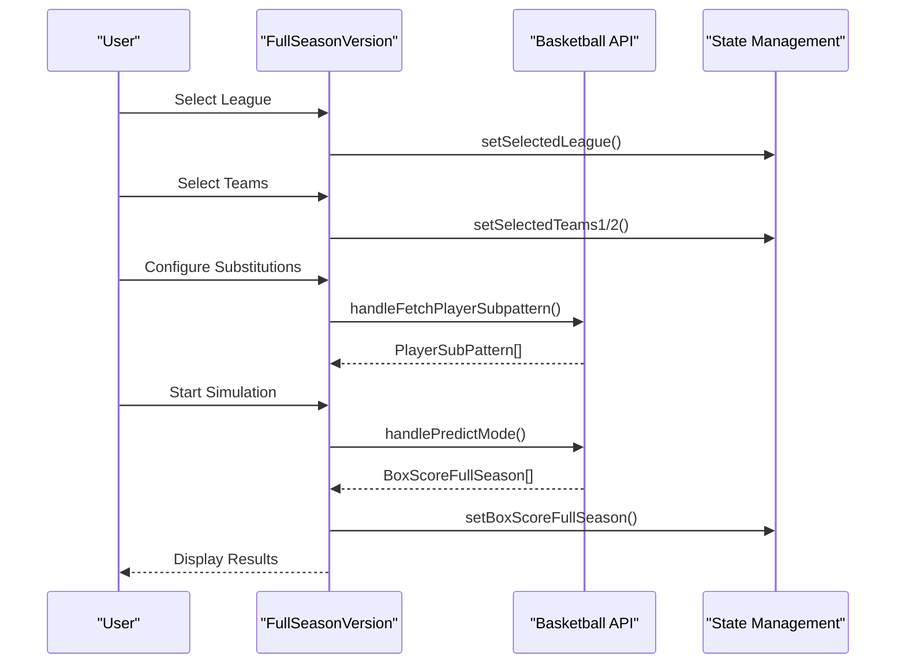

# Game Simulation Interfaces

Relevant source files

The following files were used as context for generating this wiki page:

- [src/components/PlayerStatsTable.tsx](src/components/PlayerStatsTable.tsx)
- [src/components/Scoreboard.tsx](src/components/Scoreboard.tsx)
- [src/components/ui/table.tsx](src/components/ui/table.tsx)
- [src/gamesetup_result_image.png](src/gamesetup_result_image.png)
- [src/lib/utils.ts](src/lib/utils.ts)
- [src/pages/FullSeasonVersion.tsx](src/pages/FullSeasonVersion.tsx)
- [src/pages/Instructions.tsx](src/pages/Instructions.tsx)
- [src/pages/SingleGameVersion.tsx](src/pages/SingleGameVersion.tsx)
- [src/player_subs_pattern.png](src/player_subs_pattern.png)

This document covers the user interface components responsible for basketball game simulation, including both full season and single game simulation modes. These interfaces provide controls for configuring simulations, displaying real-time results, and managing complex basketball-specific features like player substitution patterns.

For information about the underlying game simulation logic and mechanics, see [Basketball Simulation](#5.1). For the main orchestration interface that routes users to these simulation modes, see [Game Setup Interface](#4.2).

## Full Season Simulation Interface

The `FullSeasonVersion` component provides a comprehensive interface for simulating entire basketball seasons. This interface handles complex season-level operations including multi-team scheduling, player rotation management, and season-long statistics tracking.

### Component Architecture

Sources: [src/pages/FullSeasonVersion.tsx:1-1413]()

### Key Interfaces and Data Structures

The full season interface relies on several TypeScript interfaces that define the data structures for different aspects of season simulation:

| Interface | Purpose | Key Fields |
|-----------|---------|------------|
| `League` | League selection | `league_name` |
| `Team` | Team selection | `teams` |
| `TeamsSchedule` | Season scheduling | `teams`, `games` |
| `PlayerChar` | Player characteristics | `name`, `position`, `poss_fact`, `two_pt_fg_pct`, etc. |
| `PlayerSubPattern` | 4-minute substitution intervals | `pos1`, `pos2`, `pos3`, `pos4`, `pos5` |
| `BoxScoreFullSeason` | Season game results | `text`, `game_number`, `line_number` |

Sources: [src/pages/FullSeasonVersion.tsx:37-151]()

### Player Substitution Management

The full season interface includes a sophisticated drag-and-drop system for managing player substitutions across 4-minute intervals throughout a game:

The system prevents duplicate player assignments within the same 4-minute interval and provides visual feedback through the `handleDrop` function.

Sources: [src/pages/FullSeasonVersion.tsx:216-242](), [src/pages/FullSeasonVersion.tsx:245-279]()

### Sheet-Based Data Display

The interface uses sheet components to display various types of simulation data:

- **Box Score Sheet**: Displays full season box scores with attention indicators when new data is available
- **Player Statistics Sheet**: Shows detailed player stats for both teams with CSV export functionality
- **Substitution Pattern Sheet**: Full-screen drag-and-drop interface for managing player rotations

Sources: [src/pages/FullSeasonVersion.tsx:314-333](), [src/pages/FullSeasonVersion.tsx:569-708]()

## Single Game Simulation Interface

The `SingleGameVersion` component provides a real-time interface for simulating individual basketball games with granular control over game progression and display options.

### Control Systems Architecture

Sources: [src/pages/SingleGameVersion.tsx:46-56]()

### Real-time Game Display

The single game interface provides multiple synchronized views of the ongoing simulation:

| Component | Purpose | Data Source |
|-----------|---------|-------------|
| Live Scoreboard | Current score, time, fouls | `scoreboardData` |
| Player Statistics Tables | Real-time player stats | `awayTeamStats`, `homeTeamStats` |
| Play-by-Play Feed | Game commentary | `playByPlayData` |
| Box Score Display | Detailed game statistics | `boxScoreData` |

Sources: [src/pages/SingleGameVersion.tsx:14-44](), [src/pages/SingleGameVersion.tsx:125-175]()

## Supporting Components

### Scoreboard Component

The `Scoreboard` component provides a professional basketball scoreboard display with real-time game information:

The scoreboard uses conditional styling to indicate which team has possession and includes fallback team abbreviations when logos are unavailable.

Sources: [src/components/Scoreboard.tsx:3-49](), [src/components/Scoreboard.tsx:52-98]()

### Player Statistics Table

The `PlayerStatsTable` component provides a reusable interface for displaying player performance data:

Sources: [src/components/PlayerStatsTable.tsx:11-54]()

## Data Flow and State Management

### Full Season Simulation Flow

Sources: [src/pages/FullSeasonVersion.tsx:115-151](), [src/pages/FullSeasonVersion.tsx:291-305]()

### State Coordination

Both simulation interfaces manage complex state through props passed from the parent `GameSetup` component. The full season interface handles over 20 state variables while the single game interface manages real-time game state:

| State Category | Full Season | Single Game |
|----------------|-------------|-------------|
| Team Selection | `selectedTeams1/2`, `selectedLeague` | Team mode controls |
| Simulation Data | `boxScoreFullSeason`, `teamsSchedule` | Live game stats |
| UI Controls | `schedule`, `location`, `getAltsSelected` | `pauseOptions`, `displayOptions` |
| Player Management | `playersTeam1/2`, `playerSubPattern` | Real-time player stats |

Sources: [src/pages/FullSeasonVersion.tsx:115-151](), [src/pages/SingleGameVersion.tsx:46-56]()

## User Interaction Patterns

### Export and Persistence

Both interfaces provide data export capabilities using the `exportToCSV` utility function. The full season interface supports exporting player statistics, substitution patterns, and season data, while maintaining persistent state across simulation runs.

### Visual Feedback Systems

The interfaces implement several visual feedback mechanisms:
- **Attention Indicators**: Pulsing buttons (`pulse-attention` class) when user action is required
- **Loading States**: Spinner components during API operations
- **Toast Notifications**: Error and success messages for user actions
- **Drag Feedback**: Visual cues during player substitution management

Sources: [src/pages/FullSeasonVersion.tsx:354-365](), [src/pages/FullSeasonVersion.tsx:227-232](), [src/lib/utils.ts:8-42]()