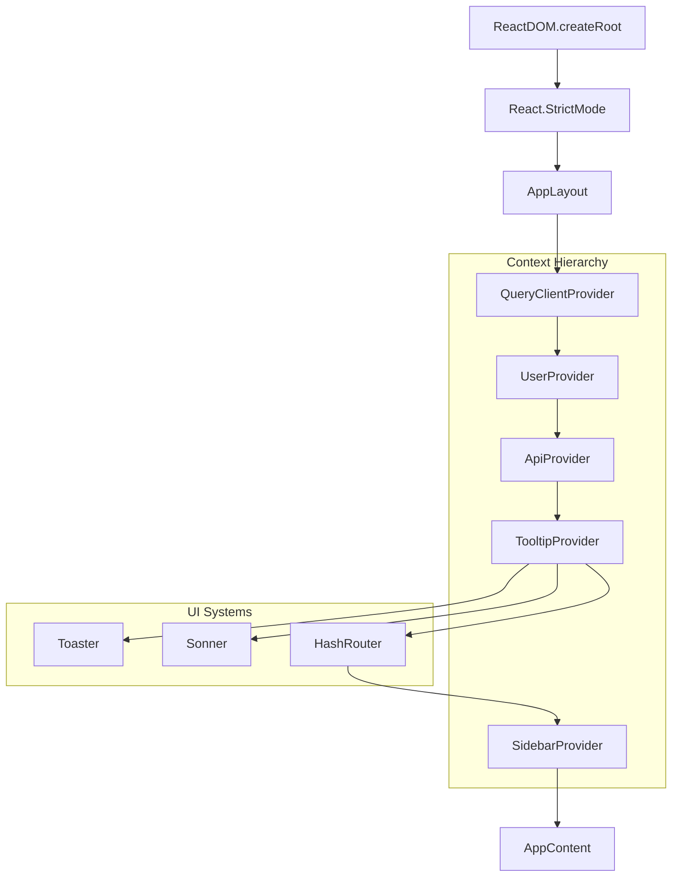
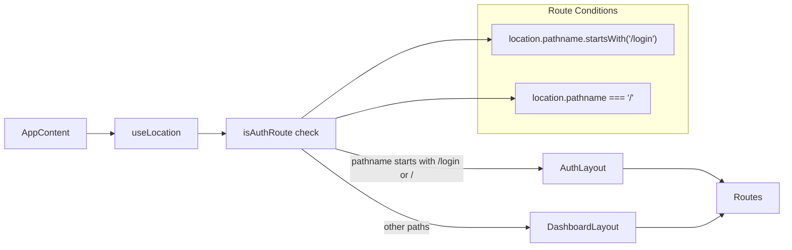
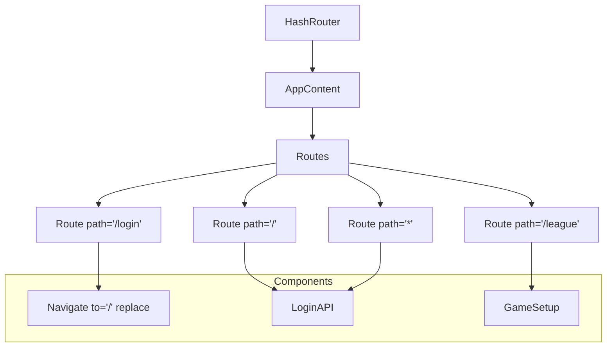
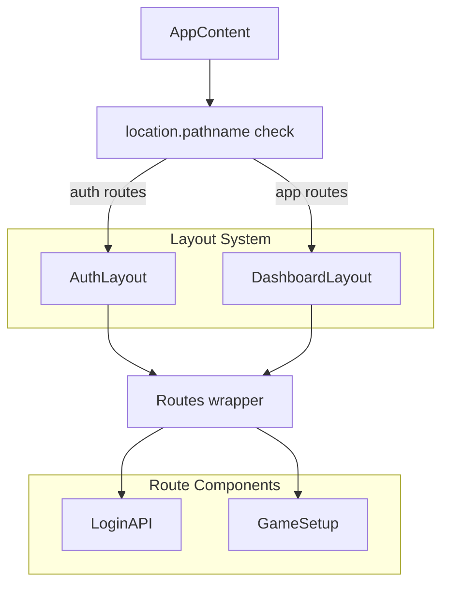
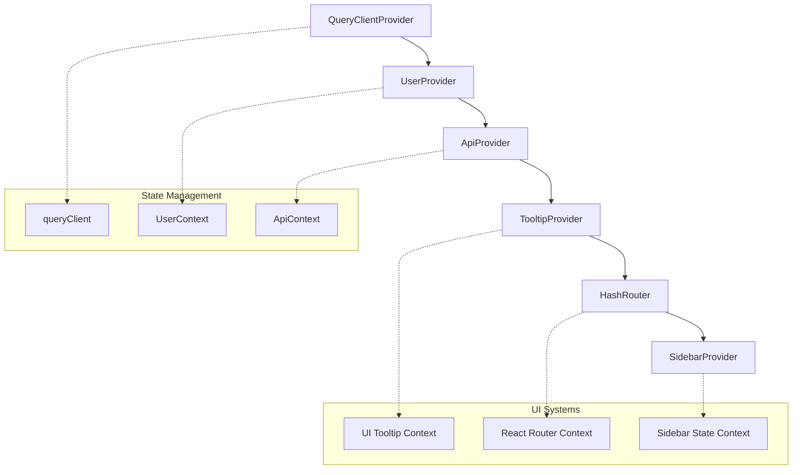
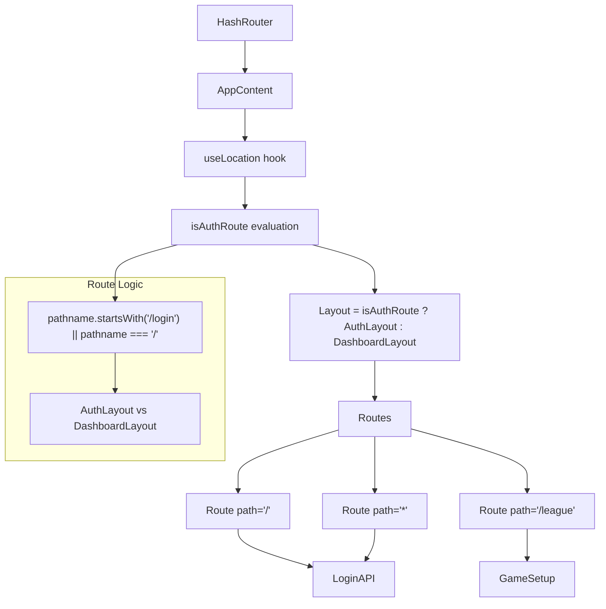
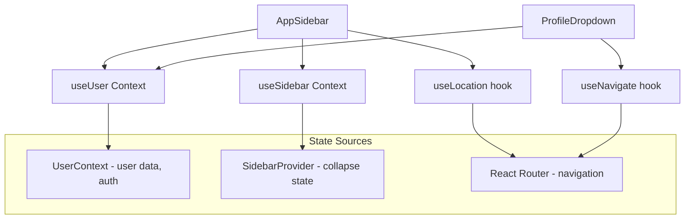

# Layout and Navigation

<details>
<summary>Relevant source files</summary>

The following files were used as context for generating this wiki page:

- [src/components/AppSidebar.tsx](/src/components/AppSidebar.tsx)
- [src/components/MainLayout.tsx](/src/components/MainLayout.tsx)
- [src/components/ProfileDropdown.tsx](/src/components/ProfileDropdown.tsx)
- [src/components/searchbox.tsx](/src/components/searchbox.tsx)
- [src/components/ui/calendar.tsx](/src/components/ui/calendar.tsx)
- [src/layout.tsx](/src/layout.tsx)

</details>


This document covers the NBA simulation application's layout system, routing architecture, and navigation components. The layout system provides a hierarchical provider structure with distinct layouts for authentication and game simulation interfaces.

For information about the core UI components used within these layouts, see [Core Components](./9_Core_Components.md). For details about the game-specific interfaces that render within these layouts, see [Game Setup Interface](./10_Game_Setup_Interface.md) and [Game Simulation Interfaces](./11_Game_Simulation_Interfaces.md).

## Application Bootstrap Architecture

The application uses a hierarchical provider system established in `AppLayout` with distinct layouts for authentication and game simulation states. The architecture follows a layered approach with context providers wrapping the routing system.

**Application Bootstrap Flow**


**Layout Selection Logic**


Sources: [src/layout.tsx:44-62](/src/layout.tsx), [src/layout.tsx:22-42](/src/layout.tsx)

## Routing System

The application uses `HashRouter` for navigation with a simple route configuration that separates authentication and game simulation flows.

**Route Configuration**


### Route Mapping

| Route | Component | Purpose |
|-------|-----------|---------|
| `/` | `LoginAPI` | Authentication entry point |
| `/login` | Redirect to `/` | Login redirect handler |
| `/league` | `GameSetup` | Main game setup interface |
| `*` | `LoginAPI` | Catch-all fallback |

### Layout Selection

The `AppContent` component determines layout based on route path:

```typescript
const isAuthRoute = location.pathname.startsWith("/login") || location.pathname === "/";
const Layout = isAuthRoute ? AuthLayout : DashboardLayout;
```

Sources: [src/layout.tsx:22-42](/src/layout.tsx), [src/layout.tsx:34-40](/src/layout.tsx)

## Layout Components

The application uses two primary layout components imported from the components directory to handle different application states.

**Layout Component Architecture**


### Layout Selection Logic

The layout selection follows this pattern:

| Condition | Layout | Used For |
|-----------|--------|----------|
| `pathname.startsWith("/login")` | `AuthLayout` | Login flows |
| `pathname === "/"` | `AuthLayout` | Root authentication |
| All other paths | `DashboardLayout` | Game simulation |

Sources: [src/layout.tsx:16-18](/src/layout.tsx), [src/layout.tsx:25-27](/src/layout.tsx)

## Context Provider Hierarchy

The application establishes a sophisticated context provider hierarchy in `AppLayout` that manages global state, API communication, and UI systems.

**Provider Stack Architecture**


### Provider Responsibilities

| Provider | Purpose | Scope |
|----------|---------|-------|
| `QueryClientProvider` | React Query client management | API caching and synchronization |
| `UserProvider` | User authentication state | User session and profile data |
| `ApiProvider` | API context aggregation | Unified API interface |
| `TooltipProvider` | UI tooltip system | Component tooltip management |
| `SidebarProvider` | Sidebar state management | Sidebar collapse/expand state |

### Notification Systems

The application includes dual notification systems:

```typescript
<Toaster />
<Sonner />
```

These provide toast notifications and sound notifications for user feedback.

Sources: [src/layout.tsx:44-60](/src/layout.tsx), [src/layout.tsx:6-9](/src/layout.tsx)

## Navigation Integration

The application integrates navigation through React Router with location-aware layout selection and component rendering.

**Navigation Flow Integration**


### Component Navigation Patterns

The application uses several navigation patterns:

| Pattern | Implementation | Usage |
|---------|----------------|-------|
| Route-based Layout | `isAuthRoute` conditional | Layout switching |
| Component Routing | `Routes` with `Route` elements | Page rendering |
| Programmatic Navigation | `useNavigate` hook | Component-triggered navigation |
| Location Awareness | `useLocation` hook | Active state management |

### Route Guard Implementation

The route configuration implements implicit authentication guards:

- **Auth Routes** (`/`, `/login`): Use `AuthLayout`, render `LoginAPI`
- **App Routes** (`/league`): Use `DashboardLayout`, render `GameSetup`
- **Fallback**: All unknown routes redirect to authentication

Sources: [src/layout.tsx:22-30](/src/layout.tsx), [src/layout.tsx:34-40](/src/layout.tsx)

## Navigation State Integration

The layout and navigation components integrate with several React contexts for state management:

**Context Integration Flow**


The navigation system maintains active route highlighting through `location.pathname` comparison and provides seamless navigation through React Router integration.

Sources: [src/components/AppSidebar.tsx:24-38](/src/components/AppSidebar.tsx), [src/components/ProfileDropdown.tsx:13-19](/src/components/ProfileDropdown.tsx)