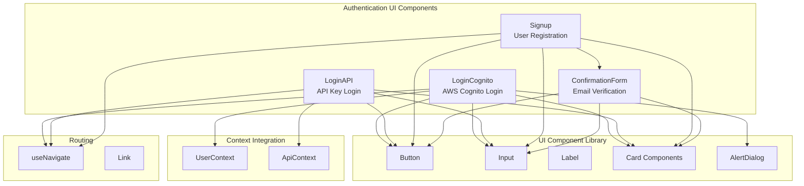
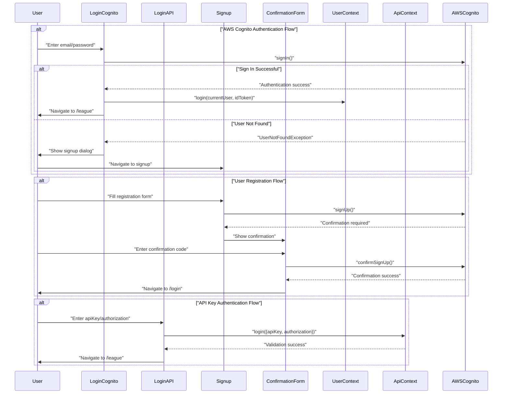
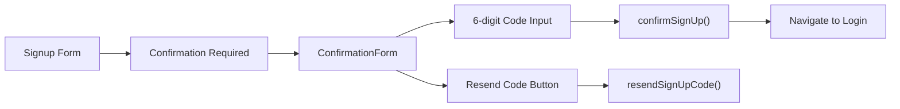
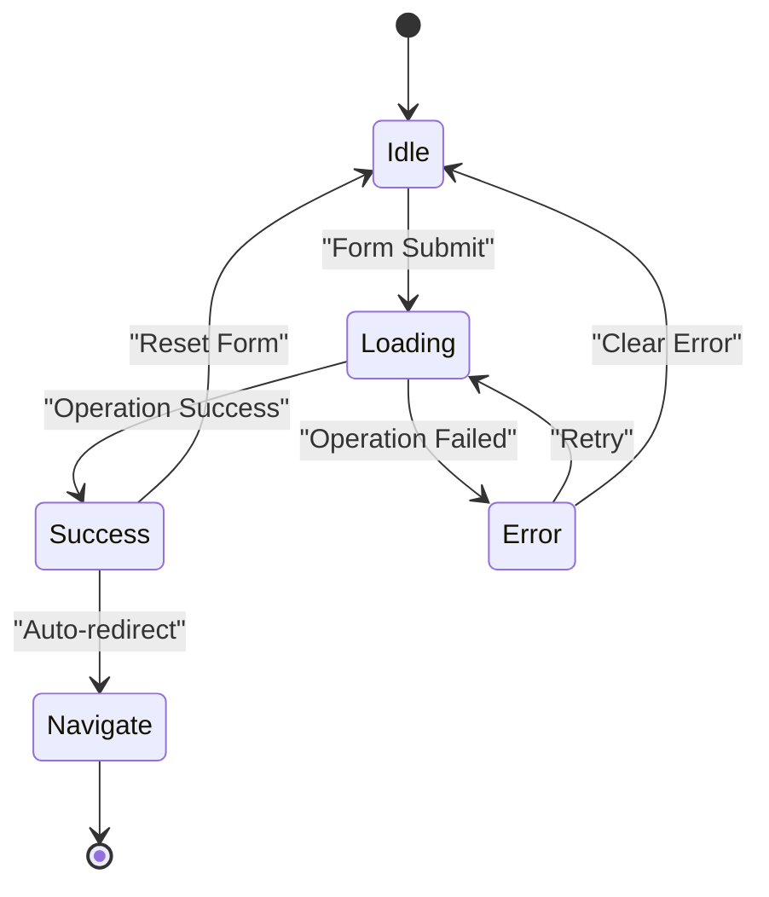

# Authentication UI

Relevant source files

The following files were used as context for generating this wiki page:

- [src/pages/auth/ConfirmationForm.tsx](src/pages/auth/ConfirmationForm.tsx)
- [src/pages/auth/loginCognito.tsx](src/pages/auth/loginCognito.tsx)
- [src/pages/auth/signup.tsx](src/pages/auth/signup.tsx)

## Purpose and Scope

This document covers the user interface components responsible for authentication workflows in the react-nba-qlx application. It focuses on the presentation layer and user interaction patterns for login, signup, and confirmation processes. For the underlying authentication system architecture and context management, see [Authentication System](#3.3). For overall application state management patterns, see [State Management](#3.2).

The authentication UI system supports two distinct authentication methods:
- AWS Cognito user account authentication with email confirmation
- Direct API key authentication for basketball simulation services

## Authentication UI Component Architecture

The authentication UI is organized into specialized components that handle different aspects of the user authentication flow:

**Sources:** [src/pages/auth/loginCognito.tsx:1-314](), [src/LoginAPI.tsx:1-172](), [src/pages/auth/signup.tsx:1-321](), [src/pages/auth/ConfirmationForm.tsx:1-76]()

## User Authentication Flows

The authentication UI supports multiple user flows depending on the authentication method and user state:

**Sources:** [src/pages/auth/loginCognito.tsx:44-97](), [src/pages/auth/signup.tsx:91-141](), [src/pages/auth/signup.tsx:143-174](), [src/LoginAPI.tsx:42-52]()

## Component Implementation Details

### LoginCognito Component

The `LoginCognito` component provides AWS Cognito authentication with a sophisticated two-panel layout:

| Feature | Implementation | Location |
|---------|---------------|----------|
| Form State | `FormState` interface with username/password | [src/pages/auth/loginCognito.tsx:22-25]() |
| Password Visibility | Toggle between text/password input types | [src/pages/auth/loginCognito.tsx:29]() |
| Error Handling | Displays authentication errors and user guidance | [src/pages/auth/loginCognito.tsx:83-96]() |
| Split Layout | Left panel for form, right panel for branding | [src/pages/auth/loginCognito.tsx:119-309]() |
| User Context Integration | Calls `login()` from `useUser()` hook | [src/pages/auth/loginCognito.tsx:69]() |

The component handles multiple authentication scenarios including new password requirements and user not found errors.

### Signup Component

The `Signup` component manages user registration with comprehensive form validation:

| Feature | Implementation | Location |
|---------|---------------|----------|
| Form Interface | `IForm` with user attributes | [src/pages/auth/signup.tsx:21-33]() |
| Email Validation | Custom regex validation | [src/pages/auth/signup.tsx:74-76]() |
| Password Confirmation | Client-side password matching | [src/pages/auth/signup.tsx:97-101]() |
| AWS Integration | Uses `signUp()` from aws-amplify/auth | [src/pages/auth/signup.tsx:106-118]() |
| State Management | Tracks loading, error, success states | [src/pages/auth/signup.tsx:50-53]() |

### ConfirmationForm Component

The `ConfirmationForm` component handles email verification during registration:

**Sources:** [src/pages/auth/ConfirmationForm.tsx:7-16](), [src/pages/auth/ConfirmationForm.tsx:41-58]()

### LoginAPI Component

The `LoginAPI` component provides API key-based authentication for direct service access:

| Feature | Implementation | Location |
|---------|---------------|----------|
| Form State | `FormState` with apiKey/authorization | [src/LoginAPI.tsx:22-25]() |
| Background Image | NBA-themed background styling | [src/LoginAPI.tsx:55-58]() |
| API Context Integration | Uses `useApi()` hook for authentication | [src/LoginAPI.tsx:32]() |
| Credential Masking | Shows/hides authorization field | [src/LoginAPI.tsx:118-137]() |

## Form Validation and Error Handling

The authentication UI implements comprehensive validation and error handling patterns:

### Validation Rules

| Component | Validation Rules | Implementation |
|-----------|-----------------|----------------|
| Signup | Email format validation | [src/pages/auth/signup.tsx:74-76]() |
| Signup | Password minimum length (8 chars) | [src/pages/auth/signup.tsx:86-88]() |
| Signup | Password confirmation matching | [src/pages/auth/signup.tsx:97-101]() |
| LoginCognito | Required field validation | [src/pages/auth/loginCognito.tsx:50-52]() |
| ConfirmationForm | 6-digit code validation | [src/pages/auth/ConfirmationForm.tsx:49]() |

### Error State Management

All authentication components follow a consistent error handling pattern:

**Sources:** [src/pages/auth/loginCognito.tsx:34](), [src/pages/auth/signup.tsx:51](), [src/LoginAPI.tsx:31]()

## Styling and Layout Patterns

### Component Layout Structure

The authentication UI uses consistent layout patterns across components:

| Layout Element | Implementation | Usage |
|----------------|---------------|--------|
| Card Container | `Card`, `CardHeader`, `CardContent`, `CardFooter` | All auth forms |
| Input Groups | `Label` + `Input` with spacing | Form fields |
| Icon Integration | Lucide icons (`Mail`, `Lock`, `Eye`) | Visual enhancement |
| Error/Success Messages | Colored background containers | User feedback |
| Button States | Loading and disabled states | Form submission |

### Responsive Design

- **LoginCognito**: Split-screen layout with responsive breakpoints [src/pages/auth/loginCognito.tsx:119-309]()
- **Signup**: Single column layout with grid-based field organization [src/pages/auth/signup.tsx:233-258]()
- **LoginAPI**: Full-screen background with centered form overlay [src/LoginAPI.tsx:55-67]()

### Visual Themes

- **LoginCognito**: Professional split-panel with animated basketball graphics
- **LoginAPI**: NBA-themed background with semi-transparent form overlay  
- **Signup/Confirmation**: Clean, minimal card-based design

**Sources:** [src/pages/auth/loginCognito.tsx:229-308](), [src/LoginAPI.tsx:4](), [src/pages/auth/signup.tsx:213-316](), [src/pages/auth/ConfirmationForm.tsx:20-72]()