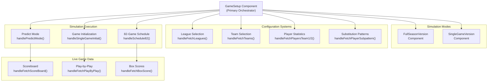
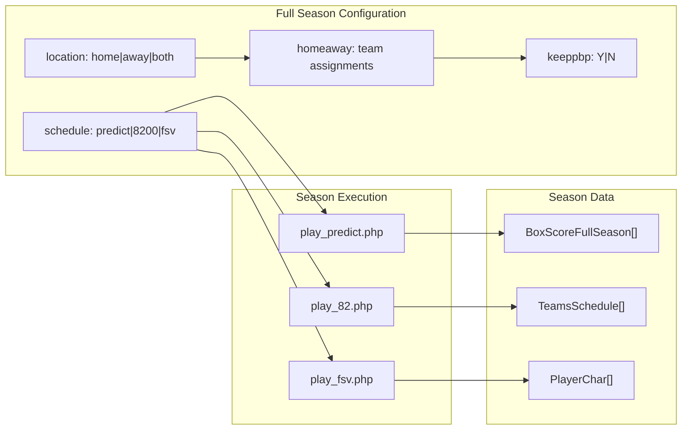
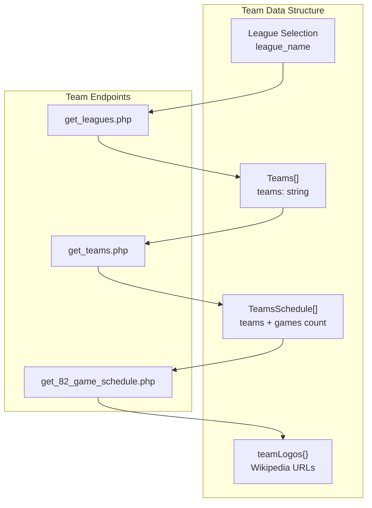
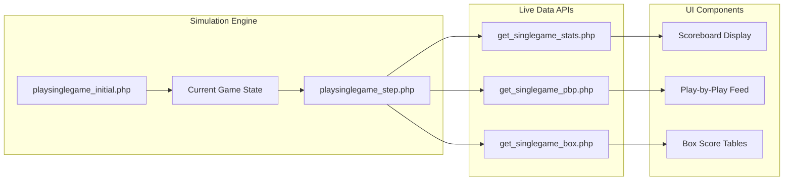

# Game Features

<details>
<summary>Relevant source files</summary>

The following files were used as context for generating this wiki page:

- [src/components/ui/table.tsx](src/components/ui/table.tsx)
- [src/gamesetup_result_image.png](src/gamesetup_result_image.png)
- [src/lib/utils.ts](src/lib/utils.ts)
- [src/pages/FullSeasonVersion.tsx](src/pages/FullSeasonVersion.tsx)
- [src/pages/GameSetup.tsx](src/pages/GameSetup.tsx)
- [src/pages/Instructions.tsx](src/pages/Instructions.tsx)
- [src/pages/SingleGameVersion.tsx](src/pages/SingleGameVersion.tsx)
- [src/player_subs_pattern.png](src/player_subs_pattern.png)

</details>


This document covers the basketball simulation functionality and game mechanics implemented in the NBA simulation application. It focuses on the core gameplay features, simulation modes, and the underlying systems that enable realistic basketball game simulation.

For information about the user interface components that display these features, see [Game Simulation Interfaces](#4.3). For details about the external API integration that powers the simulations, see [API Integration](#6).

## Simulation Architecture Overview

The game features are built around a dual-mode simulation system that supports both single games and full season simulations. The architecture centers on the `GameSetup` component as the primary orchestrator.

**Core Simulation Flow**


Sources: [src/pages/GameSetup.tsx:1-947](), [src/pages/FullSeasonVersion.tsx:1-1023](), [src/pages/SingleGameVersion.tsx:1-273]()

## Simulation Modes

The application supports two primary simulation modes, each designed for different user scenarios and gameplay experiences.

### Full Season Simulation

The full season mode (`FullSeasonVersion`) provides comprehensive season-long basketball simulation with multiple configuration options:

**Game Mode Options**:
- `predict`: Prediction-based simulation for limited games
- `8200`: Full 82-game NBA season simulation  
- `fsv`: Full season version with enhanced features

**Configuration Parameters**:
- `schedule`: Determines the type of season simulation
- `location`: Controls home/away game distribution (`home`, `away`, `both`)
- `homeaway`: Specific home/away team assignments
- `keeppbp`: Whether to maintain play-by-play data (`Y`/`N`)



Sources: [src/pages/FullSeasonVersion.tsx:147-151](), [src/pages/GameSetup.tsx:467-494]()

### Single Game Simulation

The single game mode focuses on detailed, real-time simulation of individual basketball games with comprehensive play-by-play tracking and live statistics.

**Key Features**:
- Real-time scoreboard updates via `ScoreBoard` interface
- Live play-by-play commentary through `PlayByPlay[]` data
- Detailed box score tracking with `BoxScore[]` arrays
- Interactive game controls and pause options

Sources: [src/pages/SingleGameVersion.tsx:12-273](), [src/pages/GameSetup.tsx:410-426]()

## Player and Team Data Integration

The simulation system integrates real NBA player statistics and team data to ensure realistic game outcomes.

### Player Statistics System

Player data is managed through the `PlayerChar` interface, which contains comprehensive statistical profiles:

**Core Player Attributes**:
```typescript
interface PlayerChar {
  name: string;
  position: string; 
  poss_fact: string;        // Possession factor
  two_pt_fg_pct: string;    // 2-point field goal percentage
  ft_pct: string;           // Free throw percentage
  three_pt_pct_shot: string; // 3-point shot percentage
  pct_fouled: string;       // Fouling percentage
  pct_to: string;           // Turnover percentage
  off_reb: string;          // Offensive rebounds
  def_reb: string;          // Defensive rebounds
  // ... additional statistical fields
}
```

**Player Data Endpoints**:
- `get_actual_player_stats.php`: Retrieves real player statistics
- `get_players_chars.php`: Fetches editable player characteristics
- `get_players_subs.php`: Manages substitution patterns

Sources: [src/pages/GameSetup.tsx:46-84](), [src/pages/GameSetup.tsx:516-538]()

### Team Selection and Management

Teams are organized by league with comprehensive logo and scheduling support:



Sources: [src/pages/GameSetup.tsx:235-266](), [src/pages/GameSetup.tsx:371-408](), [src/pages/GameSetup.tsx:428-447]()

## Advanced Simulation Features

### Substitution Pattern Management

The application includes a sophisticated substitution management system that allows users to define player rotations across 4-minute intervals throughout a 48-minute game.

**Substitution Pattern Structure**:
```typescript
interface PlayerSubPattern {
  pos1: string;  // Center (C)
  pos2: string;  // Power Forward (PF)  
  pos3: string;  // Small Forward (SF)
  pos4: string;  // Shooting Guard (SG)
  pos5: string;  // Point Guard (PG)
}
```

The system manages 12 intervals (4-minute segments) across 4 quarters, allowing detailed control over player rotation strategies.

**Substitution Features**:
- Drag-and-drop player assignment interface
- Duplicate player validation within intervals
- Quarter-by-quarter rotation visualization
- Export functionality for substitution patterns

Sources: [src/pages/FullSeasonVersion.tsx:215-242](), [src/pages/FullSeasonVersion.tsx:682-732]()

### Live Game Simulation Engine

The simulation engine provides real-time game progression with multiple data streams:

**Live Data Streams**:
1. **Scoreboard Updates**: Real-time scores, quarters, fouls, possessions
2. **Play-by-Play**: Detailed action commentary with color coding
3. **Box Score Tracking**: Cumulative player and team statistics
4. **Player Performance**: Individual player metrics during simulation



Sources: [src/pages/GameSetup.tsx:449-465](), [src/pages/GameSetup.tsx:565-587](), [src/pages/GameSetup.tsx:589-633]()

### Alternative Team Configurations

For advanced simulations, the system supports alternative team configurations through the `GetAlts` system:

```typescript
interface GetAlts {
  alt_sub: string;  // Alternative substitution pattern identifier
}
```

This feature enables users to experiment with different team compositions and strategic approaches within the same league framework.

Sources: [src/pages/GameSetup.tsx:734-760](), [src/pages/FullSeasonVersion.tsx:401-419]()

## Statistical Output and Reporting

The simulation system generates comprehensive statistical reports across multiple formats:

### Box Score Generation

Two distinct box score systems serve different simulation modes:

- **Single Game Box Scores** (`BoxScore[]`): Line-by-line game statistics
- **Full Season Box Scores** (`BoxScoreFullSeason[]`): Aggregated season data with game numbering

### Data Export Capabilities

The system includes built-in export functionality through the `exportToCSV` utility:

```typescript
exportToCSV<T extends Record<string, any>>(
  data: T[],
  filename: string
)
```

**Export Options**:
- Player statistics to CSV format
- Substitution patterns for analysis
- Box score data for external processing
- Team performance metrics

Sources: [src/lib/utils.ts:8-42](), [src/pages/FullSeasonVersion.tsx:441-442]()

## Game Configuration API Integration

All simulation features integrate with external basketball simulation APIs through a centralized request system:

**Core API Endpoints**:
- `conversionjs`: Primary simulation gateway
- Basketball simulation endpoints for game execution
- Player and team data retrieval services
- Statistical reporting and box score generation

The system uses a dual-token authentication approach, combining AWS authentication tokens with specialized NBA API tokens for secure access to simulation services.

Sources: [src/pages/GameSetup.tsx:369-389](), [src/pages/GameSetup.tsx:467-494]()