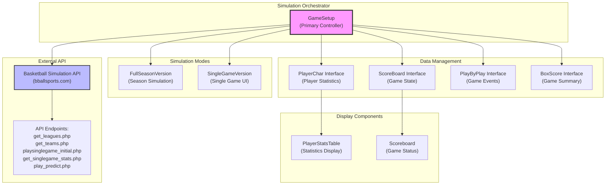
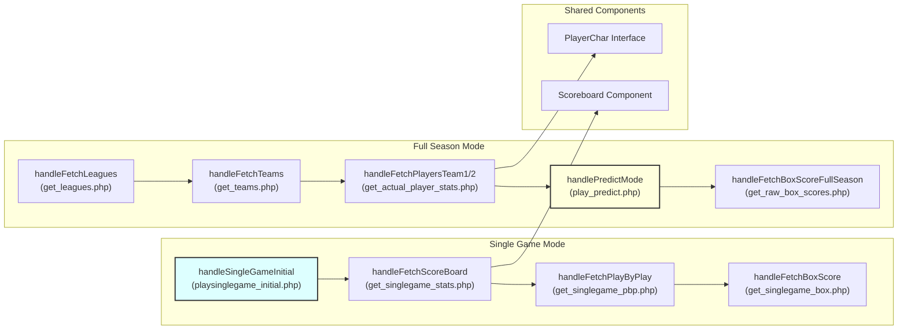
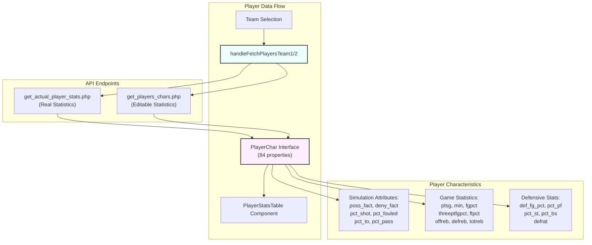
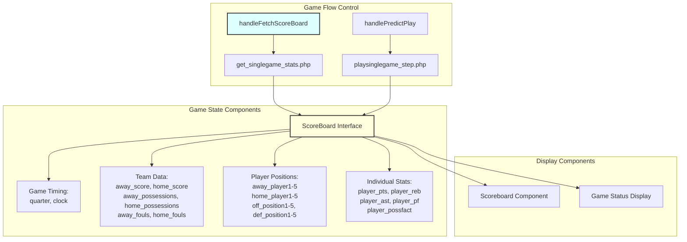
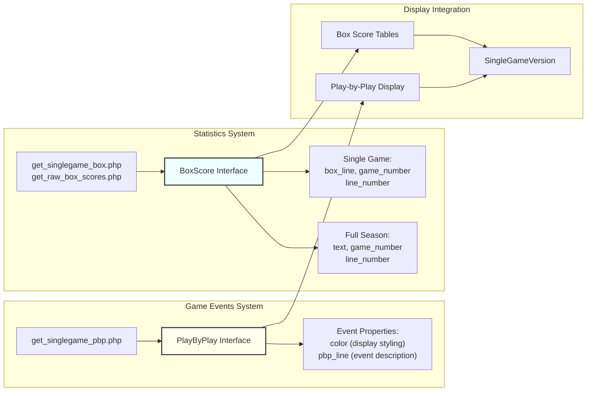
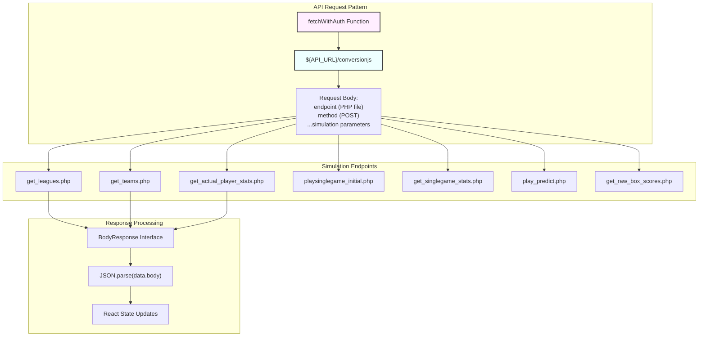

# Basketball Simulation

Relevant source files

The following files were used as context for generating this wiki page:

- [src/components/PlayerStatsTable.tsx](src/components/PlayerStatsTable.tsx)
- [src/components/Scoreboard.tsx](src/components/Scoreboard.tsx)
- [src/gamesetup_result_image.png](src/gamesetup_result_image.png)
- [src/pages/GameSetup.tsx](src/pages/GameSetup.tsx)
- [src/pages/Instructions.tsx](src/pages/Instructions.tsx)
- [src/pages/SingleGameVersion.tsx](src/pages/SingleGameVersion.tsx)

This document covers the core basketball simulation functionality that powers the NBA game simulation features. The basketball simulation system handles game mechanics, player statistics, real-time game state management, and integration with external basketball APIs. For information about the user interface components that display simulation results, see [Game Simulation Interfaces](#4.3). For details about season-long management features, see [Season Management](#5.2).

## System Architecture

The basketball simulation system is built around a central orchestrator pattern where the `GameSetup` component coordinates all simulation activities through external API calls and state management.

The simulation system operates through a series of coordinated API calls that manage game state, player data, and simulation execution. The `GameSetup` component serves as the central coordinator, managing data flow between the external basketball simulation API and the application's user interface components.

Sources: [src/pages/GameSetup.tsx:1-947](), [src/components/PlayerStatsTable.tsx:1-57](), [src/components/Scoreboard.tsx:1-101](), [src/pages/SingleGameVersion.tsx:1-273]()

## Game Simulation Modes

The basketball simulation supports two primary modes of operation, each with distinct data flows and API interaction patterns.

### Full Season Simulation

Full season simulation operates through the `handlePredictMode` function which supports multiple simulation types controlled by the `schedule` state variable. The simulation can run in three modes: `"predict"` for predictive analysis, `"8200"` for full season play, and `"fsv"` for full season version.

Sources: [src/pages/GameSetup.tsx:467-494](), [src/pages/GameSetup.tsx:287-288]()

### Single Game Simulation

Single game simulation begins with `handleSingleGameInitial` which sets up the initial game state, followed by real-time updates through `handleFetchScoreBoard` to retrieve current game status. The system tracks detailed play-by-play events and maintains comprehensive box score statistics.

Sources: [src/pages/GameSetup.tsx:410-426](), [src/pages/GameSetup.tsx:449-465]()

## Player Data Management

The basketball simulation manages comprehensive player statistics through the `PlayerChar` interface, which contains both current season statistics and simulation-specific attributes.

| Category | Properties | Purpose |
|----------|------------|---------|
| Basic Info | `name`, `position`, `height`, `year`, `team_code` | Player identification |
| Simulation Stats | `poss_fact`, `two_pt_fg_pct`, `ft_pct`, `pct_shot` | Simulation mechanics |
| Game Stats | `ptsg`, `min`, `fgpct`, `threeptfgpct`, `totreb` | Performance metrics |
| Advanced Stats | `def_fg_pct`, `pct_pf`, `pct_st`, `pct_bs` | Defensive abilities |

The `PlayerChar` interface serves dual purposes, containing both actual player statistics from real NBA data and editable simulation parameters. The system maintains separate endpoints for retrieving actual statistics versus simulation-specific characteristics.

Sources: [src/pages/GameSetup.tsx:46-84](), [src/pages/GameSetup.tsx:516-538](), [src/pages/GameSetup.tsx:540-563]()

## Real-Time Game State Management

The simulation system maintains real-time game state through the `ScoreBoard` interface, which tracks comprehensive game information including scores, game clock, player positions, and individual player statistics.

The `ScoreBoard` interface contains 184 individual properties tracking every aspect of the game state, from basic scores to detailed player positioning and individual performance metrics. The system updates this state through periodic API calls during game simulation.

Sources: [src/pages/GameSetup.tsx:94-184](), [src/pages/GameSetup.tsx:449-465](), [src/components/Scoreboard.tsx:3-14]()

## Play-by-Play and Box Score Systems

The simulation generates detailed game narratives through the play-by-play system and comprehensive statistical summaries through box scores.

The play-by-play system generates color-coded event descriptions that provide narrative context for game actions. The box score system maintains separate interfaces for single games versus full season statistics, with different data structures optimized for each use case.

Sources: [src/pages/GameSetup.tsx:190-197](), [src/pages/GameSetup.tsx:199-213](), [src/pages/GameSetup.tsx:565-587](), [src/pages/GameSetup.tsx:589-633]()

## API Integration Architecture

The basketball simulation integrates with external APIs through a standardized request pattern that supports multiple simulation endpoints and authentication methods.

All simulation API calls follow a consistent pattern where requests are sent to `/conversionjs` with a body containing the target PHP endpoint and simulation parameters. Responses are wrapped in a `BodyResponse` interface that requires JSON parsing to extract the actual data.

Sources: [src/pages/GameSetup.tsx:369-389](), [src/pages/GameSetup.tsx:17-19](), [src/pages/GameSetup.tsx:414-426](), [src/pages/GameSetup.tsx:467-494]()