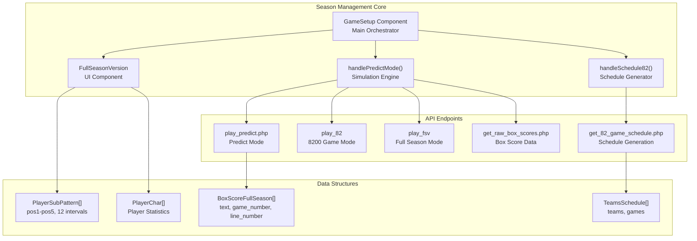
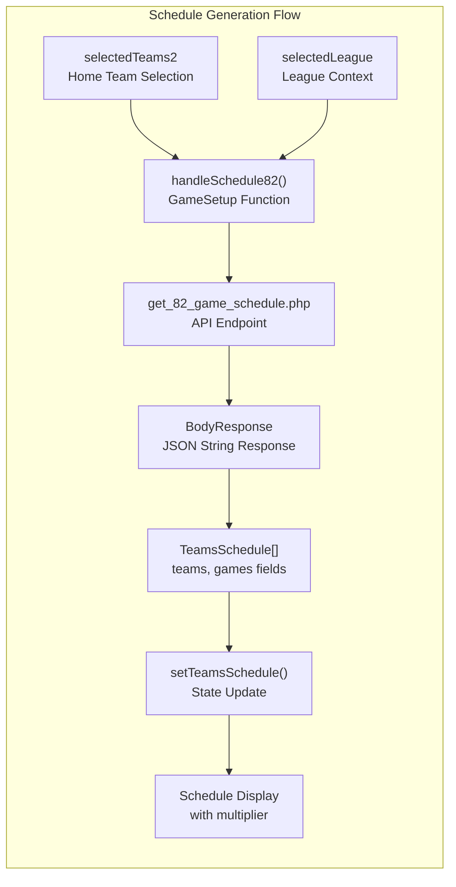
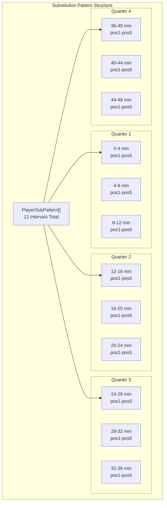
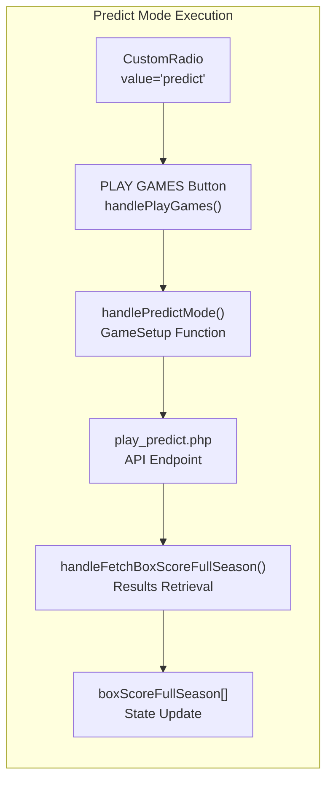
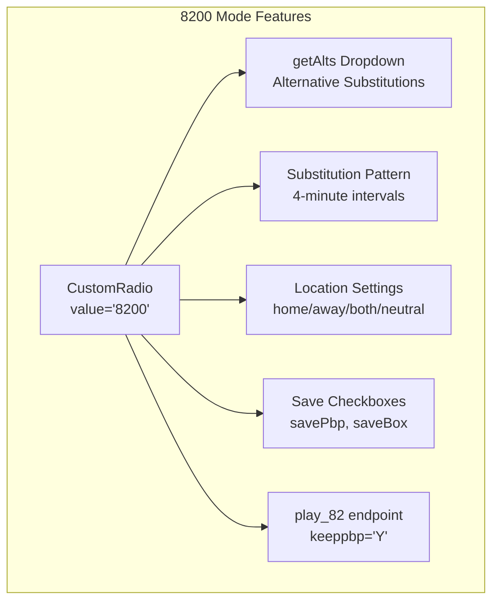
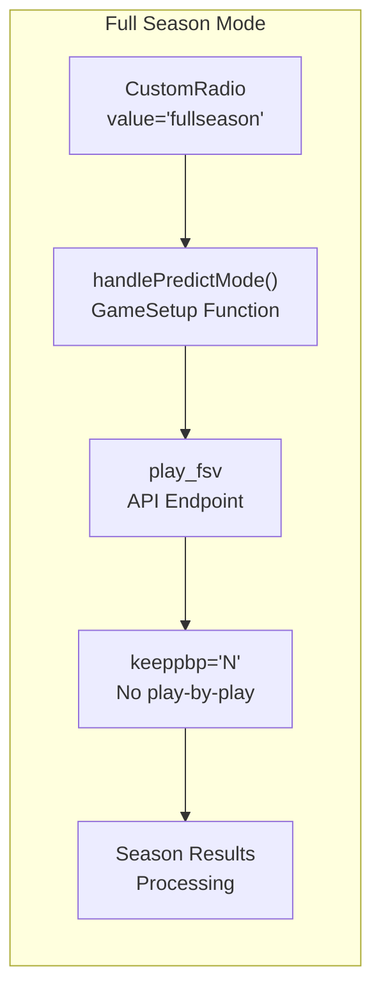
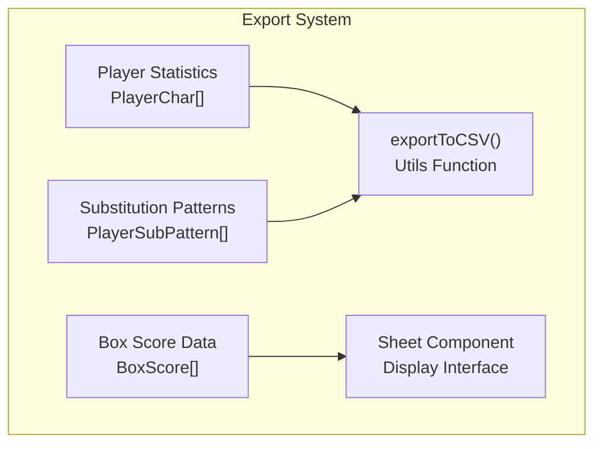
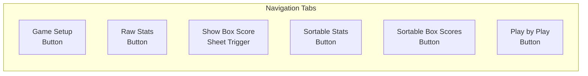
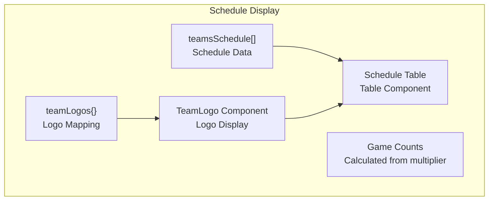
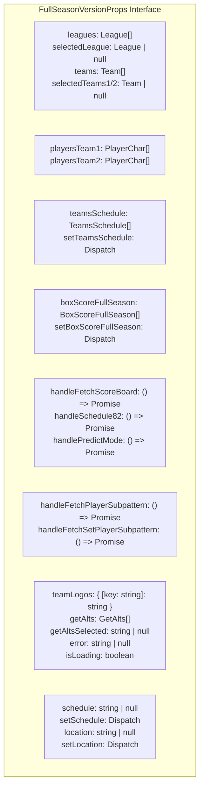

# Season Management

<details>
<summary>Relevant source files</summary>

The following files were used as context for generating this wiki page:

- [src/components/ui/table.tsx](src/components/ui/table.tsx)
- [src/lib/utils.ts](src/lib/utils.ts)
- [src/pages/FullSeasonVersion.tsx](src/pages/FullSeasonVersion.tsx)
- [src/pages/GameSetup.tsx](src/pages/GameSetup.tsx)
- [src/player_subs_pattern.png](src/player_subs_pattern.png)

</details>


This document covers the full season simulation capabilities of the NBA simulation application, including batch game processing, schedule management, player substitution patterns, and comprehensive statistics analysis. For individual game simulation features, see [Basketball Simulation](#5.1). For the initial game configuration interface, see [Game Setup Interface](#4.2).

## Overview

The Season Management system enables users to simulate complete basketball seasons with varying scales of games (82, 820, or 8200 games), manage player substitution patterns, and analyze comprehensive statistics across multiple games. The system is implemented primarily through the `FullSeasonVersion` component and provides both automated batch processing and detailed configuration options.

## Core Architecture

The season management functionality is centered around the `FullSeasonVersion` component, which orchestrates full season simulations through the parent `GameSetup` component:



Sources: [src/pages/GameSetup.tsx:427-447](), [src/pages/GameSetup.tsx:467-494](), [src/pages/FullSeasonVersion.tsx:1-792](), [src/pages/GameSetup.tsx:635-680]()

## Schedule Generation System

The schedule generation system creates game schedules through the `handleSchedule82` function, which calls the `get_82_game_schedule.php` API endpoint. The system uses a multiplier-based approach for displaying different game counts:

| Multiplier | Display Count | API Response | Purpose |
|------------|---------------|--------------|---------|
| 100 | 82 games | Actual schedule | Standard NBA season |
| 10 | 820 games | Actual × 10 | Extended simulation display |
| 1 | 8200 games | Actual × 100 | Statistical analysis display |



Sources: [src/pages/GameSetup.tsx:428-447](), [src/pages/FullSeasonVersion.tsx:753-784](), [src/pages/GameSetup.tsx:37-44]()

## Substitution Pattern Management

The substitution pattern system provides granular control over player rotations during games, organized in 4-minute intervals across four quarters:

### Pattern Structure



Sources: [src/pages/FullSeasonVersion.tsx:96-102](), [src/pages/FullSeasonVersion.tsx:227-229]()

### Drag-and-Drop Interface

The substitution pattern interface supports drag-and-drop functionality for assigning players to positions:

```mermaid
sequenceDiagram
    participant User
    participant PlayerList["Available Players<br/>playersTeam2[]"]
    participant DropZone["Position Cell<br/>TableCell"]
    participant ValidationLogic["handleDrop()<br/>Duplicate Check"]
    participant StateUpdate["playerSubPattern<br/>State Update"]
    
    User->>PlayerList: "Drag Player"
    PlayerList->>DropZone: "onDragStart<br/>setData(player_name)"
    User->>DropZone: "Drop on Position"
    DropZone->>ValidationLogic: "handleDrop(intervalIndex, posKey)"
    ValidationLogic->>ValidationLogic: "Check Duplicate in Interval"
    alt No Duplicate
        ValidationLogic->>StateUpdate: "Update Pattern"
    else Duplicate Found
        ValidationLogic->>User: "Toast Error Message"
    end
```

Sources: [src/pages/FullSeasonVersion.tsx:194-221](), [src/pages/FullSeasonVersion.tsx:517-532]()

## Simulation Modes

The system supports three distinct simulation modes controlled by the `schedule` state variable and executed through the `handlePredictMode` function:

### Predict Games Mode (`schedule === "predict"`)

Executes prediction simulations using the `play_predict.php` endpoint:



### 8200 Game Schedule Mode (`schedule === "8200"`)

Full season simulation with advanced configuration options:



**Key Parameters for 8200 Mode:**
- `endpoint`: `"play_82"`
- `keeppbp`: `"Y"` (save play-by-play)
- `gamearray`: Contains prediction configuration
- `gamemode`: `"8200"`

### Full Season Replay Mode (`schedule === "fullseason"`)

Executes through the `play_fsv` endpoint for complete league season replay:



Sources: [src/pages/GameSetup.tsx:467-494](), [src/pages/FullSeasonVersion.tsx:717-719](), [src/pages/FullSeasonVersion.tsx:291-305](), [src/pages/FullSeasonVersion.tsx:401-419]()

## Data Export and Analysis

The system provides comprehensive data export capabilities:

### Export Features

| Data Type | Export Function | File Format |
|-----------|----------------|-------------|
| Player Statistics | `exportToCSV(playersTeam1, filename)` | CSV |
| Substitution Patterns | `exportToCSV(playerSubPattern, filename)` | CSV |
| Box Scores | Sheet display with copy functionality | Text |



Sources: [src/pages/FullSeasonVersion.tsx:411-411](), [src/pages/FullSeasonVersion.tsx:553-553](), [src/pages/FullSeasonVersion.tsx:617-617](), [src/lib/utils.ts:8-42]()

## User Interface Components

The Season Management interface is organized into several key sections:

### Navigation Tabs

Quick access buttons for different views and functionalities:



Sources: [src/pages/FullSeasonVersion.tsx:281-304]()

### Configuration Panel

Main configuration area with team selection and game mode options:

- **League Selection**: Dropdown with available leagues
- **Team Selection**: Separate dropdowns for away and home teams
- **Alternative Substitutions**: Available when in schedule mode
- **Simulation Mode Radios**: Schedule, Predict, or Replay options
- **Location Options**: Home, Away, Both, or Neutral settings
- **Save Options**: Checkboxes for play-by-play and box score saving

Sources: [src/pages/FullSeasonVersion.tsx:308-720]()

### Schedule Display

Real-time display of generated schedules with team logos and game counts:



Sources: [src/pages/FullSeasonVersion.tsx:753-784](), [src/pages/FullSeasonVersion.tsx:261-263]()

## State Management

The component manages extensive state for season simulation:

### Core State Variables

| State Variable | Type | Values | Purpose |
|----------------|------|--------|---------|
| `schedule` | string | `"predict"`, `"8200"`, `"fullseason"` | Current simulation mode |
| `location` | string | `"home"`, `"away"`, `"both"`, `"neutral"` | Game location setting |
| `savePbp` | boolean | `true`/`false` | Save play-by-play flag |
| `saveBox` | boolean | `true`/`false` | Save box scores flag |
| `isSimulating` | boolean | `true`/`false` | Simulation in progress |
| `multiplier` | number | `1`, `10`, `100` | Schedule display scale factor |
| `playerSubPattern` | PlayerSubPattern[] \| null | Array of 12 intervals | Substitution patterns |
| `isSubPatternSheetOpen` | boolean | `true`/`false` | Sheet visibility control |
| `isFetchingSubPattern` | boolean | `true`/`false` | Loading state for patterns |

Sources: [src/pages/FullSeasonVersion.tsx:194-202](), [src/pages/GameSetup.tsx:287-289]()

### Props Interface

The `FullSeasonVersion` component receives comprehensive props from the parent `GameSetup` component:



Sources: [src/pages/FullSeasonVersion.tsx:115-151](), [src/pages/GameSetup.tsx:896-932]()

## Integration Points

The Season Management system integrates with several external systems:

### API Integration

- **Basketball Simulation API**: Handles game simulation requests
- **Schedule Generation**: Creates game schedules based on selected parameters
- **Player Data Retrieval**: Fetches player statistics and characteristics
- **Substitution Pattern API**: Manages player rotation data

### State Management Integration

- **ApiContext**: Receives API handler functions and state
- **Parent Component**: Inherits configuration from GameSetup component
- **Toast Notifications**: Provides user feedback through toast system

Sources: [src/pages/FullSeasonVersion.tsx:29-29](), [src/pages/FullSeasonVersion.tsx:126-133]()