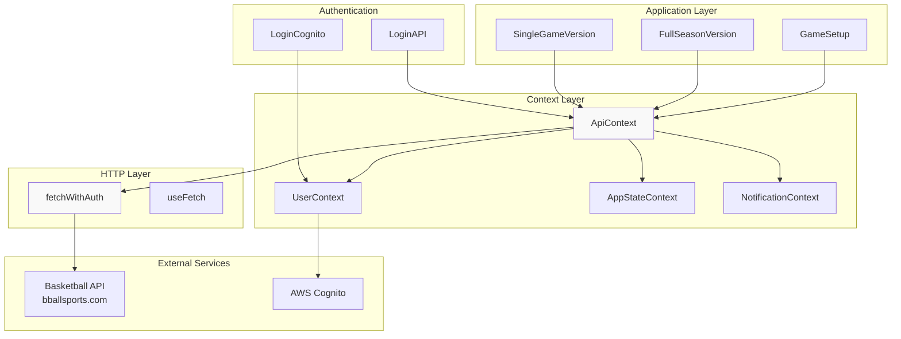
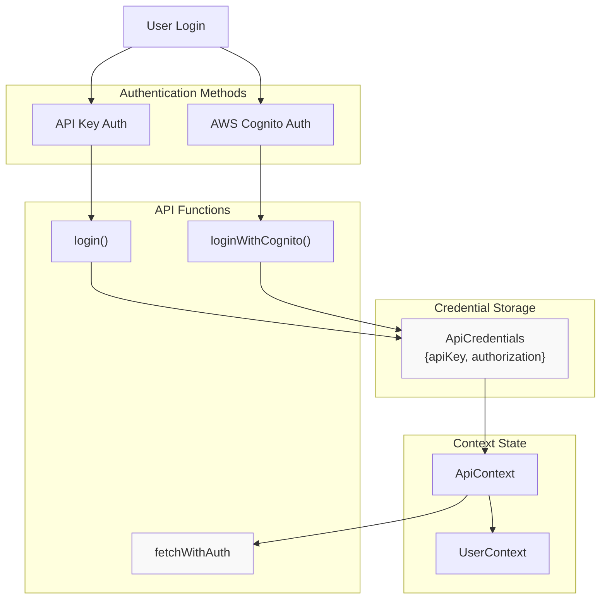
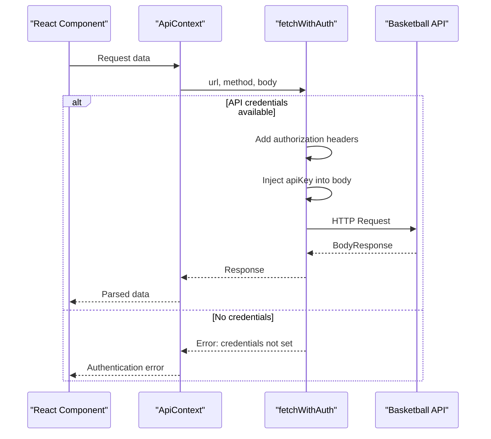

# API Integration

<details>
<summary>Relevant source files</summary>

The following files were used as context for generating this wiki page:

- [src/LoginAPI.tsx](src/LoginAPI.tsx)
- [src/contexts/ApiContext.tsx](src/contexts/ApiContext.tsx)
- [src/contexts/AppStateContext.tsx](src/contexts/AppStateContext.tsx)
- [src/contexts/NotificationContext.tsx](src/contexts/NotificationContext.tsx)
- [src/contexts/UserContext.tsx](src/contexts/UserContext.tsx)
- [src/hooks/useFetch.tsx](src/hooks/useFetch.tsx)
- [src/pages/GameSetup.tsx](src/pages/GameSetup.tsx)

</details>


This document covers the API integration system used by the react-nba-qlx application to communicate with external basketball simulation services. It details the unified API management approach, authentication mechanisms, request/response patterns, and data models used throughout the application.

For information about user authentication flows, see [Authentication System](#3.3). For details about UI components that interact with APIs, see [Game Setup Interface](#4.2).

## API Architecture Overview

The application uses a centralized API integration pattern built around React Context providers that manage authentication, request handling, and state synchronization.

**API Architecture**


Sources: [src/contexts/ApiContext.tsx:1-106](), [src/pages/GameSetup.tsx:1-823](), [src/LoginAPI.tsx:1-172]()

## Authentication System

The application supports dual authentication methods: API key-based authentication for basketball simulation services and AWS Cognito for user management.

**Dual Authentication Flow**


### API Credentials Interface

The `ApiCredentials` interface defines the structure for authentication data:

| Field | Type | Purpose |
|-------|------|---------|
| `apiKey` | string | Basketball API access key |
| `authorization` | string | Authorization token/header value |

Sources: [src/contexts/ApiContext.tsx:5-8](), [src/LoginAPI.tsx:22-25]()

## Request/Response Flow

All API requests flow through the centralized `fetchWithAuth` function, which automatically handles authentication, request formatting, and error handling.

**Request Processing Flow**


### Request Structure

The `fetchWithAuth` function automatically constructs requests with the following pattern:

```typescript
// Headers
{
  'Content-Type': 'application/json',
  'Authorization': api.authorization
}

// Body (for POST/PUT requests)
{
  ...requestBody,
  apikey: api.apiKey
}
```

Sources: [src/contexts/ApiContext.tsx:53-78]()

### Response Structure

Most API responses follow a consistent wrapper pattern:

| Interface | Fields | Usage |
|-----------|--------|-------|
| `BodyResponse` | `body: string` | Generic wrapper for API responses |
| `Message` | `message: string` | Error message responses |
| Specific Types | Various | Typed responses for specific endpoints |

The response `body` field typically contains JSON that must be parsed:

```typescript
const data: BodyResponse = await response.json();
const parsedBody: { data: SomeType[] } = JSON.parse(data.body);
```

Sources: [src/pages/GameSetup.tsx:17-19](), [src/pages/GameSetup.tsx:25-27]()

## API Endpoints and Data Models

The application communicates with basketball simulation endpoints through a proxy service. All requests are routed through the `/conversionjs` endpoint.

### Core Endpoints

| Endpoint | Purpose | Request Data | Response Type |
|----------|---------|--------------|---------------|
| `get_leagues.php` | Fetch available leagues | `{method: "POST", endpoint: "get_leagues.php", content: "form"}` | `League[]` |
| `get_teams.php` | Get teams for league | `{...league, method: "POST", endpoint: "get_teams.php"}` | `Teams[]` |
| `playsinglegame_initial.php` | Initialize game simulation | Game setup parameters | Success/Error |
| `get_singlegame_stats.php` | Get current game state | `{endpoint: "get_singlegame_stats.php", method: "POST"}` | `ScoreBoard` |
| `play_predict.php` | Run prediction simulation | Prediction parameters | Game results |

### Data Models

**League Data**
```typescript
interface League {
  league_name: string;
}
```

**Team Data**
```typescript
interface Teams {
  teams: string;
}

interface TeamsSchedule {
  teams: string;
  games: string;
}
```

**Player Statistics**
```typescript
interface PlayerChar {
  name: string;
  position: string;
  poss_fact: string;
  two_pt_fg_pct: string;
  ft_pct: string;
  // ... extensive stats fields
  team_code: string;
  year: string;
}
```

**Game State**
```typescript
interface ScoreBoard {
  away_score: string;
  home_score: string;
  quarter: string;
  clock: string;
  away_possessions: string;
  home_possessions: string;
  // ... detailed game state
}
```

Sources: [src/pages/GameSetup.tsx:21-188]()

## Environment Configuration

The API integration relies on environment variables for configuration:

| Variable | Purpose | Usage |
|----------|---------|-------|
| `VITE_API_BASE_URL` | Base URL for basketball API | Used in `API_URL` constant |

The base URL is accessed in components as:
```typescript
const API_URL = import.meta.env.VITE_API_BASE_URL;
```

Sources: [src/pages/GameSetup.tsx:360]()

## Error Handling

The API integration implements comprehensive error handling at multiple layers:

### Context-Level Error Handling

The `fetchWithAuth` function throws errors for missing credentials:
```typescript
if (!api) {
  throw new Error('API credentials are not set. Please login first.');
}
```

### Component-Level Error Handling

Components implement try-catch blocks with user-friendly error messages:
```typescript
try {
  const response = await fetchWithAuth(url, method, body);
  if (!response.ok) {
    const err: Message = await response.json();
    setError(`error: ${err.message}`);
    throw new Error('Failed to fetch data.');
  }
} catch (err: any) {
  setError(`${err}`);
}
```

### Error State Management

Components maintain error state for UI feedback:
- `error` state variable stores error messages
- Error display in UI components
- Loading states during API operations

Sources: [src/contexts/ApiContext.tsx:54-56](), [src/pages/GameSetup.tsx:362-380]()

## Custom Fetch Hook

The application also provides a generic `useFetch` hook for simpler HTTP operations:

**useFetch Interface**
```typescript
interface UseFetchReturn<T> {
  data: T | null;
  error: Error | null;
  isLoading: boolean;
  fetchData: (url: string, options?: FetchOptions) => Promise<void>;
}
```

This hook provides:
- Generic typing for response data
- Built-in loading and error states
- Automatic JSON parsing
- Configurable HTTP methods and headers

Sources: [src/hooks/useFetch.tsx:11-16](), [src/hooks/useFetch.tsx:18-61]()