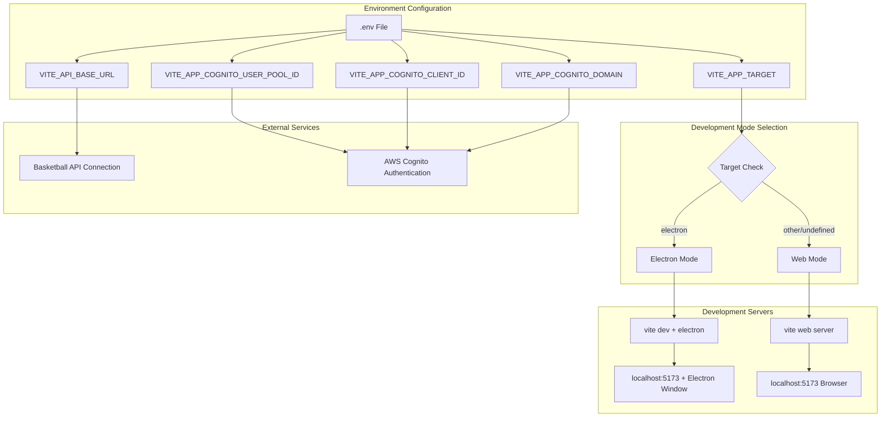
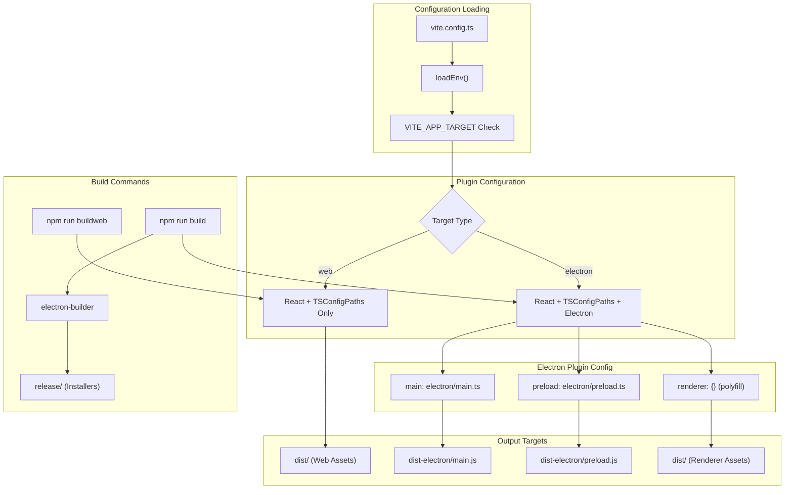
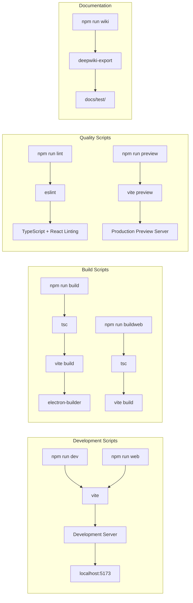
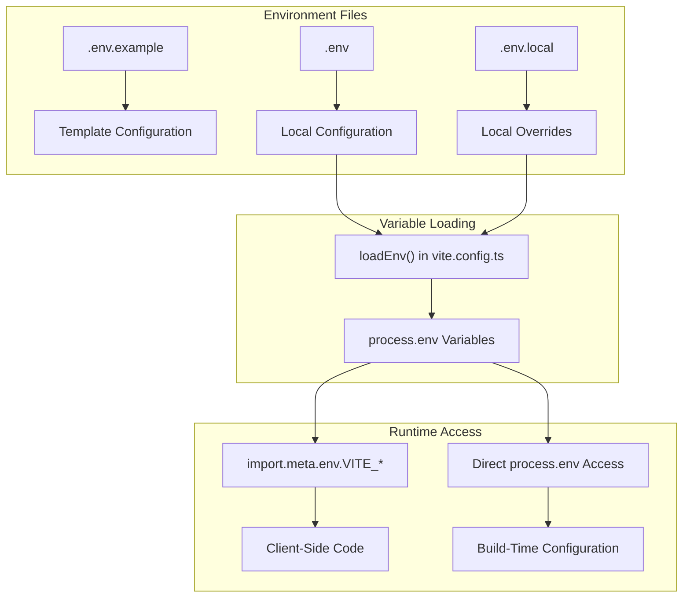
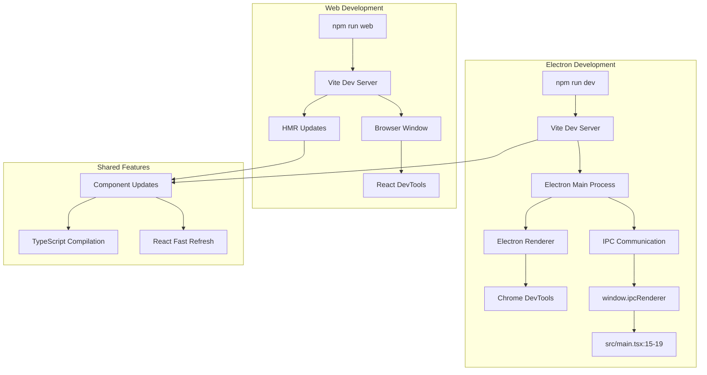

# Development Guide

Relevant source files

The following files were used as context for generating this wiki page:

- [.env.example](.env.example)
- [README.md](README.md)
- [license.txt](license.txt)
- [package.json](package.json)
- [src/main.tsx](src/main.tsx)
- [vite.config.ts](vite.config.ts)

This document covers development workflows, tooling, build configuration, and platform-specific considerations for the NBA simulation application. It provides guidance for setting up development environments, understanding build processes, and working with the dual web/Electron deployment system.

For information about styling and theming systems, see [7.1](#7.1). For Electron-specific development features, see [7.2](#7.2).

## Development Environment Setup

The application supports two primary development modes: web browser development and Electron desktop development. The development environment is configured through the `VITE_APP_TARGET` environment variable and managed by Vite with TypeScript compilation.

### Environment Configuration

The development environment requires specific environment variables defined in `.env` files. The `VITE_APP_TARGET` variable controls which development mode is active, while additional variables configure external service connections.

**Development Environment Flow**
Sources: [.env.example:1-5](), [vite.config.ts:8-11](), [README.md:88-94]()

### Development Dependencies

The application uses a comprehensive set of development tools and libraries configured through `package.json`. TypeScript provides type safety, ESLint ensures code quality, and Vite handles module bundling and hot module replacement.

| Category | Tools | Purpose |
|----------|-------|---------|
| **Build System** | `vite`, `typescript`, `@vitejs/plugin-react` | Module bundling, TypeScript compilation, React support |
| **Code Quality** | `eslint`, `@typescript-eslint/*` | Linting, code standards enforcement |
| **Electron Integration** | `electron`, `electron-builder`, `vite-plugin-electron` | Desktop application development |
| **UI Libraries** | `@radix-ui/*`, `tailwindcss`, `primereact` | Component libraries and styling |
| **Authentication** | `aws-amplify`, `@aws-amplify/*` | AWS integration and authentication |

Sources: [package.json:81-156]()

## Build Configuration and Workflows

The build system uses Vite as the primary bundler with conditional Electron plugin activation. The `vite.config.ts` file dynamically configures the build pipeline based on the `VITE_APP_TARGET` environment variable.

### Build System Architecture

**Build System Configuration**
Sources: [vite.config.ts:8-37](), [package.json:158-173]()

### Development vs Production Builds

The application distinguishes between development and production builds through different npm scripts. Development builds include hot module replacement and debugging features, while production builds optimize for distribution.

| Command | Mode | Output | Features |
|---------|------|--------|----------|
| `npm run web` | Development Web | Dev server | HMR, debugging, source maps |
| `npm run dev` | Development Electron | Dev server + Electron | HMR, debugging, native window |
| `npm run buildweb` | Production Web | `dist/` | Optimized, minified web assets |
| `npm run build` | Production Electron | `dist-electron/` + `release/` | Native installers, auto-updater |

Sources: [package.json:13-20](), [README.md:38-86]()

## Development Commands and Scripts

The `package.json` defines a comprehensive set of npm scripts for development, building, and maintenance tasks. Each script serves a specific purpose in the development workflow.

### Core Development Scripts

**Development Script Workflow**
Sources: [package.json:13-21]()

### Script Execution Flow

The build scripts follow a specific execution order to ensure proper compilation and packaging. TypeScript compilation occurs first, followed by Vite bundling, and finally Electron packaging for desktop builds.

1. **TypeScript Compilation**: `tsc` validates types and generates JavaScript
2. **Vite Build**: Bundles assets and applies optimizations
3. **Electron Builder**: Creates platform-specific installers (desktop only)

Sources: [package.json:16-17]()

## Environment Management

Environment variables control application behavior across different deployment targets and development modes. The system uses Vite's environment variable handling with the `VITE_` prefix for client-side availability.

### Environment Variable Categories

| Variable | Purpose | Values | Impact |
|----------|---------|--------|--------|
| `VITE_APP_TARGET` | Build target selection | `electron` or undefined | Determines development mode and build output |
| `VITE_API_BASE_URL` | Basketball API endpoint | URL string | External API connection configuration |
| `VITE_APP_COGNITO_*` | AWS Cognito configuration | AWS service identifiers | Authentication service setup |

Sources: [.env.example:1-5](), [vite.config.ts:10]()

### Environment File Structure

The application expects environment variables to be defined in `.env` files in the project root. The `.env.example` file provides a template for required variables.

**Environment Variable Flow**
Sources: [.env.example:1-5](), [vite.config.ts:9]()

## Platform-Specific Development

The application supports development for both web browsers and Electron desktop environments. Platform-specific considerations affect development workflows, debugging approaches, and feature availability.

### Development Mode Comparison

| Aspect | Web Mode | Electron Mode |
|--------|----------|---------------|
| **Entry Point** | [src/main.tsx:8-12]() | [src/main.tsx:8-12]() + [electron/main.ts]() |
| **API Access** | Browser fetch with CORS | Node.js capabilities + Electron APIs |
| **Debugging** | Browser DevTools | Chrome DevTools + Electron DevTools |
| **File System** | Limited (Web APIs) | Full Node.js file system access |
| **Native Features** | Web APIs only | Native desktop integration |

Sources: [src/main.tsx:15-19](), [vite.config.ts:16-33]()

### Development Server Integration

The development environment provides hot module replacement and live reloading for both web and Electron modes. The Electron development setup includes IPC communication for main-renderer process interaction.

**Development Server Architecture**
Sources: [src/main.tsx:15-19](), [package.json:14-15](), [vite.config.ts:16-33]()