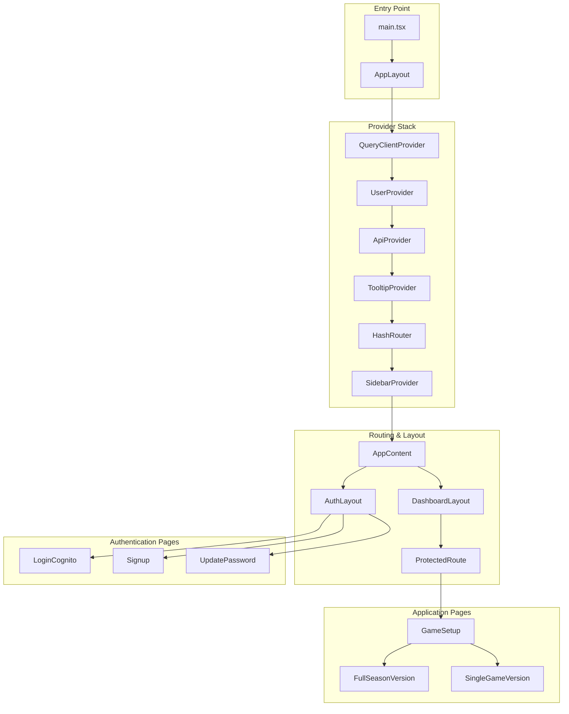
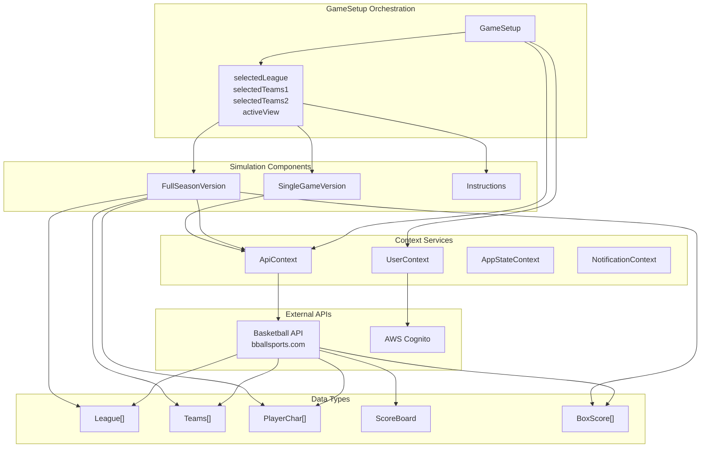
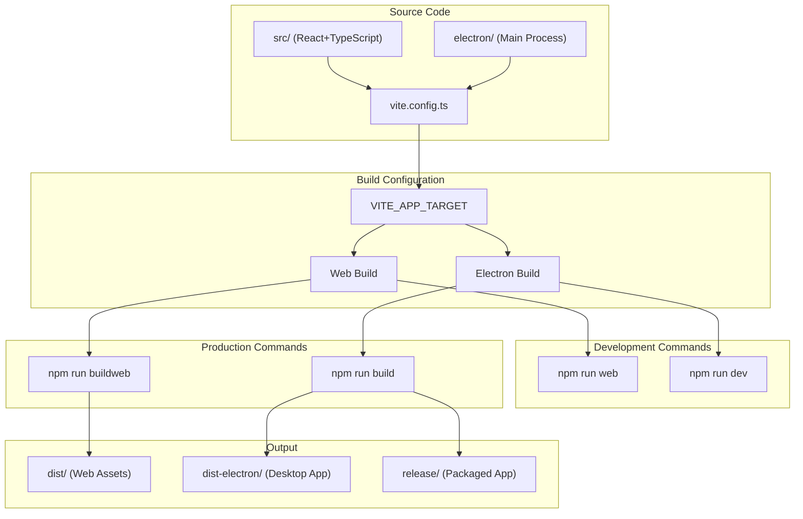
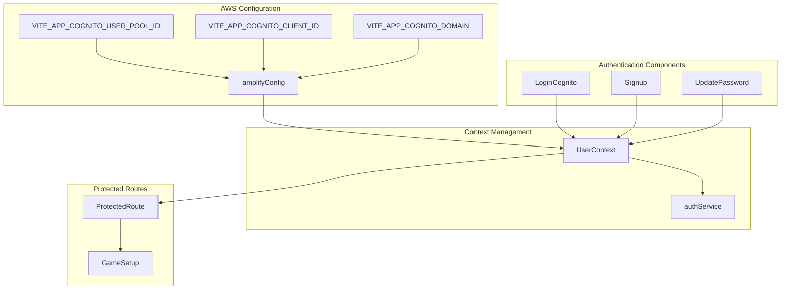

# Overview

Relevant source files

The following files were used as context for generating this wiki page:

- [package.json](/package.json)
- [src/components/ui/table.tsx](/src/components/ui/table.tsx)
- [src/layout.tsx](/src/layout.tsx)
- [src/lib/utils.ts](/src/lib/utils.ts)
- [src/pages/FullSeasonVersion.tsx](/src/pages/FullSeasonVersion.tsx)
- [src/pages/GameSetup.tsx](/src/pages/GameSetup.tsx)
- [src/player_subs_pattern.png](/src/player_subs_pattern.png)

## Purpose and Scope

This document provides a comprehensive overview of the NBA Basketball Simulation application, a React+TypeScript web and desktop application that enables users to simulate basketball games and seasons using real NBA data. The application supports both single-game simulations and full 82-game season simulations, with authentication through AWS Cognito and data integration via external basketball APIs.

The application is designed with dual deployment capabilities, supporting both web browser deployment via Vite and desktop application deployment via Electron. This overview covers the core architecture, component relationships, and system integrations that enable the basketball simulation functionality.

For detailed information about specific subsystems, see [Getting Started](#2) for setup instructions, [Architecture](#3) for technical details, [User Interface](#4) for component documentation, and [Game Features](#5) for simulation mechanics.

## Application Architecture

The application follows a layered architecture pattern with React context providers managing state and external service integrations. The core structure centers around the `GameSetup` component as the primary orchestrator, coordinating between authentication services, external APIs, and specialized simulation components.

### Core Application Flow

**Application Entry and Provider Hierarchy**

Sources: [/src/layout.tsx:87-103](), [/src/main.tsx]()

### Component Relationships

**Core Component Architecture and Data Flow**

Sources: [/src/pages/GameSetup.tsx:268-947](), [/src/pages/FullSeasonVersion.tsx:153-191]()

## Key Components

### GameSetup Component

The `GameSetup` component serves as the primary orchestrator, managing user interactions for league selection, team configuration, and simulation mode switching. It maintains state for leagues, teams, players, and game results while coordinating API calls to external basketball services.

Key state management includes:
- `leagues`: Available basketball leagues from API
- `selectedLeague`: Currently selected league for simulation
- `selectedTeams1/selectedTeams2`: Away and home teams for games
- `activeView`: Current mode (`'full-season'`, `'single-game'`, `'instructions'`)
- `playersTeam1/playersTeam2`: Player statistics for both teams
- `scoreBoard`: Live game scoreboard data
- `boxScore` and `boxScoreFullSeason`: Game statistics and results

Sources: [/src/pages/GameSetup.tsx:268-279](), [/src/pages/GameSetup.tsx:287-367]()

### Simulation Components

The application includes two specialized simulation components:

**FullSeasonVersion**: Manages complete 82-game season simulations with features including:
- Season schedule generation via `handleSchedule82()`
- Player substitution pattern management
- Season-long statistics tracking
- Multiple simulation modes (`predict`, `8200`, `fsv`)

**SingleGameVersion**: Handles individual game simulations with real-time scoreboard updates and play-by-play tracking.

Sources: [/src/pages/FullSeasonVersion.tsx:153-191](), [/src/pages/GameSetup.tsx:4-5]()

## Build System and Deployment

### Dual Deployment Architecture

**Build System Configuration and Deployment Targets**

The application uses environment variable `VITE_APP_TARGET` to determine build configuration, enabling single-codebase deployment to both web browsers and Electron desktop applications.

Sources: [/package.json:13-20](), [/package.json:158-173]()

## External Integrations

### Authentication System

The application integrates with AWS Amplify and Cognito for user management:

**AWS Cognito Integration Architecture**

Sources: [/src/layout.tsx:27-49](), [/src/layout.tsx:73-77]()

### Basketball API Integration

The application communicates with external basketball APIs through the `ApiContext` using a dual-token authentication system:

- AWS ID tokens for API authentication headers
- Specialized NBA tokens for request body authentication
- API endpoints include league data, team rosters, player statistics, and game simulation services

Key API interactions include:
- `handleFetchLeagues()`: Retrieve available basketball leagues
- `handleFetchTeams()`: Get teams for selected league
- `handleFetchPlayersTeam1/2()`: Load player statistics
- `handlePredictMode()`: Execute season simulations
- `handleSingleGameInitial()`: Initialize single game simulations

Sources: [/src/pages/GameSetup.tsx:371-447](), [/src/pages/GameSetup.tsx:467-494]()

## Technology Stack

The application leverages a comprehensive technology stack:

| Category | Technologies |
|----------|-------------|
| **Frontend Framework** | React 18.3.1, TypeScript 5.8.3 |
| **UI Libraries** | Radix UI components, PrimeReact 10.9.6 |
| **Styling** | Tailwind CSS 3.4.17, CSS animations |
| **State Management** | React Context API, TanStack Query 5.56.2 |
| **Routing** | React Router DOM 6.26.2 |
| **Authentication** | AWS Amplify 6.15.3, AWS Cognito |
| **Desktop Platform** | Electron 30.0.1, Electron Builder 24.13.3 |
| **Build Tools** | Vite 5.1.6, TypeScript compiler |
| **Development** | ESLint, Electron DevTools |

Sources: [/package.json:22-79](), [/package.json:114-156]()