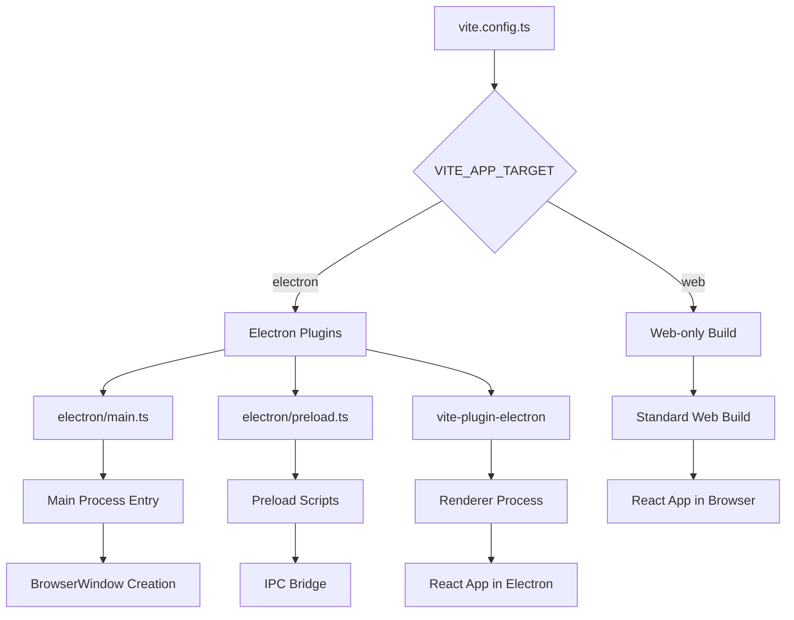
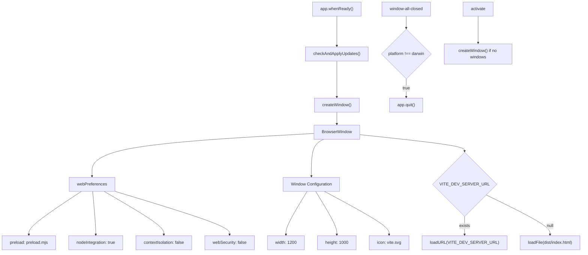
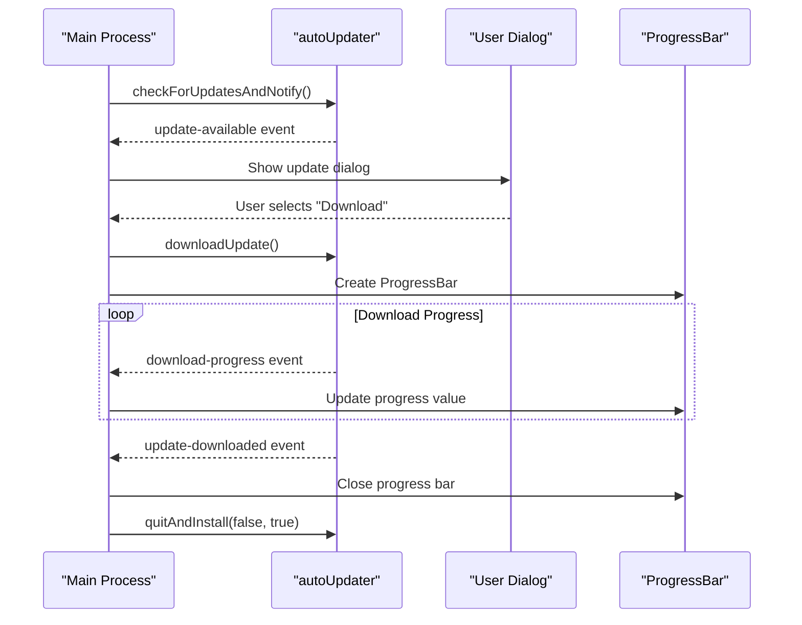
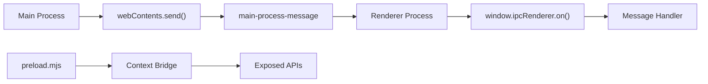
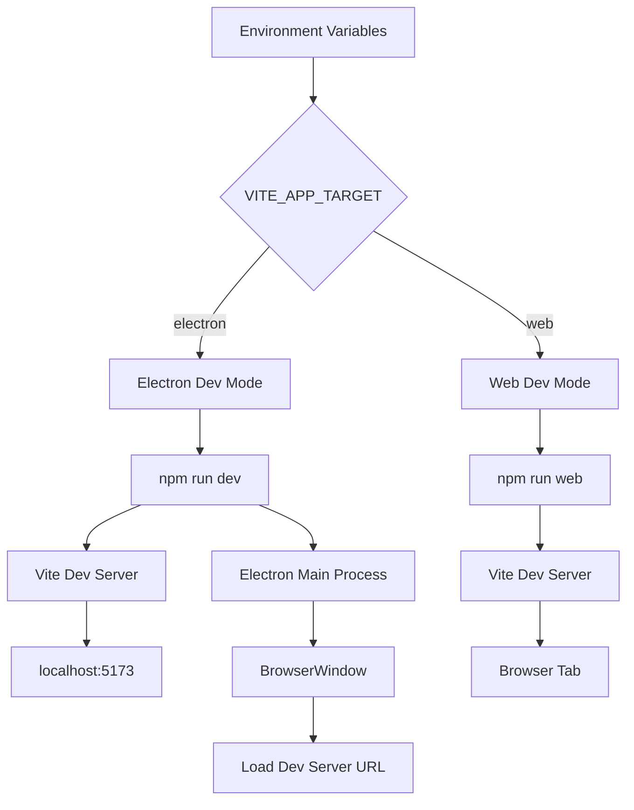
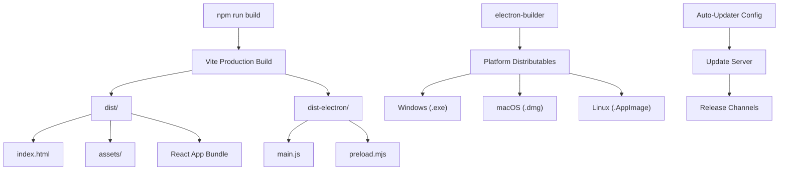

# Electron Development

<details>
<summary>Relevant source files</summary>

The following files were used as context for generating this wiki page:

- [.env.example](.env.example)
- [electron/main.ts](electron/main.ts)
- [electron/updater.ts](electron/updater.ts)
- [package-lock.json](package-lock.json)
- [src/main.tsx](src/main.tsx)
- [vite.config.ts](vite.config.ts)

</details>


This document covers the desktop application development aspects of the NBA simulation application using Electron. It explains the dual-deployment architecture, auto-updater system, and development workflows specific to the Electron desktop version.

For web-specific build configurations, see [Build System](#3.4). For general application architecture, see [Application Structure](#3.1).

## Build System and Dual Deployment

The application uses a sophisticated build system that supports both web and Electron deployments from a single codebase. The deployment target is controlled by the `VITE_APP_TARGET` environment variable.

### Build Configuration Architecture



**Build Target Control Flow**

The build configuration in [vite.config.ts:8-37]() dynamically includes Electron-specific plugins based on the `VITE_APP_TARGET` environment variable. When set to `"electron"`, the configuration includes the `vite-plugin-electron` plugin with specific entry points for the main process and preload scripts.

| Build Target | Entry Points | Output | Development Command |
|--------------|--------------|---------|-------------------|
| `electron` | `electron/main.ts`, `electron/preload.ts` | `dist-electron/`, `dist/` | `npm run dev` |
| `web` | `src/main.tsx` | `dist/` | `npm run web` |

Sources: [vite.config.ts:8-37](), [.env.example:1]()

## Main Process Architecture

The Electron main process is responsible for creating and managing browser windows, handling application lifecycle events, and coordinating with the auto-updater system.

### Main Process Structure



**Main Process Lifecycle**

The main process initialization follows a specific sequence defined in [electron/main.ts:79-81](). Instead of immediately creating the window, it first calls `checkAndApplyUpdates()` which handles the auto-updater logic before proceeding with window creation.

The `createWindow()` function in [electron/main.ts:31-56]() configures the `BrowserWindow` with specific security settings optimized for the application's requirements, including disabled context isolation and web security to allow communication with external APIs.

Sources: [electron/main.ts:31-56](), [electron/main.ts:79-81]()

## Auto-Updater System

The application implements a comprehensive auto-updater system using `electron-updater` with progress tracking and user interaction dialogs.

### Auto-Updater Flow



**Auto-Updater Configuration**

The updater system is configured in [electron/updater.ts:1-157]() with several key features:

- **Automatic Download Disabled**: Set via `autoUpdater.autoDownload = false` in [electron/updater.ts:14]() to allow user control
- **Progress Tracking**: Uses `electron-progressbar` to show download progress
- **Error Handling**: Comprehensive error dialogs for update failures
- **Logging**: Integration with `electron-log` for debugging

| Event | Handler Location | Behavior |
|-------|------------------|----------|
| `update-available` | [electron/updater.ts:37-75]() | Shows user dialog, creates progress bar |
| `download-progress` | [electron/updater.ts:78-111]() | Updates progress bar with download percentage |
| `update-downloaded` | [electron/updater.ts:114-135]() | Automatically installs and restarts |
| `error` | [electron/updater.ts:138-148]() | Shows error dialog, closes progress bar |

Sources: [electron/updater.ts:1-157](), [electron/updater.ts:14](), [electron/updater.ts:37-75]()

## Inter-Process Communication

The application uses Electron's IPC system for communication between the main process and renderer process, though usage is currently minimal.

### IPC Implementation



**Current IPC Usage**

The main process sends timestamp messages to the renderer via [electron/main.ts:46-48]():

```typescript
win.webContents.on('did-finish-load', () => {
  win?.webContents.send('main-process-message', (new Date).toLocaleString())
})
```

The renderer process listens for these messages in [src/main.tsx:15-19]():

```typescript
if (window && window.ipcRenderer) {
  window.ipcRenderer.on('main-process-message', (_event, message) => {
    console.log(message)
  })
}
```

**Security Configuration**

The current IPC setup uses relaxed security settings in [electron/main.ts:36-41]():
- `nodeIntegration: true` - Allows Node.js APIs in renderer
- `contextIsolation: false` - Disables context isolation
- `webSecurity: false` - Disables web security for external API access

Sources: [electron/main.ts:46-48](), [src/main.tsx:15-19](), [electron/main.ts:36-41]()

## Development Workflow

The Electron development workflow integrates with the existing Vite development server and provides hot-reload capabilities.

### Development Environment Setup



**Development Commands**

| Command | Target | Behavior |
|---------|--------|----------|
| `npm run dev` | Electron | Starts Vite dev server + Electron window |
| `npm run web` | Browser | Starts Vite dev server for browser |
| `npm run build` | Electron | Builds for Electron distribution |
| `npm run buildweb` | Browser | Builds for web deployment |

**Hot Reload Behavior**

When `VITE_DEV_SERVER_URL` is available, the Electron window loads from the development server via [electron/main.ts:50-55](), enabling hot reload of React components within the Electron environment.

Sources: [electron/main.ts:50-55](), [vite.config.ts:8-37]()

## Production Build Process

The production build process creates platform-specific Electron distributables with auto-updater integration.

### Build Output Structure



**Electron Builder Configuration**

The application uses `electron-builder` for creating platform-specific packages, as evidenced by the dependency in [package-lock.json:117](). The builder handles:

- Platform-specific installers
- Code signing for security
- Auto-updater manifest generation
- Application metadata and icons

**Distribution Structure**

| Directory | Contents | Purpose |
|-----------|----------|---------|
| `dist/` | React application build | Renderer process assets |
| `dist-electron/` | Compiled Electron scripts | Main and preload processes |
| `release/` | Platform packages | Distribution-ready installers |

Sources: [package-lock.json:117](), [electron/main.ts:20-27]()