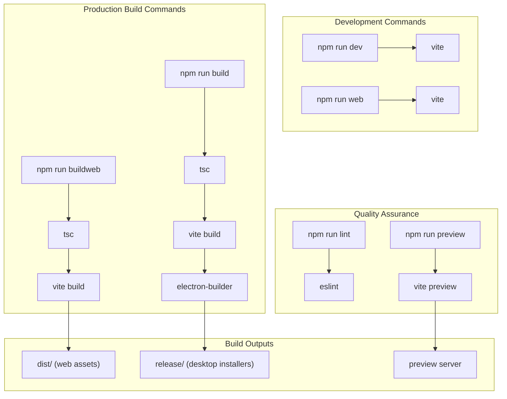
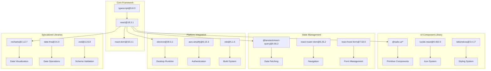
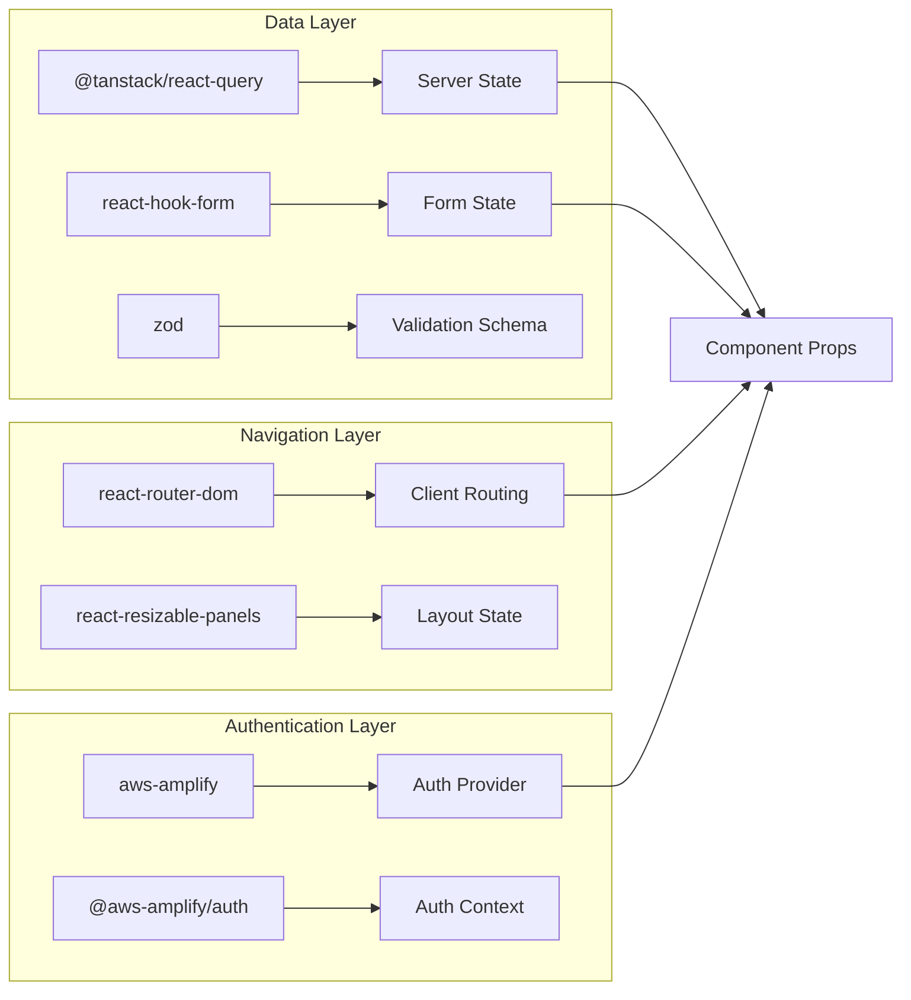
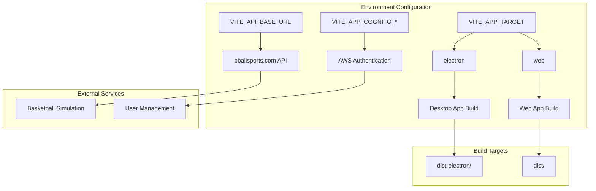
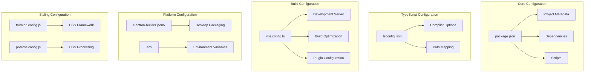

# Reference

Relevant source files

The following files were used as context for generating this wiki page:

- [package.json](package.json)
- [public/vite.svg](public/vite.svg)
- [src/App.css](src/App.css)
- [src/App.tsx](src/App.tsx)

This document provides comprehensive technical reference information for the NBA simulation application, including package dependencies, build system configuration, and project metadata. It serves as a quick lookup guide for developers working with the codebase and understanding the technical stack.

For information about the build system architecture and deployment targets, see [Build System](#3.4). For development setup and tooling details, see [Development Guide](#7).

## Project Metadata

The application is configured as an ES module-based React project with dual deployment targets (web and desktop). The project uses semantic versioning and is currently at version 1.0.20.

| Property | Value | Description |
|----------|-------|-------------|
| `name` | `react-nba-qlx` | NBA simulation application identifier |
| `version` | `1.0.20` | Current release version |
| `type` | `module` | ES module configuration |
| `main` | `dist-electron/main.js` | Electron entry point |
| `private` | `true` | Not published to npm registry |

Sources: [package-lock.json:2-3]()

## Build Scripts and Commands

The project provides multiple build scripts to support different deployment scenarios and development workflows.

**Build Scripts Reference**

| Script | Command | Purpose |
|--------|---------|---------|
| `dev` | `vite` | Start Electron development server |
| `web` | `vite` | Start web development server |
| `build` | `tsc && vite build && electron-builder` | Full desktop application build |
| `buildweb` | `tsc && vite build` | Web-only production build |
| `lint` | `eslint . --ext ts,tsx --report-unused-disable-directives --max-warnings 0` | Code linting and quality checks |
| `preview` | `vite preview` | Preview production build locally |

Sources: [package.json:6-12]()

## Core Dependencies Architecture

The application's dependency structure follows a layered architecture with clear separation between UI components, state management, build tools, and platform-specific functionality.

Sources: [package-lock.json:10-67](), [package-lock.json:69-145]()

## Dependency Categories

### UI Component System

The application uses **Radix UI** as the foundational component library, providing accessible and customizable primitives:

| Package | Version | Purpose |
|---------|---------|---------|
| `@radix-ui/react-dialog` | ^1.1.2 | Modal dialogs and overlays |
| `@radix-ui/react-select` | ^2.1.1 | Custom select controls |
| `@radix-ui/react-tabs` | ^1.1.0 | Tab navigation components |
| `@radix-ui/react-tooltip` | ^1.1.4 | Accessible tooltips |
| `@radix-ui/react-dropdown-menu` | ^2.1.1 | Context menus and dropdowns |

### State Management and Data Flow

### Platform and Build Tools

| Category | Primary Packages | Purpose |
|----------|------------------|---------|
| **Desktop Platform** | `electron@30.0.1`, `electron-builder@24.13.3` | Desktop app runtime and packaging |
| **Build System** | `vite@5.1.6`, `@vitejs/plugin-react@4.2.1` | Development server and bundling |
| **TypeScript Support** | `typescript@5.8.3`, `@types/react@18.2.64` | Type checking and definitions |
| **Styling** | `tailwindcss@3.4.17`, `autoprefixer@10.4.21` | CSS framework and processing |

Sources: [package-lock.json:116](), [package-lock.json:117](), [package-lock.json:108](), [package-lock.json:141](), [package-lock.json:139](), [package-lock.json:109]()

## Environment Variables

The application uses environment variables to configure different deployment targets and external service integrations. These variables control build behavior and runtime configuration.

**Environment Variables Reference**

| Variable | Purpose | Example Value |
|----------|---------|---------------|
| `VITE_APP_TARGET` | Deployment target selection | `electron` or `web` |
| `VITE_API_BASE_URL` | Basketball simulation API endpoint | `http://api.bballsports.com/simulationAPI` |
| `VITE_APP_COGNITO_USER_POOL_ID` | AWS Cognito user pool identifier | `us-east-1_*******` |
| `VITE_APP_COGNITO_CLIENT_ID` | AWS Cognito application client ID | `*********` |
| `VITE_APP_COGNITO_DOMAIN` | AWS Cognito hosted UI domain | `us-****-*********.auth.********.amazoncognito.com/` |

**Target-Specific Configuration**

Sources: [.env.example:1-5]()

## Configuration Files Structure

The project uses multiple configuration files to manage different aspects of the build and development process:

Sources: [package-lock.json:1-145](), [.env.example:1-5]()

## Development Dependencies

Development dependencies are intentionally duplicated between `dependencies` and `devDependencies` sections to support both local development and build environments. This ensures consistent package versions across different deployment scenarios.

### Electron-Specific Development Tools

| Package | Version | Purpose |
|---------|---------|---------|
| `electron-builder` | ^24.13.3 | Desktop application packaging |
| `electron-dl` | ^4.0.0 | Download management for Electron |
| `electron-log` | ^5.2.0 | Logging system for desktop app |
| `electron-progressbar` | ^2.2.1 | Progress indicators |
| `electron-updater` | ^6.1.7 | Auto-update functionality |

### Vite Plugin Ecosystem

| Package | Version | Purpose |
|---------|---------|---------|
| `vite-plugin-electron` | ^0.28.6 | Electron integration for Vite |
| `vite-plugin-electron-renderer` | ^0.14.5 | Renderer process support |
| `vite-tsconfig-paths` | ^5.0.1 | TypeScript path mapping |

Sources: [package-lock.json:117-121](), [package-lock.json:143-144](), [package-lock.json:66]()

## Technical Specifications

### Module System
- **Type**: ES Modules (`"type": "module"`)
- **Entry Point**: `dist-electron/main.js` for Electron builds
- **Build Target**: Modern browsers and Electron 30+

### Framework Versions
- **React**: 18.3.1 (with concurrent features)
- **TypeScript**: 5.8.3 (latest stable)
- **Node.js**: Compatible with Electron 30.0.1 runtime

### Browser Compatibility
The build system targets modern browsers through Vite's default configuration, supporting ES2020+ features and modern JavaScript APIs required by the React 18 concurrent renderer.

Sources: [package.json:5](), [package.json:149](), [package.json:58](), [package.json:144](), [package.json:119]()