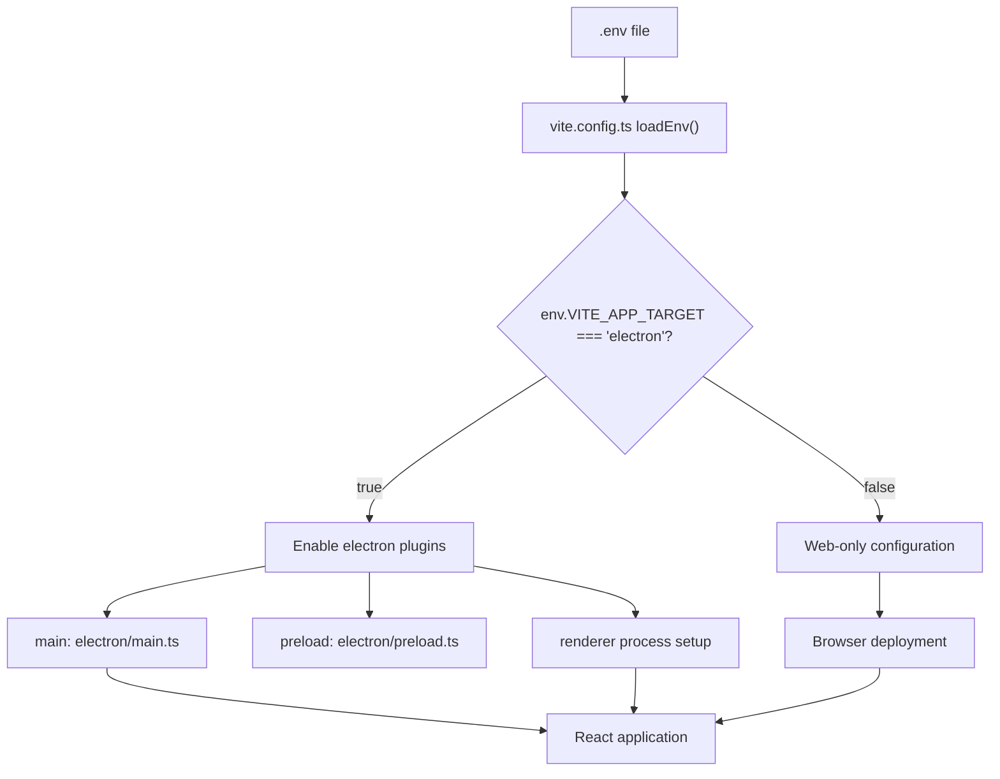
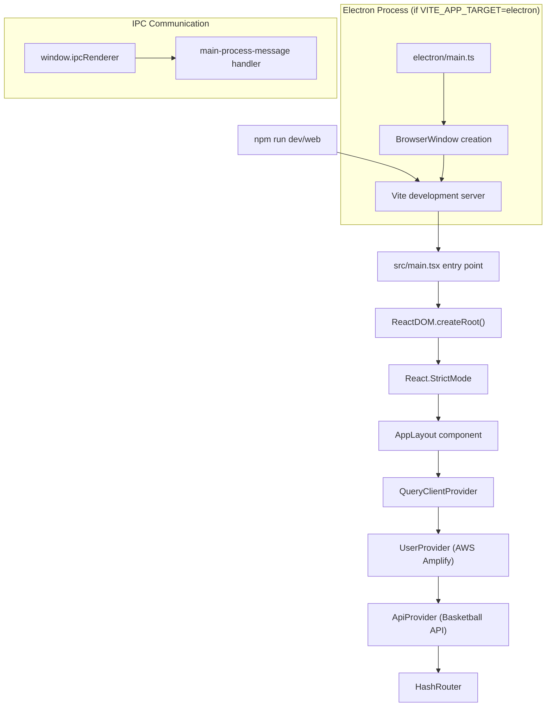
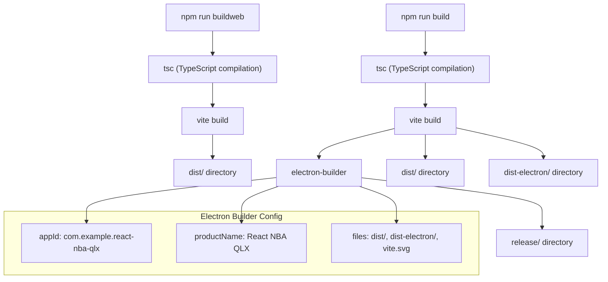

# Getting Started

<details>
<summary>Relevant source files</summary>

The following files were used as context for generating this wiki page:

- [.env.example](/.env.example)
- [README.md](/README.md)
- [docs/2_Getting_Started.md](./2_Getting_Started.md)
- [license.txt](/license.txt)
- [package.json](/package.json)
- [src/main.tsx](/src/main.tsx)
- [vite.config.ts](/vite.config.ts)

</details>


This document provides installation, environment setup, and basic usage instructions for the NBA basketball simulation application. It covers setting up the development environment, configuring build targets, and running the application in both web browser and Electron desktop modes.

For architectural details and design patterns, see [Architecture](./3_Architecture.md). For information about the authentication system and AWS integration, see [Authentication System](./6_Authentication_System.md). For details about the user interface components and game features, see [User Interface](./8_User_Interface.md).

## Prerequisites

Before setting up the application, ensure you have the following installed on your development machine:

| Requirement | Version | Purpose |
|-------------|---------|---------|
| Node.js | 18+ | Runtime environment for React and build tools |
| npm | 8+ | Package dependency management |
| Git | Latest | Source code version control |

The application requires access to external basketball simulation APIs and AWS Amplify services for full functionality.

## Installation

Clone the repository and install dependencies:

```bash
git clone https://github.com/metantonio/react-test-ts-nb
cd react-test-ts-nb
npm install
```

The installation process downloads dependencies including React 18.3.1, TypeScript 5.8.3, Electron 30.0.1, and extensive UI component libraries from Radix UI and PrimeReact.

**Sources:** [package.json:1-174](/package.json)

## Environment Configuration

The application uses environment variables to control build targets and external service configuration. Create a `.env` file based on the provided template:

```bash
cp .env.example .env
```

### Build Target Configuration

The `VITE_APP_TARGET` environment variable determines whether the application builds for Electron desktop or web browser deployment:

| Variable | Values | Effect |
|----------|--------|--------|
| `VITE_APP_TARGET` | `electron` | Enables Electron plugins and desktop features |
| `VITE_APP_TARGET` | `web` or unset | Web-only build without Electron dependencies |

### Build Target Flow



**Sources:** [vite.config.ts:8-11](/vite.config.ts), [.env.example:1](/.env.example)

## Development Workflows

The application supports two development modes through npm scripts defined in `package.json`.

### Web Development Mode

Start the application in web browser mode:

```bash
npm run web
```

This command executes `vite` and starts a development server at `http://localhost:5173`. The application runs without Electron-specific features.

### Desktop Development Mode  

Start the application as an Electron desktop application:

```bash
npm run dev
```

This command also executes `vite` but with Electron integration enabled, launching both the Vite development server and the Electron application window.

### Application Startup Sequence



**Sources:** [src/main.tsx:8-19](/src/main.tsx), [package.json:14-15](/package.json)

## Build Commands

The application provides separate build commands for different deployment targets.

### Web Production Build

Create an optimized web build:

```bash
npm run buildweb
```

This command executes `tsc && vite build`, compiling TypeScript and generating static files in the `dist/` directory.

### Desktop Production Build

Create Electron desktop application packages:

```bash
npm run build
```

This command executes `tsc && vite build && electron-builder`, generating both web assets and platform-specific desktop installers.

### Build Process Flow



**Sources:** [package.json:16-17](/package.json), [package.json:159-173](/package.json)

## Development Tools

### Code Quality

Run ESLint to check TypeScript and TSX files:

```bash
npm run lint
```

The linting configuration uses `@typescript-eslint/eslint-plugin` and `eslint-plugin-react-hooks` for React-specific rules.

### Production Preview

Test the production web build locally:

```bash
npm run preview
```

This serves the built application from the `dist/` directory using Vite's preview server.

**Sources:** [package.json:18-19](/package.json)

## Project Structure

After installation and initial builds, the project contains these key directories:

| Directory | Purpose | Generated By |
|-----------|---------|--------------|
| `src/` | React application source code | Manual development |
| `electron/` | Electron main and preload processes | Manual development |
| `dist/` | Web production build output | `npm run buildweb` |
| `dist-electron/` | Electron main process build | `npm run build` |
| `release/` | Platform-specific installers | `npm run build` |
| `node_modules/` | Package dependencies | `npm install` |

The build system generates different output directories based on the target platform, with `dist/` containing web assets and `dist-electron/` containing Electron-specific compiled code.

**Sources:** [vite.config.ts:17-25](/vite.config.ts)

## Next Steps

After completing installation and setup:

1. Start development using `npm run web` for browser testing or `npm run dev` for desktop development
2. Configure API credentials in the `.env` file for basketball simulation services  
3. Review authentication setup documentation in [Authentication System](./6_Authentication_System.md)
4. Explore the primary game interface documentation in [Game Setup Interface](./10_Game_Setup_Interface.md)

The application requires valid API credentials for the external basketball simulation service to access game data and run simulations. For information about state management and context providers, see [State Management](./5_State_Management.md).

**Sources:** [.env.example:2-5](/.env.example)