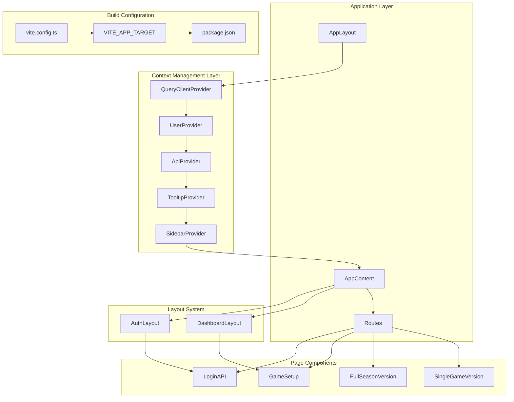
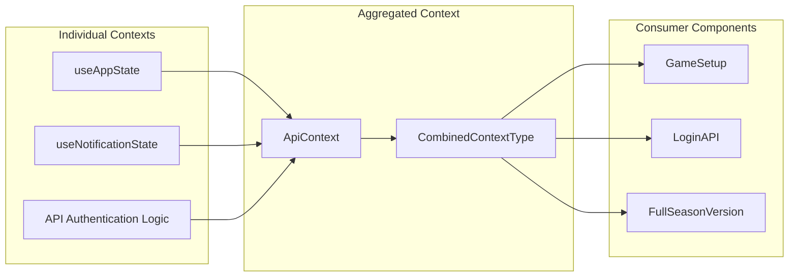
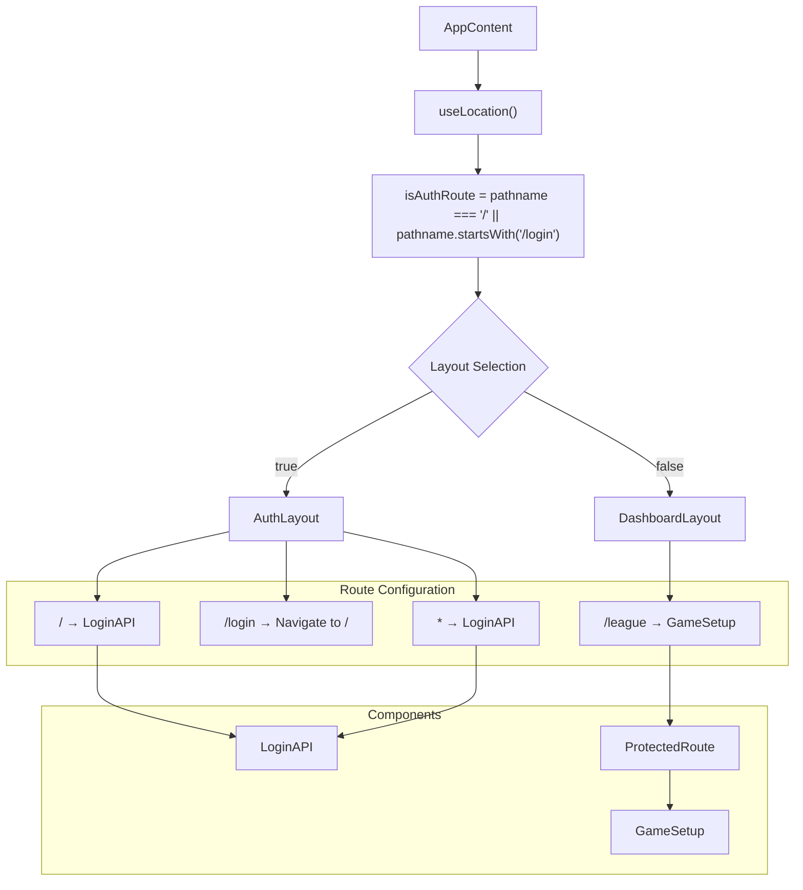
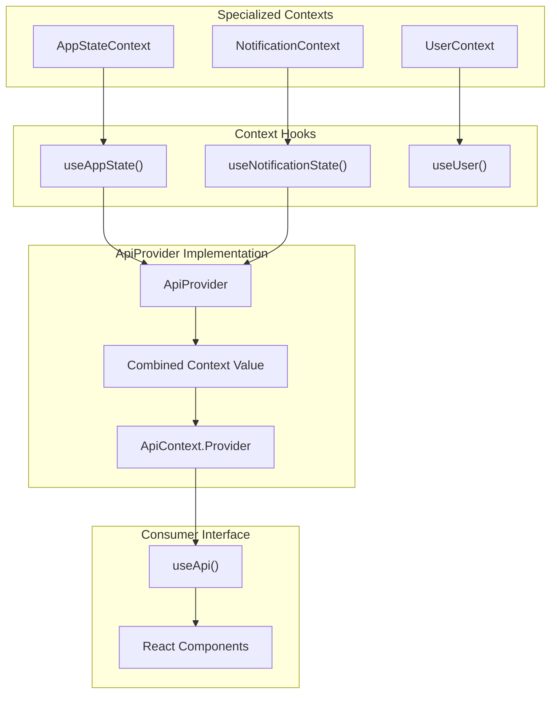
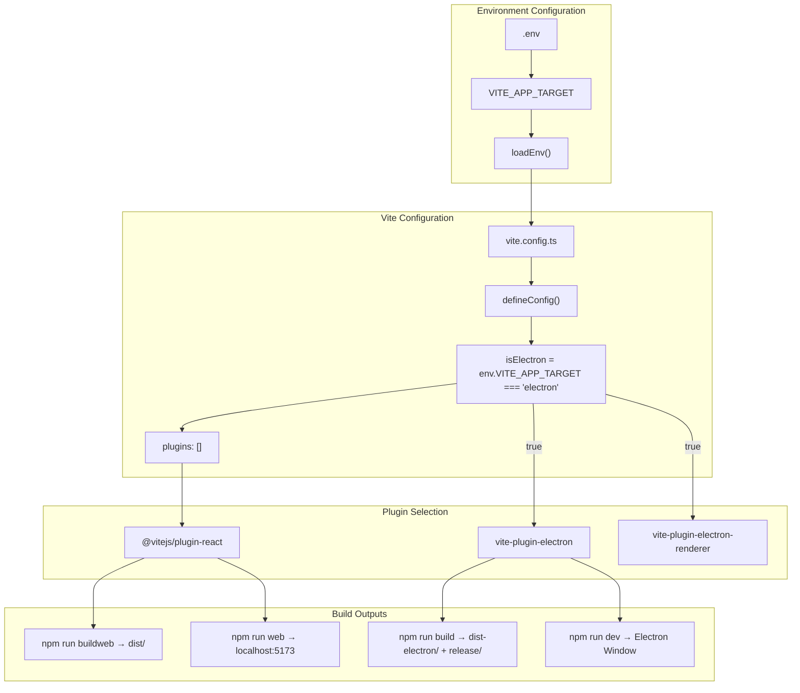
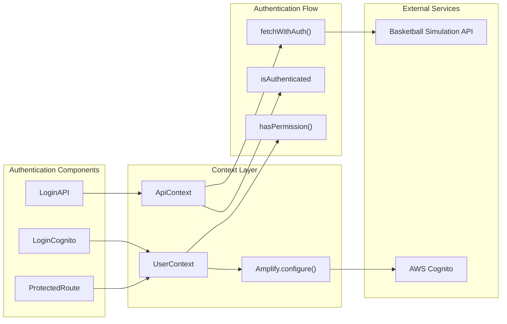
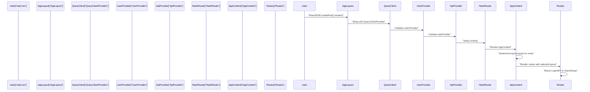

# Architecture

Relevant source files

The following files were used as context for generating this wiki page:

- [docs/1_Overview.md](docs/1_Overview.md)
- [docs/3_Architecture.md](docs/3_Architecture.md)
- [docs/4_Application_Structure.md](docs/4_Application_Structure.md)
- [docs/5_State_Management.md](docs/5_State_Management.md)
- [package.json](package.json)
- [src/layout.tsx](src/layout.tsx)

This document explains the core architectural patterns and design decisions of the NBA simulation application. It covers the React application structure, context-based state management system, conditional layout patterns, and dual-target build configuration that enables both web and desktop deployment from a single codebase.

For specific implementation details about individual contexts, see [State Management](#3.2). For authentication flow specifics, see [Authentication System](#3.3). For build configuration details, see [Build System](#3.4).

## System Architecture Overview

The application implements a layered React architecture with centralized state management through React Context. The system is designed around a provider composition pattern where multiple specialized contexts are aggregated into a unified interface.

### Core System Layers

Sources: [src/layout.tsx:87-103](), [src/main.tsx:8-12](), [vite.config.ts:8-11]()

### Provider Composition Architecture

The application uses a sophisticated provider hierarchy where each context wraps the next, creating cascading availability of services. The `ApiProvider` serves as the primary aggregator, combining multiple context slices into a unified interface.

Sources: [src/contexts/ApiContext.tsx:13-21](), [src/contexts/ApiContext.tsx:72-82]()

## Routing and Layout Selection System

The application implements a conditional layout system that dynamically selects between `AuthLayout` and `DashboardLayout` based on the current route pattern. This enables different UI structures for authentication and main application flows.

### Route-Based Layout Logic

Sources: [src/layout.tsx:51-56](), [src/layout.tsx:68-82]()

## Context Aggregation Pattern

The application implements a unique context aggregation pattern where the `ApiProvider` combines multiple specialized contexts into a single unified interface. This reduces complexity for consuming components while maintaining separation of concerns.

### Context Integration Flow

Sources: [src/contexts/ApiContext.tsx:24-88](), [src/contexts/ApiContext.tsx:91-97]()

## Dual-Target Build Architecture

The build system enables deployment to both web browsers and Electron desktop applications through environment-driven configuration. The `VITE_APP_TARGET` environment variable controls build behavior without requiring code changes.

### Build Configuration Flow

Sources: [vite.config.ts:8-11](), [vite.config.ts:16-34](), [package.json:13-20]()

## Authentication System Integration

The application implements a dual authentication system: API key-based authentication for the basketball simulation service and AWS Amplify integration for user management. The `ApiContext` manages API authentication while `UserContext` handles user session management.

### Authentication Architecture

Sources: [src/layout.tsx:31-49](), [src/layout.tsx:73-77](), [src/contexts/ApiContext.tsx:45-70]()

## Application Initialization Sequence

The application follows a specific initialization flow that establishes the provider hierarchy, configures routing, and sets up the authentication system before rendering any user interface components.

### Initialization Flow

Sources: [src/main.tsx:8-12](), [src/layout.tsx:87-103](), [src/layout.tsx:51-84]()