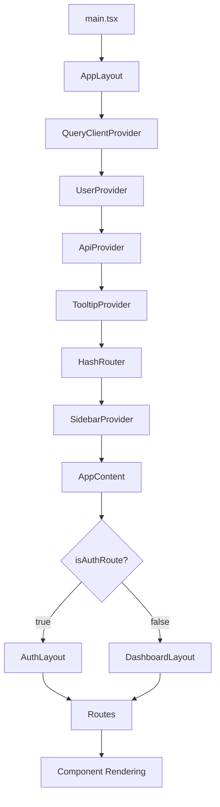
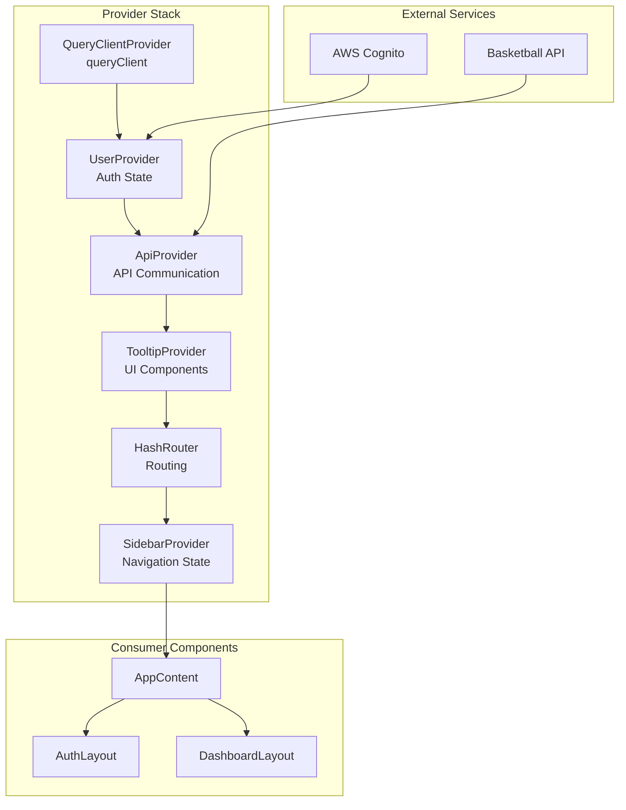
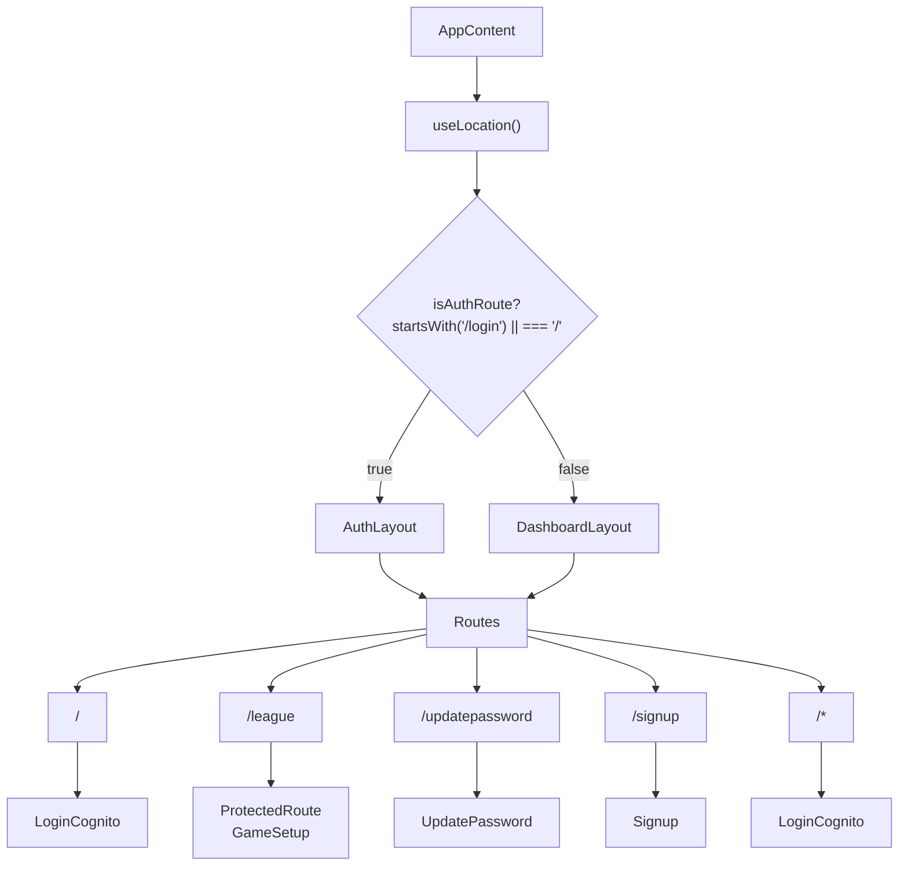
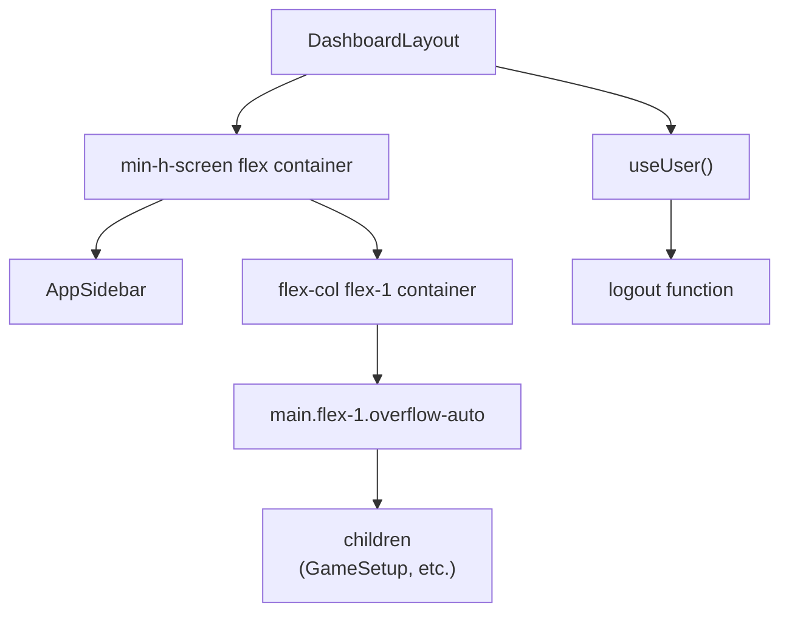
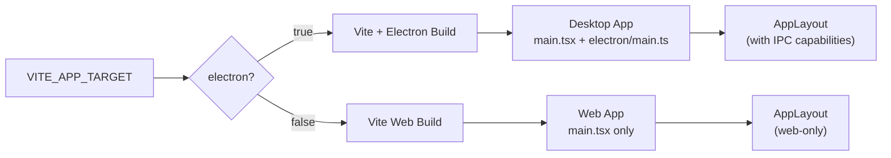
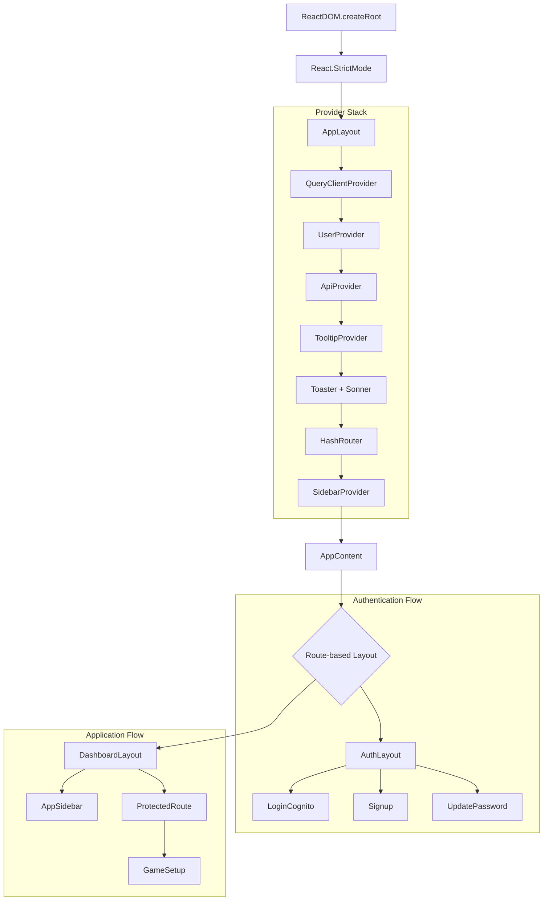

# Application Structure

<details>
<summary>Relevant source files</summary>

The following files were used as context for generating this wiki page:

- [.env.example](.env.example)
- [src/components/MainLayout.tsx](src/components/MainLayout.tsx)
- [src/layout.tsx](src/layout.tsx)
- [src/main.tsx](src/main.tsx)
- [vite.config.ts](vite.config.ts)

</details>


This document covers the foundational architecture of the NBA simulation application, including entry points, provider stack configuration, routing system, and layout components. For information about state management patterns within these components, see [State Management](#3.2). For details about the authentication flows that integrate with this structure, see [Authentication System](#3.3).

## Entry Points and Application Initialization

The application has a single entry point that initializes the React application and establishes the foundation for both web and Electron deployment targets.

### Main Entry Point

The application starts at `main.tsx`, which renders the root `AppLayout` component:

```typescript
ReactDOM.createRoot(document.getElementById('root')!).render(
  <React.StrictMode>
    <AppLayout />
  </React.StrictMode>,
)
```

**Application Initialization Flow**



Sources: [src/main.tsx:8-12](), [src/layout.tsx:87-103]()

## Provider Stack Architecture

The `AppLayout` component establishes a comprehensive provider stack that makes essential services available throughout the application component tree.

### Provider Hierarchy

The providers are wrapped in a specific order to ensure proper dependency resolution:

| Provider | Purpose | Dependencies |
|----------|---------|--------------|
| `QueryClientProvider` | React Query client for data fetching | None |
| `UserProvider` | AWS Cognito authentication state | QueryClient |
| `ApiProvider` | Basketball API communication | UserProvider |
| `TooltipProvider` | UI tooltip functionality | None |
| `HashRouter` | Client-side routing | None |
| `SidebarProvider` | Sidebar state management | None |

**Provider Dependencies and Services**



Sources: [src/layout.tsx:87-103]()

## Routing System

The routing system uses a conditional layout strategy where different layouts are applied based on the current route path.

### Route-Based Layout Selection

The `AppContent` component implements intelligent layout switching:

```typescript
const isAuthRoute = location.pathname.startsWith("/login") || location.pathname === "/";
const Layout = isAuthRoute ? AuthLayout : DashboardLayout;
```

### Route Configuration

| Route Pattern | Component | Layout | Protection |
|---------------|-----------|--------|------------|
| `/` | `LoginCognito` | `AuthLayout` | None |
| `/login` | Redirect to `/` | `AuthLayout` | None |
| `/league` | `GameSetup` | `DashboardLayout` | `ProtectedRoute` |
| `/updatepassword` | `UpdatePassword` | `AuthLayout` | None |
| `/signup` | `Signup` | `AuthLayout` | None |
| `*` (catch-all) | `LoginCognito` | `AuthLayout` | None |

**Routing and Layout Decision Flow**



Sources: [src/layout.tsx:51-85]()

## Layout Components

The application uses two primary layout components that provide different structural frameworks for authentication and main application flows.

### DashboardLayout Structure

The `DashboardLayout` provides the main application interface for authenticated users:

```typescript
const DashboardLayout = ({ children }: { children: React.ReactNode }) => {
  return (
    <div className="min-h-screen flex w-full">
      <AppSidebar />
      <div className="flex flex-col flex-1">
        <main className="flex-1 overflow-auto">{children}</main>
      </div>
    </div>
  );
};
```

**DashboardLayout Component Structure**



Sources: [src/components/MainLayout.tsx:6-18]()

### Layout Integration with Authentication

The layout system integrates with the authentication state through the `useUser` hook, which provides loading states and user management functions.

| Layout | Authentication State | Available Components |
|--------|---------------------|---------------------|
| `AuthLayout` | Unauthenticated | Login, Signup, Password Reset |
| `DashboardLayout` | Authenticated | Sidebar, Game Setup, Logout |

## Build Target Considerations

The application structure supports dual deployment through the `VITE_APP_TARGET` environment variable, configured in `vite.config.ts`:

```typescript
const isElectron = env.VITE_APP_TARGET === 'electron';
```

This affects how the application initializes and which features are available:

- **Web Target**: Standard React web application with hash routing
- **Electron Target**: Desktop application with additional native integrations

**Build Target Application Flow**



Sources: [vite.config.ts:8-11](), [src/main.tsx:14-19]()

## Component Hierarchy Overview

The complete component hierarchy flows from the entry point through the provider stack to the final rendered components:

**Complete Application Component Tree**



Sources: [src/main.tsx:8-12](), [src/layout.tsx:87-103](), [src/layout.tsx:51-85](), [src/components/MainLayout.tsx:6-18]()