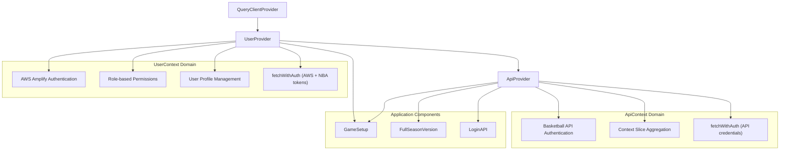
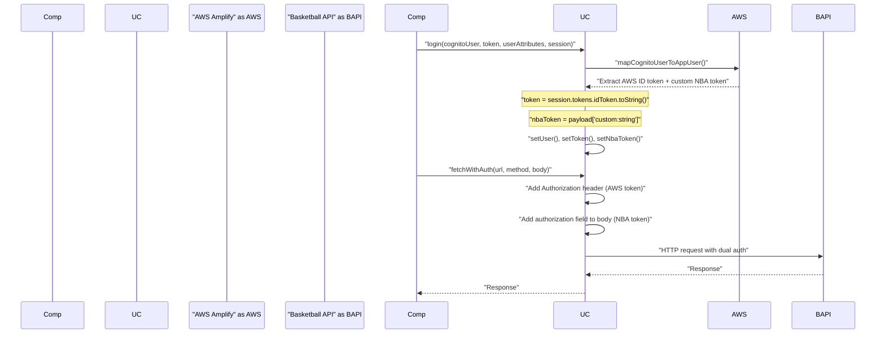
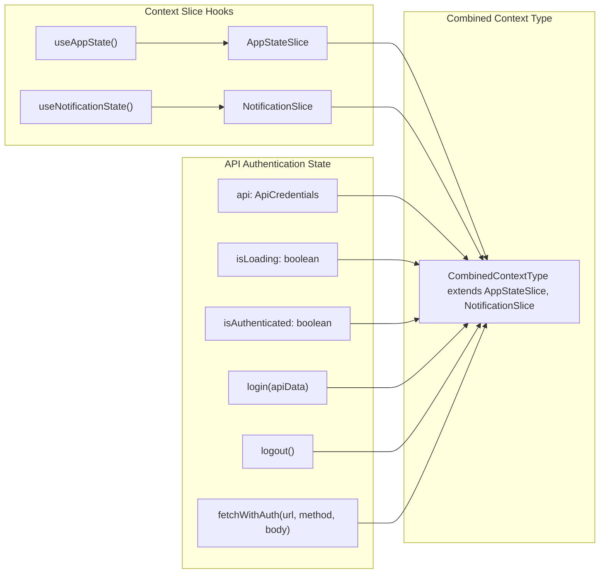
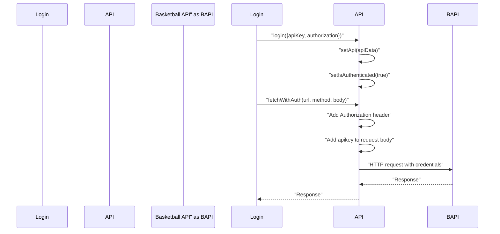
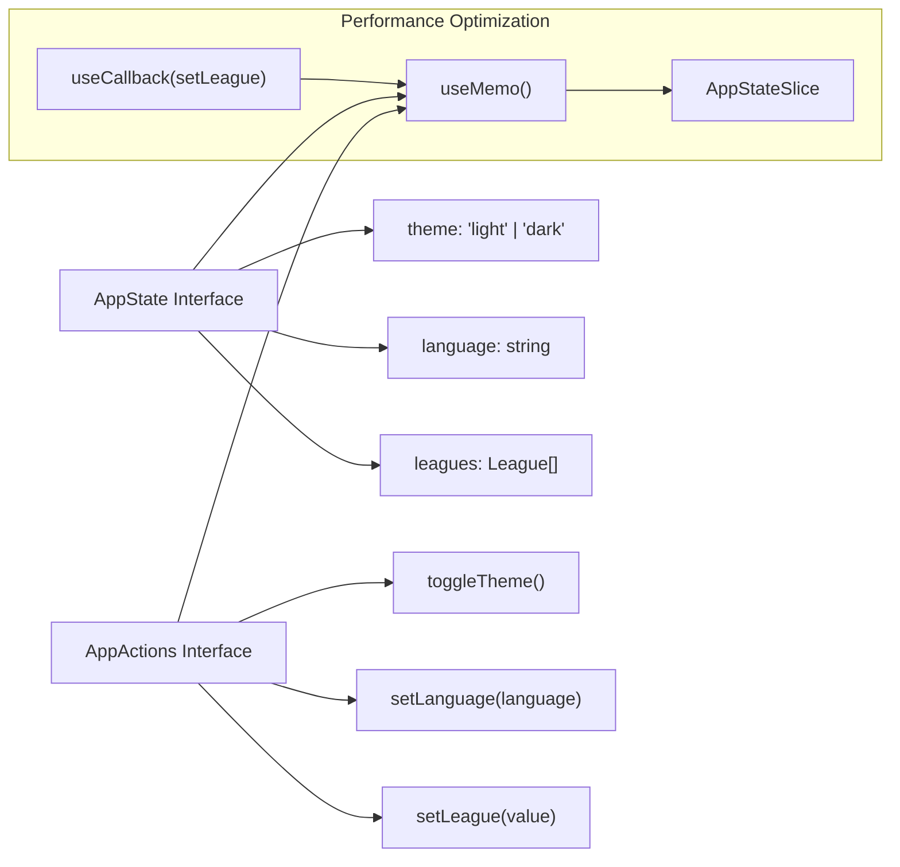
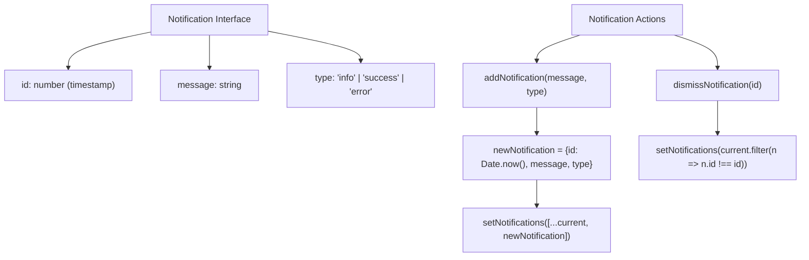
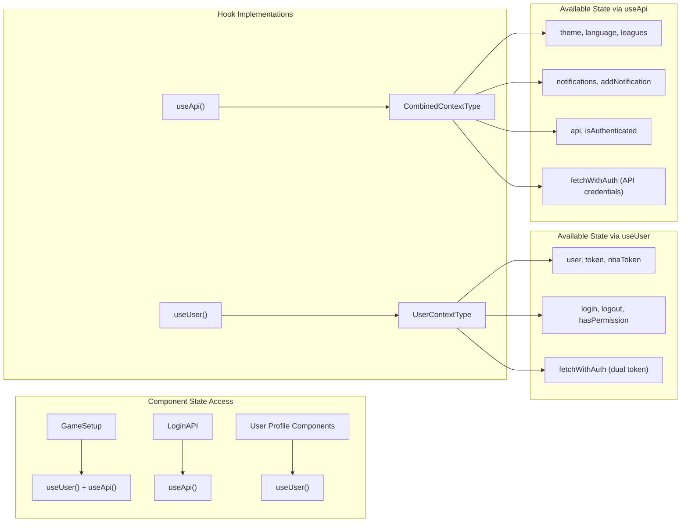
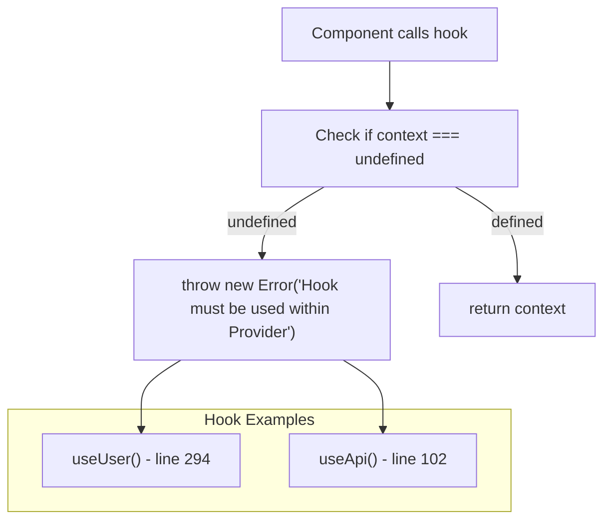

# State Management

Relevant source files

The following files were used as context for generating this wiki page:

- [docs/1_Overview.md](docs/1_Overview.md)
- [docs/3_Architecture.md](docs/3_Architecture.md)
- [docs/4_Application_Structure.md](docs/4_Application_Structure.md)
- [docs/5_State_Management.md](docs/5_State_Management.md)
- [src/LoginAPI.tsx](src/LoginAPI.tsx)
- [src/contexts/ApiContext.tsx](src/contexts/ApiContext.tsx)
- [src/contexts/AppStateContext.tsx](src/contexts/AppStateContext.tsx)
- [src/contexts/NotificationContext.tsx](src/contexts/NotificationContext.tsx)
- [src/contexts/UserContext.tsx](src/contexts/UserContext.tsx)
- [src/hooks/useFetch.tsx](src/hooks/useFetch.tsx)

## Purpose and Scope

This document covers the React Context-based state management system used throughout the NBA simulation application. The system implements a dual authentication architecture with context aggregation patterns that combine multiple specialized contexts into unified interfaces. This eliminates prop drilling while maintaining separation of concerns across user authentication, API authentication, application state, and notifications.

For information about AWS Amplify authentication specifically, see [Authentication System](#3.3). For details about API integration patterns, see [API Integration](#6).

## Dual Authentication Context Architecture

The application implements two distinct authentication contexts that serve different purposes in the basketball simulation system:

### Overall Context System Architecture

**Sources:** [src/contexts/UserContext.tsx:32-47](), [src/contexts/ApiContext.tsx:12-21](), [src/layout.tsx:44-60]()

### Authentication System Comparison

| Aspect | UserContext | ApiContext |
|--------|-------------|------------|
| **Purpose** | AWS Amplify user authentication | Basketball API service authentication |
| **Scope** | User identity, permissions, profile | Game simulation API access |
| **Token Management** | AWS ID token + NBA custom token | API key + authorization header |
| **Primary Hook** | `useUser()` | `useApi()` |
| **fetchWithAuth** | Dual token system | API credentials system |

**Sources:** [src/contexts/UserContext.tsx:32-47](), [src/contexts/ApiContext.tsx:5-21]()

## UserContext - AWS Amplify Authentication System

The `UserContext` provides comprehensive user authentication through AWS Amplify integration with a sophisticated dual token system for basketball API access.

### UserContext State Management

```mermaid
graph TD
    UserState["User State"] --> UserObject["user: User | null"]
    UserState --> TokenAWS["token: string | null (AWS ID Token)"]
    UserState --> TokenNBA["nbaToken: string | null (NBA API Token)"]
    UserState --> AuthStatus["isAuthenticated: boolean"]
    UserState --> LoadingState["isLoading: boolean"]
    
    UserActions["User Actions"] --> LoginAction["login(cognitoUser, token, userAttributes, session)"]
    UserActions --> LogoutAction["logout()"]
    UserActions --> UpdateUser["updateUser(userData)"]
    UserActions --> HasPermission["hasPermission(permission)"]
    UserActions --> RefreshToken["refreshToken()"]
    UserActions --> ValidateToken["validateToken()"]
    UserActions --> FetchWithAuth["fetchWithAuth(url, method, body)"]
    
    subgraph "User Interface"
        UserID["id: string"]
        Username["username: string"] 
        Email["email: string"]
        Role["role: UserRole"]
        CognitoID["cognitoId: string"]
        AuthNBA["authorizationNBA: string"]
    end
    
    UserObject --> UserID
    UserObject --> Username
    UserObject --> Email
    UserObject --> Role
    UserObject --> CognitoID
    UserObject --> AuthNBA
```

**Sources:** [src/contexts/UserContext.tsx:17-30](), [src/contexts/UserContext.tsx:32-47]()

### Dual Token Authentication System

The `UserContext` implements a sophisticated dual token system for accessing both AWS services and basketball simulation APIs:

**Sources:** [src/contexts/UserContext.tsx:84-109](), [src/contexts/UserContext.tsx:166-175](), [src/contexts/UserContext.tsx:230-257]()

### Role-Based Permission System

The `UserContext` implements granular role-based permissions:

| Role | Permissions |
|------|------------|
| `admin` | `view_all`, `add_edit_delete_users`, `add_edit_records`, `delete_records`, `edit_profile` |
| `developer` | `view_all`, `add_edit_records`, `delete_records`, `edit_profile` |
| `guest` | `view_all` |

**Sources:** [src/contexts/UserContext.tsx:196-206]()

## ApiContext - Basketball API and Context Aggregation

The `ApiContext` serves dual purposes: basketball API authentication and aggregation of application state slices into a unified interface.

### ApiContext Composition Pattern

**Sources:** [src/contexts/ApiContext.tsx:12-21](), [src/contexts/ApiContext.tsx:30-32](), [src/contexts/ApiContext.tsx:81-91]()

### Basketball API Authentication Flow

The `ApiContext` manages API key-based authentication for basketball simulation services:

**Sources:** [src/contexts/ApiContext.tsx:34-39](), [src/contexts/ApiContext.tsx:53-78]()

## Individual Context Slice Implementations

### AppStateContext - Application Global State

The `AppStateContext` manages theme, language, and cached league data using the slice pattern:

**Sources:** [src/contexts/AppStateContext.tsx:4-7](), [src/contexts/AppStateContext.tsx:18-21](), [src/contexts/AppStateContext.tsx:43-50]()

### NotificationContext - Toast Notification Management

The `NotificationContext` implements a timestamp-based notification queue system:

**Sources:** [src/contexts/NotificationContext.tsx:4-8](), [src/contexts/NotificationContext.tsx:31-36](), [src/contexts/NotificationContext.tsx:38-41]()

### UserContext Implementation Details

The `UserContext` integrates with AWS Amplify through the `AuthService` and implements sophisticated token management:

| State Field | Type | Purpose |
|-------------|------|---------|
| `user` | `User \| null` | Current user profile with AWS and custom fields |
| `token` | `string \| null` | AWS ID token for API authorization headers |
| `nbaToken` | `string \| null` | NBA custom token for API request bodies |
| `isAuthenticated` | `boolean` | Authentication status |
| `isLoading` | `boolean` | Authentication loading state |

| Method | Purpose | Key Implementation |
|--------|---------|-------------------|
| `loadUser` | Initialize user from AWS session | [src/contexts/UserContext.tsx:124-163]() |
| `login` | Map Cognito user to app user | [src/contexts/UserContext.tsx:166-175]() |
| `fetchWithAuth` | Dual token HTTP requests | [src/contexts/UserContext.tsx:230-257]() |
| `hasPermission` | Role-based access control | [src/contexts/UserContext.tsx:196-206]() |

**Sources:** [src/contexts/UserContext.tsx:32-47](), [src/contexts/UserContext.tsx:124-163](), [src/contexts/UserContext.tsx:230-257]()

## State Access Patterns

### Dual Hook System

Components access state through two primary hooks based on their requirements:

**Sources:** [src/contexts/UserContext.tsx:291-297](), [src/contexts/ApiContext.tsx:100-106]()

### Context Provider Hierarchy in Application

The application establishes a specific provider nesting order in the layout system:

| Layer | Provider | Purpose | File Reference |
|-------|----------|---------|----------------|
| 1 | `QueryClientProvider` | TanStack Query client | [src/layout.tsx:44]() |
| 2 | `UserProvider` | AWS Amplify authentication | [src/layout.tsx:45]() |
| 3 | `ApiProvider` | Basketball API + context aggregation | [src/layout.tsx:46]() |
| 4 | `TooltipProvider` | UI tooltip system | [src/layout.tsx:47]() |
| 5 | `HashRouter` | Client-side routing | [src/layout.tsx:50]() |
| 6 | `SidebarProvider` | Sidebar state management | [src/layout.tsx:51]() |

**Sources:** [src/layout.tsx:44-60]()

### Error Handling and Runtime Validation

Both context hooks implement runtime validation to ensure proper provider hierarchy:

**Sources:** [src/contexts/UserContext.tsx:293-296](), [src/contexts/ApiContext.tsx:102-105]()

## Performance Optimizations

### Memoization Strategy

Both `AppStateContext` and `NotificationContext` implement `useMemo` to stabilize context values:

- `AppStateContext` memoizes the complete state object at [src/contexts/AppStateContext.tsx:43-50]()
- `NotificationContext` memoizes the return value at [src/contexts/NotificationContext.tsx:45-49]()
- Functions are wrapped in `useCallback` to prevent recreation on every render

### Context Composition Benefits

The aggregation pattern provides several performance advantages:
- Single context subscription reduces re-render frequency
- Memoized slice implementations prevent cascading updates
- Centralized state access eliminates multiple context subscriptions per component

**Sources:** [src/contexts/ApiContext.tsx:72-82](), [src/contexts/AppStateContext.tsx:43-50](), [src/contexts/NotificationContext.tsx:45-49]()