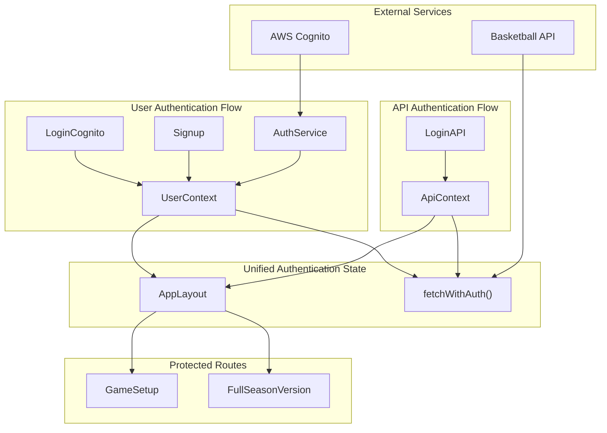
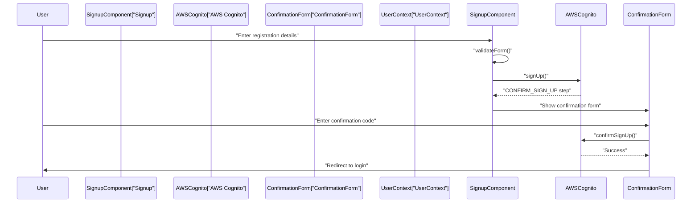
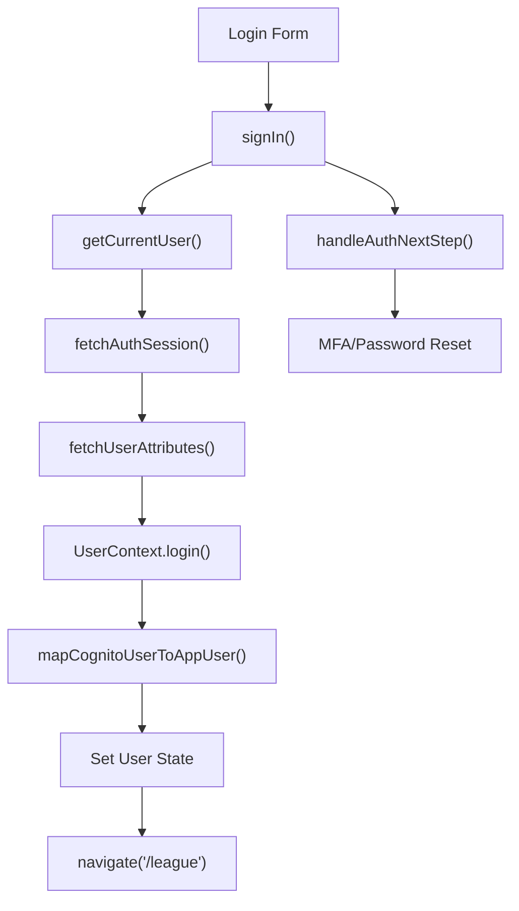
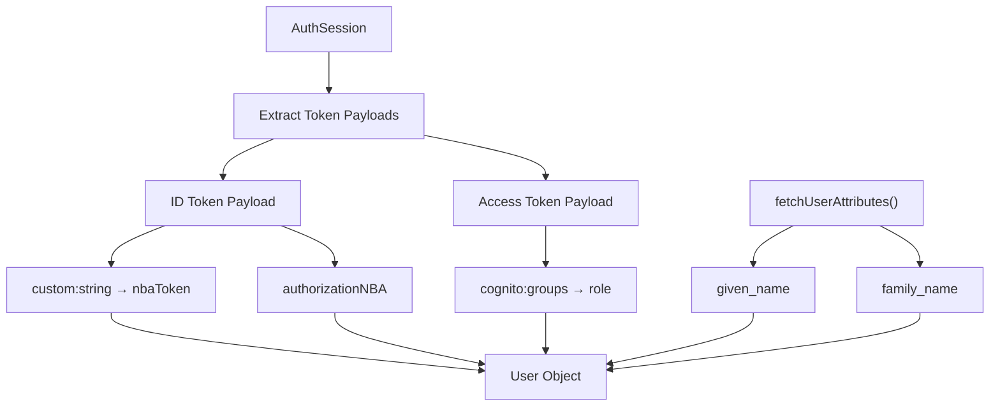
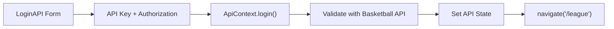
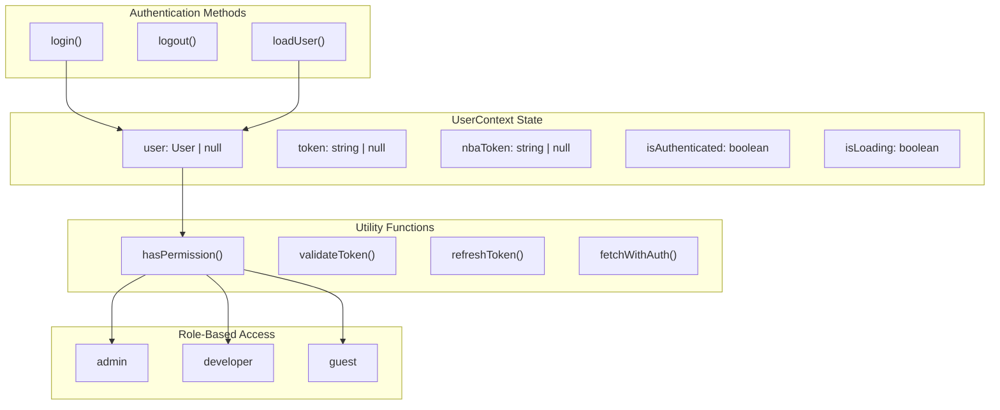
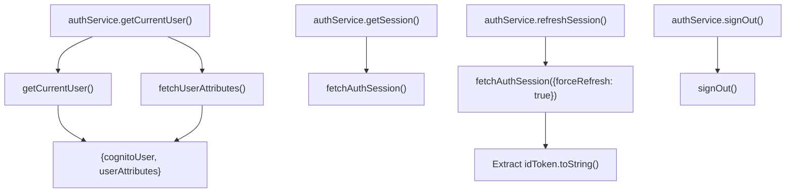
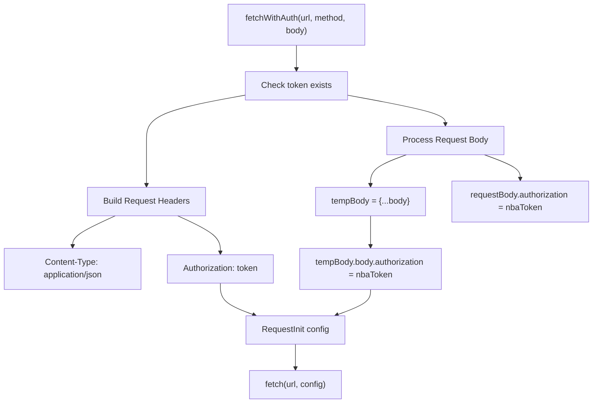
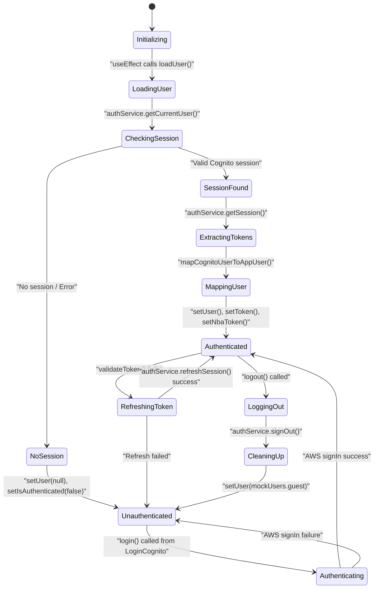

# Authentication System

Relevant source files

The following files were used as context for generating this wiki page:

- [src/contexts/AuthService.ts](/src/contexts/AuthService.ts)
- [src/contexts/UserContext.tsx](/src/contexts/UserContext.tsx)
- [src/pages/auth/loginCognito.tsx](/src/pages/auth/loginCognito.tsx)
- [src/pages/auth/signup.tsx](/src/pages/auth/signup.tsx)

## Purpose and Scope

This document covers the dual authentication system implemented in the NBA simulation application. The system supports both AWS Cognito user account authentication and API key-based authentication for accessing basketball simulation services. For information about the broader state management architecture, see [State Management](./5_State_Management.md). For details about the user interface components, see [Authentication UI](./13_Authentication_UI.md).

The authentication system provides unified user session management, token handling, permission-based access control, and seamless integration between user accounts and API service credentials.

## Authentication Architecture Overview

The application implements a dual authentication strategy to handle two distinct authentication needs: user identity management through AWS Cognito and service access through API credentials.

### System Architecture

Sources: [src/contexts/UserContext.tsx:1-298](/src/contexts/UserContext.tsx), [src/pages/auth/loginCognito.tsx:1-314](/src/pages/auth/loginCognito.tsx), [src/pages/auth/signup.tsx:1-321](/src/pages/auth/signup.tsx), [src/LoginAPI.tsx:1-172](/src/LoginAPI.tsx), [src/contexts/AuthService.ts:1-62](/[src/contexts/AuthService.ts)

## AWS Cognito Authentication

### User Registration and Confirmation

The signup process implements a two-step verification flow using AWS Cognito's built-in email confirmation system.

The `Signup` component handles user registration with the following key features:

| Feature | Implementation | Location |
|---------|----------------|----------|
| Form validation | `validateForm()` function | [src/pages/auth/signup.tsx:68-89](/src/pages/auth/signup.tsx:) |
| User attributes | Custom fields including `custom:string` for NBA token | [src/pages/auth/signup.tsx:110-116](/src/pages/auth/signup.tsx) |
| Confirmation flow | Two-step process with email verification | [src/pages/auth/signup.tsx:124-130](/src/pages/auth/signup.tsx) |
| Code resending | `handleResendCode()` for retry functionality | [src/pages/auth/signup.tsx:176-195](/src/pages/auth/signup.tsx) |

Sources: [src/pages/auth/signup.tsx:35-321](/src/pages/auth/signup.tsx), [src/pages/auth/ConfirmationForm:1-210](/src/pages/auth/ConfirmationForm.tsx)

### Login Flow and Session Management

The `LoginCognito` component manages AWS Cognito authentication with comprehensive error handling and session establishment.

The authentication process extracts multiple token types and user attributes through the `mapCognitoUserToAppUser` function:

| Token/Attribute | Purpose | Source | Code Location |
|-----------------|---------|--------|---------------|
| `idToken` | Primary authentication token | `session.tokens.idToken` | [src/pages/auth/loginCognito.tsx:62](/src/pages/auth/loginCognito.tsx) |
| `accessToken` | Role assignment via groups | `session.tokens.accessToken` | [src/contexts/UserContext.tsx:87](/src/contexts/UserContext.tsx) |
| `custom:string` | NBA API authorization token | `idToken.payload["custom:string"]` | [src/contexts/UserContext.tsx:102](/src/contexts/UserContext.tsx) |
| `authorizationNBA` | Additional NBA authorization | `idToken.payload["authorizationNBA"]` | [src/contexts/UserContext.tsx:103](/src/contexts/UserContext.tsx) |
| `cognito:groups` | User role assignment | `accessToken.payload["cognito:groups"]` | [src/contexts/UserContext.tsx:88](/src/contexts/UserContext.tsx) |

#### User Mapping Process

Sources: [src/pages/auth/loginCognito.tsx:59-82](/src/pages/auth/loginCognito.tsx), [src/contexts/UserContext.tsx:84-109](/src/contexts/UserContext.tsx)

## API Key Authentication

### Direct API Credentials

The `LoginAPI` component provides an alternative authentication method using direct API credentials for basketball simulation services.

The API authentication stores credentials for direct service access:

- **API Key**: Primary service identifier
- **Authorization**: Service authorization token
- **Direct Storage**: Credentials stored in `ApiContext` for immediate use

Sources: [src/LoginAPI.tsx:27-172](/src/LoginAPI.tsx)

## User Context and State Management

### UserContext Provider

The `UserContext` serves as the central authentication state manager, providing a unified interface for both authentication methods.

### Permission System

The authentication system implements role-based access control:

| Role | Permissions | Description |
|------|-------------|-------------|
| `admin` | `view_all`, `add_edit_delete_users`, `add_edit_records`, `delete_records`, `edit_profile` | Full system access |
| `developer` | `view_all`, `add_edit_records`, `delete_records`, `edit_profile` | Development access without user management |
| `guest` | `view_all` | Read-only access |

Sources: [src/contexts/UserContext.tsx:196-206](/src/contexts/UserContext.tsx)

### Authentication Service Layer

The `AuthService` provides low-level AWS Amplify integration with error handling and token management:

#### Service Methods Implementation

| Method | Implementation | Returns | Error Handling |
|--------|----------------|---------|----------------|
| `getCurrentUser()` | `await getCurrentUser()` + `await fetchUserAttributes()` | `{cognitoUser, userAttributes} \| null` | Logs error, returns `null` |
| `getSession()` | `await fetchAuthSession()` | `AuthSession \| null` | Logs error, returns `null` |
| `signOut()` | `await signOut()` | `boolean` | Returns `false` on error |
| `refreshSession()` | `await fetchAuthSession({forceRefresh: true})` | `string \| null` | Returns `null` on error |

Sources: [src/contexts/AuthService.ts:4-61](/src/contexts/AuthService.ts)

## Dual Authentication Integration

### Unified Request Handling

The `fetchWithAuth` function integrates Cognito authentication with NBA API credentials through dual token injection:

#### Implementation Details

| Step | Code Implementation | Purpose |
|------|-------------------|---------|
| Token Validation | `if (!token) throw new Error(...)` | Ensures user is authenticated |
| Header Setup | `Authorization: token \|\| ""` | Adds Cognito JWT to headers |
| Body Processing | `tempBody["body"]["authorization"] = nbaToken` | Injects NBA token into request body |
| Method Handling | `if (method !== 'GET' && method !== 'DELETE')` | Only add body for data methods |
| Request Execution | `return fetch(url, config)` | Returns native `Response` object |

**Dual Token Strategy:**
- **Cognito Token**: Used in `Authorization` header for user identity verification
- **NBA Token**: Injected into request body as `authorization` field for service access
- **Source**: NBA token extracted from Cognito `idToken.payload["custom:string"]`

Sources: [src/contexts/UserContext.tsx:230-257](/src/contexts/UserContext.tsx)

### Authentication State Lifecycle

#### Key Lifecycle Functions

| Function | Trigger | State Changes | Code Location |
|----------|---------|---------------|---------------|
| `loadUser()` | `useEffect` on mount | `Loading → Authenticated/Unauthenticated` | [src/contexts/UserContext.tsx:124-163](/src/contexts/UserContext.tsx) |
| `login()` | LoginCognito success | `Unauthenticated → Authenticated` | [src/contexts/UserContext.tsx:166-175](/src/contexts/UserContext.tsx) |
| `logout()` | User action | `Authenticated → Unauthenticated` | [src/contexts/UserContext.tsx:177-188](/src/contexts/UserContext.tsx) |
| `validateToken()` | Token expiration check | Validation without state change | [src/contexts/UserContext.tsx:217-228](/src/contexts/UserContext.tsx) |

Sources: [src/contexts/UserContext.tsx:124-188](/src/contexts/UserContext.tsx), [/src/contexts/UserContext.tsx:217-228](/src/contexts/UserContext.tsx)

## Key Components Summary

| Component | Purpose | Key Methods | State Management |
|-----------|---------|-------------|------------------|
| `UserContext` | Central authentication state and token management | `login()`, `logout()`, `fetchWithAuth()`, `loadUser()`, `hasPermission()` | User, tokens, authentication status |
| `LoginCognito` | AWS Cognito sign-in interface | `handleSubmit()`, `handleAuthNextStep()` | Form state, loading, error handling |
| `Signup` | User registration with email confirmation | `handleSubmit()`, `handleConfirmSignUp()`, `handleResendCode()` | Form data, confirmation flow |
| `AuthService` | AWS Amplify service wrapper | `getCurrentUser()`, `getSession()`, `signOut()`, `refreshSession()` | Service-level error handling |
| `mapCognitoUserToAppUser` | Token extraction and user mapping | N/A (pure function) | Transforms Cognito data to app User object |

The authentication system provides a robust foundation for securing the NBA simulation application while maintaining flexibility for both user account management and service integration.

Sources: [src/contexts/UserContext.tsx:1-298](/src/contexts/UserContext.tsx), [src/pages/auth/loginCognito.tsx:1-314](/src/pages/auth/loginCognito.tsx), [src/LoginAPI.tsx:1-172](/src/LoginAPI.tsx), [src/pages/auth/signup.tsx:1-321](/src/pages/auth/signup.tsx), [src/contexts/AuthService.ts:1-62](/src/contexts/AuthService.ts)