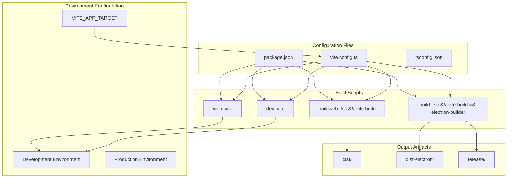
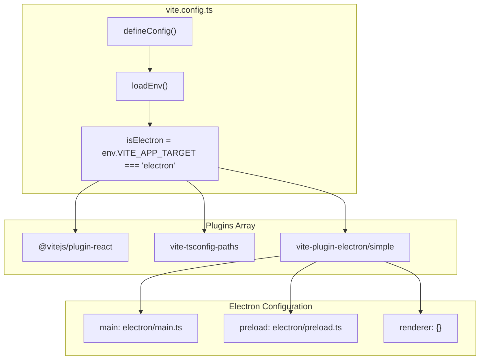
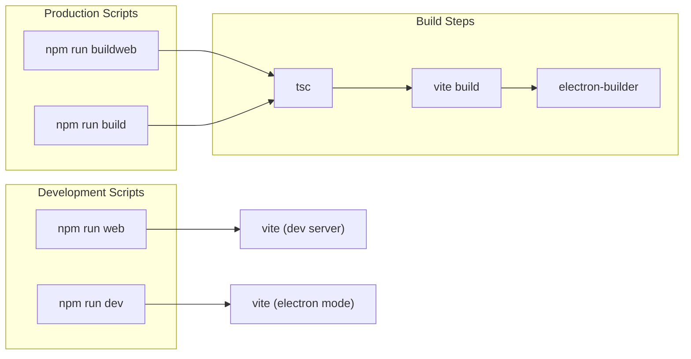
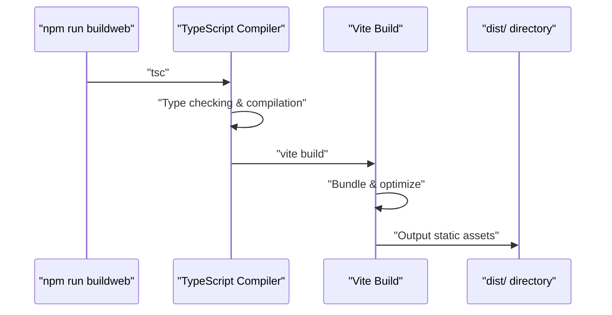
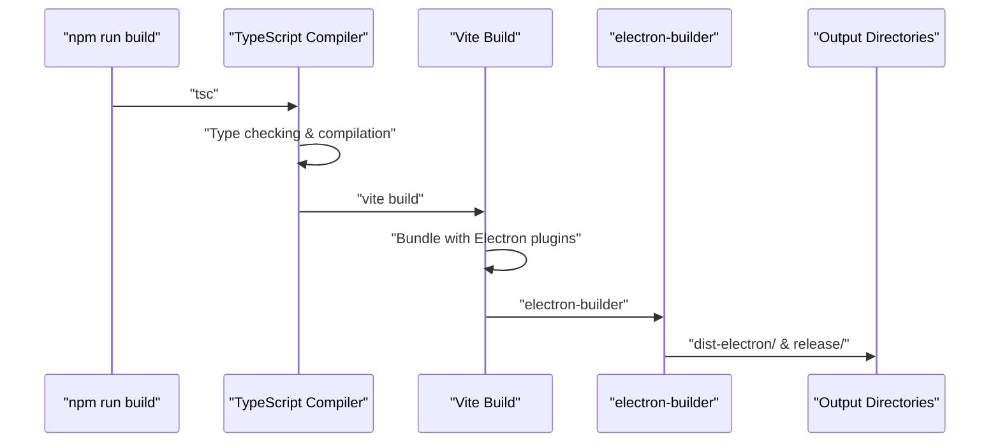
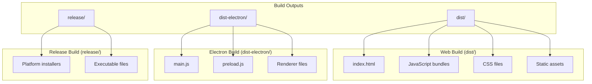
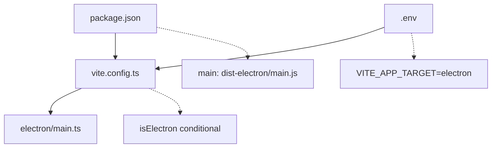

# Build System

Relevant source files

The following files were used as context for generating this wiki page:

- [.env.example](/.env.example)
- [README.md](/README.md)
- [electron/main.ts](/electron/main.ts)
- [license.txt](/license.txt)
- [package-lock.json](/package-lock.json)
- [package.json](/package.json)
- [src/main.tsx](/src/main.tsx)
- [vite.config.ts](/vite.config.ts)

This document covers the Vite-based build system that enables dual-target deployment to both web browsers and Electron desktop applications from a single codebase. The build system uses environment variables and conditional configuration to support multiple development and production workflows.

For information about the overall application architecture, see [Architecture](./3_Architecture.md). For development workflows and setup instructions, see [Getting Started](./2_Getting_Started.md).

## Overview

The build system is built on Vite and supports four primary build targets through npm scripts defined in `package.json`. The system uses the `VITE_APP_TARGET` environment variable to conditionally enable Electron-specific plugins and configurations.

### Build Target Architecture

Sources: [package.json:13-21](/package.json), [vite.config.ts:8-37](/vite.config.ts), [README.md:38-86](/README.md)

## Build Configuration

The core build configuration is defined in `vite.config.ts`, which uses conditional logic to enable Electron-specific features based on the `VITE_APP_TARGET` environment variable.

### Vite Configuration Structure

Sources: [vite.config.ts:1-37](/vite.config.ts)

The configuration file loads environment variables and conditionally includes the Electron plugin only when `VITE_APP_TARGET=electron`. The `isElectron` boolean controls plugin inclusion through array filtering.

## Build Scripts

The `package.json` defines four primary build scripts that handle different development and production scenarios:

| Script | Command | Purpose | Output |
|--------|---------|---------|---------|
| `web` | `vite` | Web development server | `localhost:5173` |
| `dev` | `vite` | Electron development mode | Electron app window |
| `buildweb` | `tsc && vite build` | Web production build | `dist/` directory |
| `build` | `tsc && vite build && electron-builder` | Electron production build | `dist-electron/` and `release/` |

Sources: [package.json:13-21](/package.json)

### Build Script Flow

Sources: [package.json:13-21](/package.json)

## Development Workflow

The development workflow varies based on the target platform:

### Web Development Mode
- Runs `vite` development server on port 5173
- Hot module replacement (HMR) enabled
- Uses standard browser environment
- Requires `VITE_APP_TARGET` to be unset or not equal to `"electron"`

### Electron Development Mode  
- Runs Vite with Electron plugin enabled
- Spawns Electron application window
- Requires `VITE_APP_TARGET=electron` environment variable
- Supports main process and renderer process development

Sources: [README.md:40-60](/README.md), [vite.config.ts:10-16](/vite.config.ts)

## Production Builds

Production builds involve TypeScript compilation followed by Vite bundling, with optional Electron packaging.

### Web Production Build Process

### Electron Production Build Process

Sources: [package.json:16-17](/package.json), [README.md:62-86](/README.md)

## Output Artifacts

The build system generates different artifacts based on the build target:

### File Structure Output

Sources: [package.json:158](/package.json), [README.md:74-86](/README.md)

## Configuration Files

Several configuration files support the build system:

### Supporting Configuration Files

| File | Purpose | Key Settings |
|------|---------|--------------|
| `vite.config.ts` | Main build configuration | Plugin loading, entry points, base path |
| `package.json` | Dependencies and scripts | Build scripts, main entry, electron-builder config |
| `electron/main.ts` | Electron main process | Window creation, app lifecycle |
| `.env` | Environment variables | `VITE_APP_TARGET`, API URLs |

### Configuration Dependencies

Sources: [vite.config.ts:9-10](/vite.config.ts), [package.json:158](/package.json), [electron/main.ts:1](/electron/main.ts), [.env.example:1](/.env.example)

The build system provides a flexible, environment-driven approach to supporting both web and desktop deployment targets through conditional configuration and unified tooling.