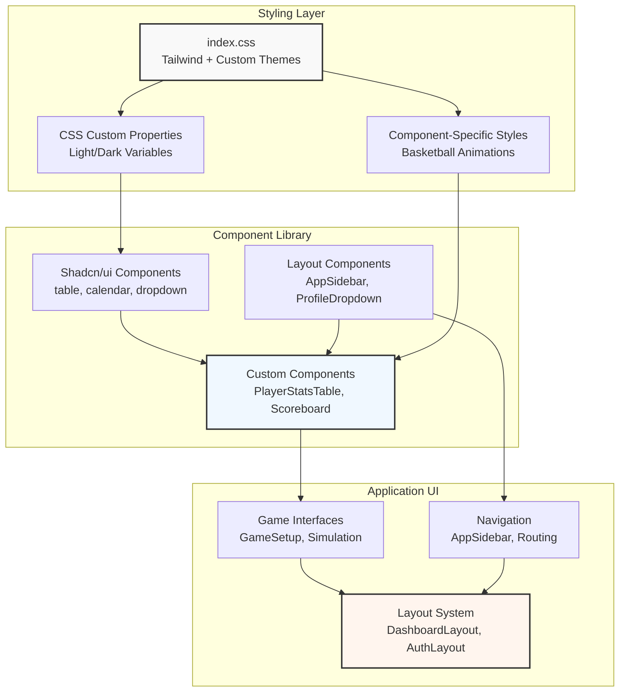
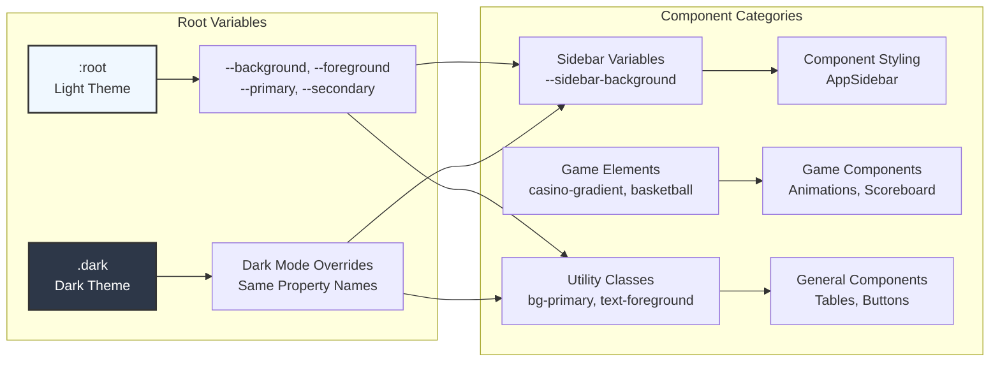
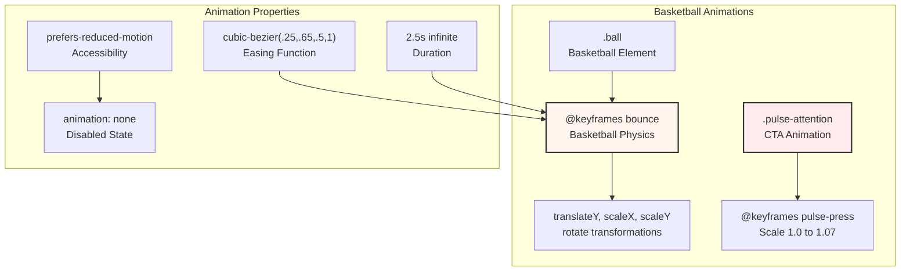
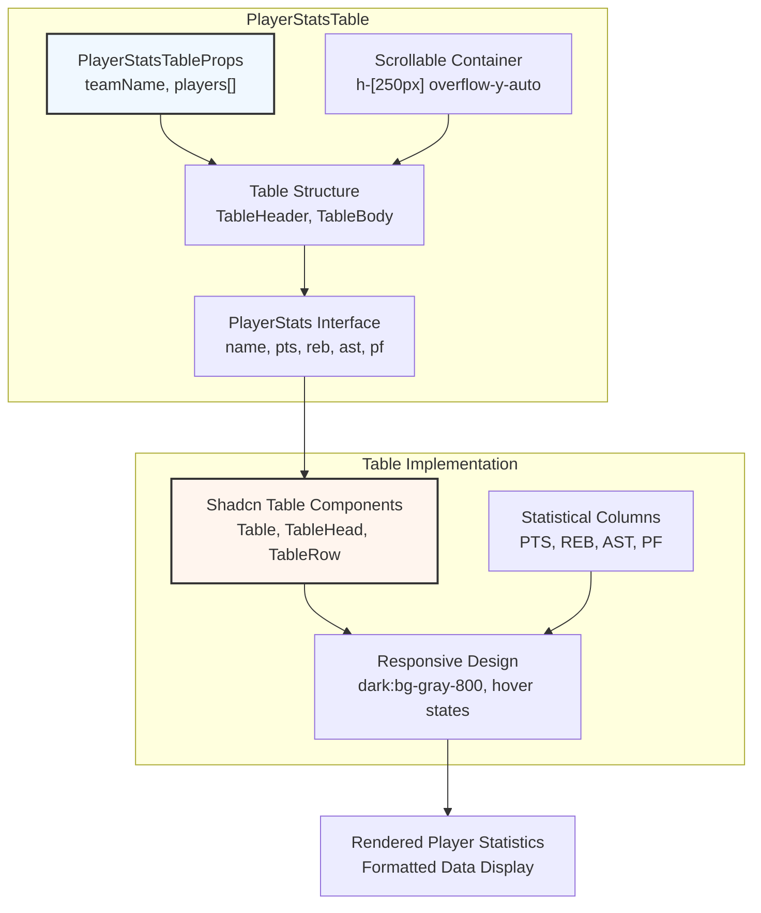
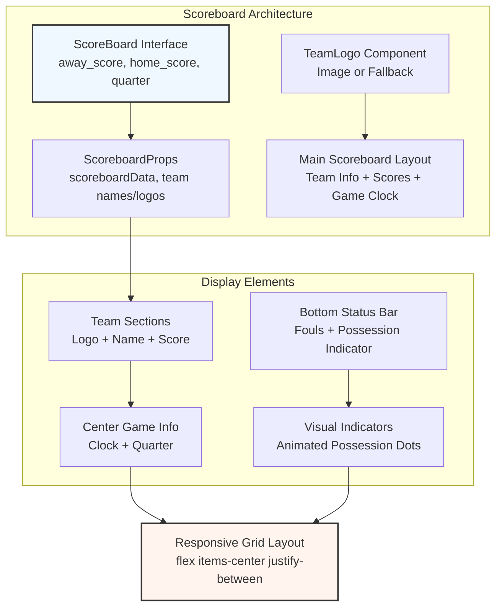
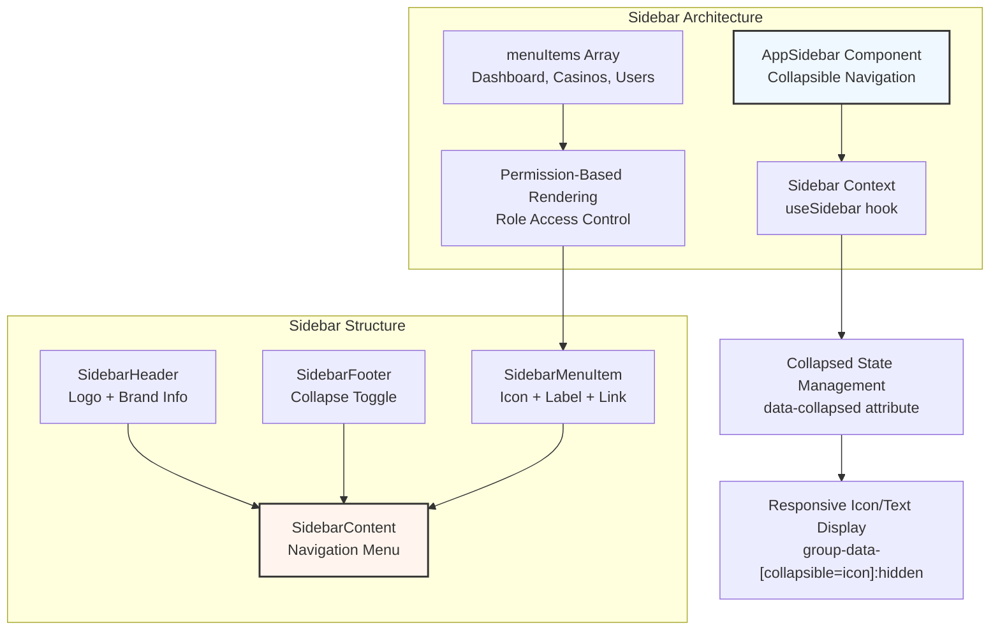
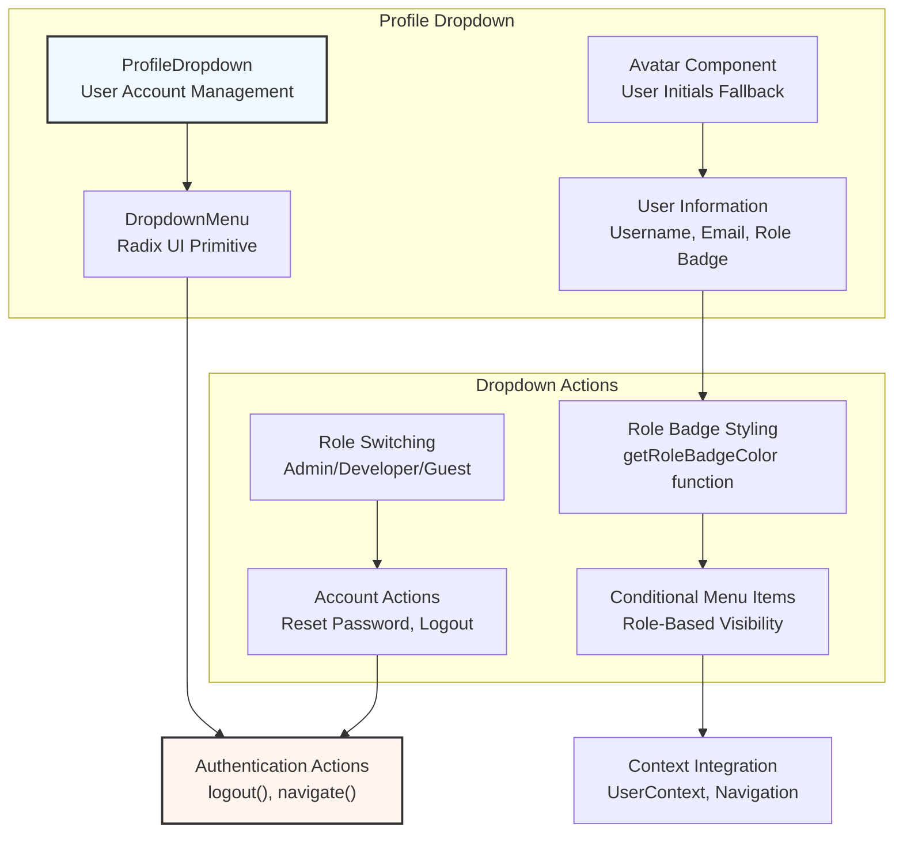
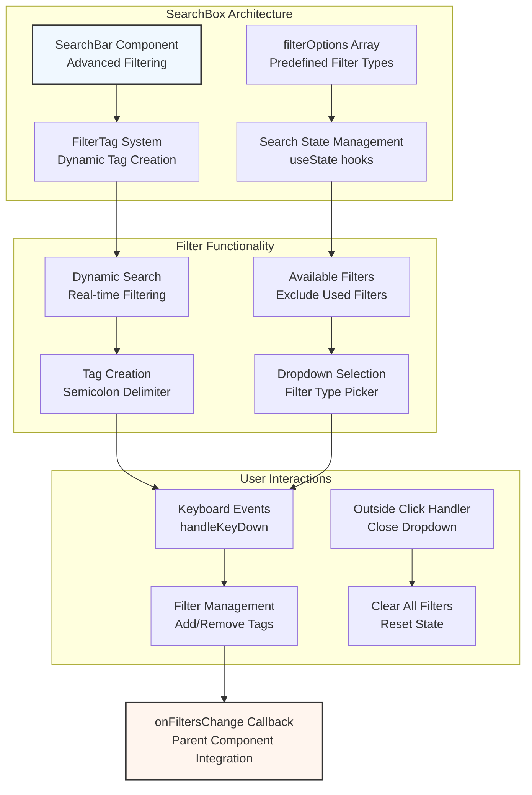
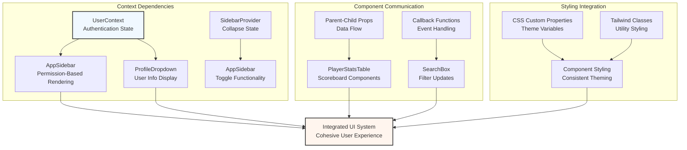

# User Interface

<details>
<summary>Relevant source files</summary>

The following files were used as context for generating this wiki page:

- [src/components/AppSidebar.tsx](/src/components/AppSidebar.tsx)
- [src/components/PlayerStatsTable.tsx](/src/components/PlayerStatsTable.tsx)
- [src/components/ProfileDropdown.tsx](/src/components/ProfileDropdown.tsx)
- [src/components/Scoreboard.tsx](/src/components/Scoreboard.tsx)
- [src/components/searchbox.tsx](/src/components/searchbox.tsx)
- [src/components/ui/calendar.tsx](/src/components/ui/calendar.tsx)
- [src/index.css](/src/index.css)
- [src/styles/index.css](/src/styles/index.css)

</details>


This document covers the user interface architecture, components, and styling systems of the NBA basketball simulation application. It includes the core UI component library, theming system, layout structures, and interactive game elements.

For authentication-specific UI components, see [Authentication UI](./13_Authentication_UI.md). For game simulation interface details, see [Game Features](./14_Game_Features.md). For build system and styling configurations, see [Build System](./7_Build_System.md) and [Styling and Theming](./19_Styling_and_Theming.md).

## UI Architecture Overview

The application employs a component-based UI architecture built on React with TypeScript, utilizing Tailwind CSS for styling and a custom theme system supporting light/dark modes. The UI system integrates multiple component libraries including Shadcn/ui and Radix UI primitives.



**Sources:** [src/index.css:1-439](/src/index.css), [src/styles/index.css:1-203](/src/styles/index.css), [src/components/ui/calendar.tsx:1-64](/src/components/ui/calendar.tsx)

## Theme and Styling System

The application implements a comprehensive theming system using CSS custom properties with automatic light/dark mode switching. The styling architecture combines Tailwind utility classes with custom CSS for specialized components.

### CSS Custom Properties Architecture



The theme system defines comprehensive color schemes in [src/index.css:6-83]() with CSS custom properties for:

| Property Category | Light Theme | Dark Theme | Usage |
|------------------|-------------|------------|--------|
| Background | `--background: 0 0% 100%` | `--background: 222.2 84% 4.9%` | Main app background |
| Primary | `--primary: 210 72% 22%` | `--primary: 210 40% 98%` | Primary UI elements |
| Sidebar | `--sidebar-background: 210 72% 22%` | `--sidebar-background: 240 5.9% 10%` | Navigation sidebar |
| Destructive | `--destructive: 0 84.2% 60.2%` | `--destructive: 0 62.8% 30.6%` | Error states |

**Sources:** [src/index.css:5-84](/src/index.css), [src/styles/index.css:8-11](/src/styles/index.css)

### Custom Animation System

The application includes specialized animations for basketball-themed elements:



Key animation implementations in [src/index.css:367-439](/src/index.css):
- Basketball bounce animation with physics-based scaling and rotation
- Pulse attention animation for call-to-action buttons
- Accessibility support with `prefers-reduced-motion` media query

**Sources:** [src/index.css:367-439](/src/index.css), [src/index.css:216-282](/src/index.css)

## Core UI Components

### Data Display Components

The application provides specialized components for displaying basketball statistics and game information.

#### PlayerStatsTable Component



The `PlayerStatsTable` component in [src/components/PlayerStatsTable.tsx:24-56](/src/components/PlayerStatsTable.tsx) implements:
- Fixed-height scrollable container for large datasets
- Responsive design with dark theme support
- Structured data display for basketball statistics
- TypeScript interfaces for type safety

**Sources:** [src/components/PlayerStatsTable.tsx:1-57](/src/components/PlayerStatsTable.tsx)

#### Scoreboard Component



The `Scoreboard` component in [src/components/Scoreboard.tsx:24-99](/src/components/Scoreboard.tsx) features:
- Real-time game state display with animated possession indicators
- Conditional logo rendering with fallback team initials
- Responsive layout with basketball-themed styling
- Team offense/defense state visualization

**Sources:** [src/components/Scoreboard.tsx:1-101](/src/components/Scoreboard.tsx)

### Navigation Components

#### AppSidebar Implementation



The sidebar system in [src/components/AppSidebar.tsx:35-116](/src/components/AppSidebar.tsx) implements:
- Collapsible navigation with icon-only and expanded states
- Role-based menu item visibility using `UserContext`
- Responsive design with conditional content display
- Integration with React Router for navigation state

Navigation menu structure defined in [src/components/AppSidebar.tsx:27-33](/src/components/AppSidebar.tsx):

| Menu Item | Route | Icon | Required Permission |
|-----------|-------|------|-------------------|
| Dashboard | `/adminpanel` | `Home` | `view_all` |
| Casinos | `/adminpanel/casinos` | `Building2` | `view_all` |
| Users | `/adminpanel/users` | `Users` | `add_edit_delete_users` |
| Analytics | `/adminpanel/analytics` | `BarChart3` | `view_all` |
| Settings | `/adminpanel/settings` | `Settings` | `view_all` |

**Sources:** [src/components/AppSidebar.tsx:1-117](/src/components/AppSidebar.tsx)

#### ProfileDropdown Component



The profile dropdown in [src/components/ProfileDropdown.tsx:17-120](/src/components/ProfileDropdown.tsx) provides:
- User role visualization with color-coded badges
- Administrative role switching functionality
- Account management actions (password reset, logout)
- Integration with authentication context and routing

Role badge color mapping in [src/components/ProfileDropdown.tsx:35-42](/src/components/ProfileDropdown.tsx):

```typescript
getRoleBadgeColor = (role: UserRole) => {
  admin: 'bg-red-100 text-red-800'
  developer: 'bg-blue-100 text-blue-800'  
  guest: 'bg-gray-100 text-gray-800'
}
```

**Sources:** [src/components/ProfileDropdown.tsx:1-121](/src/components/ProfileDropdown.tsx)

## Advanced UI Components

### SearchBox Component



The advanced search component in [src/components/searchbox.tsx:27-218](/src/components/searchbox.tsx) implements:
- Dynamic filter tag system with semicolon-triggered creation
- Real-time search with immediate parent callback updates
- Available filter management to prevent duplicate filters
- Comprehensive keyboard and mouse interaction handling

Filter configuration in [src/components/searchbox.tsx:34-41](/src/components/searchbox.tsx):

| Filter Type | Available Values | Source |
|-------------|-----------------|--------|
| `casinoName` | Unique casino names | `data.map(item => item.casinoName)` |
| `location` | Unique locations | `data.map(item => item.location)` |
| `category` | Unique categories | `data.map(item => item.category)` |
| `status` | `['active', 'inactive']` | Static values |

**Sources:** [src/components/searchbox.tsx:1-218](/src/components/searchbox.tsx)

## Component Integration Patterns

### UI Context Integration



The UI system demonstrates several key integration patterns:

1. **Context-Driven Components**: Navigation and user interface elements integrate with authentication and application state contexts
2. **Prop-Based Data Flow**: Game-specific components receive data through typed props interfaces
3. **Callback Communication**: Advanced components like `SearchBox` communicate state changes to parent components
4. **Consistent Theming**: All components utilize the centralized CSS custom property system

**Sources:** [src/components/AppSidebar.tsx:24-38](/src/components/AppSidebar.tsx), [src/components/ProfileDropdown.tsx:13-19](/src/components/ProfileDropdown.tsx), [src/components/searchbox.tsx:22-75](/src/components/searchbox.tsx)

## Design System Conventions

### Component Structure Standards

The application follows consistent patterns for component architecture:

```typescript
// Interface-driven props
interface ComponentProps {
  data: TypedData[];
  onCallback: (result: CallbackType) => void;
}

// Functional component with TypeScript
const Component: React.FC<ComponentProps> = ({ data, onCallback }) => {
  // Hooks for state management
  const [localState, setLocalState] = useState();
  const { contextData } = useContext();
  
  // Event handlers
  const handleInteraction = () => { /* ... */ };
  
  // Render with conditional logic
  return (
    <div className="responsive-container">
      {/* Conditional rendering */}
      {/* Event handlers */}
      {/* Data mapping */}
    </div>
  );
};
```

### Styling Conventions

The application employs a hybrid styling approach:

1. **Tailwind Utilities**: Primary styling method for layout, spacing, and common properties
2. **CSS Custom Properties**: Theme-aware color and sizing values
3. **Component-Specific CSS**: Complex animations and specialized styling
4. **Conditional Classes**: Dynamic styling based on state and props

Example from [src/components/Scoreboard.tsx:52-97](/src/components/Scoreboard.tsx):
```typescript
className={`w-4 h-4 rounded-full bg-red-500 transition-opacity duration-300 ${
  isHomeTeamOffense ? 'opacity-100 animate-pulse' : 'opacity-0'
}`}
```

**Sources:** [src/components/PlayerStatsTable.tsx:24-56](/src/components/PlayerStatsTable.tsx), [src/components/Scoreboard.tsx:24-99](/src/components/Scoreboard.tsx), [src/components/AppSidebar.tsx:35-116](/src/components/AppSidebar.tsx), [src/index.css:1-439](/src/index.css)