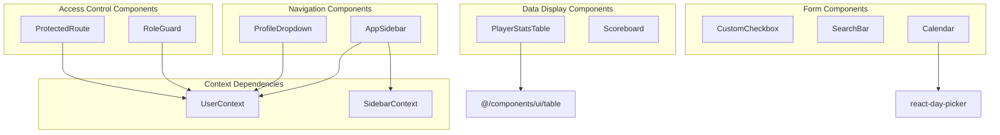
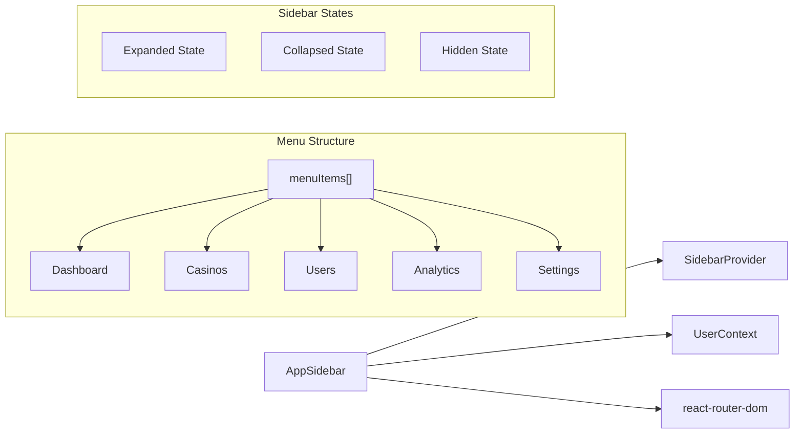
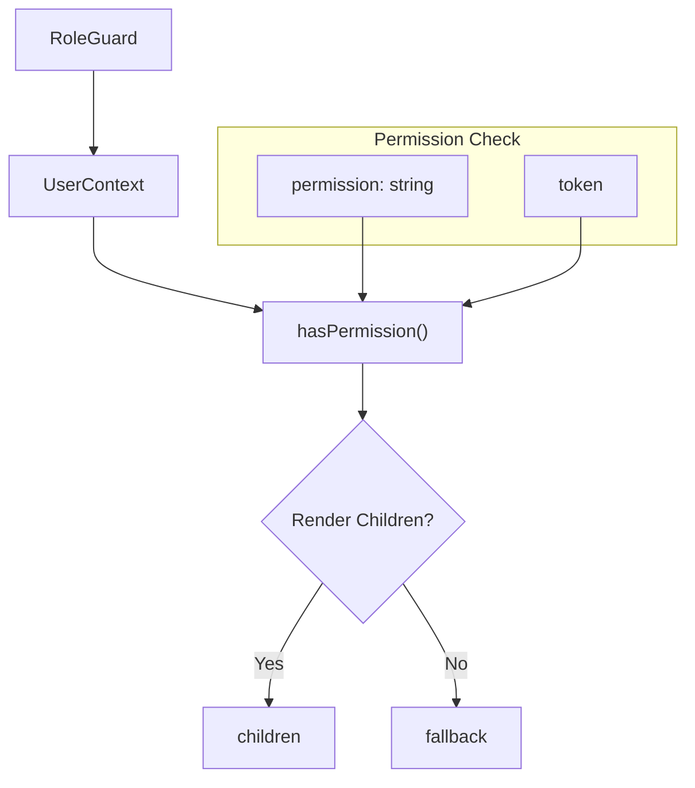

# Core Components

<details>
<summary>Relevant source files</summary>

The following files were used as context for generating this wiki page:

- [src/components/AppSidebar.tsx](/src/components/AppSidebar.tsx)
- [src/components/PlayerStatsTable.tsx](/src/components/PlayerStatsTable.tsx)
- [src/components/ProfileDropdown.tsx](/src/components/ProfileDropdown.tsx)
- [src/components/ProtectedRoute.tsx](/src/components/ProtectedRoute.tsx)
- [src/components/RoleGuard.tsx](/src/components/RoleGuard.tsx)
- [src/components/Scoreboard.tsx](/src/components/Scoreboard.tsx)
- [src/components/searchbox.tsx](/src/components/searchbox.tsx)
- [src/components/ui/CustomCheckbox.tsx](/src/components/ui/CustomCheckbox.tsx)
- [src/components/ui/calendar.tsx](/src/components/ui/calendar.tsx)
- [src/pages/auth/UpdatePassword.tsx](/src/pages/auth/UpdatePassword.tsx)
- [src/singlegame_image.png](/src/singlegame_image.png)

</details>


This document covers the reusable UI components that form the foundation of the application's user interface. These components include data display tables, navigation elements, access control utilities, and custom form controls that are used throughout the application.

For authentication-specific UI components, see [Authentication UI](./13_Authentication_UI.md). For game-specific interfaces, see [Game Setup Interface](./10_Game_Setup_Interface.md) and [Game Simulation Interfaces](./11_Game_Simulation_Interfaces.md).

## Component Architecture Overview

The core components follow a hierarchical structure with clear separation between data display, navigation, access control, and form components.



Sources: [src/components/PlayerStatsTable.tsx:1-56](/src/components/PlayerStatsTable.tsx), [src/components/Scoreboard.tsx:1-101](/src/components/Scoreboard.tsx), [src/components/AppSidebar.tsx:1-116](/src/components/AppSidebar.tsx), [src/components/ProfileDropdown.tsx:1-120](/src/components/ProfileDropdown.tsx), [src/components/RoleGuard.tsx:1-21](/src/components/RoleGuard.tsx), [src/components/ProtectedRoute.tsx:1-22](/src/components/ProtectedRoute.tsx)

## Data Display Components

### PlayerStatsTable Component

The `PlayerStatsTable` component renders basketball player statistics in a tabular format with scrollable content.

**Key Features:**
- Displays player statistics (points, rebounds, assists, personal fouls)
- Fixed height with vertical scrolling
- Dark mode support
- Responsive design

**Interface:**
```typescript
interface PlayerStats {
  name: string;
  pts: string;
  reb: string; 
  ast: string;
  pf: string;
}

interface PlayerStatsTableProps {
  teamName: string;
  players: PlayerStats[];
}
```

The component utilizes the shadcn/ui `Table` components for consistent styling and implements a `250px` fixed height container with overflow scrolling [src/components/PlayerStatsTable.tsx:28-29](/src/components/PlayerStatsTable.tsx).

### Scoreboard Component

The `Scoreboard` component displays real-time game information with a professional sports broadcast appearance.

**Key Features:**
- Team scores, quarter, and game clock
- Team logos with fallback initials
- Possession indicators with animated pulsing
- Foul tracking for both teams
- Responsive layout with backdrop blur effects

**Interface:**
```typescript
interface ScoreBoard {
  away_score: string;
  home_score: string;
  quarter: string;
  clock: string;
  away_possessions: string;
  home_possessions: string;
  away_fouls: string;
  home_fouls: string;
  home_team_offense: string;
  player_with_ball: string;
}
```

The component implements a `TeamLogo` subcomponent that handles both image URLs and text fallbacks [src/components/Scoreboard.tsx:47-49](/src/components/Scoreboard.tsx).

Sources: [src/components/PlayerStatsTable.tsx:11-22](/src/components/PlayerStatsTable.tsx), [src/components/Scoreboard.tsx:3-22](/src/components/Scoreboard.tsx)

## Navigation Components

### AppSidebar Component

The `AppSidebar` component provides application navigation with role-based menu items and collapsible functionality.



**Key Features:**
- Role-based menu visibility using permission checks
- Collapsible/expandable with icon-only mode
- Active route highlighting
- Company branding with logo
- Toggle controls with chevron icons

The sidebar uses a `menuItems` array with permission-based filtering [src/components/AppSidebar.tsx:27-33](/src/components/AppSidebar.tsx) and implements a hidden state controlled by the `hide` boolean [src/components/AppSidebar.tsx:39](/src/components/AppSidebar.tsx).

### ProfileDropdown Component

The `ProfileDropdown` provides user account management with role switching capabilities.

**Key Features:**
- User avatar with initials fallback
- Role badge with color coding
- Role switching for demo purposes
- Password reset navigation
- Logout functionality

The component implements role-specific badge colors using the `getRoleBadgeColor` function [src/components/ProfileDropdown.tsx:35-42](/src/components/ProfileDropdown.tsx) and handles demo role switching [src/components/ProfileDropdown.tsx:23-33](/src/components/ProfileDropdown.tsx).

Sources: [src/components/AppSidebar.tsx:35-116](/src/components/AppSidebar.tsx), [src/components/ProfileDropdown.tsx:17-120](/src/components/ProfileDropdown.tsx)

## Access Control Components

### RoleGuard Component

The `RoleGuard` component provides declarative access control for UI elements based on user permissions.



**Interface:**
```typescript
interface RoleGuardProps {
  children: ReactNode;
  permission: string;
  fallback?: ReactNode;
}
```

The component performs permission checking using `hasPermission(permission)` from the UserContext [src/components/RoleGuard.tsx:14](/src/components/RoleGuard.tsx).

### ProtectedRoute Component

The `ProtectedRoute` component provides route-level access control with automatic redirection.

**Key Features:**
- Permission-based route protection
- Automatic redirection for unauthorized access
- Token validation
- Configurable redirect destination

The component uses React Router's `Navigate` component for redirection when access is denied [src/components/ProtectedRoute.tsx:16](/src/components/ProtectedRoute.tsx).

Sources: [src/components/RoleGuard.tsx:5-21](), [src/components/ProtectedRoute.tsx:6-22](/src/components/ProtectedRoute.tsx)

## Form and Input Components

### CustomCheckbox Component

The `CustomCheckbox` component provides a styled checkbox input with custom visual design.

**Features:**
- Hidden native checkbox input
- Custom styled checkbox with SVG checkmark
- Label association for accessibility
- Controlled component pattern

**Interface:**
```typescript
interface CustomCheckboxProps {
  checked: boolean;
  onChange: (checked: boolean) => void;
  label: string;
  id: string;
}
```

The component implements a custom visual design by hiding the native input [src/components/ui/CustomCheckbox.tsx:18](/src/components/ui/CustomCheckbox.tsx) and using a styled div with conditional SVG rendering [src/components/ui/CustomCheckbox.tsx:21-23](/src/components/ui/CustomCheckbox.tsx).

### SearchBar Component

The `SearchBar` component provides advanced filtering capabilities with tag-based filter management.

**Key Features:**
- Dynamic filter options based on data
- Real-time search with semicolon delimiter
- Filter tag creation and management  
- Multiple filter types support
- Clickout detection for dropdown closure

**Interface:**
```typescript
interface SearchBarProps {
  onFiltersChange: (filters: FilterTag[]) => void;
  data: Casino[];
}

type FilterTag = {
  id: string;
  type: string;
  label: string;
  value: string;
}
```

The component manages filter options dynamically [src/components/searchbox.tsx:34-41](/src/components/searchbox.tsx) and implements semicolon-triggered filter creation [src/components/searchbox.tsx:83-98](/src/components/searchbox.tsx).

### Calendar Component

The `Calendar` component is a wrapper around the `react-day-picker` library with custom styling.

**Features:**
- Custom button variants for navigation
- Tailwind CSS integration
- Icon components for navigation arrows
- Comprehensive day state styling

The component extends `DayPicker` props [src/components/ui/calendar.tsx:8](/src/components/ui/calendar.tsx) and implements custom class mappings for consistent styling [src/components/ui/calendar.tsx:20-53](/src/components/ui/calendar.tsx).

Sources: [src/components/ui/CustomCheckbox.tsx:3-30](/src/components/ui/CustomCheckbox.tsx), [src/components/searchbox.tsx:22-218](/src/components/searchbox.tsx), [src/components/ui/calendar.tsx:10-64](/src/components/ui/calendar.tsx)

## Component Usage Patterns

### Context Integration

Most navigation and access control components integrate with the application's context system:

| Component | Context Dependencies | Key Methods |
|-----------|---------------------|-------------|
| `AppSidebar` | `UserContext`, `SidebarContext` | `user.role`, `toggleSidebar()` |
| `ProfileDropdown` | `UserContext` | `user`, `logout()` |
| `RoleGuard` | `UserContext` | `hasPermission()`, `token` |
| `ProtectedRoute` | `UserContext` | `hasPermission()`, `token` |

### Styling Conventions

Components follow consistent styling patterns:
- Tailwind CSS for utility-first styling
- Dark mode support with `dark:` prefixes
- Responsive design with breakpoint modifiers
- Custom CSS variables for theming
- shadcn/ui component integration where applicable

### State Management

Components use various state management approaches:
- **Local State**: `useState` for component-specific state
- **Context State**: Integration with UserContext and other providers  
- **URL State**: React Router integration for navigation state
- **Controlled Components**: Props-based state management for form inputs

Sources: [src/components/AppSidebar.tsx:24-38](/src/components/AppSidebar.tsx), [src/components/ProfileDropdown.tsx:13-18](/src/components/ProfileDropdown.tsx), [src/components/RoleGuard.tsx:12-14](/src/components/RoleGuard.tsx), [src/components/ProtectedRoute.tsx:12-15](/src/components/ProtectedRoute.tsx)